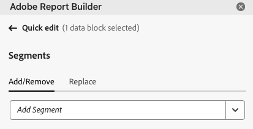

# Werken met segmenten

U kunt segmenten toepassen wanneer u een nieuw gegevensblok maakt of wanneer u **[!UICONTROL Edit data block]** in het deelvenster **[!UICONTROL Commands]** selecteert.

## Segmenten toepassen op een gegevensblok

Als u een segment wilt toepassen op het volledige gegevensblok, dubbelselecteert u een segment of sleept u segmenten uit de lijst met componenten naar de sectie Segmenten van de tabel.

## Filters toepassen op individuele metriek

Filters toepassen met behulp van segmenten op individuele metriek:

* Sleep een of meer segmenten van **[!UICONTROL Segments]** naar een metrische waarde in de tabel.

* Alternatief:

   1. Selecteer  voor specifieke metrisch in de **[!UICONTROL Table]** ruit en selecteer dan **[!UICONTROL Filter metric]**.

      {zoomable="yes"}

   1. Selecteer een of meer segmenten in het keuzemenu **[!UICONTROL Segments]** . De segmenten worden toegevoegd aan de lijst van **[!UICONTROL Segments applied]** .

      
   1. Selecteer  om een segment uit de **[!UICONTROL Segment applied]** lijst te verwijderen. Of selecteer **[!UICONTROL Clear all]** om alle segmenten uit de lijst van **[!UICONTROL Segment applied]** te verwijderen.
   1. Selecteer **[!UICONTROL Apply]**.

Als u toegepaste filters wilt weergeven, plaatst u de muisaanwijzer boven of selecteert u een metrische waarde in het deelvenster Tabel. De metriek met toegepaste segmenten tonen een segmentpictogram.

## Snel segmenten bewerken

U kunt het deelvenster **[!UICONTROL Quick edit]** gebruiken om segmenten voor bestaande gegevensblokken toe te voegen, te verwijderen of te vervangen.

Wanneer u een bereik cellen in het werkblad selecteert, wordt met de koppeling **[!UICONTROL Segments]** in het deelvenster **[!UICONTROL Quick edit]** een overzicht weergegeven van de segmenten die worden gebruikt door de gegevensblokken in die selectie.

Segmenten bewerken met het deelvenster **[!UICONTROL Quick edit]** :

1. Selecteer een bereik cellen uit een of meerdere gegevensblokken.

1. Selecteer de koppeling **[!UICONTROL Segments]** om het deelvenster **[!UICONTROL Quick edit]** **[!UICONTROL Segments]** te starten.

### Segmenten toevoegen of verwijderen

U kunt segmenten toevoegen of verwijderen met de opties Toevoegen/Verwijderen.

1. Selecteer de tab **[!UICONTROL Add/Remove]** in het deelvenster **[!UICONTROL Quick edit]** **[!UICONTROL Segments]** .

   1. Selecteer een of meer segmenten in het keuzemenu **[!UICONTROL Segments]** . De segmenten worden toegevoegd aan de lijst van **[!UICONTROL Segments applied]** .
   1. Selecteer  om een segment uit de **[!UICONTROL Segment applied]** lijst te verwijderen.
   1. Selecteer **[!UICONTROL Apply]**.

Report Builder geeft een bericht weer ter bevestiging van de toegepaste segmentwijzigingen.

### Segmenten vervangen

U kunt een bestaand segment vervangen door een ander segment om te wijzigen hoe de gegevens worden gesegmenteerd.

1. Selecteer de tab **[!UICONTROL Replace]** in het deelvenster **[!UICONTROL Quick edit]** **[!UICONTROL Segments]** .

1. Gebruik het **de lijst van het Onderzoek** onderzoeksgebied om van specifieke segmenten de plaats te bepalen.

1. Selecteer een of meer segmenten die u wilt vervangen.

1. Zoek naar één of meerdere segmenten van Replace met drop-down menu om het segment aan de **[!UICONTROL Replace with]** lijst toe te voegen.

1. Selecteer **[!UICONTROL Apply]**.

Report Builder werkt de lijst met segmenten bij om de vervanging te weerspiegelen.

## Gegevensbloksegmenten vanuit cel definiëren

Gegevensblokken kunnen verwijzen naar segmenten uit een cel. De veelvoudige gegevensblokken kunnen de zelfde cel voor segmenten van verwijzingen voorzien, toestaand u om segmenten voor veelvoudige gegevensblokken tegelijkertijd gemakkelijk te schakelen.

Segmenten uit een cel toepassen:

1. [ creeer een nieuw gegevensblok ](create-a-data-block.md#create-a-data-block) of geef een bestaand gegevensblok uit.
1. Selecteer het tabblad **[!UICONTROL Segments]** om segmenten te definiëren.
1. Selecteer .

   {zoomable="yes"}

1. Selecteer de cel waaruit u wilt dat de gegevensblokken naar een segment verwijzen.

1. Dubbelselecteer om een segment aan de cel toe te voegen. U kunt ook een of meer segmenten naar de sectie **[!UICONTROL Segments included]** slepen.

1. Selecteer **[!UICONTROL Apply]** om de referentiecel te maken.

1. Van het **lusje van Segmenten**, voeg het pas gecreëerde segment van de verwijzingscel aan uw gegevensblok toe.

   {zoomable="yes"}

1. Selecteer **[!UICONTROL Finish]**.

Als u de referentiecel als een segment wilt toepassen op andere gegevensblokken, gebruikt u de celverwijzing als een van de segmenten in de lijst **[!UICONTROL Segments]** op het tabblad **[!UICONTROL Table]** .

### Een referentiecel gebruiken om gegevensbloksegmenten te wijzigen

1. Selecteer de referentiecel in het werkblad.

1. Selecteer de koppeling onder **[!UICONTROL Segments from cell]** in het menu **[!UICONTROL Quick Edit]** .

   {zoomable="yes"}

1. Selecteer het segment in het keuzemenu.

1. Selecteer **[!UICONTROL Apply]**.

<!--
You can apply segments when you create a new data block or when you select the **Edit data block** option from the COMMANDS panel.

## Apply segments to a data block

To apply a segment to the entire data block, double-click a segment or drag and drop filters from the components list into the Segments section of the Table.

## Apply segments to individual metrics

To apply segments to individual metrics, drag and drop a segment onto a metric in the table. You can also click the **...** icon to the right of a metric in the Table pane and then select **[!UICONTROL Segment metric]**. To view applied segments, hover over or select a metric in the Table pane. Metrics with applied segments display a filter icon.

## Quick edit segments

You can use the Quick edit panel to add, remove, or replace segments for existing data blocks.

When you select a range of cells in the spreadsheet, the **[!UICONTROL Segments]** link in the Quick edit panel displays a summary list of the segments used by the data blocks in that selection.

To edit segments using the Quick edit panel

1. Select a range of cells from one or multiple data blocks.

    

1. Click the link underneath **[!UICONTROL Segments]** to launch the Quick edit - Filters panel.

    

### Add or remove a segment

You can add or remove segments using the Add/Remove options.

1. Select the **[!UICONTROL Add/Remove]** tab in the Quick edit-segments panel.

    All segments applied to the selected data blocks are listed in the Quick Edit-segments panel. Segments applied to all data blocks in the selection are listed under the **[!UICONTROL Applied to all selected data blocks]** heading. Segments applied to some but not all data blocks are listed under the **[!UICONTROL Applied to 1 or more selected data blocks]** heading.

    When multiple segments are present in the selected data blocks, you can search for specific segments using the **[!UICONTROL Add Filter]** search field.

    

1. Add segments by selecting segments from the **[!UICONTROL Add segment]** drop down menu.

    The list of searchable segments includes all segments accessible to the report suites that are present in one or more of the selected data blocks as well as all the segments that are available globally in the organization.

    Adding a segment applies the segment to all data blocks in the selection.

1. To remove segments, click the delete icon **x** to the right of segments in the **[!UICONTROL Segments applied]** list.

1. Click **[!UICONTROL Apply]** to save changes and return to the hub panel.

    Report Builder displays a message to confirm the applied segment changes.

### Replace a segment

You can replace an existing segment with another segment to change how the data is segmented.

1. Select the **[!UICONTROL Replace]** tab in the Quick edit-segment panel.

    

1. Use the **[!UICONTROL Search list]** search field to locate specific segments.

1. Choose one or more segments that you want to replace.

1. Search for one or more segments in the Replace with field.

    Selecting a filter adds it to the **[!UICONTROL Replace with]**... list.

1. Click **[!UICONTROL Apply]**.

    Report Builder updates the list of segments to reflect the replacement.

### Define data block segments from cell

Data blocks can reference segments from a cell. Multiple data blocks can reference the same cell for segments, allowing you to easily switch segments for multiple data blocks at a time.

To apply segments from a cell

1. Navigate to Step 2 in either the data block creation or editing process. See [Create a Data Block](./create-a-data-block.md).
1. Click the **[!UICONTROL Segments]** tab to define filters.
1. Click **[!UICONTROL Create segment from cell]**.

    

1. Select the cell from which you want the data blocks to reference a segment.
   
1. Add the segment choice you wish to add to the cell by either double clicking the segment, or by dragging and dropping it into the **[!UICONTROL Segments Included]** section. 
   
   Note: Only one choice may be selected for the given cell at one time.

    

1. Click **[!UICONTROL Apply]** to create the reference cell.

1. From the **[!UICONTROL Segments]** tab, add the newly created reference cell segments to your data block.

    

1. Click **[!UICONTROL Finish]**.

    Now this cell can be referenced by other data blocks in their segments. To apply the reference cell as a segment to other data blocks, simply add the cell reference to their segments from the Segments tab. 

#### Use the reference cell to change data block segments

1. Select the reference cell in your spreadsheet.

1. Click the link under **[!UICONTROL Segments from Cell]** in the Quick Edit menu.

    

1. Select your segment from the drop-down menu.

    

1. Click **[!UICONTROL Apply]**.
-->