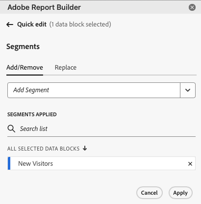

# Werken met segmenten in Report Builder

U kunt segmenten toepassen wanneer u een nieuw gegevensblok creeert of wanneer u **uitgezocht geef gegevensblok** optie van het paneel van BEVELINGEN uit.

## Segmenten toepassen op een gegevensblok

Als u een segment wilt toepassen op het volledige gegevensblok, dubbelklikt u op een segment of sleept u de filters uit de lijst met componenten naar het gedeelte Segmenten van de tabel.

## Segmenten toepassen op afzonderlijke metriek

Als u segmenten wilt toepassen op afzonderlijke metrische elementen, sleept u een segment naar een metrische waarde in de tabel. U kunt ook op het pictogram **...** rechts van een metrische waarde in het deelvenster Tabel klikken en vervolgens **[!UICONTROL Segment metric]** selecteren. Als u toegepaste segmenten wilt weergeven, plaatst u de muisaanwijzer boven of selecteert u een metrische waarde in het deelvenster Tabel. De metriek met toegepaste segmenten tonen een filterpictogram.

## Snel segmenten bewerken

Met het deelvenster Snel bewerken kunt u segmenten voor bestaande gegevensblokken toevoegen, verwijderen of vervangen.

Wanneer u een bereik cellen in het werkblad selecteert, wordt met de koppeling **[!UICONTROL Segments]** in het deelvenster Snel bewerken een overzicht weergegeven van de segmenten die worden gebruikt door de gegevensblokken in die selectie.

Segmenten bewerken met het deelvenster Snel bewerken

1. Selecteer een bereik cellen uit een of meerdere gegevensblokken.

   

1. Klik op de koppeling onder **[!UICONTROL Segments]** om het deelvenster Snel bewerken - Filters te starten.

   

### Een segment toevoegen of verwijderen

U kunt segmenten toevoegen of verwijderen met de opties Toevoegen/Verwijderen.

1. Selecteer de tab **[!UICONTROL Add/Remove]** in het deelvenster Snel bewerkingssegmenten.

   Alle segmenten die zijn toegepast op de geselecteerde gegevensblokken, worden weergegeven in het deelvenster Snel bewerken-segmenten. Segmenten die worden toegepast op alle gegevensblokken in de selectie, worden weergegeven onder de kop **[!UICONTROL Applied to all selected data blocks]** . Segmenten die op enkele maar niet alle gegevensblokken zijn toegepast, worden onder de kop **[!UICONTROL Applied to 1 or more selected data blocks]** weergegeven.

   Wanneer de geselecteerde gegevensblokken meerdere segmenten bevatten, kunt u met het zoekveld **[!UICONTROL Add Filter]** naar specifieke segmenten zoeken.

   

1. Voeg segmenten toe door segmenten te selecteren in het keuzemenu **[!UICONTROL Add segment]** .

   De lijst van doorzoekbare segmenten omvat alle segmenten die voor de rapportreeksen toegankelijk zijn die in één of meerdere geselecteerde gegevensblokken evenals alle segmenten aanwezig zijn die globaal in de organisatie beschikbaar zijn.

   Als u een segment toevoegt, wordt het segment toegepast op alle gegevensblokken in de selectie.

1. Om segmenten te verwijderen, klik het schrappingspictogram **x** rechts van segmenten in de **[!UICONTROL Segments applied]** lijst.

1. Klik op **[!UICONTROL Apply]** om de wijzigingen op te slaan en terug te keren naar het deelvenster met knooppunten.

   De Report Builder toont een bericht om de toegepaste segmentveranderingen te bevestigen.

### Een segment vervangen

U kunt een bestaand segment vervangen door een ander segment om te wijzigen hoe de gegevens worden gesegmenteerd.

1. Selecteer de tab **[!UICONTROL Replace]** in het deelvenster Snel bewerken van segment.

   

1. Gebruik het zoekveld **[!UICONTROL Search list]** om specifieke segmenten te zoeken.

1. Kies een of meer segmenten die u wilt vervangen.

1. Zoeken naar een of meer segmenten in het veld Vervangen door.

   Als u een filter selecteert, wordt dit toegevoegd aan de lijst **[!UICONTROL Replace with]** ...

   

1. Klik op **[!UICONTROL Apply]**.

   De Report Builder werkt de lijst van segmenten bij om op de vervanging te wijzen.

### Gegevensbloksegmenten vanuit cel definiëren

Gegevensblokken kunnen verwijzen naar segmenten uit een cel. De veelvoudige gegevensblokken kunnen de zelfde cel voor segmenten van verwijzingen voorzien, toestaand u om segmenten voor veelvoudige gegevensblokken tegelijkertijd gemakkelijk te schakelen.

Segmenten uit een cel toepassen

1. Navigeer naar stap 2 in het maken of bewerken van gegevensblokken. Zie [ een Blok van Gegevens ](./create-a-data-block.md) creëren.
1. Klik op het tabblad **[!UICONTROL Segments]** om filters te definiëren.
1. Klik op **[!UICONTROL Create segment from cell]**.

   

1. Selecteer de cel waaruit u wilt dat de gegevensblokken naar een segment verwijzen.

1. Voeg de segmentkeuze toe die u aan de cel wilt toevoegen door te dubbelklikken op het segment of door deze te slepen naar de sectie Segmenten inclusief.

   Opmerking: Er kan slechts één keuze voor de desbetreffende cel tegelijk worden geselecteerd.

   

1. Klik op **[!UICONTROL Apply]** om de referentiecel te maken.

1. Voeg vanaf het tabblad **[!UICONTROL Segments]** de zojuist gemaakte referentiecelsegmenten toe aan uw gegevensblok.

   

1. Klik op **[!UICONTROL Finish]**.

   Nu kan naar deze cel worden verwezen door andere gegevensblokken in hun segmenten. Als u de referentiecel als een segment wilt toepassen op andere gegevensblokken, voegt u vanuit het tabblad Segmenten de celverwijzing naar de desbetreffende segmenten toe.

#### De referentiecel gebruiken om gegevensbloksegmenten te wijzigen

1. Selecteer de referentiecel in het werkblad.

1. Klik op de koppeling onder **[!UICONTROL Segments from Cell]** in het menu Snel bewerken.

   

1. Selecteer het segment in het keuzemenu.

   

1. Klik op **[!UICONTROL Apply]**.
