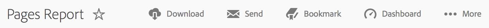
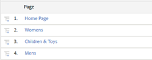

# Rapportfuncties

{{ra-eol}}

Een inleiding op de eigenschappen van een rapport, met inbegrip van de toolbar, kalender, en detaillijst.

In dit voorbeeld wordt een [!UICONTROL Pages Report]. De configuratieopties kunnen variëren, afhankelijk van het rapport dat u in werking stelt. In plaats van bijvoorbeeld Trended of Ranked te selecteren in een [!UICONTROL Site Content] rapport, zou u granulariteit en paginanaam voor een kunnen specificeren [!UICONTROL Site Metrics] verslag.

>[!IMPORTANT]
>Effectief **31 december 2023**, is Adobe voornemens de rapporten en analyses en de bijbehorende rapporten en functies te beëindigen. Op dat moment werken de rapporten en analyses en alle bijbehorende rapporten en programma&#39;s niet meer. De rapporten, visualisaties en de onderliggende technologie die de rapporten &amp; Analytics van de macht niet meer aan de technologienormen van Adobe voldoen. De meeste functies voor rapporten en analyses zijn beschikbaar in Analysis Workspace. Sinds de release van Analysis Workspace in 2015 zijn de functionaliteit en mogelijkheden van Rapporten en Analytics verplaatst naar Analysis Workspace en is een drempel voor pariteit van de workflow bereikt. Deze kennisgeving legt het einde van de levensduur uit.

## Voorbeeld van paginapport {#section_288CC85536684C2DB184141358481EF0}

Een voorbeeld van een Pagina-rapport ( **[!UICONTROL Reports]** > **[!UICONTROL Site Content]** > **[!UICONTROL Pages Reports]** > **[!UICONTROL Pages]**).

{width=&quot;672px&quot;}

## Werkbalk Rapport {#section_0D674177AE6C4A71B07234DB25910ECD}

Deel uw rapportgegevens met de besluitvormers die uw plaats of marketing strategieën kunnen veranderen die op de gegevens worden gebaseerd.

{width=&quot;672px&quot;}

Zie ook [Een rapport aanpassen](/help/analyze/reports-analytics/reports-customize/customizing-reports-overview.md).

## Koptekst en instellingen rapporteren {#section_12A90FAE02EC43FB9F11F0E2CE8FAE8F}

Toont rapportmontages en laat u het rapporttype, uitgezochte metriek, en meer vormen. Welke opties beschikbaar zijn in deze groep, is afhankelijk van het rapport dat u uitvoert.

{width=&quot;672px&quot;}

Zie [Een rapport aanpassen](/help/analyze/reports-analytics/reports-customize/customizing-reports-overview.md) voor meer informatie .

## Kalender {#section_8C6C4AD84D9043E8ABD53FF8F645AAB1}

Geef de datum op door op de kalenderknop te klikken en een datumbereik te selecteren. U kunt ook twee tijdbereiken selecteren om de prestaties te vergelijken.

{width=&quot;672px&quot;}

Zie [Een datum- of datumbereik selecteren](/help/analyze/reports-analytics/reports-customize/customizing-reports-overview.md) en [Vergelijkingsdatums](/help/analyze/reports-analytics/reports-customize/customizing-reports-overview.md).

## Type grafiek {#section_8B9CBA4096E64FC3B744E2E06EB83C19}

Selecteer het type grafiek of grafiek dat u wilt zien:

Zie [Rapportgrafieken wijzigen.](/help/analyze/reports-analytics/reports-customize/t-reports-graphs.md)

## Grafiekweergave {#section_4C78ADC82C234CC6841AC92C803636F4}

Afhankelijk van het type grafiek dat u hebt geselecteerd, ziet u doorgaans de bovenste diverse items in de detaillijst. Als uw grafiek een trendgrafiek is die verschillende tijdsperiodes toont, dan tonen alle tijdsperiodes:

Zie [Rapporten aanpassen.](/help/analyze/reports-analytics/reports-customize/customizing-reports-overview.md)

## Metrics {#section_8B8F9EC72B864E29B91039E7B7381EAD}

Voeg metriek aan uw rapport toe. Beheerders kunnen standaardmetriek opgeven.

Zie [Metrisch.](/help/analyze/reports-analytics/metrics.md)

## Detailtabel {#section_449A5DC848744F65A10DA12E189B835D}

De details zijn het grootste deel van de rapportgegevens. In dit geval worden pagina&#39;s weergegeven en gemeten in Paginaweergaven. Dit is het aantal keren dat ze tijdens de periode zijn geladen:

In de detaillijst, kunt u gegevens filtreren, onderbrekingen tot stand brengen, metriek toevoegen, en meer.

Zie [Rapporten aanpassen.](/help/analyze/reports-analytics/reports-customize/customizing-reports-overview.md)
