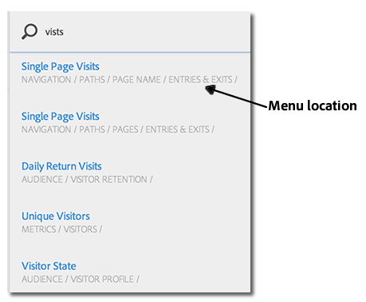
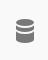

# Menu Rapporten{#reports-menu}

Een overzicht van het menu Rapporten in Rapporten &amp; Analytics.

Het menu Rapporten bevat:

* Toegang tot de volledige reeks verslagen
* Mogelijkheid om favoriete rapporten in te stellen voor snelle toegang
* Vaak bekeken rapporten
* Verbeterde zoekopdracht

Mijn Favorieten, Vaak bekeken, en de Geschiedenis van het Rapport zijn allen rapport-reeks specifiek. Als u rapportsuites verandert, zullen alle drie lijsten veranderen.

In rapporten wordt via een hiërarchische kolomweergave genavigeerd. Klik **[!UICONTROL View All Reports]**, of duw op de Volgende sleutel van de Schuine streep (/), en duw dan op de Benedene sleutel van de Pijl (?) om het menu snel weer te geven en te navigeren met de pijltoetsen. Druk op de toets Escape om het menu te sluiten zonder het huidige rapport te wijzigen of druk op Enter om het geselecteerde rapport te laden.

{width=&quot;672px&quot;}

Zie [Beschrijvingen rapporteren](https://docs.adobe.com/content/help/en/analytics/components/variables/c-variables.html) voor meer informatie over afzonderlijke rapporten.

## Zoeken naar rapporten {#section_E5EF11E36CB9451AA7B079E585CA7DB6}

Het menu Rapporten biedt een verbeterde zoekervaring. Klik **[!UICONTROL View All Reports]**, of duw op de Volgende sleutel van de Schuine streep (/), en begin dan te typen om snel een rapport te vinden. De rapportzoekopdracht is uitgebreid en bevat nu alles in de linkernavigatie Analytics (Admin, Components, enz.).

Druk op Tab of op Pijl-omlaag (?) om door de lijst van rapporten te navigeren. Druk op de toets Escape om de zoekopdracht te sluiten zonder het huidige rapport te wijzigen of druk op Enter om het geselecteerde rapport te laden.

>[!NOTE]
>
>U kunt de rapportlijst ook doorzoeken op basis van eigenschap, eVar en gebeurtenisnummer. Voer op de zoekbalk de waarde voor de eigenschap, de eVar of het gebeurtenisnummer in.

## Navigatieoverzicht {#section_A6A0A369207149BABE504753B48A42D7}

<table id="table_3BA295966BBC4C94ABDC3718D1894698"> 
 <thead> 
  <tr> 
   <th colname="col1" class="entry"> Menu-opdracht </th> 
   <th colname="col2" class="entry"> Beschrijving </th> 
  </tr>
 </thead>
 <tbody> 
  <tr> 
   <td colname="col1">Menu Experience Cloud-oplossingen  </td> 
   <td colname="col2"> Als u op dit pictogram klikt, wordt het menu Experience Cloud uitgebreid, zodat u toegang hebt tot andere oplossingen van marketingmogelijkheden. </td> 
  </tr> 
  <tr> 
   <td colname="col1">Rapportmenu  in-/uitschakelen </td> 
   <td colname="col2"> Als u op deze knop klikt, wordt het menu Rapporten uitgevouwen of samengevouwen, zodat u een rapport kunt weergeven met de volledige breedte van het browservenster. </td> 
  </tr> 
  <tr> 
   <td colname="col1">Segmenten  </td> 
   <td colname="col2">Brings up the segment rail that lets you lets add or manage. U kunt tot de <a href="/help/components/segmentation/segmentation-workflow/seg-build.md"  > interfaces van de Bouwer van het Segment </a> en <a href="https://docs.adobe.com/content/help/en/analytics/components/segmentation/segmentation-workflow/seg-manage.html"  > van de Manager van het Segment</a> van het segmentspoor ook toegang hebben. </td> 
  </tr> 
  <tr> 
   <td colname="col1">Cijfers  </td> 
   <td colname="col2"> Brings up the metrics rail that lets you lets add or manage metrics and calculations. </td> 
  </tr> 
  <tr> 
   <td colname="col1"> Alle rapporten weergeven </td> 
   <td colname="col2">Al uw rapport-reeks-specifieke rapporten, dashboards, referenties, berekende metriek, en doelstellingen zijn bevat in  Mening Alle Rapporten secties. Klik hier op elk gewenst moment om door alles te navigeren wat voor u beschikbaar is. </td> 
  </tr> 
  <tr> 
   <td colname="col1">Zoekbalk in  Alle rapporten weergeven </td> 
   <td colname="col2"> 
 Hiermee kunt u zoeken naar de benodigde bron. Het gebruikt zogenaamde "vage"onderzoek, zodat te hoeven u niet om de nauwkeurige formulering in te gaan u zoekt. De zoekresultaten worden weergegeven in een rechte lijst waarin u met pijl-omhoog, pijl-omlaag en pijl-omlaag kunt navigeren. Als u op  Enter op een zoekresultaat drukt, gaat u rechtstreeks naar dat rapport. 
 </td> 
  </tr> 
  <tr> 
   <td colname="col1"> Mijn favorieten   </td> 
   <td colname="col2">U kunt de rapporten gemakkelijk terugwinnen u als  Favoriete  van dit gebied merkte. Op een per-gebruiker en per-rapport-reeks basis, toont het tien Favorieten en  Meer.. als u meer dan tien favorieten hebt. 
Merk op dat u rapporten maar niet dashboards in Mijn Favorieten kunt anders noemen. 
 
Favorieten zijn vergelijkbaar met bladwijzers, maar ze worden niet opgeslagen in een map of worden net als bladwijzers beheerd via <a href="/help/analyze/reports-analytics/bookmarks.md"  > Bladwijzerbeheer</a>. 
 </td> 
  </tr> 
  <tr> 
   <td colname="col1"> Veelvuldig weergegeven </td> 
   <td colname="col2"> Adobe Analytics houdt de tien rapporten bij die u de afgelopen 90 dagen het vaakst hebt uitgevoerd en toont ze hier, gesorteerd op hoe vaak u ze uitvoert. Als u niet meer dan 90 dagen in deze rapportenreeks bent geweest, vult het de lijst met een algemene lijst van tien populaire rapporten. </td> 
  </tr> 
  <tr> 
   <td colname="col1"> Rapportgeschiedenis </td> 
   <td colname="col2"> Hier vindt u de meest recente tien rapporten of dashboards die u in de afgelopen 90 dagen hebt geopend. U kunt eenvoudig terugkeren naar een vorige stap in uw analyse of rapportage. </td> 
  </tr> 
  <tr> 
   <td colname="col1"> Download </td> 
   <td colname="col2">Hiermee kunt u het rapport downloaden in de indelingen PDF, CSV, Excel en Word. </td> 
  </tr> 
  <tr> 
   <td colname="col1"> Verzenden </td> 
   <td colname="col2">Hiermee kunt u het rapport direct per e-mail verzenden of de e-mail plannen op een eenmalige of terugkerende basis. Indelingsopties zijn onder andere PDF, CSV, Excel, HTML, Word of Mobile (alleen tekst).</td> 
  </tr> 
  <tr> 
   <td colname="col1"> Bladwijzer... </td> 
   <td colname="col2">Hiermee kunt u <a href="/help/analyze/reports-analytics/bookmarks.md"  > bladwijzer</a> het rapport toevoegen. </td> 
  </tr> 
  <tr> 
   <td colname="col1"> Dashboard... </td> 
   <td colname="col2">Hiermee kunt u het rapport toevoegen aan een <a href="/help/analyze/reports-analytics/dashboard.md"  > dashboard</a>. </td> 
  </tr> 
  <tr> 
   <td colname="col1"> Meer... </td> 
   <td colname="col2"> Hiermee kunt u alle of sommige van de volgende handelingen uitvoeren: druk het, haal gegevens uit het, voeg een alarm aan het toe, creeer een douanerapport, kopieer een grafiek, verbinding aan dit rapport, en open een nieuw venster. </td> 
  </tr> 
  <tr> 
   <td colname="col1">Rapportsuite Selector  </td> 
   <td colname="col2">Hiermee kunt u <a href="https://docs.adobe.com/content/help/en/analytics/admin/manage-report-suites/report-suites-admin.html"  > basisrapportsuites</a> of <a href="https://docs.adobe.com/help/nl-NL/analytics/components/virtual-report-suites/vrs-about.html"  > virtuele rapportsuites</a> selecteren. </td> 
  </tr> 
  <tr> 
   <td colname="col1">Kalender  </td> 
   <td colname="col2">Brings up de <a href="/help/analyze/reports-analytics/overview/report-overview.md#section_8C6C4AD84D9043E8ABD53FF8F645AAB1"  > kalender</a> zodat kunt u de rapportperiode bepalen. </td> 
  </tr> 
 </tbody> 
</table>

## Het menu Alle rapporten aanpassen {#section_7E47312747564FBE8A55EE5726B7DFF4}

Beheerders kunnen de rapporten in het menu Rapporten wijzigen. Zie [Menu Aanpassen](https://docs.adobe.com/content/help/en/analytics/admin/admin-tools/customize-menus.html) in Admin Help.
