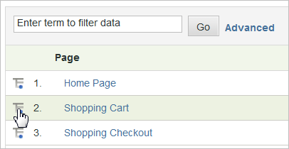

# Uitsplitsingen

{{ra-eol}}

De onderverdelingen van het gebruik wanneer u meer over wilt weten hoe een rapportpunt of een segment op andere rapporten betrekking hebben. Dit wordt vaak &quot;het breken van&quot;een rapport door een ander rapport genoemd.

Een voorbeeld is een verdeling van een rapport van het douaneverkeer genoemd de Groep van de Leeftijd, waarin u de pagina&#39;s van de plaatsbezoekers van een onderzoek hebt verzameld. Met dit rapport kunt u zien welke leeftijdsgroep verantwoordelijk is voor het meeste verkeer op uw site. Als u echter de moeite hebt genomen om iets als de leeftijd van een bezoeker vast te leggen, wilt u wellicht meer weten dan alleen de paginaweergaven. U kunt een uitsplitsingsrapport genereren over de zoekmachine die ze gebruiken, welke trefwoorden ze gebruiken of waar ze zich geografisch bevinden. U hebt een correlatie tussen de leeftijdsgroep en de zoekmachine.

Als u een rapport indeelt door *`Referrer Type`* kan een gegevenspunt worden weergegeven voor *`Inside Your Site`*. Deze waarde geeft een verwijzingspagina aan die voorkomt in de lijst Interne URL-filters. Zie [Interne URL-filters](/help/admin/admin/c-manage-report-suites/c-edit-report-suites/general/internal-url-filter-admin.md) in de Admin Reference.

U kunt elke analytische variabele (eVar of eigenschap) opsplitsen met een andere variabele. De **[!UICONTROL Breakdown By]** menu in de rapporttabel komt overeen met het standaardmenu Analytics-rapportage, zodat selecties consistent blijven

## Een uitsplitsingsrapport uitvoeren {#task_F685624830E64C829C8BE6435A107F69}

Een uitsplitsingsrapport uitvoeren:

<!-- 

t_reports_breakdown.xml

 -->

1. Open rapport, zoals **[!UICONTROL Analytics]** > **[!UICONTROL Reports]** > **[!UICONTROL Site Content]** > **[!UICONTROL Pages]**.
1. Klik in de rapporttabel op de knop **[!UICONTROL Breakdown By]** pictogram.

   Als de **[!UICONTROL Breakdown By]** is niet zichtbaar, is de functie niet beschikbaar of niet ingeschakeld.

   

   De **[!UICONTROL Breakdown By]** toont alle beschikbare verdelingsopties beschikbaar voor het huidige rapport.
