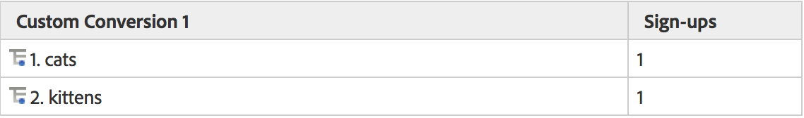
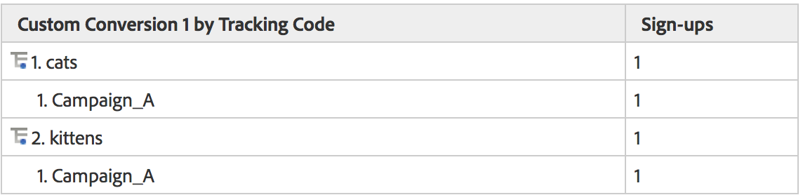

# Subrelaties

Volledige subrelaties worden ingeschakeld voor alle conversierapporten, zodat u elke eVar kunt afsplitsen op een andere eVar. Het menu Onderverdeling op in de rapporttabel komt overeen met het standaardmenu Analytics-rapportage, zodat selecties consistent blijven

## Hoe Subrelaties werken {#section_5BD862BB74FE411B96B59204520E4631}

Neem het volgende voorbeeld om te laten zien hoe subrelaties werken:

1. Een gebruiker komt naar uw site via Campaign_A en arriveert op de startpagina.
1. De gebruiker zoekt naar &#39;katten&#39; en geeft de zoekresultaten weer. In Var1 worden de interne zoektermen bijgehouden.
1. De gebruiker schrijft aan een postingslijst in, die gebruikend event1 wordt gevolgd.
1. Een andere gebruiker komt ook via Campaign_A naar uw site en arriveert op uw homepage.
1. Deze gebruiker zoekt naar &#39;kittens&#39;, toont zoekresultaten (eVar1) en abonneert zich ook op de mailinglijst (event1).

Als u een het Volgen coderapport trok, zou u het volgende zien:

Als u een eVar1 rapport trok, zou u het volgende zien:

Als u het rapport van de Campagne door eVar1 subrelated, zou u het volgende krijgen:

Als u het eVar1 rapport door Campagnes subrelated, zou u het volgende krijgen:

Vanwege de persistente aard van conversievariabelen worden twee gegevenskolommen gebruikt voor het opslaan van Var-waarden. de waarde die wordt geactiveerd en de waarde die blijft bestaan. Als we zouden kijken naar een onbewerkte gegevensexport voor dit voorbeeld, ziet het er als volgt uit (vereenvoudigd voor dit voorbeeld):

Onze backend werkt door post_campagne en post_evar1 toe te staan om de waarden voort te zetten die in campagne en evar1 worden bepaald. In subrelatierapporten wordt alleen gekeken naar de resultaten die succesgebeurtenissen bevatten (rijen die lichtgeel zijn gemarkeerd). Vervolgens vullen ze de subrelatierapporten in op basis van de aanhoudend waarden (in dit geval post_campagne en post_evar1, cellen gemarkeerd in heldergeel).

In wezen volgen subrelaties deze stappen om uw rapport te vullen:

* Isoleer de afbeeldingsaanvragen met de succesgebeurtenis(sen) die u in het rapport weergeeft.
* Retourneer de persisted waarden van elke conversievariabele die in de subrelatie wordt gebruikt.
* Organiseer de waarden op basis van de volgorde van de subrelatie. Als een variabele geen persisted waarde heeft (bijvoorbeeld als een eVar nooit is gedefinieerd of verlopen), wordt deze onder &#39;Geen&#39; opgenomen.

