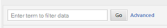
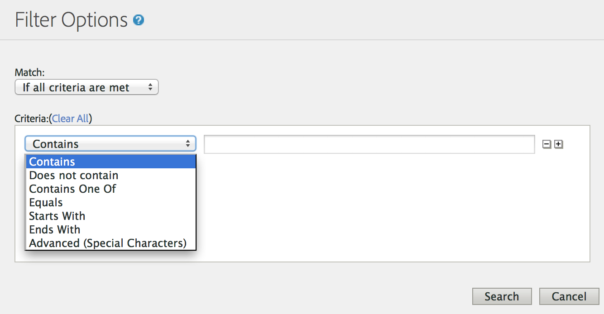

# Rapportgegevens filteren {#concept_09DC5B986A644738B12204DAC76A90E1}

Met filters kunt u het rapport beperken en regelitems die overeenkomen met een filter, opnemen of uitsluiten.

## Eenvoudig filter {#section_5C4DE873F8D5484BB77F38A4AEB57B4A}



Het eenvoudige filter verschijnt op de meeste rapporten om u snel specifieke lijnpunten te laten vinden. Bij eenvoudige filters worden geen speciale tekens gebruikt, dus `-, ", ', +` en andere speciale tekens komen overeen met de letterlijke waarde in het rapport. Met een spatie kunt u zoeken naar lijstitems die meerdere termen bevatten.

Bijvoorbeeld:

```
help search
```

Komt overeen met de volgende pagina&#39;s:

```
help:Search
help:Paid Search Detection
help:Configure paid search detection
help:Search Keywords Report
help:Internal Search Term
```

## Geavanceerde filters {#section_E016626C084640E8A066B2FDA5B932BF}

Met geavanceerde filters kunt u het bereik van de zoekopdracht bepalen aan de hand van een verzameling filters. U kunt selecteren om alle filters, of om het even welke filters aan te passen.



**Bevat**

Komt overeen als de termijn overal in het lijnpunt wordt gevonden. Dit werkt hetzelfde als het eenvoudige filter.

> [!NOTE] Spaties kunnen niet worden gebruikt in filters, omdat spaties scheidingstekens zijn in zoekopdrachten

**Bevat niet**

Komt overeen als de termijn nergens in het lijnpunt wordt gevonden. U kunt &quot;niet gespecificeerd&quot;, &quot;niets&quot;, &quot;sleutelwoord niet beschikbaar&quot;en andere [speciale waarden](https://marketing.adobe.com/resources/help/en_US/reference/none-unspecified-unknown-other.html) van rapporten filtreren gebruikend &quot;bevat niet&quot;.

Bevat niet: `none`

Voor een nauwkeuriger filter kunt u een geavanceerd filter (Speciale tekens) gebruiken:

* Geavanceerd (speciaal teken): `-^none$`
* Geavanceerd (speciaal teken): `-"keyword unavailable"`

Het volgende regelitem wordt bijvoorbeeld gefilterd door de criteria &quot;Bevat niet&quot;, maar wordt niet gefilterd door de criteria &quot;Geavanceerd (Speciaal teken)&quot;:

```
help:Rename the None classification key
```

**Bevat een van**

Komt overeen met termen die in het regelitem zijn gevonden, gescheiden door spaties. Met het volgende filter worden alle pagina&#39;s weergegeven die &quot;mens&quot; of &quot;uitverkoop&quot; bevatten:

Bevat één van: `mens sale`

Komt overeen met de volgende pagina&#39;s:

```
Womens
Mens
Mens:Desk & TravelJewelry & Accessories:Accessories:Hats:Mens
Sale & Values
```

**Gelijk**

Komt overeen met de opgegeven woordgroep als het gehele regelitem, inclusief spaties en andere tekens, overeenkomt.

Gelijk aan: `mens:desk & travel`

`Mens:Desk & Travel`

**Begint met**

Komt overeen als het lijstitem, met inbegrip van ruimten en andere karakters, met de gespecificeerde uitdrukking begint.

Begint met: `mens`

Komt overeen met de volgende pagina&#39;s:

```
Mens
Mens:Desk & Travel
Mens:Apparel
Mens Perfume Spray
Mens Hemp/Bamboo Flip Flops
```

**Eindigt met**

Komt overeen met het feit of het regelitem, inclusief spaties en andere tekens, eindigt met de opgegeven woordgroep.

Eindigt met: `jean`

Komt overeen met de volgende pagina&#39;s:

```
Bell Bottom Jean
Velvet Dream Skinny Leg Jean
Dark Slimmer Jean
Bling Belt High Waist Jean
Ocean Blue Jean
```

## Geavanceerd (speciaal teken) {#section_83DA3B6C23EB4C119DB6D74062DB501D}

Met Geavanceerd kunt u jokertekens en andere complexe zoekopdrachten uitvoeren.

| Geavanceerd (speciaal teken) | Beschrijving |
|--- |--- |
| `" "` | Identieke uitdrukking. |
| `*` | Jokerteken, greedy matching. <br>Komt bijvoorbeeld `r*p` overeen met Registratie-opname. |
| `^` | Begint met. <br>Plaats geen spatie tussen het speciale teken en de zoekfrase. |
| `$` | Eindigt met. <br>Plaats geen spatie tussen het speciale teken en de zoekfrase. |
| `-` | Niet. <br>Plaats geen spatie tussen het speciale teken en de zoekfrase. |
| `|` | <br>OrNote:  u moet een ruimte aan elke kant van het pijpkarakter omvatten, `" | "`. |

## Rapportspecifieke filters maken {#task_DEBB0632411D4CA8AA0B3BA267A5B35F}

Stappen die beschrijven hoe te om filters voor rapporten tot stand te brengen.

<!-- 

t_reports_filter_specific.xml

 -->

Bepaalde rapporten bevatten een filter dat specifiek is voor dat rapport. Met een script kunt u bijvoorbeeld filteren op webpagina&#39;s. [!UICONTROL Purchase Conversion Funnel Report] Met een [!UICONTROL Geosegmentation Report] filter kunt u filteren op geografische regio. Aanvullende rapporten hebben andere filters die specifiek zijn voor die rapporten.

Wanneer u tot deze filters toegang hebt, kunt u rapportmetriek voor de punten zien die in de lijst worden gespecificeerd.

**Rapportspecifieke filters maken**

1. Genereer een rapport, bijvoorbeeld een rapport [!UICONTROL Purchase Report] ( **[!UICONTROL Site Metrics]** > **[!UICONTROL Purchases]** > **[!UICONTROL Purchase Conversion Funnel]**).
1. Klik in de rapportkoptekst op de **[!UICONTROL Filter]** koppeling.
1. Klik op de [!UICONTROL Filter Selector] pagina **[!UICONTROL Apply a Filter]** en selecteer een filtertype.
1. Als u naar een item wilt zoeken, typt u een tekenreeks in het **[!UICONTROL Search]** veld.
1. Klik op **[!UICONTROL OK]**.

## Een correlatiefilter toevoegen {#task_065042E384DA4BF3864C58AF2B88D6E2}

Stappen die beschrijven hoe u een correlatiefilter kunt toevoegen.

<!-- 

t_reports_correlation_filter.xml

 -->

In bepaalde rapporten kunt u aangepaste correlatiefilters toevoegen. Bijvoorbeeld, als u [!UICONTROL Pages Report] voor een rapportreeks bekijkt die de Secties van de Plaats gecorreleerd met een pagina van de Vrouwen heeft, kunt u een filterregel tot stand brengen die een rapport produceert die de populairste pagina&#39;s toont wanneer de Secties van de Plaats = Vrouwen.

U kunt de gegevens in een correlatierapport filteren met behulp van elke beschikbare correlatie. In het volgende voorbeeld ziet u hoe u een correlatiefilter voor zoekprogramma&#39;s toevoegt.

**Een correlatiefilter toevoegen**

1. Voer een rapport uit dat correlaties ondersteunt. (Zie Een [uitsplitsingsrapport](/help/analyze/reports-analytics/reports-customize/breakdowns.md#task_F685624830E64C829C8BE6435A107F69)uitvoeren.)
1. Klik in de rapportkoptekst op de **[!UICONTROL Correlation Filter]** koppeling.
1. Selecteer onder [!UICONTROL Filter Rule Creator]een categorie die u met een object wilt correleren.
1. Klik op **[!UICONTROL OK.]**
