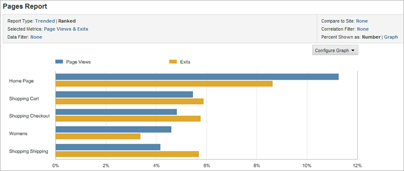

# Rapportgrafieken wijzigen

Stappen die beschrijven hoe te om de grafiek aan te passen zodat het voor het voorgenomen publiek het nuttigst is.

Het type grafieken dat beschikbaar is, is afhankelijk van het type rapport dat u uitvoert. Tendellijngrafieken zijn bijvoorbeeld handig voor trendrapporten, maar u kunt ook een verticale staafgrafiek gebruiken met trendlijnen die trends over dagen, weken, maanden, enzovoort duidelijk illustreren. U kunt ook een schijfdiagram kiezen om percentages voor de weergegeven pagina&#39;s weer te geven.

**Een rapportgrafiek wijzigen**

1. Voer een rapport uit.
1. Klik op **[!UICONTROL Configure Graph]**.
1. Selecteer een grafiektype.

   **[!UICONTROL Trend Line]**: De lijnen van de trend tonen dagelijkse tendensen voor de rapportmetriek en zijn nuttig om één metrisch over tijd per lijn te trenderen.

   

   **[!UICONTROL Smooth Line]**: U gebruikt dit grafiektype met het [!UICONTROL Video Detail Report]. Het toont de aantallen of de percentages van meningen voor specifieke segmenten van een video. Een toename in weergaven voor een specifiek segment van de video geeft aan dat viewers dat gedeelte van de video meerdere keren hebben teruggespoeld en bekeken. Als u percentages gebruikt, is het percentage in de grafiek een percentage van alle weergegeven segmenten, niet een percentage van de kijkers die het segment zagen. In de grafiek is de som van alle rapportsegmenten bijvoorbeeld 39. Het aantal meningen voor het 0 tot 10 secondensegment is 10. Daarom is het percentage van meningen voor dit segment ongeveer 26 percenten.

   

   **[!UICONTROL Area]**: De vlakgrafiek lijkt op de grafiek van de Trend Line, maar vult het gebied onder de lijnen. U moet een georiënteerd rapport bekijken om de grafiek van het Gebied te tonen.

   

   **[!UICONTROL Stacked Area]**: Gestapelde vlakgrafieken zijn handig wanneer u een aantal producten of campagnes in de loop der tijd wilt laten overlopen. Bijvoorbeeld, als u de top vijf producten die opbrengst tonen, u kunt snel zien hoeveel totale opbrengst die producten in tijd brengen. U kunt de weergave verfijnen door een zoekfilter te gebruiken om bepaalde producten op te nemen of uit te sluiten.

   

   **[!UICONTROL Vertical Bar]**: Het verticale grafiek van de Bar toont relatieve percentages voor de rapportmetriek.

   

   **[!UICONTROL Stacked Vertical Bar]**: Door vergelijkbare items te stapelen, kunt u snel de totale invloed van een item zien. Bijvoorbeeld, in een [!UICONTROL Campaign Report], kunt u gelijkaardige succesmetriek stapelen en zien welke campagne het meeste succes produceert. Met stapelen is het gemakkelijker om campagnes te vinden die niet de beste uitvoerders in één metrische eenheid zijn, maar die de beste uitvoerders zijn in een combinatie van metriek.

   

   **[!UICONTROL Horizontal Bar]**: Het diagram van de horizontale balk lijkt op het diagram van de verticale balk, maar de kolommen zijn horizontaal.

   

   **[!UICONTROL Stacked Horizontal Bar]**: Het gestapelde horizontale staafdiagram lijkt op het verticale staafdiagram, maar de kolommen zijn horizontaal.

   

   **[!UICONTROL Pie]**: In het schijfdiagram worden de hoogste metrische waardepercentages ten opzichte van elkaar weergegeven en wordt het percentage van de geselecteerde metriek ten opzichte van het geheel weergegeven. U kunt het schijfdiagram voor gerangschikte rapporten weergeven.

   

   **[!UICONTROL Scatter]**: De spreidingsgrafiek toont een spreidingsvertoning van de metriek u met betrekking tot elkaar selecteert. Met spreidingsgrafieken kunt u gegevens in twee dimensies visualiseren, zodat u kunt zien welke items uitschieters zijn.

   

   **[!UICONTROL Bubble]**: De grafiek van de Bubbel toont een bel vertoning van de metriek u met betrekking tot elkaar selecteert. De plaats van de bellen toont de verhoudingen tussen de metriek op de horizontale en verticale as, terwijl de grootte van de bel metrisch het belangrijkste rapport toont. Met Bubble-grafieken kunt u gegevens in twee dimensies visualiseren, zodat u kunt zien welke items uitschieters zijn.

   

