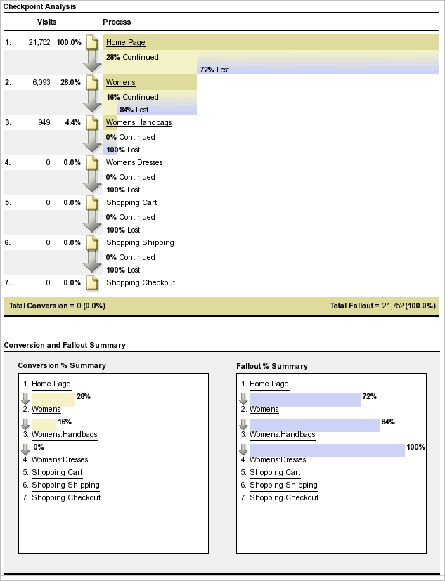

# Verschillende rapporttypen uitvoeren

Stappen bij het runnen van de verschillende rapporttypes.

## Een gerangschikt rapport {#task_C570BA4A213F4F2EB7B30E012934BE7D} uitvoeren

In een gerangschikt rapport, toont de lijst de rangschikkingen van de rapportpagina&#39;s met betrekking tot metrisch, volgens aantal of percentage. De gerangschikte rapporten kunnen veelvoudige metriek in een rapport tonen.

<!-- 

t_reports_ranked.xml

 -->

1. Genereer een rapport, zoals een [!UICONTROL Pages Report] ( **[!UICONTROL Reports]** > **[!UICONTROL Site Content]** > **[!UICONTROL Pages]**).
1. Klik in de rapportkoptekst op **[!UICONTROL Ranked.]**
1. Om het rapport te rangschikken, klik een kolomrubriek in de lijst.

   De gerangschikte rapporten kunnen tot 200 punten hebben die in de lijst (zoals producten, categorieën, Web-pagina&#39;s, etc.) en tien metriek (opbrengst, orden, meningen, etc.) worden vermeld.

## Een vernieuwd rapport {#task_F03B4E760B9E4EA29FC3F654E6316887} uitvoeren

In trendrapporten worden metrische gegevens in de loop der tijd weergegeven. U gebruikt dit rapporttype wanneer u wilt zien hoe een segment van één tijdspanne aan volgende presteert.

<!-- 

t_reports_trended.xml

 -->

De meeste rapporten van de Omzetting en van het Verkeer hebben een Gevorderde beschikbare mening. Met de [!UICONTROL Calendar] kunt u een verbetering weergeven voor uitsplitsingen naar tijdsperiode, zoals dagen van een maand, weken van een jaar, weken van een kwartaal, maanden van een jaar enzovoort. In trendrapporten worden trends weergegeven voor één meting (omzet, bestellingen, weergaven, enzovoort) voor maximaal vijf items (zoals producten, categorieën, webpagina&#39;s, enzovoort).

**Een trendrapport uitvoeren**

1. Voer een conversie- of verkeersrapport uit, zoals **[!UICONTROL Reports]** > **[!UICONTROL Site Content]** > **[!UICONTROL Pages]**.
1. Klik onder **[!UICONTROL Report Type]** op **[!UICONTROL Trended.]**

## Een conversietrechter-rapport uitvoeren {#task_B926A74AA6A641138C2986C1635120CB}

De rapporten van het Kanaal van de Omzetting tonen het percentage bezoekers die door een reeks gebeurtenissen zijn gegaan om een gewenste actie uit te voeren. U kunt bijvoorbeeld zien hoeveel bezoekers uw webpagina hebben bezocht door items aan een winkelwagentje toe te voegen en vervolgens een object aan te schaffen. Dit verslag toont ook het aantal mensen dat onderweg is gevallen.

<!-- 

t_reports_conversion_funnel.xml

 -->

Als u dit rapport wilt uitvoeren, selecteert u een rapport, zoals een rapport Pagina&#39;s ( **[!UICONTROL Reports]** > **[!UICONTROL Campaigns]** > **[!UICONTROL Tracking Code]** > **[!UICONTROL Campaign Conversion Funnel]**).

Zie [Conversierapporten](https://docs.adobe.com/content/help/en/analytics/components/variables/dimensions-reports/reports-conversion.html) voor een beschrijving.

## Een uitvalrapport uitvoeren {#task_8FD97C8260464F9DA731A93DB8F80184}

In [!UICONTROL Fallout Report] ziet u het aantal bezoekers dat een vooraf opgegeven reeks pagina&#39;s heeft bezocht. Het toont ook omzettings en valutarieven tussen elke stap.

<!-- 

t_reports_fallout.xml

 -->

Ontdek het nieuwe [Fallout Analysis](https://docs.adobe.com/content/help/en/analytics/analyze/analysis-workspace/visualizations/fallout/fallout-flow.html) paneel in Analysis Workspace!

1. Klik in [!UICONTROL Adobe Analytics] op **[!UICONTROL Reports]** > **[!UICONTROL Paths]** > **[!UICONTROL Pages]** > **[!UICONTROL Fallout]**.
1. Klik op [!UICONTROL Fallout Report] op de pagina.**[!UICONTROL Launch the Fallout Report Builder]**

   

1. Geef op de pagina [!UICONTROL Define Checkpoints] de controlepunten op die u voor het rapport wilt gebruiken.
1. Klik op **[!UICONTROL Run Report]**.

   

>[!MORELIKETHIS]
>
>* [Beschrijving van evaluatierapport](https://docs.adobe.com/content/help/en/analytics/components/variables/dimensions-reports/reports-fallout.html)

## Een rapport voor paginastroom uitvoeren {#task_133E8B87C3F04DA0A42D10CBA499305B}

In de rapporten Paginastroom wordt de volgorde weergegeven waarin bezoekers de pagina&#39;s openen en door uw site navigeren. Dit rapport helpt antwoord

Ontdek de nieuwe [Stroomvisualisatie](https://docs.adobe.com/content/help/en/analytics/analyze/analysis-workspace/visualizations/fallout/fallout-flow.html) in Analysis Workspace!

Voer een rapport [Paden](https://docs.adobe.com/content/help/en/analytics/components/variables/dimensions-reports/reports-paths.html) uit.

Klik bijvoorbeeld op **[!UICONTROL Reports]** > **[!UICONTROL Paths]** > **[!UICONTROL Pages]** > **[!UICONTROL Next Page Flow]**.

U leest dit rapport van links naar rechts, te beginnen met de geselecteerde pagina. De pagina&#39;s die na de geselecteerde pagina zijn weergegeven, worden weergegeven als een vertakking die zich naar rechts uitbreidt.

Het percentage dat elke volgende pagina is weergegeven, wordt naast de naam van de pagina weergegeven. De breedte van de lijn die aan elke volgende pagina wordt verbonden toont dit relatieve percentage.

**[!UICONTROL Path Views]**: Hiermee geeft u het aantal keer aan dat een pagina is weergegeven, wanneer deze is beperkt tot de weergegeven paden.

De pagina Privacybeleid kan bijvoorbeeld in totaal 10.000 paginaweergaven bevatten, maar slechts 500 van deze paginaweergaven vond direct na de startpagina plaats. De term padweergave wordt dus gebruikt.

Het relatieve percentage wordt weergegeven door de relatieve breedte van de lijn. Dit rapport geeft standaard vijf vertakkingen op het tweede niveau en vijf vertakkingen op het derde niveau weer. U kunt het aantal vertakkingen uitbreiden om tot tien vertakkingen op het tweede niveau en vijf vertakkingen op het derde niveau weer te geven. Dit verhoogt de hoogte van het rapport en hoogstwaarschijnlijk vereist schuiven om de volledige grafiek te bekijken.

## Voer een Trechter-rapport {#task_2BBF6FACD48F479E8B2EE458919941CB} uit

U kunt succesgebeurtenissen selecteren en deze toevoegen aan een [!UICONTROL Purchase Conversion Funnel]-rapport of een [!UICONTROL Product Conversion Funnel]-rapport.

<!-- 

t_reports_funnel.xml

 -->

1. Klik op **[!UICONTROL Reports]** > **[!UICONTROL Products]** > [Productconversietrechter](https://docs.adobe.com/content/help/en/analytics/components/variables/dimensions-reports/reports-conversion-funnel.html).

## Een marketingkanaalrapport uitvoeren {#task_64ADED5CC75248319E06E3E029B47F78}

De rapportage van het marketingkanaal biedt een overzichtsrapport van de eerste en laatste kanaaltoewijzing, met standaard rapportcijfers zoals omzet, bestellingen en kosten. Deze rapporten laten u toe om te analyseren hoeveel opbrengst elk kanaal produceert.

<!-- 

t_reports_marketing_channel.xml

 -->

Zie [Marketing Channel](/help/components/c-marketing-channels/analyze-mc.md) Help voor meer informatie.

## Een Anomaly Detection-rapport uitvoeren {#task_4808C96327354D789C075823F5C3A049}

Beschrijft hoe te om de Samenvatting en Individuele Metrische grafieken in Anomaly Detection te interpreteren.

<!-- 

t_anomaly_view.xml

 -->

Bekijk de nieuwe [Anomaly Detection and Contribution Analysis](https://docs.adobe.com/content/help/nl-NL/analytics/analyze/analysis-workspace/virtual-analyst/anomaly-detection/anomaly-detection.html)-functies in Analysis Workspace!

**[!UICONTROL Reports]** > **[!UICONTROL Site Metrics]** > **[!UICONTROL Anomaly Detection]** .

>[!NOTE]
>
>U kunt ook Anomaly Detection uitvoeren vanuit Analysis Workspace-projecten. [Meer...](https://docs.adobe.com/content/help/en/analytics/analyze/analysis-workspace/virtual-analyst/anomaly-detection/anomaly-detection.html)

Raadpleeg de [Referentiehandleiding](https://docs.adobe.com/content/help/en/analytics/analyze/reports-analytics/getting-started.html#Setting_up_Anomaly_Detection) voor informatie over het instellen van Anomaly Detection.

Bij Anomaly-detectie worden twee typen grafieken weergegeven: Een overzichtsgrafiek en individuele metriekaarten. Individuele metrische diagrammen worden alleen getoond als ten minste één anomalie voor die meting is gedetecteerd.

<table id="table_88163CD8FC164342855D90D01F9C581A"> 
 <thead> 
  <tr> 
   <th colname="col1" class="entry"> 
Type grafiek 
 </th> 
   <th colname="col2" class="entry"> 
Wat doet u? 
 </th> 
  </tr> 
 </thead>
 <tbody> 
  <tr> 
   <td colname="col1"> 
Samenvattingsgrafiek 
 
 
 </td> 
   <td colname="col2"> 
 
     <ul id="ul_D26DA3024CD7468291369F549557B28A"> 
      <li id="li_1C22B6E02FFB479FB71EFAD89EB37A4E">Elke doos vertegenwoordigt één anomalie, die per dag wordt gevolgd, die aan metrisch hieronder beantwoordt. </li> 
      <li id="li_8FC587D3FF4E452D83263CC7A10B6675">Groen geeft anomalieën boven de trendlijn aan, blauw onder de trendlijn. </li> 
      <li id="li_25135AB691BF443599AF2A3A60E2E71A">Geeft de sterkte van de anomalie aan: Hoe groter de anomalie, hoe donkerder de kleur van het gegevenspunt en hoe verder weg van de trendlijn. </li> 
      <li id="li_0C42AFA8897D420D8AB1A5D0F65B3B3A">Als u op individuele anomalieën klikt, wordt het individuele metrische diagram van die anomalie (onder het overzichtsdiagram) bovenaan weergegeven. </li> 
      <li id="li_85C0F426952547B5A75D6BD31DE19CA5">De waarden voor het afwijkingspercentage (links van de grafiek) worden als volgt berekend: 
       <ul id="ul_BEC0A88BFFAC4CF78BC9885FEB749694"> 
        <li id="li_1BAB2F50482745B69937DFAF1E09982E">Als de bovenste grenzen en de verwachte waarde gelijk zijn, is de afwijking % 100% </li> 
        <li id="li_CA48064F5788448C8646CCE196161237">Anders is de afwijking % (werkelijke waarde - bovenste gebonden waarde) / (bovenste gebonden waarde - verwachte waarde) * 100 </li> 
        <li id="li_4090357A0D214BC7B1C3DE0615875554">Als de onderste grenzen en de verwachte waarde gelijk zijn, is de afwijking % -100% </li> 
        <li id="li_EF694E1A4E874ECD94E1E8F7302E494F">Anders is de afwijking % (laagste gebonden waarde - werkelijke waarde) / (verwachte waarde - laagste gebonden waarde) * -100 </li> 
       </ul> </li> 
      <li id="li_5C05EF7023484CC993E96D63E842B65C">Als u op  Segmenten tonen  klikt, wordt de segmentrail weergegeven waarmee u segmenten kunt toepassen op een afwijkingsdetectierapport. <a href="https://docs.adobe.com/content/help/en/analytics/components/segmentation/seg-home.html"  > Meer  </a> over segmentatie. </li> 
      <li id="li_1B41CABF13D1407886C68EE3BC201E60">Als u op  Metriek bewerken klikt, kunt u metriek selecteren en deselecteren waarvoor u anomalieën wilt detecteren. </li> 
     </ul> 
 </td> 
  </tr> 
  <tr> 
   <td colname="col1"> 
Individuele metrische grafiek 
 
 
 </td> 
   <td colname="col2"> 
 
     <ul id="ul_739C5687013743A29B63089FDA763F45"> 
      <li id="li_456A0BDA4D4E46CE9CC1C3DBAA1E2220">Hiermee worden afwijkende gegevenspunten voor afzonderlijke trended-metriek (inclusief berekende metriek) als punten weergegeven. </li> 
      <li id="li_89FD847C65F04F48BCA7CD38D0EC51CD">Geeft de meest recente anomalie bovenaan weer, en plaatst secundair op aantal anomalieën. </li> 
      <li id="li_98B97A9706DE4455B8D8850904CBDE03">Geeft een effen lijn weer om de gegevens aan te geven die momenteel zijn verzameld. Dit wordt vergeleken met de prognose en de foutenmarge om te bepalen of gegevenspunten anomalieën zijn. </li> 
      <li id="li_0EEA38DDDC344BF3879430E67D74EB72">Geeft een stippellijn weer die een voorspelling weergeeft op basis van historische gegevens (d.w.z. de trainingsperiode). </li> 
      <li id="li_035BD2725D004AEDB630BF8DFF4DA4F3">Hiermee geeft u de bovenste en onderste 95%-betrouwbaarheidsintervallen/grenzen in een grijze schaduw weer. </li> 
      <li id="li_021A3D1F2EDB4319B9B39620EF1C038A">Hiermee kunt u afzonderlijke rapporten samenvouwen en uitvouwen door op de pijl-omhoog of -omlaag naast de naam van de metrische waarde te klikken. </li> 
      <li id="li_722E4B9FC21047AC96D7B143197E293D">Verandert de orde waarin de metrische grafieken door aan boor-downs in het overzichtsrapport (zie hierboven) te antwoorden verschijnen </li> 
      <li id="li_A2441169B185475AA68A64F81E6E40B8">Hiermee kunt u grafieken filteren door zoektermen te gebruiken, zoals "pagina" voor alle paginagerelateerde metriek. </li> 
      <li id="li_F1BBBFCA8E2A43C29658E4FCAA36C904">Hiermee kunt u alle door u gedefinieerde metriek of alleen die met anomalieën weergeven. </li> 
     </ul> 
 </td> 
  </tr> 
 </tbody> 
</table>

## Anomaly-detectie instellen {#task_AF347B34F56E44A6AE70E019B6EB2F08}

Stappen voor het selecteren van rapportsuites, metriek, en opleiding/meningsperiodes voor anomalieopsporing.

<!-- 

t_anomaly_config.xml

 -->

U plaatst onafhankelijk van elkaar Ontdekking voor elke rapportreeks.

1. Ga naar  **[!UICONTROL Analytics > Reports > Site Metrics > Anomaly Detection]** .
1. Selecteer de rapportreeks waarvoor u dagelijkse anomalieopsporing wilt volgen. Als u een lijst met rapportsuites wilt weergeven, klikt u op de keuzelijst Rapportsuite.
1. Als u de metriek wilt selecteren en/of gefilterde metriek wilt definiëren, klikt u op **[!UICONTROL Edit Metrics]** rechtsboven in het scherm:  .

   U kunt metriek van de lijst (met inbegrip van berekende metriek) van alle metriek of van een lijst van gevolgde metriek kiezen. U kunt ook filteren op specifieke termen om de lijst te verkleinen. 1. Nadat het rapport is gegenereerd, definieert u **[!UICONTROL Training Period]** en **[!UICONTROL View Period]** voor anomaliedetectie. (Beschouw de trainingsperiode als de ‘leerperiode’ voor het algoritme.)

   

   Houd er rekening mee dat:

* De trainingsperiode eindigt vlak voordat de weergaveperiode begint.
* De standaardduur voor beide is 30 dagen en u kunt deze verlengen tot 60 of 90 dagen.
* Als u de trainingsperiode verlengt, worden uw gegevens in een groter kader geplaatst en kan de grootte van een anomalie afnemen.

   Het rapport Metrische gegevens van Anomaly-detectie wordt telkens vernieuwd wanneer u een parameter wijzigt.
1. (Optioneel) Pas segmenten toe op het rapport door te klikken op **[!UICONTROL Show Segments]** en een of meer bestaande segmenten te selecteren of een nieuw segment te maken en het toe te passen.

   

   Zie [Analytics Segmentation Guide](https://docs.adobe.com/content/help/en/analytics/components/segmentation/seg-home.html) voor meer informatie over het creëren van en het beheren van segmenten. 1. (Optioneel) Favoriet of bladwijzer voor het rapport.
1. (Optioneel) Wijzig de einddatum van de weergaveperiode. De standaardwaarde is gisteren.
1. U kunt nu beginnen met het interpreteren van het rapport. [Anomaly Detection-grafieken](/help/analyze/reports-analytics/t-running-report-types.md#task_4808C96327354D789C075823F5C3A049) weergeven.

## Een real-time rapport {#task_5D25929C918E40B18965222FA94176B0} uitvoeren

Beschrijft om rapporten in real time te bekijken en te interpreteren.

<!-- 

reports_realtime.xml

 -->

**[!UICONTROL Reports > Site Metrics > Real-Time]** .

Real-Time rapportage biedt twee hoofdrapporten - een overzichtsrapport en een detailrapport. Ze bestaan elk uit een aantal verslagen.

Voor informatie bij het vormen rapporten in real time, zie [de Gids van de Verwijzing van Analytics](https://docs.adobe.com/content/help/en/analytics/landing/home.html#RealTime_Reports_Configuration).

1. Bekijk het **[!UICONTROL Overview]** rapport en zijn componenten:  

   <table id="choicetable_8586BECF55E843B2B5CD41205567EA32"> 
   <thead class="chhead sthead"> 
   <th class="choptionhd"> UI-component </th> 
   <th class="chdeschd"> Beschrijving </th> 
   </thead> 
   <tr class="chrow strow"> 
   <td class="choption"><strong>Rapportsuite selecteren</strong></td> 
   <td class="chdesc stentry"> Toont de rapportreeks die dit rapport in real time behandelt. Als u de rapportsuite wilt wijzigen, raadpleegt u <a href="https://docs.adobe.com/content/help/en/analytics/admin/admin-tools/real-time-reports/t-realtime-admin.html"  > Configuratie van realtime rapporten </a>. </td> 
   </tr> 
   <tr class="chrow strow"> 
   <td class="choption"><strong>Schakelen tussen rapporten</strong></td> 
   <td class="chdesc stentry"> Hiermee kunt u schakelen tussen de rapporten die u hebt ingesteld (maximaal 3.) </td> 
   </tr> 
   <tr class="chrow strow"> 
   <td class="choption"><strong>Tijdbereik selecteren</strong></td> 
   <td class="chdesc stentry"> Laat u de algemene tijdwaaier kiezen die door alle rapporten in het rapport moet worden gebruikt. </td> 
   </tr> 
   <tr class="chrow strow"> 
   <td class="choption"><strong>Rapporten configureren</strong></td> 
   <td class="chdesc stentry"> Deze koppeling naar het tandwielpictogram is alleen zichtbaar als u beheerdersrechten hebt. Als u hierop klikt, gaat u naar Report Suite Manager onder   Admin Tools  &gt;  Report Suites  &gt;  Edit Settings  &gt;  Real-Time  . </td> 
   </tr> 
   <tr class="chrow strow"> 
   <td class="choption"><strong>Volledige schermweergave</strong></td> 
   <td class="chdesc stentry"> Het pictogram van de volledige-schermmening is zichtbaar slechts als uw monitor een specifieke aspectverhouding (of 16:9 of 16:10) heeft EN als uw browser het steunt. U kunt niet communiceren met het scherm als het volledig scherm wordt weergegeven (druk op  Esc  om af te sluiten). De modus Volledig scherm heeft geen time-out. </td> 
   </tr> 
   <tr class="chrow strow"> 
   <td class="choption"><strong>Site Traffic ReportLet</strong></td> 
   <td class="chdesc stentry"> De blauwe gegevens van de trendlijn tonen het verkeerstotaal voor de algemene plaats. De X-as gebruikt letterlijke labels (15 minuten geleden, 10 minuten geleden), behalve de huidige waarde, die wordt weergegeven als een real-time expressie. </td> 
   </tr> 
   <tr class="chrow strow"> 
   <td class="choption"><strong>Site totaal rapport</strong></td> 
   <td class="chdesc stentry"> Stelt een telling van het Totaal van de Plaats voor metrisch in real time rapport voor de laatste N minuten voor. "N"is configureerbaar door de selecteur van de Waaier van de Tijd. 
De pijlkleur en -richting zijn gebaseerd op het volgende algoritme: 
      <ul id="ul_9F40CEA33798467393CB1266BB36D500"> 
      <li id="li_CCD01A44F912487DA5681EA50113643C">Significante verbreding (pijl-omhoog): &gt; 100% </li> 
      <li id="li_7402491A9A614851B7F2AE0C77BD9A97">Versterking (pijl-omhoog): tussen 5 % en 100 % </li> 
      <li id="li_BCA79C08B5714D4B9315068112C66107"> Vlak (pijl-rechts): tussen 5% en -5% </li> 
      <li id="li_234ECBD7D83A4AE680E4A70BF288681F"> Verlies (pijl-omlaag rechts): tussen -5% en -100% </li> 
      <li id="li_10C5EA8803604C1CA714D3DB27478B31"> Significant verlies (pijl-omlaag): &lt; -100% </li> 
      </ul> 
 
Als het totaal van de site wordt gerapporteerd in "exemplaren", weerspiegelen deze instanties de dimensie in het primaire rapport. Als er een instantiespecifieke naam bestaat (zoals "Paginaweergaven"), rapporteert het totaal van de site die naam. 
 </td> 
   </tr> 
   <tr class="chrow strow"> 
   <td class="choption"><strong>Primair rapport</strong></td> 
   <td class="chdesc stentry"> Rapport voor de primaire dimensie van het rapport in real time en voor zijn metrisch. Geeft een trendlijn voor dat element voor de geselecteerde tijdwaaier aan. Het metrische totaal vertegenwoordigt de som voor de volledige trendlijn. De pijl geeft aan of het item sterk wint, opraakt, plat, verloren of sterk verliest. </td> 
   </tr> 
   <tr class="chrow strow"> 
   <td class="choption"><strong>Dialoogvenster Zoeken</strong></td> 
   <td class="chdesc stentry"> Het onderzoek beïnvloedt alle rapporten. De zoekopdracht gaat door terwijl u het rapport weergeeft. </td> 
   </tr> 
   <tr class="chrow strow"> 
   <td class="choption"><strong>Sorteren op... Populairste/Gainers/Gebruikers</strong></td> 
   <td class="chdesc stentry"> U kunt schakelen om te sorteren op  Populairste  (gebrek),  Gainers  (dimensies die de meeste groei tonen), en  Gebruikers  (dimensies die op een neerwaartse trajectie. zijn) 
Hier volgt de formule die wordt gebruikt om meters of verliezers te bepalen: Real-Time zoekt naar het vroegste voorbeeld en het op één na laatste voorbeeld en voert een eenvoudige "% verandering"berekening uit. Dus als "Laatste 15 minuten" is geselecteerd en n de huidige minuut vertegenwoordigt, wordt n-1 vergeleken met n-15. Real-Time voert momenteel geen weging uit. De huidige minuut wordt genegeerd omdat deze niet volledig is en waarschijnlijk een wijziging van % false veroorzaakt. 
 
Deze formule is verenigbaar over alle metriek die in het rapport in real time wordt gebruikt. 
 </td> 
   </tr> 
   <tr class="chrow strow"> 
   <td class="choption"><strong>Secundaire 1 Rapporlet</strong></td> 
   <td class="chdesc stentry"> Presenteert Real-Time Rapporten voor de tweede provisioned dimensie van het rapport en voor metrisch. 
In het tweede 1-rapport worden de vier hoofdcategorieën weergegeven. de vijfde is een samenvoeging van alle resterende waarden . Voor elke categorie wordt de totale ruwe weergave van die categorie vermeld. Bovendien wordt het totaal voor alle categorieën in het midden weergegeven. 
 
 Als u de muisaanwijzer op een sectie plaatst, wordt de desbetreffende categorie gemarkeerd en wordt de trendlijn van de categorie onder de donut weergegeven. 
 
 Als u de muisaanwijzer op een regelitem plaatst, wordt het regelitem plus de bijbehorende sectie gemarkeerd en wordt de trendlijn van de categorie onder de donut weergegeven. 
 </td> 
   </tr> 
   <tr class="chrow strow"> 
   <td class="choption"><strong>Secundair 2 rapport</strong></td> 
   <td class="chdesc stentry"> Presenteert Real-Time Rapporten voor de derde provisioned dimensie van het rapport en voor metrisch. Als u de muisaanwijzer boven op het itemlabel plaatst, schuift u het label naar rechts en toont u een trendlijn voor het item met de aanroep. </td> 
   </tr> 
   </table>

1. Klik op een lijstitem in het primaire rapport om de weergave **[!UICONTROL Details]** voor dat lijstitem te starten:  

   | **Trend Report voor item** | Presenteert de trendlijn van het punt dat in het Rapport van het Overzicht voor de laatste notulen N werd geselecteerd. N is configureerbaar door de selecteur van de Waaier van de Tijd. |
   |---|---|
   | **Itemtotaal rapport** | Stelt een totale metrische telling voor het punt voor dat in het Rapport van het Overzicht voor de laatste N minuten werd geselecteerd. N is configureerbaar door de selecteur van de Waaier van de Tijd. |
   | **Correlated Secondary 1 ReportLet** | Dit rapport lijkt sterk op Secundair 1 Rapport. Het enige verschil is de gegevensbron die wordt gebruikt om dit rapport te bevolken: in dit voorbeeld, toont het de correlatie (of verdeling) tussen een specifieke pagina (die u in het primaire rapport van het Overzicht rapport selecteerde) en de bekeken instanties. |
   | **Correlated Secondary 2 ReportLet** | Dit rapport lijkt sterk op het tweede rapport. Het enige verschil is de gegevensbron die wordt gebruikt om dit rapport te bevolken: in dit voorbeeld, toont het de correlatie (of verdeling) tussen een specifieke pagina (die u in het primaire rapport van het Overzicht rapport selecteerde) en de taaldimensie. |
