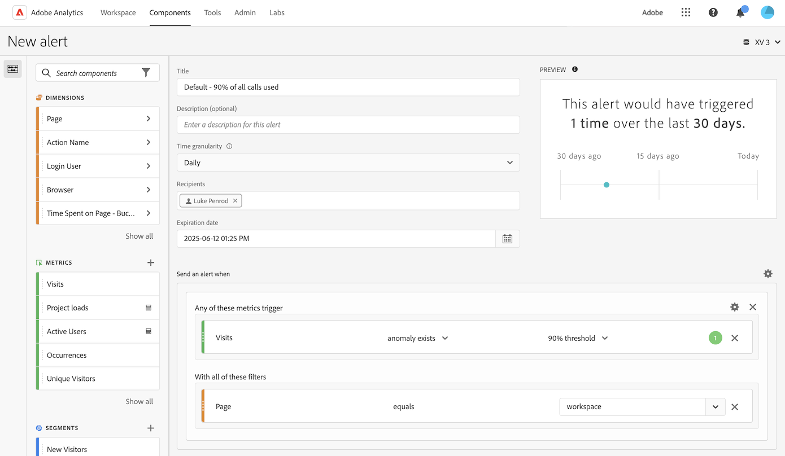

# Waarschuwingen maken {#create-alerts}

<!-- markdownlint-disable MD034 -->

>[!CONTEXTUALHELP]
>id="components_alerts_timegranularity"
>title="Tijdkorreligheid"
>abstract="De tijdsgranulariteit verwijst naar hoe vaak de waarschuwing wordt gecontroleerd."

<!-- markdownlint-enable MD034 -->

>[!NOTE]
>
>Het gebruiken van alarm met anomalieopsporing (die ook als _Intelligente Alarm_ wordt bekend) is beschikbaar slechts aan organisaties met een pakket van Adobe Analytics Prime of van Ultimate.

Met waarschuwingen in Adobe Analytics kunt u op basis van gewijzigde percentages of specifieke gegevenspunten op de hoogte worden gesteld. Afhankelijk van het Adobe Analytics-pakket kunt u ook waarschuwingen gebruiken die op basis van afwijkende drempelwaarden moeten worden geactiveerd. Het alarm van het het vraaggebruik van de server is een verschillend soort alarm dat slechts aan de beheerders van Analytics beschikbaar is. Deze waarschuwingen stellen u op de hoogte van het risico of het voorkomen van een overage in de gegevens van het servervraagverbruik en de verplichting. Voor meer informatie, zie {het alarm van het de vraaggebruik van de Server 0} [.](/help/admin/tools/server-call-usage/scu-alerts.md)

Voor meer gedetailleerde informatie over alarm, zie [&#x200B; het overzicht van Alarm &#x200B;](alerts-overview.md).

Een waarschuwing maken:

1. U kunt een waarschuwing op een van de volgende manieren maken:

   * Open een project in Analysis Workspace en selecteer vervolgens **[!UICONTROL Components]** > **[!UICONTROL Create alert]** .
   * Open een project in Analysis Workspace, dan gebruik de volgende kortere weg: ***cmd + shift + a*** (macOS), of ***ctrl + shift + a*** (Vensters).
   * Open een project in Analysis Workspace, selecteer één of meerdere lijnpunten in een vrije vormlijst, dan klik met de rechtermuisknop aan en selecteer **[!UICONTROL Create alert from selection]**. Deze actie bevolkt onmiddellijk de [&#x200B; Waakzame bouwer &#x200B;](alert-builder.md) om een alarm met de correcte metriek en de filters tot stand te brengen.
   * Creeer een alarm [&#x200B; van waakzame manager &#x200B;](/help/components/alerts/alert-manager.md#create-alerts).

   De waakzame bouwer toont. Deze interface is vertrouwd aan de interface om segmenten of berekende metriek in Analytics te bouwen.

## Alert builder

De waarschuwingsbuilderinterface is vergelijkbaar met de interface die u gebruikt om segmenten of berekende metriek te maken in Customer Journey Analytics:

Geef de volgende gegevens op in de wizard Alarm Builder voor een waarschuwing:

| Element | Beschrijving |
|---------|----------|
| **[!UICONTROL Title]** | Geef een naam op voor de waarschuwing. De waakzame naam zou de naam van het rapport of de metriedrempel kunnen bevatten. |
| **[!UICONTROL Description (optional)]** | Geef een beschrijving voor de waarschuwing op. |
| **[!UICONTROL Time granularity]** | Selecteer hoe vaak u de metrische waarde wilt controleren: Dagelijks, Wekelijks of Maandelijks.
 |
| **[!UICONTROL Recipients]** | Geef op waar de waarschuwing kan worden verzonden. Een waarschuwing kan naar een gebruiker van de Analyse, een groep van Analytics, een onbewerkt e-mailadres, of naar een telefoonaantal worden verzonden.
<b> Belangrijk </b>: Het telefoonaantal moet door a `+` en a [&#x200B; landcode &#x200B;](https://countrycode.org/) worden voorafgegaan.

Een voorbeeld van de e-mail die een gebruiker ontvangt:

 |
| **[!UICONTROL Expiration date]** | Stel de datum en tijd in waarop de waarschuwing moet verlopen. |
| **[!UICONTROL Delay]** | De tijd die nodig is voordat de gegevens zijn voltooid en beschikbaar zijn voor rapportage in Customer Journey Analytics, varieert per organisatie, meestal van 3 tot 9 uur na de tijd van de gegevensgebeurtenis. Voor waarschuwingen is accuraat, moeten de gebeurtenisgegevens voor een bepaald gebeurtenisbereik volledig zijn, wat betekent dat Adobe geen gebeurtenisgegevens meer ontvangt voor het opgegeven gebeurtenisbereik.
Voor deze vertraging in de innametijd hebben waarschuwingen een standaardvertraging van 9 uur voordat ze worden verzonden.

U kunt de standaardvertraging van 9 uur aanpassen aan een willekeurige locatie tussen 0 en 24 uur. Als u echter de vertraging tot minder dan 9 uur verkort, kan dit betekenen dat u onvolledige gegevens rapporteert, wat leidt tot onjuiste waarschuwingsinformatie.

Overweeg het volgende wanneer het verminderen van de vertragingstijd:
<ul><li>**Begrijp gegevensbeschikbaarheid tegenover gegevensvolledigheid**: Alle partijgegevens worden opgenomen in een dataset van Experience Platform slechts na een periode van 3 tot 9 uur. Voor nauwkeurige waarschuwingen moet de gegevensinvoer volledig zijn, met alle partijgegevens beschikbaar in de dataset.</li><li>**bepaalt hoe lang het voor uw gegevens vergt om volledig en beschikbaar in de dataset** te zijn: De tijden van de opname van gegevens verschillen door organisatie. Zorg ervoor dat de vertragingstijd u voor waakzame levering kiest het zelfde of minder frequent is dan de tijd het voor de partijgegevens neemt om in de dataset van het Platform beschikbaar te zijn <!--add link? -->.</li>
**Uiteinde:** de nauwkeurigste manier om de tijd te kennen die voor alle partijgegevens wordt vereist om volledig en in de dataset van het Platform worden opgenomen is de gegevensingenieurs in uw organisatie te raadplegen.

Alternatief, kunt u een algemeen idee krijgen van hoe lang het voor de partijlevering in uw organisatie duurt om in de dataset van Experience Platform beschikbaar te zijn. De volgende vrije-vormtabel maken in Analysis Workspace:
<ol><li>In een vrije vormlijst in Analysis Workspace, voeg metrische en 3&rbrace; dimensie van de Dag van a [!UICONTROL **Gebeurtenissen**] en van a [!UICONTROL **toe.**]</li><li>Onderdeel de [!UICONTROL **dimensie van de Dag 0&rbrace; {gebruikend een**] 3} dimensie van Uren &lbrace;.[!UICONTROL **&#x200B;**]
Uren zonder gegevens worden weergegeven als 0.
</li></ol><li>**Rekening voor fouten in uw berekeningen**: Als u de standaardvertragingstijd vermindert, vorm de vertraging minstens een uur langer dan de tijd het uw organisatie voor volledigheid van gegevensopname neemt. Als er bijvoorbeeld een vertraging van 3 uur is voordat de gegevens zijn ingevoerd, moet u de vertraging instellen op 4 uur.</li> |
| **[!UICONTROL Send an alert when]** | [!UICONTROL **om het even welk van deze metrieke trekker**]: <ol><li>Sleep metriek (inclusief berekende metriek) om triggers voor de waarschuwing te maken.
Een *incompatibele componenten* bericht verschijnt als niet alle metriek, dimensies, of segmenten in het alarm compatibel zijn met de momenteel geselecteerde rapportreeks.

Bepaal de drempel (voor een anomalie) die de metrische waarde moet overschrijden of de waarde (in het geval van boven, onder, gelijk aan of verandering in percentage) die moet worden gebruikt voordat een waarschuwing wordt ingesteld.</li><li>Selecteer een van de volgende voorwaarden:<ul><li>anomalie bestaat</li><li>anomalie is groter dan verwacht</li><li>anomalie is minder dan verwacht</li><li>is boven of gelijk aan</li><li>is lager of gelijk aan</li><li>wijzigingen door</li></ul></li><li>Selecteer een drempelwaarde of voer een waarde in.</li></ol>[!UICONTROL **met elk van deze filters**]: Sleep en dalingssegmenten of dimensies om filters aan het alarm toe te voegen. Bijvoorbeeld, zou het toevoegen van a *Mobiele Apparaten slechts* segment betekenen dat de regel slechts voor mobiele apparaten teweegbrengt. U kunt extra filters toevoegen door een EN verklaring te gebruiken. U kunt EN of OF regels toevoegen door het tandwielpictogram te klikken.

Zie [&#x200B; Alarm - gebruiksgevallen &#x200B;](alerts-use-cases.md) bijvoorbeeld gebruiksgevallen.
 |
| **[!UICONTROL Preview]** | De interactieve waarschuwingsvoorvertoning laat zien hoe vaak, ongeveer, een waarschuwingsbericht wordt geactiveerd op basis van eerdere ervaringen.
Als u bijvoorbeeld de tijdsgranulariteit instelt op dagelijks, kan de voorvertoning u vertellen dat de waarschuwing gedurende een bepaalde metrische x-maal in de afgelopen 30 of 31 dagen zou zijn geactiveerd.

Als u vindt dat teveel alarm wordt teweeggebracht, kunt u de drempel in [&#x200B; aanpassen leidt alarm &#x200B;](alert-manager.md).

{width="50%"}
 |
