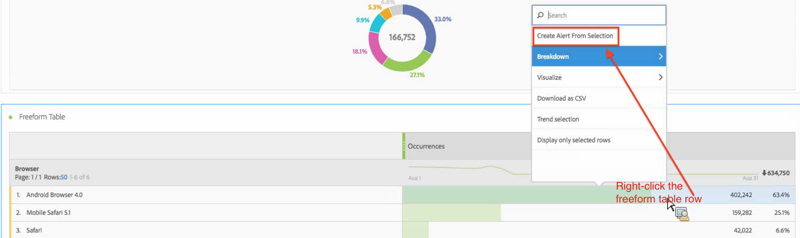

# Intelligente waarschuwingen - gebruiksgevallen

## Eenvoudige waarschuwing maken die door twee segmenten wordt gefilterd {#filter}

## Een waarschuwing maken op basis van een tabelselectie {#from-selection}

In de Lijsten van de Vrije Vorm, kunt u binnen-context alarm nu tot stand brengen door een lijstrij met de rechtermuisknop aan te klikken en te selecteren **[!UICONTROL Create Alert from Selection]**.

Dit vult onmiddellijk de Waakzame Bouwer vooraf in om een alarm met correcte metrisch/s en filter/s tot stand te brengen:

## Consolideer waarschuwingen (stapel) in plaats van meerdere waarschuwingen te maken {#stacking}

Het stapelen alarm zorgt ervoor dat de alarm wordt gecombineerd en u krijgt geen aantal afzonderlijke alarm.

