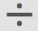

# Metrische gegevens samenstellen

De Berekende Bouwer van Metriek verstrekt een canvas om Afmetingen, Metriek, Segmenten, en Functies te slepen en te laten vallen om douanemetriek tot stand te brengen die op de logica van de containerhiërarchie, regels, en exploitanten wordt gebaseerd. Met dit geïntegreerde ontwikkelingshulpmiddel kunt u eenvoudige berekende metriek of complexe, berekende metriek bouwen en opslaan.

Er zijn verscheidene manieren om aan Berekende Metrische Bouwer te krijgen:

* Open een project in de analysewerkruimte en klik op **[!UICONTROL + New]** > **[!UICONTROL Create Metric]** .
* Ga in [!DNL Analytics], ga naar **[!UICONTROL Components]** > **[!UICONTROL Calculated Metrics]**.

* Klik **[!UICONTROL + Add]** bij de bovenkant van de [Berekende Metrische Manager](/help/components/c-calcmetrics/c-workflow/cm-workflow/cm-manager.md), of

* Ga naar **[!UICONTROL Analytics]** > **[!UICONTROL Reports]**, open een willekeurig rapport en klik op het pictogram Metriek  om de metrieke rail weer te geven en klik vervolgens **[!UICONTROL Add]**.

## UI-componenten {#section_9382AEEBA4244DD6A9F6C1DD3F6D076B}

<table id="table_60A82936321047D1A335331BF83B0972"> 
 <thead> 
  <tr> 
   <th colname="col2" class="entry"> Veld </th> 
   <th colname="col3" class="entry"> Beschrijving </th> 
  </tr> 
 </thead>
 <tbody> 
  <tr> 
   <td colname="col2">  Titel  </td> 
   <td colname="col3"> 
De naam van de metrische waarde is verplicht. U kunt metrisch opslaan tenzij het wordt genoemd. 
 </td> 
  </tr> 
  <tr> 
   <td colname="col2">  Beschrijving  </td> 
   <td colname="col3"> 
Geef het een gebruikersvriendelijke beschrijving om te tonen waarvoor het wordt gebruikt en het van gelijkaardige degenen te onderscheiden. 
 
De beschrijving wordt ook weergegeven in een rapport. Het is beter NIET om de formule in de beschrijving te zetten - in plaats daarvan, beschrijf wat deze metrisch zou moeten en niet zouden moeten worden gebruikt. (De formule wordt geproduceerd aangezien u metrisch bouwt, onder de Summiere rubriek. Dientengevolge, is het niet nodig om de formule aan de beschrijving toe te voegen.) 
 </td> 
  </tr> 
  <tr> 
   <td colname="col2">  Indeling  </td> 
   <td colname="col3"> 
U kunt kiezen uit Decimaal, Tijd, Percentage en Valuta. 
 </td> 
  </tr> 
  <tr> 
   <td colname="col2">  Decimalen  </td> 
   <td colname="col3"> 
Toont hoeveel decimalen in het rapport zullen worden getoond. Het maximumaantal decimalen dat u kunt opgeven, is 10. 
 </td> 
  </tr> 
  <tr> 
   <td colname="col2">  Naar boven trends tonen als...  </td> 
   <td colname="col3"> 
Deze metrische polariteit die toont of de Analyse een stijgende trend in metrisch als goed (groen) of slecht (rood) zou moeten beschouwen. Als gevolg hiervan zal de grafiek van het rapport als groen of rood worden weergegeven wanneer het omhoog gaat. 
 </td> 
  </tr> 
  <tr> 
   <td colname="col2">  Tags  </td> 
   <td colname="col3"> 
Tags zijn een goede manier om metriek in te delen. Alle gebruikers kunnen tags maken en een of meer tags toepassen op een metrische waarde. U kunt echter alleen labels zien voor de segmenten die u bezit of die met u zijn gedeeld. Welke soorten markeringen moet u creëren? Hier volgen enkele suggesties voor handige tags: 
     <ul id="ul_9A6CE5F179424687A39F2D5C1A953258"> 
      <li id="li_A8815F2D8D284874AD701A7B103D82A3">Tags die zijn gebaseerd op <b>teamnamen</b>, zoals Sociale marketing, Mobiele marketing. </li> 
      <li id="li_A51A4515A541488E9D90296A955E9F4F"><b>Projectlabels</b> (analysetags), zoals analyse van de pagina Entry. </li> 
      <li id="li_B4605470A7094026AC168420B64BBCC3"><b>Categorielabels</b> : Mannen; geografie. </li> 
      <li id="li_B6EAB0F2A96C41209C4EC97B9E64390B"><b>Workflowcodes</b> : goed te keuren; Gecurreerd voor (een specifieke bedrijfseenheid) </li> 
     </ul> 
 </td> 
  </tr> 
  <tr> 
   <td colname="col2">  Samenvatting  </td> 
   <td colname="col3"> 
De  Summiere  formule werkt bij wanneer u een verandering in de metrische definitie aanbrengt. Deze formule wordt ook weergegeven in de metrische rail links wanneer u de muisaanwijzer boven een metrische waarde houdt en op het  pictogram klikt. 
 </td> 
  </tr> 
  <tr> 
   <td colname="col2">  Definitie  </td> 
   <td colname="col3"> 
Dit is waar u in metriek/berekende metriek, segmenten, en/of functies sleept om berekende metrisch te bouwen. 
 
 
     <ul id="ul_B13401A266354DC594C6176025DB61CB"> 
      <li id="li_01776C32C7C5440AA1F847096CBED92B">Als u in berekende metrisch sleept, zal het zijn metrische definitie automatisch uitbreiden. </li> 
      <li id="li_A483D352522E4572AB43042473053359">U kunt definities nesten met containers. In tegenstelling tot gesegmenteerde containers, functioneren deze containers als een wiskundige uitdrukking en bepalen de orde van verrichtingen. </li> 
     </ul> 
 </td> 
  </tr> 
  <tr> 
   <td colname="col2">  Operator  </td> 
   <td colname="col3"> 
Gedeeld door (  ) is de standaardexploitant, plus er zijn +, -, en xexploitanten. 
 </td> 
  </tr> 
  <tr> 
   <td colname="col2">  Voorvertoning  </td> 
   <td colname="col3"> 
Hiermee kunt u snel informatie lezen over mogelijke fouten. De voorvertoning beslaat de laatste 90 dagen. Dit is een manier om aanvankelijk te graven of u de juiste componenten voor uw metrisch hebt geselecteerd. Een onverwacht resultaat zou betekenen u een tweede blik bij de metrische definitie moet nemen. 
 </td> 
  </tr> 
  <tr> 
   <td colname="col2">  Productcompatibiliteit  </td> 
   <td colname="col3"> 
De verenigbaarheid van het product toont u of metrisch met <a href="https://marketing.adobe.com/resources/help/en_US/reference/data_latency.html"  > Huidige Gegevens </a>, met volledig Verwerkte Gegevens, of slechts met de rapporten van het Kanaal van de Marketing (first-touch toewijzing) compatibel is. 
Opmerking:  De huidige Gegevens steunen niet alle metriek. Metriek die segmenten of functies bevatten, is niet compatibel met de huidige gegevens. <a href="/help/components/c-calcmetrics/cm-compatibility.md"  > Meer... </a> 
 
 </td> 
  </tr> 
  <tr> 
   <td colname="col2">  Toevoegen  </td> 
   <td colname="col3"> 
Voor alle soorten berekende metriek, kunt u containers en statische aantallen aan de definitie toevoegen. Voor geavanceerde berekende metriek, kunt u segmenten en functies ook toevoegen. 
 
 
     <ul id="ul_607C1B303F334062BC620317667DE490"> 
      <li id="li_53462789B8AF4F1AA9B45565D37CF22B">Containers werken als een wiskundige expressie en bepalen de volgorde van bewerkingen. Dus alles in een container wordt verwerkt voor de volgende bewerking. </li> 
      <li id="li_401A9E0D8B3B468990289DBF66A06F63">Als u een segment naar een container sleept, wordt alles in die container gesegmenteerd. (Alleen geavanceerde berekende cijfers) </li> 
      <li id="li_F191B200D7A944F9ADC0573A9A82A6DA">U kunt meerdere segmenten in een container stapelen. </li> 
     </ul> 
 </td> 
  </tr> 
  <tr> 
   <td colname="col2"> Pictogram tandwiel (  Metrisch type ,  Kenmerk ) </td> 
   <td colname="col3"> 
Als u het tandwielpictogram naast een metrische waarde selecteert, kunt u het <a href="/help/components/c-calcmetrics/c-workflow/cm-workflow/c-build-metrics/m-metric-type-alloc.md"  > metrische type en de attributiemodellen opgeven </a>. 
 </td> 
  </tr> 
  <tr> 
   <td colname="col2">  + Nieuw  </td> 
   <td colname="col3"> 
Hiermee kunt u een nieuwe component maken, zoals een nieuw segment (dat u naar de <a href="https://marketing.adobe.com/resources/help/en_US/analytics/segment/seg_build_ui.html"  > Segment Builder </a>.) 
 </td> 
  </tr> 
  <tr> 
   <td colname="col2"> 
Componenten zoeken 
 </td> 
   <td colname="col3"> 
Met deze zoekbalk kunt u zoeken naar afmetingen, metriek, segmenten (alleen geavanceerde berekende meetgegevens) en functies (alleen geavanceerde berekende meetgegevens). 
 </td> 
  </tr> 
  <tr> 
   <td colname="col2"> 
Lijst met afmetingen 
 </td> 
   <td colname="col3"> 
In plaats van de Berekende Metrische Bouwer te verlaten om een eenvoudig segment (in de Bouwer van het Segment) te bouwen, b.v. "Pagina = Homepage", kunt u in Pagina slepen en Homepage van Berekende Metrische Bouwer direct selecteren. 
 
Dit resulteert in een veel gestroomlijnder werkschema voor het creëren van gesegmenteerde berekende metriek. 
 </td> 
  </tr> 
  <tr> 
   <td colname="col2"> 
Lijst met meetwaarden 
 </td> 
   <td colname="col3"> 
De cijfers zijn ingedeeld in drie categorieën: 
 
    <ul id="ul_7BF50F4964EF45858FBA1634FBFA45CF"> 
     <li id="li_90F2312927A6499CA1CE04F8FFC912CF">Standaardwaarden ( ) </li> 
     <li id="li_A3F59083E79B4AC780D6F8CEDFFD20C9">Berekende cijfers ( ) </li> 
     <li id="li_8735E76637ED4C3F983731A66E04C93E">Metrische sjablonen ( ) - onder aan de lijst. </li> 
    </ul> 
Wanneer u de muisaanwijzer boven een metrische waarde houdt, ziet u het pictogram Info rechts ervan: . Als u op dit pictogram klikt, krijgt u de volgende informatie: 
 
    <ul id="ul_DF35DDB9FBFA40C8A93FA0F2286A0BBE"> 
     <li id="li_4215AA9BF93F4C8B941002A7A4D2F50B">De formule van hoe het wordt berekend. </li> 
     <li id="li_6A8E39EB6DCE4377B0B594B6D4FC0294">Een voorproeftrend van metrisch. </li> 
     <li id="li_44C1595E4BE64ED69D1DB3BB6655ED55">Een bewerkingspictogram (potlood) rechtsboven dat u naar de Calculated Metrics Builder brengt waar u deze berekende metrische waarde kunt bewerken. </li> 
    </ul> 
 
 </td> 
  </tr> 
  <tr> 
   <td colname="col2"> 
Lijst met segmenten 
 </td> 
   <td colname="col3"> 
(Alleen Geavanceerde berekende metriek) Als beheerder worden in deze lijst alle segmenten weergegeven die in uw aanmeldingsbedrijf zijn gemaakt. Als u een gebruiker niet-Admin bent, toont deze lijst segmenten u bezit en die met u worden gedeeld. <a href="https://marketing.adobe.com/resources/help/en_US/analytics/segment/seg_rights.html"  > Meer... </a> 
 </td> 
  </tr> 
  <tr> 
   <td colname="col2"> 
Lijst met functies 
 </td> 
   <td colname="col3"> 
(Alleen geavanceerde berekende metriek) Functies worden in twee lijsten onderverdeeld: <a href="/help/components/c-calcmetrics/cm-reference/cm-functions.md"  > Standaard </a> (meest gebruikt) en <a href="/help/components/c-calcmetrics/cm-reference/cm-adv-functions.md"  > Geavanceerd </a>. 
 </td> 
  </tr> 
  <tr> 
   <td colname="col2"> 
Selector rapportsuite 
 </td> 
   <td colname="col3"> 
Hiermee kunt u overschakelen op een andere rapportsuite. 
 </td> 
  </tr> 
 </tbody> 
</table>

