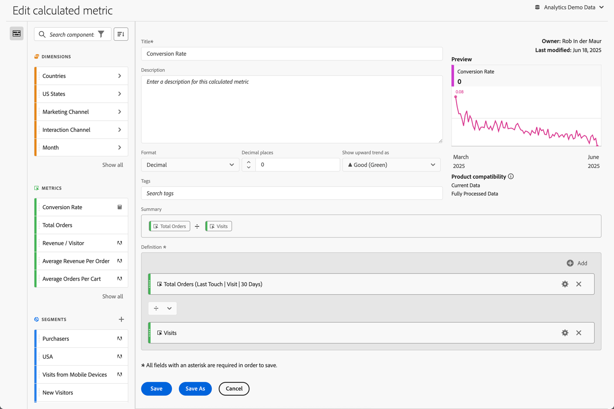

# Berekende maatstaven samenstellen {#build-metrics}

Adobe Analytics biedt een canvas voor het slepen en neerzetten van dimensies, metriek, segmenten en functies om aangepaste metrische gegevens te maken op basis van logica in de containerhiërarchie, regels en operatoren. Met dit geïntegreerde ontwikkelprogramma kunt u eenvoudige of complexe berekende meetgegevens maken en opslaan.

U kunt de berekende metrische bouwer gebruiken om berekende metriek tot stand te brengen of uit te geven. Wanneer gecreeerd op deze manier, zijn de berekende metriek beschikbaar in de componentenlijst en kunnen dan in projecten door uw organisatie worden gebruikt. Alternatief, kunt u snel berekende metrisch tot stand brengen die slechts voor het project beschikbaar is waar het werd gecreeerd, zoals die in [ wordt beschreven creeer berekende metriek voor één enkel project ](/help/analyze/analysis-workspace/components/apply-create-metrics.md#create-calculated-metrics-for-a-single-project) in [ Metriek ](/help/analyze/analysis-workspace/components/apply-create-metrics.md).

[ creeer berekende metrisch ](../cm-workflow.md) beschrijft de verschillende opties beschikbaar om nieuwe berekende metrisch tot stand te brengen.

## Gebieden van de berekende metriebouwer

Het dialoogvenster **[!UICONTROL Calculated metric builder]** wordt gebruikt om nieuwe berekende waarden te maken of te bewerken. Het dialoogvenster krijgt de naam **[!UICONTROL New calculated metric]** of **[!UICONTROL Edit calculated metric]** voor metriek die u maakt of beheert via de [[!UICONTROL Calculated metrics] manager ](../cm-manager.md) .

>[!BEGINTABS]

>[!TAB  Berekende metrische bouwer ]

>[!TAB creeer of geef berekend metrisch  uit]

>[!ENDTABS]

1. Specificeer de volgende details ( wordt vereist):

   | Element | Beschrijving |
   | --- | --- |
   | **[!UICONTROL Report suite]** | U kunt de rapportreeks voor berekende metrisch selecteren.  De berekende metrisch u bepaalt is beschikbaar in de projecten van Workspace die op de geselecteerde rapportreeks worden gebaseerd. |
   | **[!UICONTROL Project-only metric]** | Een infodoos verschijnt bij de bovenkant van deze dialoog wanneer u berekende metrisch uitgeeft die voor één enkel project werd gecreeerd, zoals die in [ wordt beschreven creeer berekende metriek voor één enkel project ](/help/analyze/analysis-workspace/components/apply-create-metrics.md#create-calculated-metrics-for-a-single-project). 
Als u deze berekende metrische waarde beschikbaar wilt maken voor alle projecten, selecteert u de optie, **[!UICONTROL Make this metric available to all your projects and add it to your component list]**.
 |
   | **[!UICONTROL Title]**  | Geef de berekende metrische waarde een naam, bijvoorbeeld `Conversion Rate` . |
   | **[!UICONTROL Description]** | Geef een beschrijving voor het segment, bijvoorbeeld `Calculated metric to define the conversion rate.` U hoeft de formule voor de berekende metrische waarde niet te beschrijven omdat de formule al automatisch beschikbaar is in [!UICONTROL Summary] . |
   | **[!UICONTROL Format]** | Selecteer een indeling voor de berekende metrische waarde: u kunt tussen **[!UICONTROL Decimal]** , **[!UICONTROL Time]** , **[!UICONTROL Percent]** en **[!UICONTROL Currency]** selecteren. |
   | **[!UICONTROL Decimal places]** | Geef het aantal decimalen op voor de geselecteerde notatie. Wordt alleen ingeschakeld wanneer de geselecteerde indeling Decimaal, Valuta en Percentage is. |
   | **[!UICONTROL Show upward trend as]** | Geef op of een opwaartse trend van de berekende metrische waarde wordt weergegeven als ▲ **[!UICONTROL Good (Green)]** of als ▼ **[!UICONTROL Bad (Red)]** . |
   | **[!UICONTROL Currency]** | Geef de valuta van de berekende metrische waarde op. Alleen ingeschakeld wanneer de geselecteerde notatie Valuta is. |
   | **[!UICONTROL Tags]** | Organiseer de berekende metrisch door één of meerdere markeringen te creëren of toe te passen. Begin te typen om naar bestaande tags te zoeken die u kunt selecteren. Of druk op **[!UICONTROL ENTER]** om een nieuwe tag toe te voegen. Selecteer  om een markering te verwijderen. |
   | **[!UICONTROL Preview]** | De voorvertoning geldt voor de laatste 90 dagen en is een manier om te bepalen of u de maateenheid correct hebt gedefinieerd. |
   | **[!UICONTROL Summary]** | Toont een samenvatting van de definitie van berekende metrisch.   bijvoorbeeld:  **[!UICONTROL Total Orders]**   **[!UICONTROL Sessions]**. |
   | **[!UICONTROL Definition]**  | Bepaal uw segment gebruikend de [ bouwer van de Definitie ](#definition-builder). |

1. Om te verifiëren of uw berekende metrische definitie correct is, gebruik constant bijgewerkt **[!UICONTROL Preview]** van de resultaten van berekende metrisch. **[!UICONTROL Preview]** geldt voor de laatste 90 dagen en evalueert continu de definitie van de berekende maateenheid.

   De **[!UICONTROL Product compatibility]** geeft de compatibiliteit van de berekende metrische waarde met Adobe Analytics-functies aan. Zie [ Metrische verenigbaarheid ](/help/components/c-calcmetrics/cm-compatibility.md) voor meer informatie.

1. Selecteren:
   * **[!UICONTROL Save]** om de berekende metrische waarde op te slaan.
   * **[!UICONTROL Save As]** om een kopie van de berekende metrische waarde op te slaan.
   * **[!UICONTROL Cancel]** om wijzigingen in de berekende metrische waarde te annuleren of om het maken van een nieuwe berekende metrische waarde te annuleren.

## Definition builder

U gebruikt de bouwer van de Definitie om dimensies, metriek, segmenten, en functies te slepen en te laten vallen om douanemetriek tot stand te brengen die op de logica van de containerhiërarchie, regels, en exploitanten wordt gebaseerd. In die constructie, kunt u standaardmetriek, Adobe bepaalde metriek, berekende metriek, segmenten, dimensies en functies gebruiken. Al deze componenten zijn beschikbaar bij het componentenpaneel in de Berekende metrische bouwer. Bovendien kunt u operatoren en containers in de definitie gebruiken.

Alleen metriek worden gedefinieerd als afzonderlijke componenten in het **[!UICONTROL Definition]** -gebied. Alle andere componenten worden gedefinieerd als een container, verpakkingsmetriek of andere containers. Zie [ Containers ](#containers) voor meer informatie.

### Metrics

Een metrische waarde toevoegen:

* Sleep een  **[!UICONTROL Metrics]** van het componentenpaneel aan **[!UICONTROL Drag and drop metrics, dimensions, dimension items, segments, and/or functions here]**. U kunt het  in de componentenbar gebruiken om naar specifieke componenten te zoeken.

Wanneer u berekende metrisch als deel van uw definitie gebruikt, wordt berekende metrisch uitgebreid.

Een metrische waarde wijzigen:

1. Selecteer  in metrische component in het **[!UICONTROL Definition]** gebied.
1. In het popup dialoogvenster kunt u het type metrisch en een attributiemodel bepalen. Zie [ Metrisch type en Attributie ](m-metric-type-alloc.md).

Een metrische waarde verwijderen:

* Selecteer  in metrisch.

### Operatoren

Met operatoren kunt u de operator tussen componenten of containers opgeven. Operatoren worden automatisch weergegeven tussen

* twee of meer meeteenheden in een container,
* twee of meer recipiënten in een recipiënt,
* een of meer maateenheden en een of meer containers in een container.

U kunt selecteren:

| Symbool | Operator |
|:---:|---|
|  | Splitsen (standaard) |
|  | Vermenigvuldigen |
|  | Aftrekken |
|  | Toevoegen |

### Statisch getal

U kunt een statisch aantal aan uw berekende metrische definitie toevoegen. Een statisch getal toevoegen:

* Selecteer  **[!UICONTROL Add]** van binnen een container.
* Selecteer **[!UICONTROL Static number]** . Er wordt een container met statische getallen weergegeven.
* Selecteer [!UICONTROL *klik om een waarde*] toe te voegen en een waarde te typen.

### Containers

U voegt afmetingen, segmenten en functies als containers toe aan een berekende metrische definitie. U kunt ook een algemene container toevoegen. Containers werken als een wiskundige expressie en bepalen de volgorde van bewerkingen. Alles in een container wordt verwerkt vóór de volgende component of container.

#### Segmentcontainer

U gebruikt het concept van een segmentcontainer om metrische a [ gesegmenteerde tot stand te brengen ](metrics-with-segments.md). U kunt een segmentcontainer maken met behulp van een segment of met behulp van een segment dat u maakt op basis van een dimensie.

* Een segmentcontainer toevoegen vanuit een dimensie:

   1. De belemmering en laat vallen a  **[!UICONTROL Dimensions]** component van het componentenpaneel op **[!UICONTROL Drag and drop metrics, dimensions, dimension items, segments, and/or functions here]**. U kunt het  in de componentenbar gebruiken om naar specifieke componenten te zoeken.
   1. Definieer in de pop-up **[!UICONTROL Create Segment from Dimension]** de voorwaarde voor het segment. Selecteer een waarde in de lijst met operatoren en selecteer een waarde of voer een waarde in. Bijvoorbeeld, **[!UICONTROL Month]** **[!UICONTROL equals]**  `Sep 2024`.
   1. Selecteer **[!UICONTROL Done]** . Er wordt een segmentcontainer toegevoegd aan de **[!UICONTROL Definition]** .

* Als u een segmentcontainer vanuit een segment wilt toevoegen, kunt u:

   * Sleep de component van de a  **[!UICONTROL Segments]** van het componentenpaneel op **[!UICONTROL Drag and drop metrics, dimensions, dimension items, segments, and/or functions here]**. U kunt het  in de componentenbar gebruiken om naar specifieke segmenten te zoeken.
Er wordt automatisch een segmentcontainer toegevoegd aan de **[!UICONTROL Definition]** , met de naam van het segment.

   * De belemmering en laat vallen a  **[!UICONTROL Segment]** component van het componentenpaneel op een generische container. De container wordt gewijzigd in een segmentcontainer.

   * Selecteer  **[!UICONTROL Add]** van binnen een container:

      1. Selecteer **[!UICONTROL Segment]** . Er wordt een segmentcontainer toegevoegd aan de **[!UICONTROL Definition]** .
      1. In de nieuwe segmentcontainer, selecteer een segment van [!UICONTROL *Uitgezocht..*] drop-down menu.

  >[!TIP]
  >
  >U kunt meer dan één segment aan een container toevoegen.

  De segmenten in de container worden genoemd naar de segmentcomponent. Bijvoorbeeld,  **[!UICONTROL Web sessions]**. Selecteer  om popup met details op het segment te tonen. In popup, uitgezocht  uit om de segmentdefinitie uit te geven.

Een segment verwijderen uit een container:

* Selecteer  naast de segmentnaam.

Zie [ Gesegmenteerde metriek ](metrics-with-segments.md) voor meer details en voorbeelden.

#### Functiecontainer

Als u een functiecontainer wilt toevoegen, kunt u het volgende gebruiken:

* Sleep en zet:

   1. De belemmering en laat vallen a  **[!UICONTROL Functions]** van het componentenpaneel op **[!UICONTROL Drag and drop metrics, dimensions, dimension items, segments, and/or functions here]**. U kunt het  in de componentenbar gebruiken om naar specifieke functies te zoeken.
   1. Er wordt automatisch een functienotel toegevoegd aan de **[!UICONTROL Definition]** met de naam van de functie.

* Selecteer  **[!UICONTROL Add]** van binnen een container:

   1. Selecteer **[!UICONTROL Function]** .
   1. In de container, selecteer een functie van [!UICONTROL *Uitgezocht...*] drop-down menu.

De functievulling krijgt de naam van de functiecomponent. Bijvoorbeeld,  **[!UICONTROL SQUARE ROOT (metric)]**. Selecteer  om popup met details op de functie te tonen. Selecteer **[!UICONTROL Learn more]** voor meer informatie over de functie.

Zie [ functies van het Gebruik ](cm-using-functions.md) voor details op hoe te om functies te gebruiken en welke functies beschikbaar zijn om berekende metrisch tot stand te brengen.

#### Algemene container

Een algemene container toevoegen:

* Selecteer  AddCircle **[!UICONTROL Add]** van binnen een container
* Selecteer **[!UICONTROL Container]** . Er wordt een nieuwe lege generieke container toegevoegd aan de **[!UICONTROL Definition]** . U kunt een generische container gebruiken om een hiërarchie in de definitie van uw berekende metrisch te nesten of tot stand te brengen.

#### Een container verwijderen

Om een container te schrappen, selecteer  op het containerniveau.

>[!MORELIKETHIS]
>
>[Functies gebruiken](cm-using-functions.md)
>&#x200B;>[Segmenten ](/help/components/segmentation/seg-overview.md)
>

<!--

Adobe Analytics provides a canvas to drag and drop dimensions, metrics, segments, and functions to create custom metrics based on container hierarchy logic, rules, and operators. This integrated development tool lets you build and save simple or complex calculated metrics.

## Begin building a calculated metric

You can use the calculated metric builder to create or edit calculated metrics. When created in this way, calculated metrics are available in the component list and can then be used in projects throughout your organization. Alternatively, you can quickly create a calculated metric that is available only for the project where it was created, as described in [Create calculated metrics for a single project](/help/analyze/analysis-workspace/components/apply-create-metrics.md#create-calculated-metrics-for-a-single-project) in [Metrics](/help/analyze/analysis-workspace/components/apply-create-metrics.md).

Access the calculated metric builder to begin creating a calculated metric that is available in the component list. 

1. Access the calculated metric builder in any of the follows ways:

   * In Analysis Workspace, open a project, then select **[!UICONTROL Components]** > **[!UICONTROL Create metric]**.
   * In Analysis Workspace, open a project, then select the **Plus** icon next to the [!UICONTROL **Metrics**] section in the left rail.
   * In [!DNL Adobe Analytics], go to **[!UICONTROL Components]** > **[!UICONTROL Calculated metrics]**, then select **[!UICONTROL + Add]** at the top of the Calculated metrics page.

1. Continue with [Areas of the calculated metric builder](#areas-of-the-calculated-metrics-builder).

## Areas of the Calculated metrics builder

The following image and accompanying table explain some of the main areas and features of the Calculated metrics builder.

| Location in image  | Name and function  |
|---|---|
| 1 | **Title:** Naming the metric is mandatory. You cannot save the metric unless it is named.  |
| 2 | **Description:** Give it a user-friendly description to show what it's used for and to distinguish it from similar ones. 
The description also appears within a report. It's best NOT to put the formula into the description - instead, describe what this metric should and should not be used for. (The formula is generated as you build the metric, underneath the Summary heading. As a result, there is no need to add the formula to the description.) 
  |
| 3 | **Format:** Choices include Decimal, Time, Percent, and Currency.  |
| 4 | **Decimal Places:** Shows how many decimal places will be shown in the report. The maximum number of decimal places you can specify is 10.  |
| 5| **Show Upward Trend As:** This metric polarity setting shows whether Analytics should consider an upward trend in the metric as good (green) or bad (red). As a result, the report's graph will show as green or red when it's going up.  |
| 6 | **Tags:** Tagging is a good way to organize metrics. All users can create tags and apply one or more tags to a metric. However, you can see tags only for those segments that you own or that have been shared with you. What kinds of tags should you create? Here are some suggestions for useful tags:<ul><li>**Team names**, such as Social Marketing, Mobile Marketing.</li><li>**Projects** (analysis tags), such as Entry-page analysis.</li><li>**Categories**, such as Women's; Geography.</li><li>**Workflows**, such as To be approved; Curated for (a specific business unit)</li></ul> |
| 7 | **Summary:** 
The Summary formula updates anytime you make a change to the metric definition. This formula also shows up in the metrics rail on the left when you hover over a metric and click the  icon. 
  |
| 8 | **Definition:** This is where you drag in metrics/calculated metrics, segments, and/or functions to build the calculated metric. <ul><li>If you drag in a calculated metric, it will expand its metric definition automatically. </li> <li>You can nest definitions with containers. However, unlike segment containers, these containers function like a math expression and determine the order of operations. </li> </ul>  |
| 9 | **Operator:** Divided by (  ) is the default operator, plus there are the +, -, and x operators. |
| 10 | **Preview:** Provides a quick read on any possible errors. The preview covers the last 90 days. This is a way of initially gauging whether you have selected the right components for your metric. An unexpected result would mean you need to take a second look at the metric definition.  |
| 11 | **Product compatibility:** Product compatibility shows you whether the metric is compatible with <a href="https://experienceleague.adobe.com/docs/analytics/analyze/reports-analytics/current-data.html?lang=nl-NL"  > Current Data </a>, with Fully Processed Data, or only with Marketing Channel reports (first-touch allocation). 
Note:  Current Data does not support all metrics. Metrics that contain segments or functions are not compatible with current data. <a href="/help/components/c-calcmetrics/cm-compatibility.md"  > More... </a> 
 
  |
| 12 | **Add:** For all types of calculated metrics, you can add containers and static numbers to the definition. For advanced calculated metrics, you can also add segments and functions. <ul><li>Containers function like a math expression and determine the order of operations. So anything in a container will get processed before the next operation.</li><li>Dragging a segment onto a container segments everything in that container. (Advanced calculated metrics only)</li><li>You can stack multiple segments in a container.</li></ul> |
| 13 | **Gear icon (Metric Type, Attribution):** Selecting the gear icon next to a metric lets you specify the <a href="/help/components/c-calcmetrics/c-workflow/cm-workflow/c-build-metrics/m-metric-type-alloc.md"  > metric type and attribution models </a>. |
| 14 | **New:** Lets you create a new component, such as a new segment (which takes you to the <a href="/help/components/segmentation/segmentation-workflow/seg-build.md"  > Segment Builder </a>.) |
| 15 | **Search Components:** This search bar lets you search for dimensions, metrics, segments (advanced calculated metrics only), and functions (advanced calculated metrics only). |
| 16 | **List of Dimensions:** Rather than leaving the Calculated Metric Builder in order to build a simple segment (in the Segment Builder), e.g. "Page = Homepage", you can drag in Page and select Homepage directly from the Calculated Metric Builder.
This results in a much more streamlined workflow for creating segmented calculated metrics.
 |
| 17 | **List of Metrics:** Metrics come in 3 categories: <ul> <li>Standard metrics () </li><li>Calculated metrics ( ) </li><li id="li_8735E76637ED4C3F983731A66E04C93E">Metrics templates ( ) - at the bottom of the list. </li> </ul> 
When you hover over a metric, you can see the Info icon to the right of it: . Clicking this icon gives you the following information: 
<ul> <li>The formula of how it is calculated. </li><li>A preview trend of the metric. </li><li>An edit (pencil) icon  at the top right that will take you to the Calculated Metrics Builder where you can edit this calculated metric. </li></ul> |
| 18 | **List of Segments:** (Advanced calculated metrics only) As an Admin, this list shows all segments created in your login company. If you are a non-Admin user, this list shows segments you own and those shared with you. <a href="https://experienceleague.adobe.com/docs/analytics/components/segmentation/segment-reference/seg-rights.html?lang=nl-NL"  > More... </a> |
| 19 | **List of Functions:** (Advanced calculated metrics only) Functions are divided into two lists: <a href="/help/components/c-calcmetrics/cm-reference/cm-functions.md"  > Basic </a> (used most often) and <a href="/help/components/c-calcmetrics/cm-reference/cm-adv-functions.md"  > Advanced </a>. |
| 20 | **Report Suite selector:** Lets you switch to a different report suite. |

{style="table-layout:auto"}

-->
