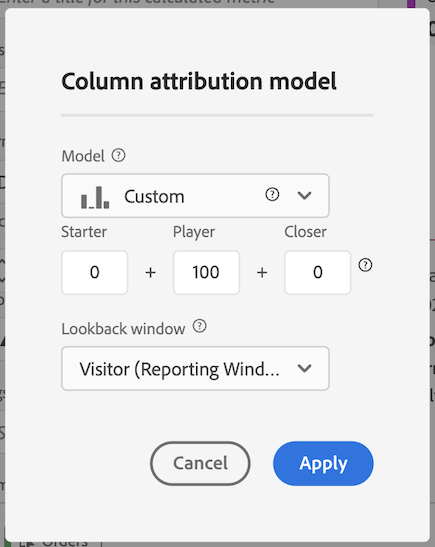

# Metrisch met instructies

Verklaart hoe te om metrisch tot stand te brengen die toont welke Kanalen van de Marketing in rijorden bijwonen. Dit kan aan om het even welke dimensie of succesgebeurtenis van belang worden aangepast.

1. In de Berekende Bouwer van Metriek, noem metrische &quot;Begeleide Orders&quot;.
1. In het canvas van de Definitie, sleep in metrische orde. Pas vervolgens het toewijzingsmodel aan met het instellingenversnelling door het **[!UICONTROL Use non-default attribution models]** selectievakje in te schakelen.

   

1. Selecteren **[!UICONTROL Custom]** als attributiemodel. Wijzig de gewichten in 0 (startpunt), 100 (speler) en 0 (dichter).

   

1. Sla de metrische waarde op.
1. Creeer een vrije vormlijst in de Werkruimte van de Analyse met de afmeting van het Kanaal van de Marketing, Orden en uw nieuwe Begeleidende metrische Orden.

   

Dit is een eenvoudige manier om te zien welke marketingkanalen hebben geholpen bij het bestellen van rijbewijzen. U kunt ook vanuit een vrije-vormtabel met de rechtermuisknop op elke willekeurige meting klikken en het attributiemodel rechtstreeks vanuit de tabel aanpassen.
