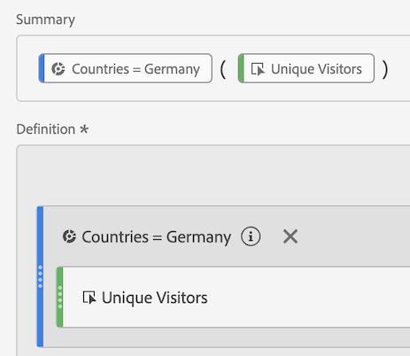
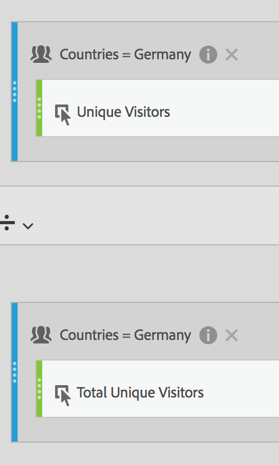
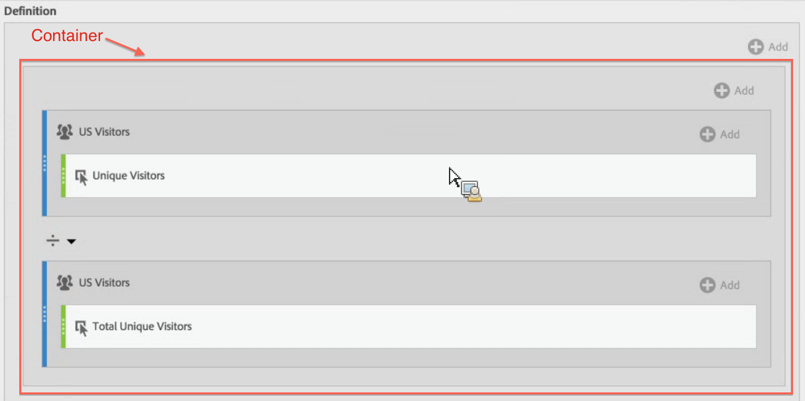

# Gesegmenteerde metriek

Het segmenteren op individuele metriek staat u toe om metrische vergelijkingen binnen het zelfde rapport te maken. (Alleen afgeleide cijfers)

## Segmenten vergelijken {#section_29A6E0070F084BFDB6228FA9CE106F48}

Laten we zeggen dat u verschillende aspecten van een &quot;Amerikaanse Bezoekers&quot;-segment wilt vergelijken met die van een &quot;International Visitors&quot;-segment. U kunt metriek tot stand brengen die u inzichten zoals zal geven:

* Hoe vergelijk het gedrag van bladeren door inhoud tussen de twee groepen? (Een ander voorbeeld is: Hoe vergelijk de omrekeningskoers tussen de twee segmenten?)
* Hoeveel bezoekers uit de VS bladeren als percentage van het totale aantal bezoekers door bepaalde pagina&#39;s in vergelijking met internationale bezoekers?
* Waar zijn de grootste verschillen in termen van welke inhoud door deze verschillende segmenten wordt betreden?

Laten we de eerste vraag nader onderzoeken: Hoe vergelijk het gedrag van bladeren door inhoud tussen de twee groepen?

1. Als u geen vergelijkbaar segment hebt, creeer een intern segment recht in Berekende Metrische Bouwer genoemd &quot;Duitse Bezoekers&quot;, waar &quot;Landen&quot;&quot;Duitsland&quot;evenaart. Sleep gewoon de dimensie Landen naar het canvas Definition en selecteer Duitsland als waarde:

   

   >[!NOTE]
   >
   >U kunt dit ook doen in de Bouwer [van het](https://marketing.adobe.com/resources/help/en_US/analytics/segment/seg_build.html)Segment, maar wij hebben het werkschema vereenvoudigd door dimensies ter beschikking te stellen in Berekende Metrische Bouwer.

   >[!NOTE]
   >
   >&quot;Intern&quot; betekent dat het segment niet zichtbaar is in de **[!UICONTROL Segments]** lijst in de linkerspoorstaaf. U kunt het bestand echter openbaar maken door de muisaanwijzer boven het pictogram &quot;i&quot; naast het bestand te houden en erop te klikken **[!UICONTROL Make public]**.

1. Als u geen vergelijkbaar segment hebt, maakt u een segment met de naam &quot;Internationale Bezoekers&quot;, waarbij &quot;Landen&quot; niet gelijk is aan &quot;Duitsland&quot;.
1. Bouw en bewaar metrisch genoemd &quot;Duitse Bezoekers&quot;door het segment van Duitsland in het canvas van de Definitie te slepen en de Unieke Bezoekers metrisch binnen het te slepen:

   

1. Herhaal Stap 3 met het Internationale segment van Bezoekers en de Unieke metrisch van Bezoekers om Internationale metrische Bezoekers tot stand te brengen.
1. In de Werkruimte van de Analyse, sleep de **[!UICONTROL Page]** Dimensie in een Lijst van de Vrije Vorm en sleep de 2 nieuwe berekende metriek naast elkaar aan bovenkant:

   

1. Of open in [!UICONTROL Reports & Analytics], open het [!UICONTROL Pages] rapport en klik **[!UICONTROL Show Metrics]**, dan pas de nieuwe Bezoekers van de V.S. en Internationale Bezoekers gesegmenteerde metriek toe om te zien hoe hun inhoud het doorbladeren gedrag vergelijkt.

   

## Percentage totalen vergelijken {#section_846CB89725F04388AE0352DB20189EE8}

U kunt een ander niveau van onderzoek introduceren door bezoekersbrowser gedrag in genormaliseerde percentages te vergelijken. Hiertoe maakt u twee nieuwe metriek, &quot;% van het totaal aantal Duitse bezoekers&quot; en &quot;% van het totaal aantal internationale bezoekers&quot;:

1. Verplaats het segment Duitse (of internationale) bezoekers naar het canvas.
1. Zet een ander Duits (of Internationaal) bezoekerssegment hieronder neer. Deze keer klikt u echter op het pictogram voor configuratie (versnelling) om het metrische type &quot;Totaal&quot; te selecteren. De notatie moet &#39;Percentage&#39; zijn. De exploitant zou &quot;gedeeld door&quot;moeten zijn. U eindigt omhoog met deze metrische definitie:

   

1. Pas deze metrisch op uw project toe:

   

## Verschillen in percentages vergelijken (met gebruik van containers) {#section_13D6353259B74C09B37BA6378A501938}

Als u in één oogopslag de grootste verschillen wilt zien tussen het browsergedrag van de VS en International, kunt u een andere metrische waarde maken die de percentages van elkaar aftrekt. Hiervoor kunt u de Containerfunctionaliteit gebruiken die effectief als ronde haakjes rond de twee sets metriek fungeert.

1. Klik op [!UICONTROL Definition] het canvas op **[!UICONTROL Add]** > **[!UICONTROL Container]**:

   

1. Verlaag de metrische waarde &quot;% van Total US Visitors&quot; die u eerder in de eerste container hebt gemaakt - deze wordt uitgebreid naar de volledige definitie:

   

1. Maak hieronder nog een container en plaats daarin de metrische waarde &quot;% van Total International Visitors&quot;.
1. Wijzig de operator tussen de 2 containers in een min (-).

   

1. Sparen metrisch (zorg ervoor u het als &quot;Verschil in % tussen de V.S. en Int&#39;l.&quot;hebt genoemd).
1. Wanneer toegepast op het rapport, kunt u gemakkelijk waar de grootste verschillen in percentages zijn, en u kunt het rapport dienovereenkomstig sorteren.

   

