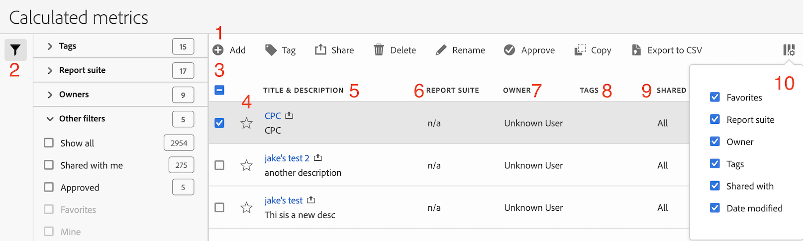

# Het berekende manager van metriek

De pagina Berekende metriek biedt vele manieren om metriek, zoals het delen, het filtreren, het etiketteren, het goedkeuren, het kopiëren, het schrappen, en het merken als favorieten te leiden.

Op de pagina Berekende metriek ziet u alle segmenten die u bezit en die met u zijn gedeeld. Gebruikers op beheerniveau kunnen alle aangepaste maatstaven in de organisatie zien.

## Toegang tot het Berekende manager van metriek

1. Selecteer in Adobe Analytics [!UICONTROL **Componenten**] > [!UICONTROL **Berekende cijfers**].

## Gebieden van het Berekende metrische beheer

In de volgende afbeelding en de bijbehorende tabel worden enkele hoofdgebieden en kenmerken van het beheer van berekende metriek uitgelegd.

| Locatie in afbeelding | Naam en functie |
|---|---|
| 1 | **Werkbalk voor berekend metrische beheer:** Nadat u metrisch hebt geselecteerd, wordt deze werkbalk weergegeven. De meeste beheertaken kunnen vanaf deze werkbalk worden voltooid. |
| 2 | **Filter:** U kunt filteren op tags, rapportsuites, eigenaars, alles (alleen admin), gedeeld met mij, mijn, favorieten en goedgekeurd (alleen admin). |
| 3 | **Selectievakjes:** Selecteer een aangepaste metrische waarde om deze te beheren. |
| 4 | **Favorieten:** Als u de ster naast een metrische waarde selecteert, wordt de metrische waarde als favoriet gemarkeerd. |
| 5 | **Segmenttitels en -beschrijvingen:** Deze waarden worden verstrekt in de Berekende metrische bouwer. Als u de titel en beschrijving wilt bewerken, selecteert u de titelkoppeling om de builder voor berekende metrische gegevens te openen. |
| 6 | **Rapportsuite:** Wijst erop in welke rapportreeks metrisch het laatst werd bewaard. |
| 7 | **Eigenaar:** Geeft aan wie de aangepaste metrische waarde bezit. Als niet-beheerder, kunt u slechts metriek zien u bezit of die met u werden gedeeld. |
| 8 | **Tags:** Toont markeringen die op metrisch, of door u of door mensen werden toegepast die het segment met u deelden. |
| 9 | **Gedeeld met:** Hiermee geeft u personen of groepen (alleen beheerder) of Alle personen (alleen beheerder) weer waarmee u het segment hebt gedeeld. |
| 10 | **Kolomkiezer:** Hiermee kunt u kolommen op de pagina Berekende metriek selecteren of deselecteren, zodat u de weergave kunt aanpassen. |
| Niet weergegeven in afbeelding | **Datum gewijzigd:** Geeft de datum aan waarop de aangepaste metrische waarde voor het laatst is gewijzigd. |

{style="table-layout:auto"}
