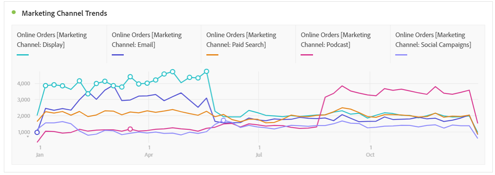

# Marketingkanalen analyseren

>[!NOTE]
>
>Om doeltreffendheid van de Kanalen van de Marketing voor Attributie en Adobe Analytics te maximaliseren, hebben wij sommige [&#x200B; herzien beste praktijken &#x200B;](/help/components/c-marketing-channels/mchannel-best-practices.md) gepubliceerd.
>
>De beheerders van Analytics kunnen marketing kanalen voor hun organisaties beheren zoals die in [&#x200B; worden beschreven leiden de Kanalen van de Marketing &#x200B;](/help/admin/tools/manage-rs/edit-settings/marketing-channels/c-channels.md).

U wilt waarschijnlijk weten welke van uw marketingkanalen het meest effectief is en met wie, zodat u uw inspanningen beter kunt richten en een beter rendement op uw marketingdollars kunt krijgen. In Adobe Analytics zijn de dimensies en maatstaven van de distributiekanalen in Workspace een van de hulpmiddelen die u kunnen helpen de invloed van verschillende kanalen op uw bestellingen, inkomsten, enz. volgen. en geeft u nuttige kanaalinzichten. Hier zijn de afmetingen en de metriek u met betrekking tot de Kanalen van de Marketing kunt gebruiken:

| Dimension/Metric | Definitie |
| --- | --- |
| Marketingkanaal | Dit is de geadviseerde dimensie van de Kanalen van de Marketing aan gebruik. Attributiemodellen kunnen hierop worden toegepast tijdens runtime. Deze dimensie gedraagt zich als laatste de dimensie van het Kanaal van de Aanraking, maar verschillend geëtiketteerd om verwarring te verhinderen wanneer het gebruiken van het met een verschillend attributiemodel. |
| Laatste aanraakkanaal | Verouderde dimensie, met het laatste aanraakattributiemodel vooraf toegepast en onveranderbaar. |
| Eerste aanraakkanaal | Verouderde dimensie, met het eerste aanraakattributiemodel vooraf toegepast en onveranderbaar. |
| Marketing Channel-instanties | Deze metrische meting meet het aantal tijden een marketing kanaal in een beeldverzoek, met inbegrip van standaardpaginameningen en douaneverbindingsvraag werd bepaald. Bevat geen aaneengesloten waarden. |
| Nieuwe contracten | Deze metrische waarde lijkt op Instanties, maar wordt alleen verhoogd wanneer first-touch marketingkanaal wordt gedefinieerd in een afbeeldingsaanvraag. |

## Basisanalyse

Deze lijst van Freeform toont de metriek Online Orders, Online Ontvangsten, en het Tarief van de Omzetting voor elk van de Kanalen van de Marketing:

Hier ziet u de Online Orders en Online-inkomsten van elk marketingkanaal in een Donut-overzicht:

Dit diagram van Lijn toont tendensen in Online Orden voor diverse kanalen in tijd:

## Geavanceerde analyse

De Details van de Kanalen van de marketing duiken dieper in elk kanaal om u specifieke campagnes, plaatsen, enz. te tonen. U kunt elk marketingkanaal onderverdelen in details:

## Kenmerkingsmodellen toepassen

U kunt [&#x200B; Attributie &#x200B;](/help/analyze/analysis-workspace/attribution/overview.md) gebruiken om verschillende attributiemodellen onmiddellijk toe te passen:

U ziet hoe dezelfde metrische waarde (Online bestellingen) verschillende resultaten genereert wanneer u verschillende attributiemodellen toepast.

## Analyse van intertab-marketing

Met het verouderde First-Touch Channel en Last-Touch Channel kunt u een handige weergave krijgen in kanaalinteracties:

Leer meer over dwars-lusje marketing analyse in deze video: [&#x200B; Gebruikend Cross-tab Analyse om Basis de Marketing Attributie in Analysis Workspace &#x200B;](https://experienceleague.adobe.com/docs/analytics-learn/tutorials/analysis-workspace/attribution-iq/using-cross-tab-analysis-to-explore-basic-marketing-attribution-in-analysis-workspace.html?lang=nl-NL) te onderzoeken.
