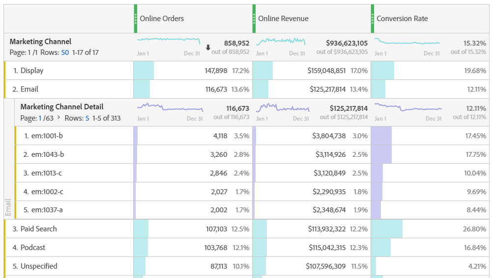

# Marketingkanalen analyseren

U wilt waarschijnlijk weten welke van uw marketingkanalen het meest effectief is en met wie, zodat u uw inspanningen beter kunt richten en een beter rendement op uw marketingdollars kunt krijgen. In Adobe Analytics zijn de dimensies en metriek van de Kanalen van de Marketing in Workspace één van de hulpmiddelen die u kunnen helpen de invloed van verschillende kanalen op uw orden, opbrengsten, enz. volgen. en geeft u nuttige kanaalinzichten. Hier zijn de afmetingen en de metriek u met betrekking tot de Kanalen van de Marketing kunt gebruiken:

| Dimensie/metrisch | Definitie |
|---|---|
| Marketingkanaal | Dit is de dimensie van de Kanalen van de Marketing wij adviseren gebruikend. Attribution IQ-modellen kunnen hierop worden toegepast tijdens runtime. De generieke dimensie van Kanalen van de Marketing gedraagt zich identiek aan de Afmetingen van het Kanaal van de Laatste Aanraak, maar etiketteert verschillend om verwarring te verhinderen wanneer het gebruiken van het met een verschillend attributiemodel. |
| Laatste aanraakkanaal | Verouderde dimensie, met vooraf toegepast en onveranderlijk attributiemodel. |
| Eerste aanraakkanaal | Verouderde dimensie, met vooraf toegepast en onveranderlijk attributiemodel. |
| Marketing Channel-instanties | Deze metrische waarde... |
| Nieuwe contracten | Dit is een oudere metrische waarde die alleen wordt verhoogd wanneer er een &#39;first touch&#39;-toewijzing op een kanaal is toegepast. |

## Basisanalyse

Deze lijst van Freeform toont de metriek Online Orders, Online Ontvangsten, en het Tarief van de Omzetting voor elk van de Kanalen van de Marketing:

Hier ziet u de Online Orders en Online-inkomsten van elk marketingkanaal in een Donut-overzicht:

Dit diagram van Lijn toont trends in Online Orders voor diverse kanalen in tijd:

## Geavanceerde analyse

De Details van de Kanalen van de marketing duiken dieper in elk kanaal om u specifieke campagnes, plaatsen, enz. te tonen. U kunt elk marketingkanaal onderverdelen in details:

## Kenmerkingsmodellen toepassen

U kunt [Attribution IQ](https://docs.adobe.com/content/help/en/analytics/analyze/analysis-workspace/panels/attribution/use-attribution.html) gebruiken om verschillende attributiemodellen onmiddellijk toe te passen:

U ziet hoe dezelfde metrische waarde (Online bestellingen) verschillende resultaten genereert wanneer u verschillende attributiemodellen toepast.

Hier volgen enkele video&#39;s waarin IQ van kenmerk nader wordt uitgelegd: Afspeellijst [van](https://www.youtube.com/playlist?list=PL2tCx83mn7GuDzYEZ8jQlaScruZr3tBTR)Attribution IQ.

## Analyse van intertab-marketing

Met het verouderde Eerste aanraakkanaal en Laatste aanraakkanaal krijgt u een handige weergave in kanaalinteracties:

In [deze video](https://www.youtube.com/watch?v=M3EOdONa-3E)vindt u meer informatie over de marketinganalyse op verschillende tabbladen.