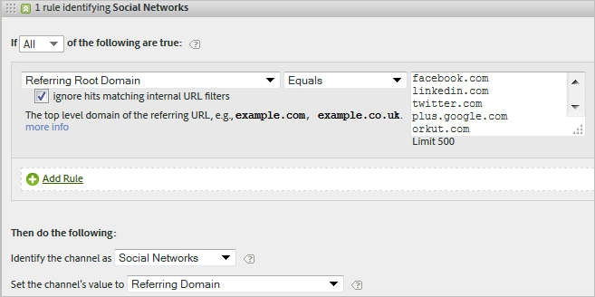

# Veelgestelde vragen en voorbeelden over marketingkanalen

Zie Regels [voor de verwerking van marketingkanalen](/help/components/c-marketing-channels/c-rules.md) maken voor definities van velden die op de [!UICONTROL Marketing Channel Processing Rules] pagina worden weergegeven.

## Veelgestelde vragen {#faq}

Elke implementatie van de verwerkingsregels voor marketingkanalen kan verschillen, afhankelijk van uw trackingcodes. Het vormen van regels die resultaten verstrekken u zoekt kan wat creatief denken vereisen om problemen op te lossen.

**Vraag**: Mijn volgcodes volgen geen patroon en ik heb duizenden die moeten worden gespecificeerd voor mijn kanaal van Verbonden.

* Gebruik het eliminatieproces. Als uw e-mail en gelieerde kanalen dezelfde parameter voor de queryreeks gebruiken, maar u hebt slechts een paar codes voor het bijhouden van e-mail, kunt u de codes voor het bijhouden van e-mail opgeven in een regelset die e-mail definieert. Vervolgens classificeert u alle andere volgcodes met *`affiliates.`*
* Voeg in uw e-mailsysteem een parameter voor de querytekenreeks toe aan alle bestemmingspagina-URL&#39;s, zoals *`&ch=eml`* de URL. Maak een regelset die detecteert of de parameter voor de query gelijk is *`eml`*. Als het niet bevat *`eml`*, is het een gelieerde.

**Vraag**: Verwijzende domeinen bevatten meer gegevens dan ik verwacht.

* Verwijzende domeinen zouden te hoog in de lijst van de verwerkingsregel kunnen zijn. Het zou één van de laatste (of laatste) regelreeksen moeten zijn, omdat de verwerkingsorde belangrijk is.

**Vraag**: Ik heb een regel gecreeerd die een parameter van het vraagkoord aanpast en het werkt niet.

* Controleer of de parameternaam is opgegeven in de parametervelden van de querytekenreeks (meestal een alfanumerieke waarde). Zorg er ook voor dat de parameterwaarde wordt opgegeven na de operator, zoals in het volgende voorbeeld van een e-mailregel wordt getoond.

   

**Vraag**: Waarom wordt al mijn laatste-aanrakingsverkeer toegeschreven aan een intern domein?

* U hebt een regel die intern verkeer aanpast. Houd er rekening mee dat deze regels gelden voor elke hit die een bezoeker op uw site maakt, en niet alleen voor het eerste bezoek. Als u een regel hebt zoals *`Page URL exists`* zonder andere criteria, komt dat kanaal overeen op elke volgende hit op uw site, omdat een pagina-URL altijd bestaat.

**Vraag**: Hoe zuivert ik verkeer dat in Geen Kanaal wordt getoond die op het rapport wordt geïdentificeerd?

* Regels worden op volgorde verwerkt. Als er geen specifieke criteria zijn gevonden, vallen treffers onder een van de drie categorieën:

1. Geen referentie (een rechtstreeks bezoek).

2. Interne referentie, op de eerste pagina van een bezoek.

3. Een verwerkingsglitch op de pagina.

Zorg ervoor dat u een kanaal voor deze drie mogelijkheden hebt. Maak bijvoorbeeld regels die het volgende aangeven:

1. **[!UICONTROL Referrer]** en **[!UICONTROL Does Not Exist]** en **[!UICONTROL Is First Page of Visit]**. (Zie [Direct.](/help/components/c-marketing-channels/c-faq.md))

2. **[!UICONTROL Referrer Matches Internal URL Filters]** en **[!UICONTROL Is First page of Visit]**. (Zie [Intern](/help/components/c-marketing-channels/c-faq.md).)

3. **[!UICONTROL Referrer]** en **[!UICONTROL Exists]** en **[!UICONTROL Referrer Does Not Match Internal URL Filters]**.

Ten slotte maakt u een *ander* kanaal waarmee de resterende resultaten worden vastgelegd, zoals wordt beschreven in [Geen kanaal geïdentificeerd](/help/components/c-marketing-channels/c-faq.md#no-channel-identified).

## Geen kanaal geïdentificeerd {#no-channel-identified}

Wanneer uw regels geen gegevens vangen, of als de regels niet correct worden gevormd, toont het rapport de gegevens in de [!UICONTROL No Channel Identified] rij op het rapport. U kunt een regelreeks tot stand brengen genoemd *Andere*, bijvoorbeeld, aan het eind van uw verwerkingsorde, die ook intern verkeer identificeert.

Dit soort regel dient als catch-all om ervoor te zorgen dat het kanaalverkeer altijd extern verkeer aanpast, en typisch niet omhoog in **[!UICONTROL No Channel Identified]**. Wees voorzichtig om geen regel te creëren die ook intern verkeer identificeert. Het plaatsen van de waarde van het kanaal aan **[!UICONTROL Referring Domain]** of aan **[!UICONTROL Page URL]** zijn de gemeenschappelijkste, nuttigste manieren om een efficiënte Andere regel tot stand te brengen.

> [!NOTE] Er zou nog wat kanaalverkeer kunnen zijn dat in de Geen Geïdentificeerde categorie van het Kanaal kan vallen. Bijvoorbeeld: Een bezoeker komt naar de site en bladwijzers op een pagina en tijdens hetzelfde bezoek komt de pagina via de bladwijzer terug. Aangezien dit niet de eerste pagina van het bezoek is, zal het noch in het directe kanaal noch in het andere kanaal gaan omdat er geen verwijzend domein is.

## Betaalde zoekopdracht {#paid-search}

Een betaalde zoekopdracht is een woord of zinsdeel dat u betaalt voor plaatsing in zoekresultaten. Om de betaalde regels van de onderzoeksopsporing aan te passen, gebruikt het marketing kanaal montages die op de [!UICONTROL Paid Search Detection] pagina worden gevormd. ( **[!UICONTROL Admin]** > **[!UICONTROL Report Suites]** > **[!UICONTROL Edit Settings]** > **[!UICONTROL General]** > **[!UICONTROL Paid Search Detection]**). De doel-URL komt overeen met de bestaande regel voor betaalde zoekdetectie voor dat zoekprogramma.

Voor de marketingkanaalregel zijn de [!UICONTROL Paid Search] instellingen als volgt:

Zie Detectie [van betaald zoeken](https://docs.adobe.com/content/help/en/analytics/admin/admin-tools/paid-search-detection/paid-search-detection.html) in Admin voor meer informatie.

## Natuurlijk zoeken {#natural-search}

Een natuurlijk onderzoek komt voor wanneer de bezoekers uw website door een onderzoek van het Web vinden, waar het onderzoeksmotor uw plaats zonder u voor de lijst te betalen rangschikte. U kunt de doel-URL bepalen die het zoekprogramma gebruikt om een koppeling naar uw site te maken. Met deze URL kan Analytics bepalen of een zoekopdracht natuurlijk is.

Er is geen natuurlijke onderzoeksopsporing in Analytics. Nadat u de Detectie van het Gesteunde Onderzoek hebt ingesteld, weet het systeem dat als een onderzoeksverwijzer geen betaalde onderzoeksverwijzer was, het een natuurlijke onderzoeksverwijzer moet zijn. Voor een natuurlijke zoekopdracht komt de doel-URL niet overeen met de bestaande regel voor betaalde zoekdetectie voor die zoekmachine.

Voor de regel voor marketingkanalen gelden de volgende instellingen voor Natuurlijk zoeken:

Zie Detectie [van](https://docs.adobe.com/content/help/en/analytics/admin/admin-tools/paid-search-detection/paid-search-detection.html) betaalde zoekopdrachten in Beheer voor meer informatie.

## Affiliates {#afilliates}

Een partnerregel identificeert bezoekers die uit een gespecificeerde reeks verwijzende domeinen voortkomen. In de regel geeft u als volgt een overzicht van de domeinen van filialen die u wilt bijhouden:

## Sociale netwerken {#social-networks}

Deze regel identificeert bezoekers die afkomstig zijn van een sociaal netwerk, zoals Facebook*. De instellingen kunnen als volgt zijn:

## Weergave {#display}

Deze regel identificeert bezoekers die afkomstig zijn van banneradvertenties. Het wordt geïdentificeerd door een parameter van het vraagkoord in de bestemmingsURL, in dit geval *`Ad_01`*.

## Intern {#internal}

Deze regel identificeert bezoekers die uit een verwijzer voortkomen die de interne filters URL voor de rapportreeks aanpast.

## E-mail {#email}

Aan opstelling deze regel, verstrekt u de parameter van het vraagkoord voor uw e-mailcampagne. In dit voorbeeld is de parameter *`eml`*:

Als uw regel het Volgen Codes bevat, ga één waarde per lijn in, zoals hier getoond:

## Direct {#direct}

Deze regel identificeert bezoekers die geen verwijzend domein hebben. Deze regel geldt ook voor bezoekers die rechtstreeks naar uw site komen, bijvoorbeeld via een koppeling Favorieten of door een koppeling in hun browser te plakken.

