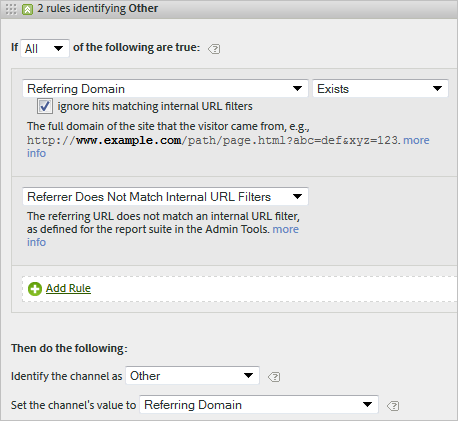

# Veelgestelde vragen over marketingkanalen

>[!NOTE]
>
>Om doeltreffendheid van de Kanalen van de Marketing voor Attributie en Customer Journey Analytics te maximaliseren, hebben wij sommige [ herzien beste praktijken ](/help/components/c-marketing-channels/mchannel-best-practices.md) gepubliceerd.
>
>De beheerders van Analytics kunnen marketing kanalen voor hun organisaties beheren zoals die in [ worden beschreven leiden de Kanalen van de Marketing ](/help/admin/admin/c-manage-report-suites/c-edit-report-suites/marketing-channels/c-channels.md).

Veelgestelde vragen over marketingkanalen.

## Mijn volgcodes volgen geen patroon en ik heb duizenden die moeten worden gespecificeerd voor mijn kanaal van Verbonden.

* Gebruik het eliminatieproces. Als uw e-mail en gelieerde kanalen dezelfde parameter voor de queryreeks gebruiken, maar u hebt slechts een paar codes voor het bijhouden van e-mail, kunt u de codes voor het bijhouden van e-mail opgeven in een regelset die e-mail definieert. Vervolgens classificeert u alle andere volgcodes met *`affiliates.`*
* Voeg in uw e-mailsysteem een parameter voor de queryreeks toe aan alle bestemmingspagina-URL&#39;s, zoals *`&ch=eml`* . Maak een regelset die detecteert of de parameter voor de ch-query gelijk is aan *`eml`* . Als het geen *`eml`* bevat, is het een gelieerde.

## Verwijzende domeinen bevatten meer gegevens dan ik verwacht.

Verwijzende domeinen zouden te hoog in de lijst van de verwerkingsregel kunnen zijn. Het zou één van de laatste (of laatste) regelreeksen moeten zijn, omdat de verwerkingsorde belangrijk is.

## Ik heb een regel gecreeerd die een parameter van het vraagkoord aanpast en het werkt niet.

Controleer of de parameternaam is opgegeven in de parametervelden van de querytekenreeks (meestal een alfanumerieke waarde). Zorg er ook voor dat de parameterwaarde wordt opgegeven na de operator, zoals in het volgende voorbeeld van een e-mailregel wordt getoond.

## Waarom wordt al mijn laatste-aanrakingsverkeer toegeschreven aan een intern domein?

U hebt een regel die intern verkeer aanpast. Houd er rekening mee dat deze regels gelden voor elke hit die een bezoeker op uw site maakt, en niet alleen voor het eerste bezoek. Als u een regel als *`Page URL exists`* zonder andere criteria hebt, komt dat kanaal overeen bij elke volgende hit op uw site, omdat een pagina-URL altijd bestaat.

## Hoe zuivert ik verkeer dat in Geen Kanaal wordt getoond die op het rapport wordt geïdentificeerd?

Regels worden op volgorde verwerkt. Als er geen specifieke criteria zijn gevonden, vallen treffers onder een van de drie categorieën:

1. Geen referentie (een rechtstreeks bezoek).

2. Interne referentie, op de eerste pagina van een bezoek.

3. Een verwerkingsglitch op de pagina.

Zorg ervoor dat u een kanaal voor deze drie mogelijkheden hebt. Maak bijvoorbeeld regels die het volgende aangeven:

1. **[!UICONTROL Referrer]** en **[!UICONTROL Does Not Exist]** en **[!UICONTROL Is First Page of Visit]** . (Zie [ Direct.](/help/components/c-marketing-channels/c-faq.md))

2. **[!UICONTROL Referrer Matches Internal URL Filters]** en **[!UICONTROL Is First page of Visit]** . (Zie [ Intern ](/help/components/c-marketing-channels/c-faq.md).)

3. **[!UICONTROL Referrer]** en **[!UICONTROL Exists]** en **[!UICONTROL Referrer Does Not Match Internal URL Filters]** .

Tot slot creeer een *Ander* kanaal dat de resterende klappen vangt, zoals die in [ worden beschreven Geen Geïdentificeerd Kanaal ](/help/components/c-marketing-channels/c-faq.md#no-channel-identified).

## Relatie tussen eerste en laatste aanraking

Als u de interactie tussen oudere eerste en laatste aanraakafmetingen wilt begrijpen en wilt bevestigen dat overschrijvingen naar behoren werken, kunt u een first-touch-kanaalrapport genereren dat is gekoppeld aan een last-touch-kanaalrapport en waarin de maatstaf voor het succes van uw sleutel is toegevoegd (zie het onderstaande voorbeeld). Het voorbeeld demonstreert de interactie tussen eerste en laatste aanraakkanalen.

De doorsnede waar de eerste staat gelijk aan de laatste aanraking is de diagonaal van de tabel. Zowel Direct als Sessie vernieuwen krijgen alleen &#39;last-touch&#39;-kredieten als dit ook het eerste aanraakkanaal is, omdat ze geen krediet kunnen halen van andere persisterende kanalen (gemarkeerde rijen).

## Redenen voor Geen kanaal geïdentificeerd {#no-channel-identified}

Wanneer uw regels geen gegevens vangen, of als de regels niet correct worden gevormd, toont het rapport de gegevens in de [!UICONTROL No Channel Identified] rij op het rapport. U kunt een regel tot stand brengen genoemd *Andere*, bijvoorbeeld, aan het eind van uw verwerkingsorde, die ook intern verkeer identificeert.

Dit soort regel dient als een &#39;catch-all&#39;-regel om ervoor te zorgen dat het kanaalverkeer altijd overeenkomt met het externe verkeer en gewoonlijk niet eindigt in **[!UICONTROL No Channel Identified]** . Wees voorzichtig om geen regel te creëren die ook intern verkeer identificeert. Het instellen van de waarde van het kanaal op **[!UICONTROL Referring Domain]** of **[!UICONTROL Page URL]** is de meest gebruikte en nuttige manier om een effectieve andere regel te maken.

>[!NOTE]
>
>Er zou nog één of ander kanaalverkeer kunnen zijn dat in de Geen Geïdentificeerde categorie van het Kanaal kan vallen. Bijvoorbeeld: een bezoeker komt naar de site en bladwijzers op een pagina en tijdens hetzelfde bezoek komt de pagina via de bladwijzer terug. Aangezien dit niet de eerste pagina van het bezoek is, zal het noch in het Directe kanaal noch in het Andere kanaal gaan omdat er geen verwijzend domein is.

## Redenen voor intern (Sessie vernieuwen) {#internal}

Interne laatste aanraking (Sessie vernieuwen) kan alleen optreden als dit ook de eerste aanraking was. Zie &quot;Relatie tussen eerste en laatste aanraking&quot; hierboven. In de onderstaande scenario&#39;s wordt uitgelegd hoe Zitting vernieuwen een eersteklas kanaal kan zijn.

* **onderbreking van de Zitting**: Een bezoeker komt aan de website en verlaat dan het lusje open in hun browser aan gebruik op een recentere datum. De periode van de betrokkenheid van de bezoeker verloopt (of ze verwijderen hun cookies vrijwillig) en ze gebruiken het tabblad Openen om de website opnieuw te bezoeken. Aangezien de verwijzende URL een intern domein is, wordt het bezoek geclassificeerd als Sessie vernieuwen.

* **niet alle plaatspagina&#39;s worden geëtiketteerd**: Een bezoeker land op Pagina A die niet wordt geëtiketteerd, en dan bewegingen aan pagina B die wordt geëtiketteerd. Pagina A wordt beschouwd als de interne referentie en het bezoek wordt geclassificeerd als Sessie vernieuwen.

* **richt** opnieuw: Als een omleiding niet opstelling is om verwijzergegevens tot de nieuwe het landen pagina over te gaan, worden de ware gegevens van de ingangsverwijzing verloren en nu verschijnt de omleidingspagina (waarschijnlijk een interne pagina) als verwijzend domein. Het bezoek wordt geclassificeerd als Sessie vernieuwen.

* **Verkeer van het Domein 1}: Een bezoeker beweegt zich van één domein dat aan Reeks A in brand steekt, naar een tweede domein dat aan Reeks B in brand steekt. Als de interne URL-filters in Suite B het eerste domein bevatten, wordt het bezoek in Suite B geregistreerd als Intern, omdat Marketing Channels het als een nieuw bezoek in de tweede suite zien.** Het bezoek wordt geclassificeerd als Sessie vernieuwen.

* **Lange ingang-pagina laadt tijden**: Een bezoeker land op Pagina A die zwaar op inhoud is, en de code van Adobe Analytics wordt gevestigd bij de bodem van de pagina. Voordat alle inhoud (inclusief Adobe Analytics-verzoek om afbeelding) kan worden geladen, klikt de bezoeker op Pagina B. Pagina B wordt de Adobe Analytics-aanvraag voor een afbeelding geactiveerd. Aangezien de afbeeldingsaanvraag van Pagina A nooit is geladen, wordt de tweede pagina weergegeven als de eerste hit van het bezoek in Adobe Analytics, met Pagina A als de referentie. Het bezoek wordt geclassificeerd als Sessie vernieuwen.

* **het Schrappen van koekjes halverwege**: Een bezoeker komt aan de plaats, en de middenzitting ontruimt hun koekjes. Zowel eerste als laatste-aanraakkanalen worden opnieuw ingesteld en het bezoek wordt geclassificeerd als Sessie vernieuwen (omdat de referentie intern zou zijn).

Hieronder ziet u een voorbeeld van de instelling Interne (verfrissen van sessie) voor zowel eerste als laatste aanraakkanalen:

* Dag 1: de gebruiker komt naar de site op het scherm. Het eerste en laatste aanraakkanaal worden ingesteld op Weergave.
* Dag 2: De gebruiker komt naar de site voor natuurlijk zoeken. First-touch blijft Display en Last touch is ingesteld op Natuurlijk zoeken.
* Dag 35: De gebruiker is niet in 33 dagen naar de site geweest en komt terug gebruikend het lusje dat zij in hun browser open hadden. Ervan uitgaande dat het venster 30 dagen lang geldig is, zou het venster gesloten zijn en zouden de marketingkanaalcookies verlopen zijn. Het eerste aanraak- en laatste aanraakkanaal wordt opnieuw ingesteld en wordt ingesteld op Sessie vernieuwen nadat de gebruiker van een interne URL is gekomen.

## Waarom zijn sommige kanalen onveranderd na het veranderen van de regels van de kanaalverwerking van de Marketing?

Soms worden de de verwerkingsregels van het Kanaal van de Marketing verkeerd opstelling, die het noodzakelijk maken om verwerkingsregels te veranderen. Nadat u de wijzigingen hebt toegepast, kunt u bepaalde metrische gegevens van kenmerken weergeven op een onjuist kanaal. Er zijn verschillende zaken die in overweging moeten worden genomen:

* **de gegevens van het Kanaal van de Marketing worden verzameld in echt - tijd**: De gegevens van het het kanaalkanaal van de marketing worden verwerkt op gegevensinzameling, en zijn permanent 100%. Het wijzigen van de verwerkingsregels heeft geen invloed op gegevens met terugwerkende kracht.
* **het Veranderen van verwerkingsregels beïnvloedt direct geen Eerste aanraakgegevens**: Bijvoorbeeld:
   1. Een gebruiker komt binnen door uw e-mailkanaal omdat het verkeerd opstelling was, dan verlaat uw plaats.
   2. De volgende dag wijzigt u de verwerkingsregel voor e-mail om deze te corrigeren.
   3. Die gebruiker komt een paar dagen later terug door middel van natuurlijke zoekopdracht en koopt een aankoop.
   4. Het e-mailkanaal krijgt First Touch-krediet en natuurlijke zoekopdrachten krijgt Last Touch-creditering.

  Zelfs enkele dagen nadat u de verwerkingsregels hebt gewijzigd, kunnen gegevens nog steeds worden verzameld in het verkeerde First Touch-kanaal. De eerste aanraakgegevens worden voortdurend in het onjuiste kanaal verzameld totdat de betrokkenheid van alle gebruikers verloopt.

De beste manier om deze discrepanties te corrigeren is het doen van een of beide van de volgende maatregelen:

* **verlopen manueel alle periodes van de bezoekersbetrokkenheid**: Dit het plaatsen verloopt onmiddellijk alle eerste en laatste aanrakingskanalen over alle bezoekers:
   1. Ga naar Admin Tools > Report Suites.
   2. Houd de muisaanwijzer boven Beeldbewerkingsinstellingen > Marketingkanalen > Vervaldatum betrokkenheid bezoeker
   3. Klik op Alles vervallen.
   4. Klik op OK in het pop-upvenster met waarschuwingen om te bevestigen dat u begrijpt wat het gaat doen.

* **slechts de metriek van de mening van de Laatste Aanraak van de tijd u uw regels vooruit** verbeterde: De laatste metriek van de Aanraak volgt altijd de huidige heersers. Wanneer u de tijd vanaf het moment waarop u de verwerkingsregels hebt gewijzigd, bekijkt, worden de meest actuele verwerkingsregels correct weergegeven.
