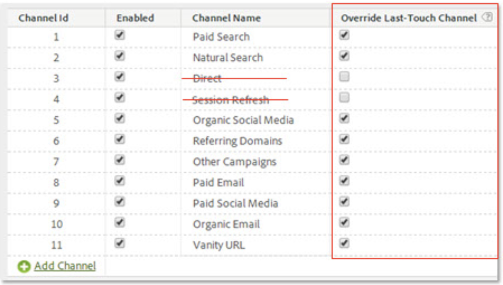

# Attribution IQ met de Kanalen van de Marketing - Beste praktijken

[Marketingkanalen](/help/components/c-marketing-channels/c-getting-started-mchannel.md) zijn een waardevol en krachtig kenmerk van Adobe Analytics. De huidige leidraad betreffende de implementatie van het Kanaal van de Marketing werd geformuleerd op een ogenblik dat geen van beiden [Attribution IQ](https://experienceleague.adobe.com/docs/analytics/analyze/analysis-workspace/attribution/overview.html#analysis-workspace)  noch [Customer Journey Analytics](https://experienceleague.adobe.com/docs/analytics-platform/using/cja-usecases/marketing-channels.html#cja-usecases) bestaan.

Om de implementatie van uw marketingkanalen in de toekomst te controleren en ervoor te zorgen dat er consistentie is met Attribution IQ en met Customer Journey Analytics, geven we een reeks bijgewerkte best practices uit. Als u al marketingkanalen gebruikt, kunt u de beste opties kiezen uit deze nieuwe richtlijnen. Als u niet bekend bent met Marketing Channels, raden we u aan alle nieuwe aanbevolen procedures te volgen.

Toen de Kanalen van de Marketing voor het eerst werden geïntroduceerd, kwamen zij met slechts eerste-aanraak en last-aanraking dimensies. Expliciete eerste/laatste aanraakafmetingen zijn niet meer nodig met de huidige versie van de toewijzing. Adobe biedt algemene dimensies ‘Marketing Channel’ en ‘Marketing Channel Detail’, zodat u deze kunt gebruiken met het gewenste attributiemodel. Deze generische afmetingen gedragen zich identiek aan de laatste-aanraak afmetingen van het Kanaal, maar verschillend geëtiketteerd om verwarring te verhinderen wanneer het gebruiken van de Kanalen van de Marketing met een verschillend attributiemodel.

Aangezien de dimensies van het Kanaal van de Marketing van een traditionele definitie van het Bezoek (zoals die door hun verwerkingsregels wordt bepaald) afhangen, kan hun definitie van het Bezoek niet worden veranderd gebruikend Virtuele Reeksen van het Rapport. Deze herziene praktijken laten duidelijke en gecontroleerde raadplegingsvensters met Attribution IQ en met CJA toe.

## Beste praktijken #1: Gebruik van Attribution IQ voor gecontroleerde analyse

We raden u aan [Attribution IQ](https://experienceleague.adobe.com/docs/analytics/analyze/analysis-workspace/attribution/overview.html#analysis-workspace) in plaats van de bestaande toewijzing van het Kanaal van de Marketing om uw analyse van het Kanaal van de Marketing te verfijnen. Volg de andere beste praktijken om consistentie en robuuste controles over uw analyse met Attribution IQ te verzekeren.

* De configuratie van de dimensies van het Kanaal van de Marketing en het Detail van het Kanaal van de Marketing vestigt te evalueren aanraakpunten, die aan elke Instantie van het Kanaal van de Marketing beantwoorden.
* Voor metrische analyse, zou uw organisatie zich op één of meerdere attributiemodel(en) moeten richten. Sla aangepaste maateenheden op met dit model, zodat u ze eenvoudig opnieuw kunt gebruiken.
* Standaard worden gegevens toegewezen met gebruik van Last Touch en de instelling van de bezoekersperiode. De Attribution IQ metrische modellen bieden grotere controle over de raadplegingsvensters en meer verscheidenheid, met inbegrip van [algoritmische toewijzing](https://experienceleague.adobe.com/docs/analytics/analyze/analysis-workspace/attribution/algorithmic.html#analysis-workspace).

## Beste praktijken #2: Geen directe en Sessiekanaaldefinities

De directe en Interne kanalen/van het Sessievernieuwen worden niet geadviseerd voor gebruik met de modellen van de douaneattributie (Attribution IQ).

Wat als uw organisatie reeds Directe en Zitting heeft gevormd verfrissen zich? In dit geval raden we u aan [een classificatie maken](https://experienceleague.adobe.com/docs/analytics/components/marketing-channels/classifictions-mchannel.html) voor Eerste aanraking/Laatste aanraking en laat de kanalen van de Vernieuwingen van Direct en van de Zitting niet geclassificeerd. De geclassificeerde dimensie zal de zelfde Attribution IQ resultaten opleveren alsof die kanalen nooit werden gevormd.

## Beste praktijken #3: Laatste aanraakkanaal overschrijven inschakelen voor alle kanalen

Aangepaste toewijzingsmodellen die worden gebruikt met de dimensie Marketingkanaal in Workspace werken het beste als deze instelling is ingeschakeld. Als u deze instelling inschakelt, telt een marketingkanaalinstantie wanneer een nieuw kanaal/detail wordt aangetroffen. Schakel deze optie in voor alle kanalen behalve Direct of Intern/Sessie vernieuwen, die we niet langer aanbevelen voor gebruik met aangepaste attributiemodellen (Attribution IQ).

## Beste praktijken #4: Betrokkenheid bezoeker minimaliseren

Door de bedenktijd van de bezoeker in te stellen op het minimum van &quot;1 dag&quot; minimaliseert u de kans op het vasthouden van waarden. Omdat de modellen van de douaneattributie (AIQ) flexibele raadplegingsvensters toestaan, adviseren wij plaatsend de minimumwaarde om het effect van deze het plaatsen te minimaliseren.

## Beste praktijken #5: De Verwerkingsregels van de Kanalen van de marketing zouden slechts voor toegelaten kanalen moeten bestaan

Zorg ervoor dat u om het even welke Regels van de Verwerking van het Kanaal van de Marketing voor gehandicapte kanalen verwijdert. De regels zouden slechts voor de Kanalen van de Marketing moeten bestaan die zoals toegelaten worden gecontroleerd.
