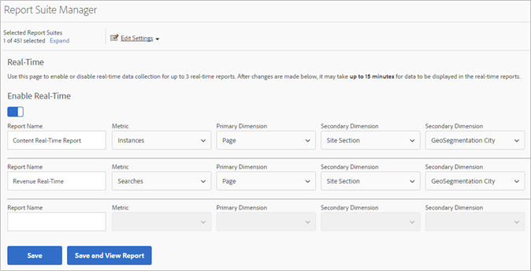

# Realtimerapporten configureren

{{ra-eol}}

Administratieve stappen voor vestiging real-time rapporten.

Real-time rapporten instellen binnen [!UICONTROL Reports & Analytics] bestaat uit het selecteren van de rapportreeks en het vormen van maximaal drie rapporten voor het.

1. Selecteer de rapportsuite waarvoor u realtime rapporten wilt inschakelen.

   Navigeren naar **[!UICONTROL Analytics]** > **[!UICONTROL Reports]** > **[!UICONTROL View All Reports > Site Metrics]** > **[!UICONTROL Real-Time]** en selecteer de rapportreeks van drop-down bij de bovenkant:

   

   Als u probeert om rapporten in real time voor een rapportreeks te bekijken die niet opstelling voor rapportering in real time is, een berichtvertoningen die u aan opstelling de rapportreeks toelaat.

   

1. Klikken **[!UICONTROL Configure]** (tandwielpictogram) om het [!UICONTROL Report Suite Manager].

   (Ook beschikbaar onder **[!UICONTROL Analytics]** > **[!UICONTROL Admin > Report Suites]** > **[!UICONTROL Edit Settings]** > **[!UICONTROL Real-Time]**.)

1. De knop **[!UICONTROL Enable Real-Time]** instellen.
1. Opstelling gegevensinzameling in real time voor maximaal drie rapporten, met één metrische en drie dimensies of classificaties per rapport.

   

   Voor informatie over ondersteunde realtime metriek en dimensies raadpleegt u [Ondersteunde maateenheden en Dimensionen](/help/admin/admin/c-manage-report-suites/c-edit-report-suites/realtime/realtime-metrics.md).

   Als u classificaties hebt gemaakt, worden deze ingesprongen weergegeven onder de dimensie waarvoor ze zijn gedefinieerd:

   

   >[!NOTE]
   >
   >Voor één enkel rapport Real-Time, steunen wij momenteel niet toelatend dubbele dimensies, zelfs als een verschillende classificatie voor elke dimensie wordt geselecteerd.

   Zie voor meer informatie over classificaties [Over classificaties](/help/components/classifications/c-classifications.md).

   >[!NOTE]
   >
   >Sommige dimensies, zoals &#39;Trefwoord zoeken&#39; of &#39;Product&#39;, blijven niet in real-time behouden, zoals ze elders in Adobe Analytics doen. Wanneer u een niet-permanente metrische waarde selecteert, wordt de volgende waarschuwing weergegeven:

   

1. Klikken **[!UICONTROL Save]** of **[!UICONTROL Save and View Report]**.

   Na deze eerste rapportinstelling kan het 20 minuten duren voordat de gegevens beginnen met streamen. Vanaf dat moment zijn de gegevens direct beschikbaar. Voor informatie bij het bekijken van Real-Time rapporten, zie [Een real-time rapport uitvoeren](https://experienceleague.adobe.com/docs/analytics/analyze/reports-analytics/t-running-report-types.html).

1. Door gebrek, hebben alle gebruikers toegang tot Echt - tijd rapporten.
