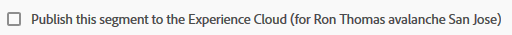
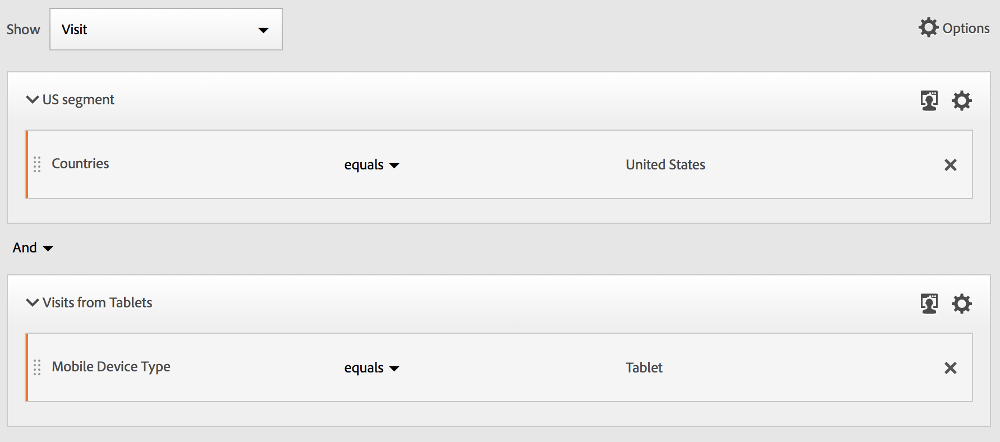

# Segment Builder

Het [!UICONTROL Segment Builder] biedt een canvas waarin u Metrisch, Dimensies, Segmenten en Gebeurtenissen kunt slepen en neerzetten om bezoekers te segmenteren op basis van de containerhiërarchische logica, regels en operatoren. Met dit geïntegreerde ontwikkelprogramma kunt u eenvoudige of complexe segmenten maken en opslaan die bezoekerskenmerken en -acties identificeren voor bezoeken en pagina-einden.

>[!IMPORTANT]
>
>We introduceerden dimensioneringsmodellen in de release van juni 2019. Zie #6 onder Web UI-functies hieronder.

Er zijn verscheidene manieren om tot de Bouwer van het Segment toegang te hebben:

* **Bovenste navigatie** Analytics: Klik **[!UICONTROL Analytics]** > **[!UICONTROL Components]** > **[!UICONTROL Segments]**.
* **[!UICONTROL Analysis Workspace]**: Klik **[!UICONTROL Analytics]** > **[!UICONTROL Workspace]**, open een project en klik **[!UICONTROL + New]** > **[!UICONTROL Create Segment]**.
* **[!UICONTROL Reports & Analytics]**: Klik **[!UICONTROL Analytics]** > **[!UICONTROL Reports]**, open een bestaand rapport en klik het pictogram van Segmenten  in de linkernavigatie, dan klik **[!UICONTROL Add]**.
* **[!UICONTROL Ad Hoc Analysis]**: Segmenten [maken in ad hoc analyse](/help/components/c-segmentation/c-segmentation-workflow/seg-build.md#build-segments).
* **[!UICONTROL Report Builder]**: [Voeg of geef segmenten in de Bouwer](https://marketing.adobe.com/resources/help/en_US/arb/segmentation.html)van het Rapport toe uit.

## Gebruikersinterface van Segment Builder {#concept_643F2DF74C544796B58F4656ABC5F726}

Met [!UICONTROL Segment Builder] deze interface kunt u eenvoudige of complexe segmenten maken die bezoekerskenmerken en -acties identificeren voor bezoeken en paginakijken. Het verstrekt een canvas om metrische afmetingen, gebeurtenissen, of andere segmenten te slepen en te laten vallen om bezoekers te segmenteren die op hiërarchische logica, regels, en exploitanten worden gebaseerd.

## Functies webinterface {#section_F61C4268A5974C788629399ADE1E6E7C}

Met [!UICONTROL Segment Builder] deze opties kunt u segmenten maken en bewerken in de webinterface (of in een gebruikersinterface van [Java in ad hoc-analyse](/help/components/c-segmentation/c-segmentation-workflow/seg-workflow.md)). U kunt regeldefinities en containers toevoegen om uw segmenten, stapelsegmenten te verfijnen en ze te nesten om ze te verfijnen. U kunt ook valideren hoeveel paginaweergaven, bezoeken en unieke bezoekers het resultaat zijn van uw huidige segmentdefinitie. Sla het segment vervolgens op voor toekomstige behoeften.

Heb toegang tot de Bouwer van het Segment door:

* Een bestaand rapport weergeven en klikken op het pictogram Segmenten  in de linkernavigatie. Klik in de segmenttrack die wordt weergegeven **[!UICONTROL Add]**.

* Klik in Segmentbeheer op **[!UICONTROL + Add]**.
* Klik op een bestaande segmenttitel in Segmentbeheer om het segment te bewerken in Segmentbouwer.

1. **[!UICONTROL Title]**: Hiermee kunt u het segment een naam geven of de naam ervan wijzigen.
1. **[!UICONTROL Description]**: Geef een beschrijving voor het segment op. U moet een beschrijving opgeven als u het segment wilt delen.
1. **[!UICONTROL Tags]**: [Tags toewijzen aan het segment](/help/components/c-segmentation/c-segmentation-workflow/seg-workflow.md) dat u maakt door het segment te kiezen uit een lijst met bestaande tags of door een nieuwe tag te maken.
1. **[!UICONTROL Definitions]**: Dit is waar u segmenten bouwt en vormt, regels, en nest en opeenvolgingscontainers toevoegt. Hiermee kunt u een beschrijving voor het nieuwe segment opgeven door de container te selecteren en afmetingen, segmenten of metriek te slepen en neer te zetten in de definitie.
1. **[!UICONTROL Show]**: (Selector bovenste container.) Hiermee kunt u de [container](/help/components/c-segmentation/seg-overview.md) op hoofdniveau selecteren ( [!UICONTROL Visitor], [!UICONTROL Visit], [!UICONTROL Hit]). De standaard container op hoofdniveau is de container Actief.
1. **[!UICONTROL Options]**: (tandwiel) pictogram

   * **[!UICONTROL + Add container]**: Hiermee kunt u een nieuwe container (onder de container op het hoogste niveau) toevoegen aan de segmentdefinitie.
   * **[!UICONTROL + Add container from selection]**: Hiermee kunt u een nieuwe container maken van de elementen die u (meerdere) hebt geselecteerd in het veld Definities.
   * **[!UICONTROL Exclude]**: Hiermee kunt u het segment definiëren door een of meer dimensies, segmenten of metriek uit te sluiten.

1. **[!UICONTROL Attribution Models]**: Voor dimensiesegmentatie. Dimensiemodellen zijn vooral handig voor opeenvolgende segmentatie, zoals bij modellen die stroomvisualisatie ondersteunen:

   * **[!UICONTROL Repeating]** (standaard): Bevat varianten en doorlopende waarden voor de dimensie.
   * **[!UICONTROL Instance]**: Bevat exemplaren voor de dimensie.
   * **[!UICONTROL Non-repeating instance]**: Hiermee worden unieke (niet-herhalende) instanties voor de dimensie opgenomen.
   

1. **[!UICONTROL Dimensions]**: Dimensies worden gesleept en verwijderd uit de lijst Dimensies (oranje zijbalk).
1. **[!UICONTROL Comparison]**: U kunt waarden vergelijken en beperken gebruikend geselecteerde exploitanten.
1. **[!UICONTROL Value]**: De waarde die u hebt ingevoerd of geselecteerd voor de afmeting of het segment of metrisch.
1. **[!UICONTROL And/Or/Then]**: Wijst de [!UICONTROL AND/OR/THEN] operatoren toe tussen containers of regels. Met de operator THEN kunt u opeenvolgende segmenten definiëren.
1. **[!UICONTROL Metric]**: (Groene zijbalk) Metrisch die is gesleept en verwijderd uit de lijst Metriek.
1. **[!UICONTROL Comparison]** operator: U kunt waarden vergelijken en beperken gebruikend geselecteerde exploitanten.
1. **[!UICONTROL Value]**: De waarde die u hebt ingevoerd of geselecteerd voor de afmeting of het segment of metrisch.
1. **[!UICONTROL X]**: (Verwijderen) Hiermee kunt u dit deel van de segmentdefinitie verwijderen.
1. **[!UICONTROL Save]** of **[!UICONTROL Cancel]**: Hiermee slaat u het segment op of annuleert u het. Nadat u hebt geklikt, gaat u naar Segmentbeheer **[!UICONTROL Save]** waar u het segment kunt beheren.
1. **[!UICONTROL Search]**: Hiermee doorzoekt u de lijst met afmetingen, segmenten of metriek.
1. **[!UICONTROL Dimensions]**: (Lijst) Klik de kopbal om uit te breiden.
1. **[!UICONTROL Metrics]**: Klik op de koptekst om deze uit te vouwen.
1. **[!UICONTROL Segments]**: Klik op de koptekst om deze uit te vouwen.
1. **[!UICONTROL Report suite selector]**: Hiermee selecteert u de rapportsuite waarin dit segment wordt opgeslagen. U kunt het segment in alle rapportreeksen nog gebruiken.
1. **[!UICONTROL Segment Preview]**: Hiermee kunt u een voorvertoning van de belangrijkste metriek bekijken om te zien of u een geldig segment hebt en hoe breed het segment is. Geeft de uitsplitsing aan van de gegevensset die u kunt verwachten om te zien of u dit segment toepast. Toont 3 concentrische cirkels en een lijst om het aantal en het percentage gelijken voor, [!UICONTROL Hits]en [!UICONTROL Visits][!UICONTROL Visitors] voor een segment te tonen dat tegen een gegevensreeks in werking wordt gesteld. Dit diagram wordt meteen bijgewerkt nadat u de segmentdefinitie hebt gemaakt of gewijzigd.
1. **[!UICONTROL Product Compatibility]**: Verstrekt een lijst waarvan de producten van de Analyse van Adobe (de Werkruimte van de Analyse, [!UICONTROL Reports & Analytics]Ad hoc Analyse, het Pakhuis van Gegevens) waarmee het segment u creeerde compatibel is. De meeste segmenten zijn compatibel met alle producten. Niet alle operatoren en dimensies zijn echter compatibel met alle analytische producten, met name [Data Warehouse](/help/components/c-segmentation/seg-reference/seg-compatibility.md). Dit diagram wordt onmiddellijk bijgewerkt nadat u veranderingen in uw segmentdefinitie aanbrengt.

De segmenten met ingebedde datumwaaiers blijven verschillend in de Werkruimte van de Analyse tegenover [!UICONTROL Reports & Analytics]: In Workspace overschrijft een segment met een ingesloten datumbereik het datumbereik van het deelvenster. Door contrast, geeft [!UICONTROL Reports & Analytics] u de doorsnede van de waaier van de rapportdatum en de ingebedde de datumwaaier van het segment.

**[!UICONTROL Publish to Experience Cloud (for `<report suite name>`)]**: (Niet weergegeven op scherm) Deze optie wordt alleen weergegeven als de rapportsuite waarin u dit segment opslaat, is [ingeschakeld voor de Experience Cloud](/help/components/c-segmentation/c-segmentation-workflow/seg-workflow.md). Door een segment naar de Experience Cloud te publiceren, kunt u het segment gebruiken voor marketingactiviteiten in de [!UICONTROL Audience Library], [!DNL Target]en [!DNL Audience Manager]. Een segmenttitel en beschrijving zijn vereist.

> [!NOTE] In Analytics, kunt u een gepubliceerd segment uitgeven of schrappen. Als het segment in gebruik is, wordt een waarschuwingsbericht uitgegeven wanneer u een segment uitgeeft. U kunt geen gepubliceerd segment verwijderen dat door Adobe wordt gebruikt [!DNL Target].

>[!IMPORTANT]
>
>U moet het aantal publiek dat wordt gedeeld van Analytics tot 20 beperken om extra verwerkingsvertragingen te voorkomen. Het publiek dat via Analytics naar de Experience Cloud wordt gedeeld, mag niet meer dan 20 miljoen unieke leden tellen. Vanwege caching is het bovendien 12 uur nodig voordat verwijderde rapportsuites in Analytics worden weergegeven in de Experience Cloud.

>[!IMPORTANT]
>
>Wanneer een bezoeker in aanmerking komt voor het publiek dat wordt gedeeld door Analytics, is er een vertraging van 24 tot 48 uur voordat die informatie kan worden ingegrepen in [!DNL Target], [!DNL Advertising Cloud]en [!DNL Campaign].

## Segmenten maken {#build-segments}

1. U sleept gewoon een afmeting, segment of metrische gebeurtenis van het linkerdeelvenster naar het [!UICONTROL Definitions] veld.

   

   De standaard container op hoofdniveau wordt weergegeven nadat een element naar [!UICONTROL Hit] [!UICONTROL Definitions]is gesleept. U kunt het containertype wijzigen in Bezoek of Bezoeker in het **[!UICONTROL Show]** keuzemenu.

1. Stel de [operator](/help/components/c-segmentation/seg-reference/seg-operators.md) in het keuzemenu in.
1. Voer een waarde in voor het geselecteerde item of selecteer een waarde.
1. Voeg indien nodig extra containers toe met behulp van **[!UICONTROL And]**, **[!UICONTROL Or]** of **[!UICONTROL Then]** regels.
1. Na het plaatsen van de containers en het plaatsen van de regels, zie de resultaten van het segment in de bevestigingsgrafiek bij het hoogste recht. De validator geeft het percentage en het absolute aantal paginaweergaven, bezoeken en unieke bezoekers aan die overeenkomen met het segment dat u hebt gemaakt.
1. Onder **[!UICONTROL Tags]**, [etiketteer](/help/components/c-segmentation/c-segmentation-workflow/seg-tag.md) de container door een bestaande markering te selecteren of nieuwe te creëren.
1. Klik **[!UICONTROL Save]** om het segment op te slaan.

U wordt nu gebracht aan de Manager [van het](/help/components/c-segmentation/c-segmentation-workflow/seg-manage.md)Segment, waar u, uw segment kunt etiketteren delen en beheren op veelvoudige manieren.

## Containers bouwen en nesten {#section_1C38F15703B44474B0718CEF06639EFD}

U kunt een kader van containers  bouwen en dan logische regels en exploitanten tussen plaatsen.

1. Klik op **[!UICONTROL Options > Add Container]**.

   

   Er wordt een nieuwe [!UICONTROL Hit] container geopend zonder dat een [!UICONTROL Hit] (paginaweergave) is geïdentificeerd.

   

1. Wijzig desgewenst het containertype.
1. Sleep een afmeting, segment of gebeurtenis van het linkerdeelvenster naar de container.
1. Ga door met het toevoegen van nieuwe containers van het hoogste niveau **[!UICONTROL Options]** > **[!UICONTROL Add container]** knoop bij de bovenkant van de definitie, of voeg containers van binnen een container aan nest logica toe.

   **OF**

   Selecteer een of meer regels en klik op **[!UICONTROL Options]** > **[!UICONTROL Add container from selection]**. Hierdoor verandert uw selectie in een aparte container.

## Datumbereiken gebruiken in segmenten {#concept_252A83D43B6F4A4EBAB55F08AB2A1ACE}

U kunt segmenten bouwen die het rollen datumwaaiers bevatten om vragen over aan de gang zijnde campagnes of gebeurtenissen te beantwoorden.

U kunt bijvoorbeeld eenvoudig een segment maken dat &#39;iedereen bevat die de afgelopen 60 dagen een aankoop heeft gedaan&#39;.

U creeert een container van het Bezoek en binnen het, voeg de [!UICONTROL Last 60 days] tijdwaaier en metrisch [!UICONTROL Orders is greater than or equal to 1], met een exploitant AND toe:

## Segmenten stapelen {#task_58140F17FFD64FF1BC30DC7B0A1B0E6D}

Het stapelen van segmenten werkt door de criteria in elk segment te combineren gebruikend een &quot;en&quot;exploitant, en dan de gecombineerde criteria toe te passen.

Het stapelen van bijvoorbeeld een segment van &quot;mobiele telefoongebruikers&quot; en een segment van &quot;Amerikaanse geografie&quot; zou alleen gegevens voor mobiele telefoongebruikers in de VS retourneren.

Denk aan deze segmenten als bouwstenen of modules die u in een segmentbibliotheek kunt omvatten, voor gebruikers om te gebruiken aangezien zij passen zien. Op die manier kunt u het aantal benodigde segmenten aanzienlijk verminderen. Stel dat u 40 segmenten hebt:

* 20 voor gebruikers van mobiele telefoons in verschillende landen (VS_mobile, Duitsland_mobile, Frankrijk_mobile, Brazilië_mobile, enz.)
* 20 voor gebruikers van tablets in verschillende landen (US_tablet, Germany_tablet, France_tablet, Brazilië_tablet, enz.)

Door segment het stapelen te gebruiken, kunt u uw segmentaantal tot 22 verminderen en hen stapelen zoals nodig. U moet deze segmenten maken:

* één segment voor mobiele gebruikers
* één segment voor tabletgebruikers
* 20 segmenten voor de verschillende geografische gebieden

> [!NOTE] Wanneer het stapelen van twee segmenten, worden zij door gebrek verbonden door een EN verklaring. Dit kan niet in een OF verklaring worden veranderd.

1. Ga naar de Segment Builder.
1. Geef een titel en een beschrijving voor het segment op.

   Stap Resultaat 1. Klik **[!UICONTROL Show Segments]** om de lijst met segmenten in de linkernavigatie weer te geven.

   Stap Resultaat 1. Sleep de segmenten die u wilt stapelen naar het segmentdefinitiekanvas. Hier is een voorbeeld van een segment dat de bestaande segmenten &quot;Visits from Tablets&quot; en &quot;US Geo&quot; stapelt:

   

1. Sla het segment op.

   Stap resultaat

## Segmentsjablonen gebruiken {#concept_5098446CC78D441E93B8E4D1D1EA6558}

De malplaatjes vertegenwoordigen de oude pre-gevormde en reekssegmenten.

In de Manager van het Segment, klik **[!UICONTROL Add]**, die u aan de Bouwer van het Segment neemt. Klik nu op het pictogram Segmenten 

het segment &quot;spoorstaaf&quot; te verhogen. De segmentmalplaatjes verschijnen bij de bodem van de segmentlijst. Ze zijn herkenbaar aan een mappictogram links van de sjabloonnaam:

U kunt deze sjablonen naar het canvas Definities slepen en ze gebruiken zoals ze zijn gedefinieerd, of ze wijzigen.

<table id="table_98B87D807E9344C9BEBF072C65D87B1B"> 
 <thead> 
  <tr> 
   <th colname="col1" class="entry"> Sjabloonnaam </th> 
   <th colname="col2" class="entry"> Definitie </th> 
  </tr> 
 </thead>
 <tbody> 
  <tr> 
   <td colname="col1"> Abandon Cart </td> 
   <td colname="col2">Gegevens weergeven voor bezoekers die items aan hun winkelwagentjes hebben toegevoegd, maar geen bestellingen hebben gedaan. In de Definitie van het Segment, is de container Bezoek. De regel voor dit opeenvolgende segment is 
 Toevoegingen voor illustraties zijn niet null 
 
Vervolgens 
 
Orders is gelijk aan 0. 
 </td> 
  </tr> 
  <tr> 
   <td colname="col1"> Eerste bezoeken </td> 
   <td colname="col2">Gegevens weergeven voor bezoekers die maximaal één [1] keer hebben bezocht. In de Definitie van het Segment, is de container Bezoek. De regel is 
Visit Number is gelijk aan 1. 
 </td> 
  </tr> 
  <tr> 
   <td colname="col1"> Niet-aankoopcentrales </td> 
   <td colname="col2">Gegevens weergeven voor bezoekers die niet hebben deelgenomen aan een bestelgebeurtenis. In de Definitie van het Segment, is de container Bezoeker. In dit segment wordt de logica voor uitsluiten gebruikt. De regel is 
Bestellingen zijn niet null. 
 </td> 
  </tr> 
  <tr> 
   <td colname="col1"> Bezoek van niet-enkele pagina (niet-gebonden) </td> 
   <td colname="col2">Gegevens weergeven voor bezoekers die meerdere keren een bezoek hebben gebracht. In de Definitie van het Segment, is de container Bezoeker. In dit segment wordt de logica voor uitsluiten gebruikt. De regel is 
Single Access is niet null. 
 </td> 
  </tr> 
  <tr> 
   <td colname="col1"> Betaalde zoekopdracht </td> 
   <td colname="col2">Gegevens van bezoekers die afkomstig zijn van een betaalde zoekopdracht bekijken. In de Definitie van het Segment, is de container Bezoek. De regel is 
Betaalde zoekopdracht is gelijk aan 1. 
 </td> 
  </tr> 
  <tr> 
   <td colname="col1"> Aankopers </td> 
   <td colname="col2">Gegevens weergeven voor bezoekers die hebben deelgenomen aan een bestelgebeurtenis. In de Definitie van het Segment, is de container Bezoeker. De regel is 
Bestellingen zijn niet null. 
 </td> 
  </tr> 
  <tr> 
   <td colname="col1"> Retourbezoeken </td> 
   <td colname="col2">Gegevens weergeven van bezoekers die ten minste één keer een bezoek hebben gebracht. In de Definitie van het Segment, is de container Bezoek. De regel is 
Visitenummer is groter dan 1. 
 </td> 
  </tr> 
  <tr> 
   <td colname="col1"> Bezoeken van één pagina </td> 
   <td colname="col2"> Gegevens van bezoeken weergeven waarin u een waarde van één pagina ziet, ook al kunt u tijdens dat bezoek meerdere paginaweergaven verzenden. Bezoeken van één pagina met gebeurtenissen van de uitgangsverbinding zijn inbegrepen in het segment. In de Definitie van het Segment, is de container Bezoek. De regel is 
Bezoekingen van één pagina zijn gelijk aan 1. 
 </td> 
  </tr> 
  <tr> 
   <td colname="col1"> Bekeken product niet aan winkelwagentje toegevoegd </td> 
   <td colname="col2">Gegevens weergeven voor bezoekers die producten hebben bekeken maar geen extra winkelwagentjes hebben. In de Definitie van het Segment, is de container Bezoek. De regel voor dit opeenvolgende segment is 
Productweergaven zijn niet null 
 
Vervolgens 
 
 Kart optellen is gelijk aan 0. 
 </td> 
  </tr> 
  <tr> 
   <td colname="col1"> Bezoeken van campagne </td> 
   <td colname="col2">Gegevens van bezoekers weergeven die door campagnes worden genoemd. In de Definitie van het Segment, is de container Bezoek. De regel is 
Trackingcode is niet null. 
 </td> 
  </tr> 
  <tr> 
   <td colname="col1"> Bezoeken van mobiele apparaten </td> 
   <td colname="col2">Gegevens van bezoekers weergeven die mobiele apparaten gebruiken. In de Definitie van het Segment, is de container Bezoek. De regel is 
Mobiel apparaat is niet null. 
 </td> 
  </tr> 
  <tr> 
   <td colname="col1"> Bezoeken van Natuurlijk zoeken </td> 
   <td colname="col2">Gegevens van bezoekers bekijken die niet afkomstig zijn van een betaalde zoekopdracht. In de Definitie van het Segment, is de container Bezoek. De regel is 
Betaalde zoekopdracht is gelijk aan 0. 
 </td> 
  </tr> 
  <tr> 
   <td colname="col1"> Bezoeken van niet-mobiel apparaat </td> 
   <td colname="col2">Gegevens weergeven van bezoekers die geen mobiele apparaten gebruiken. In de Definitie van het Segment, is de container Bezoek. In dit segment wordt de logica voor uitsluiten gebruikt. De regel is 
Mobiel apparaattype is gelijk aan mobiele telefoon 
 
of 
 
Mobiel apparaattype is gelijk aan tablet. 
 </td> 
  </tr> 
  <tr> 
   <td colname="col1"> Bezoeken van telefoons </td> 
   <td colname="col2">Gegevens van bezoekers weergeven met telefoons. In de Definitie van het Segment, is de container Bezoek. De regel is 
Apparaattype is gelijk aan mobiele telefoon. 
 </td> 
  </tr> 
  <tr> 
   <td colname="col1"> Bezoeken van zoekmachines </td> 
   <td colname="col2">Gegevens van bezoekers weergeven die door zoekprogramma's worden genoemd. In de Definitie van het Segment, is de container Bezoek. De regel is 
Het verwijzingstype is zoekmachines. 
 </td> 
  </tr> 
  <tr> 
   <td colname="col1"> Bezoeken van sociale sites </td> 
   <td colname="col2">Gegevens weergeven van bezoekers die door sociale sites worden genoemd. In de Definitie van het Segment, is de container Bezoek. De regel is 
Het verwijzingstype is sociale netwerken. 
 </td> 
  </tr> 
  <tr> 
   <td colname="col1"> Bezoeken van tabletten </td> 
   <td colname="col2">Gegevens van bezoekers weergeven met tablets. In de Definitie van het Segment, is de container Bezoek. De regel is 
Apparaattype is gelijk aan tablet. 
 </td> 
  </tr> 
  <tr> 
   <td colname="col1"> Bezoeken met cookie van bezoeker-id </td> 
   <td colname="col2">Gegevens van bezoekers van uw site weergeven, waar een permanente cookie vereist is. In de Definitie van het Segment, is de container Bezoek. De regel is 
Blijvende cookie is gelijk aan 1. 
 </td> 
  </tr> 
 </tbody> 
</table>

## Voorbeeld: Segment Campagnebezoekers {#concept_61AC6115097B4EB3AEFE8CE98F38315D}

Toont een voorbeeld van dit vaak gebruikte segment.

Veel klanten willen meetgegevens zien van bezoekers die op specifieke campagnes hebben gereageerd. Het creëren van een segment van campagnebezoekers is een gemakkelijke manier om deze gegevens te krijgen.

Bouwend dit segment in de Bouwer van het Segment betekent dat van een container van het Bezoek van het hoogste niveau, u in een campagnedimensie, in dit geval de Naam van de Campagne sleept:

(Optioneel) U kunt ook een tag Campagnes toepassen op dit segment als u gemakkelijk wilt filteren op al uw aan de campagne gerelateerde segmenten.
