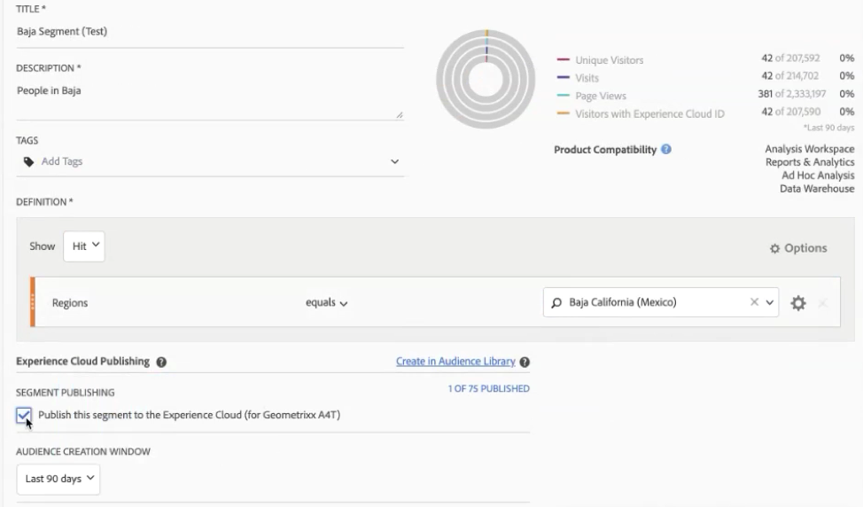

# Segmenten publiceren naar de Experience Cloud

Als u een segment publiceert naar de Experience Cloud, kunt u het segment gebruiken voor marketingactiviteiten in de [!UICONTROL Audience Library], [!DNL Target], [!DNL Audience Manager], [!DNL Advertising Cloud]en [!DNL Campaign]. Recente updates hebben de publicatieworkflow aanzienlijk geoptimaliseerd. Eerder duurde het publiceren van een bruikbaar segment ongeveer 48 uur.

Nu, kan de verwerking tot 8 uren vergen, maar afhankelijk van ander verkeer en op de segmentgrootte, kan de verwerking zelfs sneller zijn. (Wij hebben momenteel echter geen manier om u te informeren wanneer het segment beschikbaar is, zodat zult u manueel moeten controleren.) We hebben ook het maximumaantal te publiceren segmenten verhoogd tot 75 (van 20). U kunt gepubliceerde segmenten weergeven in Componenten > Segmenten.

> [!NOTE] De campagne van Adobe (Klassiek en Norm) gedraagt zich anders in die zin dat het een extra latentie van 24 uur bovenop de latentie van 8 uur voorkomt.

## Vereisten

* Zorg ervoor dat de rapportsuite waar u dit segment opslaat, is [ingeschakeld voor de Experience Cloud](https://docs.adobe.com/content/help/en/core-services/interface/audiences/t-publish-audience-segment.html). Anders kunt u de presentatie niet publiceren naar de Experience Cloud.
* Zorg ervoor dat u werkt in een rapportenpakket dat is [toegewezen aan uw Experience Cloud-organisatie](https://docs.adobe.com/content/help/en/core-services/interface/about-core-services/report-suite-mapping.html).
* Zorg ervoor dat uw organisatie gebruikmaakt van Experience Cloud-id&#39;s.
* Voordat u segmenten kunt publiceren, moet uw beheerder de [!UICONTROL Segment Publishing] machtigingen toewijzen aan een productprofiel in de [beheerconsole](https://docs.adobe.com/content/help/en/core-services/interface/manage-users-and-products/admin-getting-started.html)en u toevoegen aan het productprofiel.

## Overwegingen

* **Limieten** voor rapportsuite: U kunt tot 75 segmenten per rapportreeks publiceren. Deze limiet geldt. Als u al 75 gepubliceerde segmenten hebt, kunt u geen extra segmenten publiceren tot u unpublish genoeg segmenten om onder de 75-segmentdrempel te krijgen.
* **Lidmaatschapgrenzen**: Het publiek dat via Analytics aan de [!DNL Experience Cloud] Commissie wordt gedeeld, mag niet meer dan 20 miljoen unieke leden tellen.
* **Gegevensprivacy**: Het publiek wordt niet gefilterd op basis van de verificatiestatus van een bezoeker. Als een bezoeker in een niet-geverifieerde en geverifieerde status door uw site kan bladeren, kan een bezoeker door handelingen die plaatsvinden wanneer een bezoeker niet-geverifieerd is, toch worden opgenomen in een publiek. Bekijk de privacy [van](https://www.adobe.com/privacy/experience-cloud.html) Adobe Experience Cloud om inzicht te krijgen in de volledige implicaties voor privacy bij het delen van publiek.
* Voor een bespreking over de **verschillen tussen segmenten in[!DNL Adobe Analytics]en[!DNL Audience Manager]**, ga[hier](https://docs.adobe.com/content/help/en/analytics/integration/audience-analytics/audience-analytics-workflow/aam-analytics-segments.html).

## Tijdlijn voor segmentpublicatie

| Beschikbaar | Wanneer deze beschikbaar is | Waar beschikbaar |
|---|---|---|
| Metagegevens (segmenttitel en -definitie) | Onmiddellijk na publicatie | [!DNL Audience Manager], [!UICONTROL Experience Cloud Audience Library], [!DNL Target] |
| Nuttig segment met lidmaatschap | ~ 8 uur na publicatie | Bezoekerprofiel Viewer in [!DNL Audience Manager] |
| Treinen en lidmaatschapspopulatie | Binnen 24-48 uur | [!DNL Audience Manager] |

## Segmenten publiceren in [!UICONTROL Segment Builder]

1. Ga naar **[!UICONTROL Analytics > Workspace > Components > Segments]> +**
1. Maak een segment in de [!UICONTROL Segment Builder]map.
1. Geef een titel en een beschrijving voor het segment op. U kunt het segment dan niet opslaan.
1. Controleer **[!UICONTROL Publish this segment to the Experience Cloud (for *de rapportsuite *)]**.

>[!IMPORTANT]
>
>Gebruik &quot;Bezoekers met Experience Cloud ID&quot; wanneer u segmentvoorvertoningen bekijkt in Analytics in plaats van de totale segmentvoorvertoning &quot;unieke bezoekers&quot; wanneer u de Adobe Analytics-nummers vergelijkt met de Audience Manager-nummers:
>
>

| Element | Beschrijving |
|---|---|
| **[!UICONTROL Publish this segment to the Experience Cloud (for *<report suite>*)]** | Wanneer deze optie is ingeschakeld, worden de segmenttitel en -definitie (d.w.z. het shellpubliek zoals vaak wordt gebruikt op advertentieplatforms) onmiddellijk gedeeld met de Experience Cloud, terwijl het segmentlidmaatschap elke 4 uur wordt geëvalueerd en gedeeld.   Wanneer dat publiek is gekoppeld aan een activiteit in, [!DNL Target]bijvoorbeeld, [!DNL Analytics] begint met het verzenden van id&#39;s voor bezoekers die in aanmerking komen voor die Experience Cloud en het [!DNL Target] publiek. Op dat moment worden de naam van het publiek en de bijbehorende gegevens weergegeven op de pagina Experience Cloud Audiences.   |
| **[!UICONTROL Audience Creation Window]** | Het tijdkader dat u selecteert, wordt gebruikt om het publiek te maken op basis van een rolkalender. Bijvoorbeeld, &quot;Laatste 30 dagen&quot;(gebrek) omvat bezoekers die voor het publiek in de laatste 30 dagen van de datum van vandaag (NIET van de originele datum hebben gekwalificeerd toen het segment werd gecreeerd.) |
| **[!UICONTROL Create in Audience Library]** | De segmenten die u maakt en publiceert, kunnen zonder vertraging beschikbaar worden gemaakt in de Experience Cloud Audience Library. Ze zijn niet afhankelijk van analytische updates. Deze segmenten tellen niet tegen uw grens van 75 gepubliceerde segmenten. |
| **[!UICONTROL x of 75 Published]** | Hier wordt het aantal segmenten weergegeven dat u hebt gepubliceerd naar de Experience Cloud. Klik op de koppeling om een lijst met gepubliceerde segmenten en de bijbehorende rapportsuite en eigenaar weer te geven. |
| **[!UICONTROL Save]** | Hiermee slaat u dit segment op. |

## Segmenten verwijderen of verwijderen

Als u een segment wilt verwijderen dat is gepubliceerd naar de Experience Cloud, moet u eerst de publicatie ongedaan maken. Als u de publicatie van een segment ongedaan wilt maken, **klikt** u gewoon op het selectievakje waarmee u het segment hebt gepubliceerd.

> [!NOTE] U **kunt de publicatie van een segment dat momenteel wordt gebruikt door een van de volgende Adobe-oplossingen niet** ongedaan maken: [!DNL Analytics] (in [!DNL Audience Analytics]), [!DNL Campaign], [!DNL Advertising Cloud] (voor [!DNL Core Service] &amp; [!DNL Audience Manager] klanten) en alle andere externe partners (voor [!DNL Audience Manager] klanten). U **kunt** de publicatie ongedaan maken van een segment dat door wordt gebruikt [!DNL Target].

## Publicatiestatus segment weergeven in het dialoogvenster [!UICONTROL Segment Manager]

1. Ga naar [!UICONTROL Analytics > Components > Segments].
1. Let op de nieuwe [!UICONTROL Published] kolom. Ja/Nee verwijst naar de vraag of het segment al dan niet is gepubliceerd naar de Experience Cloud.

## De [!DNL Audience Manager] UUID ophalen

Er zijn twee manieren om AAM UUID vast te leggen die momenteel aan browser wordt gekoppeld:

* Adobe Experience Cloud Debugger
* Native ontwikkelaarsprogramma in browsers (bijv. Chrome Developer Tools)

De volgende schermafbeeldingen tonen u hoe te om AAM UUID op uw browser terug te winnen en het te gebruiken in de Kijker van het Profiel van de Bezoeker van de Manager van de Audience om spoor en segmentlidmaatschap te bevestigen.

**Methode 1: Adobe Experience CLoud-foutopsporing gebruiken**

1. Download en installeer [Adobe Experience Cloud Debugger](https://docs.adobe.com/content/help/en/analytics/implementation/testing-and-validation/debugger.html) in de Chrome Web Store.
1. Start de foutopsporing wanneer u een pagina laadt.
1. Blader naar de sectie Audience Manager en zoek de AAM UUID die op de huidige browserpagina is ingesteld (`50814298273775797762943354787774730612` in het onderstaande voorbeeld)

**Methode 2: Chrome Developer Tools (of andere browsergereedschappen) gebruiken**

1. Chrome Developer Tools starten voordat een pagina wordt geladen
1. Laad de pagina en controleer Toepassingen > Cookies. De AAM UUID moet worden ingesteld in het cookie van de derde partij ([adobe.demdex.net](https://marketing.adobe.com/resources/help/en_US/aam/demdex-calls.html) in het onderstaande voorbeeld). De veldindex is de AAM UUID-instelling in de browser (`50814298273775797762943354787774730612` in het onderstaande voorbeeld).

## Auditiebeheer gebruiken [!UICONTROL Visitor Profile Viewer]

De AAM UUID in de browser wordt standaard gebruikt wanneer deze [!UICONTROL Visitor Profile Viewer] wordt geladen. Als u de resultaten van andere gebruikers met betrekking tot de eigenschap verifieert, voert u een UUID in het veld UUID in en klikt u [!UICONTROL Refresh]. Raadpleeg de [Bezoekerprofielviewer](https://marketing.adobe.com/resources/help/en_US/aam/t_visitor_profile_viewer.html) voor meer informatie.

## De segmentkenmerken weergeven in [!DNL Audience Manager]

In AAM wordt de lijst met bezoekers met ECID&#39;s voor een bepaald segment op streamingwijze geëvalueerd, aangezien Analytics segmenten deelt met Experience Cloud.

1. Ga [!DNL Audience Manager]naar [!UICONTROL Audience Data > Traits > Analytics Traits]. Er wordt een map weergegeven voor elke analytische rapportensuite die is toegewezen aan uw Experience Cloud-organisatie. Deze mappen (voor Traits, Segmenten en Gegevensbronnen) worden gemaakt wanneer de kernservice Profielen en Soorten publiek/Personen wordt gestart of ingericht.
1. Selecteer de map voor de rapportsuite waarin u eerder het segment hebt gemaakt waarmee u wilt delen [!DNL Audience Manager]. U zult het segment/het publiek zien u creeerde. Wanneer u een segment deelt, gebeuren er twee dingen in [!DNL Audience Manager]:
* Er wordt een doel gemaakt, eerst zonder gegevens erin. Ongeveer. 8 uur nadat het segment is gepubliceerd in [!DNL Analytics], wordt de lijst met ECID&#39;s genegeerd en gedeeld met [!DNL Audience Manager] en andere Experience Cloud-oplossingen.

* Er wordt een segment met één doel gemaakt. Het gebruikt de gegevensbron die met de rapportreeks wordt geassocieerd waar u het segment publiceerde.
* De vervaldatum van de reis is nu ingesteld op 16 dagen (voorheen 2 dagen).

## Het segment weergeven in [!DNL Adobe Target]

Met het [!UICONTROL Publish this segment to the Experience Cloud] selectievakje tijdens het maken van segmenten in Adobe Analytics kan het segment beschikbaar zijn in de aangepaste publieksbibliotheek van Adobe Target. Een segment dat in Analytics of de Manager van de Publiek wordt gecreeerd kan voor activiteiten in Doel worden gebruikt. U kunt bijvoorbeeld campagneactiviteiten maken op basis van de omzettingswaarden voor Analytics en publiekssegmenten die zijn gemaakt in Analytics.
], click [!UICONTROL Audiences].
1. Zoek op de [!UICONTROL Audiences] pagina het publiek op dat afkomstig is van de [!DNL Experience Cloud]pagina. Deze doelgroepen zijn beschikbaar voor gebruik in [!DNL Target] activiteiten.

