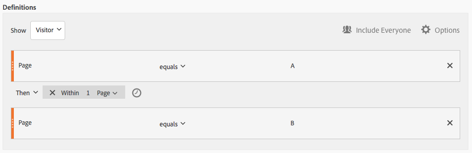
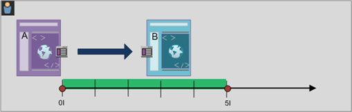

# Opeenvolgende segmenten maken

Opeenvolgende segmenten worden gemaakt met behulp van de operator THEN in plaats van AND of OR. VERVOLGENS impliceert dat één segmentcriteria voorkomt, gevolgd door een andere. Door gebrek, identificeert een opeenvolgend segment alle passende gegevens, die de filter &quot;omvatten iedereen&quot;tonen. Opeenvolgende segmenten kunnen verder worden gefilterd naar een subset van overeenkomende resultaten met de opties &quot;Alleen voor reeks&quot; en &quot;Alleen na reeks&quot;.

Bovendien, kunt u opeenvolgende segmenten tot een specifieke duur, granulariteit, en tellingen tussen controlepunten beperken gebruikend [na en binnen exploitanten](/help/components/c-segmentation/c-segmentation-workflow/seg-sequential-build.md).

## Inclusief iedereen {#section_75ADDD5D41F04800A09E592BB2940B35}

Wanneer u een segment maakt waarin Inclusief iedereen is ingesteld, identificeert het segment paden die overeenkomen met het opgegeven patroon als geheel. Dit is een voorbeeld van een standaardsequentiesegment dat op zoek is naar een hit (pagina A) gevolgd door een andere hit (pagina B) die dezelfde bezoeker heeft bezocht. Het segment is ingesteld op Inclusief iedereen.

| Indien resultaat... | Reeks |
|--- |--- |
| Overeenkomsten | A then BA (bij een ander bezoek) BA, vervolgens D en B |
| Komt niet overeen | B en A |

## Alleen voor reeks en Alleen na reeks {#section_736E255C8CFF43C2A2CAAA6D312ED574}

Met de opties **[!UICONTROL Only Before Sequence]** **[!UICONTROL Only After Sequence]** en filtert u het segment naar een subset van gegevens voor of na de opgegeven reeks.

* **Alleen voor reeks**: Bevat alle treffers vóór een reeks + de eerste treffer van de reeks zelf (zie voorbeeld 1, 3). Als een reeks meerdere keren in een pad wordt weergegeven, bevat &quot;Alleen voor reeks&quot; de eerste treffer van de laatste instantie van de reeks en alle vorige treffers (zie voorbeeld 2).
* **Alleen na reeks**: Bevat alle treffers na een reeks + de laatste treffer van de reeks zelf (zie voorbeeld 1, 3). Als een reeks meerdere keren in een pad wordt weergegeven, bevat &quot;Alleen na&quot; de laatste hit van de eerste instantie van de reeks en alle volgende treffers (zie voorbeeld 2).

Neem bijvoorbeeld de volgorde B -> D. De drie filters zouden klappen als volgt identificeren:

**Voorbeeld 1: B en D worden één keer weergegeven**

| Voorbeeld | A | B | C | D | E | F |
|---|---|---|---|---|---|---|
| Inclusief iedereen | A | B | C | D | E | F |
| Alleen voor reeks | A | B |  |  |  |  |
| Alleen na reeks |  |  |  | D | E | F |

**Voorbeeld 2: B en D worden meerdere keren weergegeven**

| Voorbeeld | A | B | C | D | B | C | D | E |
|---|---|---|---|---|---|---|---|---|
| Inclusief iedereen | A | B | C | D | B | C | D | E |
| Alleen voor reeks | A | B | C | D | B |  |  |  |
| Alleen na reeks |  |  |  | D | B | C | D | E |

Laten we dit concept ook omringen met de dimensie van de Diepte van het Actief.

**Voorbeeld 3: Hit Depth 3 then 5**

## Dimensiebeperkingen {#section_EAFD755F8E674F32BCE9B642F7F909DB}

In een &quot;binnen&quot;clausule, binnen tussen VEREN verklaringen, kunt u, bijvoorbeeld, &quot;binnen 1 onderzoek sleutelwoordinstantie&quot;toevoegen, &quot;binnen 1 eVar 47 instantie&quot;. Dit beperkt het segment tot binnen één instantie van een dimensie.

Door een component &#39;Binnen dimensie&#39; tussen regels in te stellen, kan een segment gegevens beperken tot reeksen waarvoor aan die component wordt voldaan. Zie het onderstaande voorbeeld, waarin de beperking is ingesteld op &quot;Binnen 1 pagina&quot;:

| Indien resultaat... | Reeks |
|--- |--- |
| Overeenkomsten | A then B |
| Komt niet overeen | A toen C toen B (omdat B zich niet binnen 1 pagina van A bevond) **Opmerking:**Als de afmetingsbeperking wordt geschrapt, &quot;A toen B&quot;en &quot;A toen C dan B&quot;allebei aanpast. |

## Eenvoudige weergavevolgorde van pagina&#39;s

Geef bezoekers op die een pagina hebben weergegeven en bekijk vervolgens een andere pagina. De gegevens op hit-level gegevens zullen deze opeenvolging ongeacht vorige, afgelopen, of tussentijdse bezoeken zittingen of de tijd of het aantal paginameningen filtreren die tussen voorkomen.

**Voorbeeld**: Bezoeker heeft pagina A bekeken en vervolgens pagina B tijdens hetzelfde of een ander bezoek bekeken.

**Gebruik hoofdletters**

Hieronder ziet u voorbeelden van hoe het segment kan worden gebruikt.

1. Bezoekers van een sportsite bekijken de landingspagina van het voetbal en bekijken de landingspagina van de basketbal dan in volgorde, maar niet noodzakelijkerwijs tijdens hetzelfde bezoek. Dit leidt tot een campagne om basketbalinhoud aan voetbalkijkers tijdens het voetbalseizoen te promoten.
1. De autoverkoper identificeert een verhouding tussen degenen die op de pagina van de klantenloyaliteit landen en dan naar de videopagina op elk ogenblik tijdens het bezoek of een ander bezoek gaan.

**Dit segment maken**

U negeert twee paginalijnen in een container op hoofdniveau en geeft de paginareeksen een reeks met behulp van de [!UICONTROL Visitor] [!UICONTROL THEN] operator.

## Bezoekersreeks bij bezoeken

Identificeer de bezoekers die uit een campagne vielen maar dan aan de opeenvolging van paginameningen in een andere zitting terugkwamen.

**Voorbeeld**: Bezoeker heeft pagina A bekeken tijdens een bezoek en vervolgens pagina B bekeken tijdens een ander bezoek.

**Gevallen gebruiken**

Hieronder volgen voorbeelden van de manier waarop dit type segment kan worden gebruikt:

* Bezoekers op de pagina Sport van een nieuwssite bekijken de pagina Sport in een andere sessie opnieuw.
* Een kledinghandelaar ziet een relatie tussen bezoekers die op een landingspagina in één zitting landen, en dan direct naar de checkout pagina in een andere zitting gaan.

**Dit segment maken**

In dit voorbeeld worden twee **[!UICONTROL Visit]** containers in de container op hoofdniveau genest en wordt het segment met de **[!UICONTROL Visitor]** [!UICONTROL THEN] operator gesorteerd.

## Volgorde op gemengde niveaus

Identificeer bezoekers die twee pagina&#39;s over een onbepaald aantal bezoeken bekijken, maar dan een derde pagina in een afzonderlijk bezoek bekijken.

**Voorbeeld**: Bezoekers bezoeken pagina A en vervolgens pagina B tijdens een of meer bezoeken, gevolgd door een bezoek aan pagina C tijdens een afzonderlijk bezoek.

**Gevallen gebruiken**

Hieronder volgen voorbeelden van de manier waarop dit type segment kan worden gebruikt:

* Bezoekers bezoeken eerst een nieuwssite en bekijken de sportpagina tijdens hetzelfde bezoek. Bij een ander bezoek bezoekt de bezoeker de weerpagina.
* De detailhandelaar bepaalt bezoekers die de Belangrijkste pagina ingaan en dan naar de Mijn pagina van de Rekening gaan. In een ander bezoek gaan ze naar de pagina Winkelwagentje bekijken.

**Dit segment maken**

1. Zet de afmetingen van twee pagina&#39;s neer vanuit de linkerdeelvensters in een container op hoofdniveau. [!UICONTROL Visitor]
1. Voeg de operator THEN ertussen toe.
1. Klik **[!UICONTROL Options]** > **[!UICONTROL Add container]** en voeg een [!UICONTROL Visit] container onder het [!UICONTROL Visitor] niveau toe en gerangschikt gebruikend de [!UICONTROL THEN] exploitant.

## Samengevoegde containers

Door meerdere [!UICONTROL Hit] containers in een [!UICONTROL Visitor] container toe te voegen, kunt u de juiste operatoren gebruiken tussen hetzelfde type containers en kunt u regels en afmetingen gebruiken, zoals Pagina en Bezoek nummer, om de paginaweergave te definiëren en een reeksdimensie binnen de [!UICONTROL Hit] container te verschaffen. Door logica toe te passen op het niveau Actief kunt u overeenkomsten op hetzelfde niveau van hits binnen de [!UICONTROL Visitor] container beperken en combineren om een verscheidenheid aan segmenttypen te maken.

**Voorbeeld**: Bezoekers bezochten pagina A na de eerste treffer in de reeks paginaweergaven (pagina D in het voorbeeld) en bezochten vervolgens pagina B of pagina C, ongeacht het aantal bezoeken.

**Gevallen gebruiken**

Hieronder volgen voorbeelden van de manier waarop dit type segment kan worden gebruikt:

* Geef bezoekers die naar de Main-landingspagina gaan tijdens een bezoek op, bekijk de pagina voor kleding voor heren tijdens een ander bezoek en bekijk vervolgens de landingspagina van Vrouw of Kinderen tijdens een ander bezoek.
* Een e-zine legt de bezoekers vast die in één bezoek naar de startpagina gaan, de pagina Sport in een ander bezoek en de pagina Advies in een ander bezoek.

**Dit segment maken**

1. Selecteer de [!UICONTROL Visitor] container als container op hoofdniveau.
1. Voeg containers-een afmeting op twee [!UICONTROL Hit]niveaus met een aangewezen numerieke afmeting toe die op het zelfde [!UICONTROL Hit] niveau door de [!UICONTROL AND] en [!UICONTROL OR] exploitant worden aangesloten.
1. Voeg binnen de [!UICONTROL Visit] container nog een [!UICONTROL Hit] container toe en nestel twee extra [!UICONTROL Hit] containers die met een [!UICONTROL OR] of [!UICONTROL AND] operator zijn verbonden.

   Deze geneste [!UICONTROL Hit] containers volgen met de [!UICONTROL THEN] operator.

## &quot;Nesten&quot; in opeenvolgende segmenten

Door controlepunten op zowel het [!UICONTROL Visit] als [!UICONTROL Hit] niveau te plaatsen, kunt u het segment beperken om aan vereisten binnen een specifiek bezoek evenals een specifieke klap te voldoen.

**Voorbeeld**: Bezoeker bezocht pagina A en bezocht vervolgens pagina B tijdens hetzelfde bezoek. Tijdens een nieuw bezoek ging de bezoeker naar pagina C.

**Dit segment maken**

1. Sleep onder een container op hoofdniveau in afmetingen van twee pagina&#39;s. [!UICONTROL Visit]
1. Selecteer beide regels meerdere keren, klik op **[!UICONTROL Options]** > **[!UICONTROL Add container from selection]** en wijzig deze in een [!UICONTROL Visit] container.
1. Verbind hen met een [!UICONTROL THEN] exploitant.
1. Maak een container Actief als een peer voor de [!UICONTROL Visit] container en sleep in een paginadimensie.
1. Verbind de geneste opeenvolging in de [!UICONTROL Visit] container met de [!UICONTROL Hit] container gebruikend een andere [!UICONTROL THEN] exploitant.

## hits uitsluiten

De regels van het segment omvatten alle gegevens tenzij u specifiek uitsluitt [!UICONTROL Visitor], [!UICONTROL Visit], of [!UICONTROL Hit] gegevens gebruikend de [!UICONTROL Exclude] regel. Hiermee kunt u algemene gegevens negeren en segmenten met meer focus maken. U kunt ook segmenten maken, met uitzondering van gevonden groepen, om de resterende gegevensset te identificeren, zoals het maken van een regel die succesvolle bezoekers die bestellingen hebben geplaatst bevat en vervolgens het uitsluiten van deze groepen om &quot;niet-kopers&quot; te identificeren. In de meeste gevallen is het echter beter om regels te maken die brede waarden uitsluiten in plaats van de [!UICONTROL Exclude] regel te gebruiken om specifieke include-waarden als doel in te stellen.

Bijvoorbeeld:

* **Pagina&#39;s** uitsluiten. Gebruik een segmentregel om een specifieke pagina (zoals *`Home Page`*) uit een rapport te verwijderen, een Hit-regel te maken waar de pagina gelijk is aan &quot;Startpagina&quot; en deze vervolgens uit te sluiten. Deze regel bevat automatisch alle waarden behalve de startpagina.
* **Verwijzende domeinen** uitsluiten. Gebruik een regel die alleen verwijzende domeinen van Google.com omvat en alle andere uitsluit.
* **Identificeer niet-kopers**. Identificeer wanneer de orden groter dan nul zijn en sluit dan uit [!UICONTROL Visitor].

De [!UICONTROL Exclude] operator kan worden gebruikt om te bepalen in welke volgorde specifieke bezoeken of treffers niet door de bezoeker worden uitgevoerd. [!UICONTROL Exclude Checkpoints] kan ook worden opgenomen in een [logische groep](/help/components/c-segmentation/c-segmentation-workflow/seg-sequential-build.md).

### Uitsluiten tussen controlepunten

Regelgeving afdwingen om bezoekers te segmenteren op plaatsen waar een controlepunt niet expliciet voorkomt tussen twee andere controlepunten.

**Voorbeeld**: Bezoekers die pagina A hebben bezocht en vervolgens pagina C hebben bezocht, maar pagina B niet hebben bezocht.

**Gevallen gebruiken**

Hieronder volgen voorbeelden van de manier waarop dit type segment kan worden gebruikt:

* Bezoekers naar een pagina Lifestyle en vervolgens naar de sectie Theater zonder naar de pagina Arts te gaan.
* Een auto-detailhandelaar ziet een relatie tussen hen die de belangrijkste landingspagina bezoeken en dan direct naar de campagne van de Geen Rente gaan zonder naar de pagina van het Voertuig te gaan.

**Dit segment maken**

Creeer een segment zoals u voor een eenvoudig, gemengd-vlakke, of genestelde opeenvolgend segment en dan plaats de [!UICONTROL EXCLUDE] exploitant voor het containerelement. Het onderstaande voorbeeld is een geaggregeerd segment waarbij de drie [!UICONTROL Hit] containers naar het canvas worden gesleept, de [!UICONTROL THEN] operator die is toegewezen om de containerlogica samen te voegen, en vervolgens de weergavecontainer voor de middelste pagina uit te sluiten om alleen bezoekers op te nemen die van pagina A naar pagina C zijn gegaan.

### Uitsluiten aan begin van reeks

Als het uitsluit controlepunt aan het begin van een opeenvolgend segment is, dan zorgt het ervoor dat een uitgesloten paginamening niet vóór de eerste niet-uitgesloten slag voorkwam.

**Voorbeeld**: Bezoeker heeft pagina A bezocht en niet pagina B.

**Gevallen gebruiken**

Hieronder ziet u voorbeelden van het gebruik van dit type segment:

* Bezoekers die pagina A hebben bezocht en pagina B niet hebben bezocht.
* Een restaurant wil geïsoleerde gebruikers zien die de hoofdlandingspagina vermijden en rechtstreeks naar de pagina Bestellen uit gaan.

**Dit segment maken**

Maak twee aparte Hit-containers in een bezoekercontainer op hoofdniveau. Stel vervolgens de [!UICONTROL EXCLUDE] operator in voor de eerste container.

### Uitsluiten aan einde van reeks

Als het uitsluit controlepunt aan het eind van een opeenvolging is, dan zorgt het ervoor dat het controlepunt niet tussen het laatste niet-uitgesloten controlepunt en het eind van de bezoekersopeenvolging gebeurde.

**Voorbeeld**: Bezoekers bezoeken pagina A en bezochten pagina B bij de huidige of volgende bezoeken niet.

**Gevallen gebruiken**

Hieronder volgen voorbeelden van de manier waarop dit type segment kan worden gebruikt:

* Bezoekers die pagina A hebben bezocht en pagina B niet hebben bezocht.
* Een restaurant wil geïsoleerde gebruikers zien die de hoofdlandingspagina vermijden en rechtstreeks naar de pagina Bestellen uit gaan.

**Dit segment maken**

Bouw een eenvoudig opeenvolgingssegment door twee [!UICONTROL Hit] containers aan het canvas te slepen en hen te verbinden gebruikend de [!UICONTROL THEN] exploitant. Wijs vervolgens de [!UICONTROL EXCLUDE] operator toe aan de tweede [!UICONTROL Hit] container in de reeks.

## Containers voor logische groepen

Logische Groepcontainers worden vereist om voorwaarden in één enkel opeenvolgend segmentcontrolepunt te groeperen. De container voor de speciale logische groep is alleen in sequentiële segmentatie beschikbaar, om ervoor te zorgen dat aan de voorwaarden wordt voldaan na elk voorafgaand controlepunt en vóór elk volgend controlepunt. Aan de voorwaarden binnen het controlepunt van de Logische Groep zelf kan in om het even welke orde worden voldaan. Niet-opeenvolgende containers (hit, visit, bezoeker) vereisen daarentegen niet dat aan de voorwaarden ervan wordt voldaan binnen de gehele reeks, wat leidt tot intuïtieve resultaten bij gebruik met een THEN-operator.
De [!UICONTROL Logic Group] container werd ontworpen om *verscheidene controlepunten als groep* te behandelen, *zonder het opdracht geven tot* onder de gegroepeerde controlepunten. Met andere woorden, we geven niet om de volgorde van de controlepunten binnen die groep. U kunt bijvoorbeeld geen [!UICONTROL Visitor] container in een [!UICONTROL Visitor] container nesten. Maar in plaats daarvan, kunt u een [!UICONTROL Logic Group] container binnen een [!UICONTROL Visitor] container met specifieke [!UICONTROL Visit]-vlakke en [!UICONTROL Hit]-vlakke controlepunten nesten.

>[!NOTE] A [!UICONTROL Logic Group] kan slechts in een opeenvolgend segment worden bepaald, betekenend dat de [!UICONTROL THEN] exploitant binnen de uitdrukking wordt gebruikt.

| Containerhiërarchie | Illustratie | Definitie |
|---|---|---|
| Standaard containerhiërarchie |  | Binnen de [!UICONTROL Visitor] container worden de containers [!UICONTROL Visit] en [!UICONTROL Hit] containers op volgorde genest om segmenten te extraheren op basis van hits, het aantal bezoeken en de bezoeker. |
| Logische containerhiërarchie |  | De standaardcontainerhiërarchie is ook buiten de [!UICONTROL Logic Group] container vereist. Maar binnen de [!UICONTROL Logic Group] container, vereisen de controlepunten geen gevestigde orde of hiërarchie-deze controlepunten eenvoudig door de bezoeker in om het even welke orde moeten worden vervuld. |

Logische groepen lijken ontmoedigend. Hier volgen enkele aanbevolen procedures voor het gebruik ervan:

**Logische groep of Handje/Bezoek container?**
Als u opeenvolgende controlepunten wilt groeperen, dan is uw &quot;container&quot;Logische Groep. Als deze opeenvolgende controlepunten echter moeten plaatsvinden binnen één druk- of bezoekbereik, is een &quot;hit&quot;- of &quot;visit&quot;-container vereist. (Natuurlijk heeft &#39;hit&#39; geen zin voor een groep opeenvolgende controlepunten, wanneer één hit niet meer dan één controlepunt mag crediteren).

**Zijn Logische Groepen het samenstellen van opeenvolgende segmenten vereenvoudigen?**
Ja, dat kunnen ze. Laten we aannemen dat u deze vraag probeert te beantwoorden: **Heeft een bezoeker pagina B, of pagina C, of pagina D na pagina A gezien?**

U kunt dit segment maken zonder een container van de Logische Groep, maar het is complex en moeizaam:
* `Visitor Container [Page A THEN Page B THEN Page C THEN Page D] or`
* `Visitor Container [Page A THEN Page B THEN Page D THEN Page C] or`
* `Visitor Container [Page A THEN Page C THEN Page B THEN Page D] or`
* `Visitor Container [Page A THEN Page C THEN Page D THEN Page B] or`
* `Visitor Container [Page A THEN Page D THEN Page B THEN Page C] or`
* `Visitor Container [Page A THEN Page D THEN Page C THEN Page B]`

Een container van de Groep van de Logica vereenvoudigt de bouw van dit segment, zoals hier getoond:

### Een segment voor de logische groep maken {#section_A5DDC96E72194668AA91BBD89E575D2E}

Net als andere containers kunnen [!UICONTROL Logic Group] containers op meerdere manieren binnen de container worden gebouwd [!UICONTROL Segment Builder]. U kunt [!UICONTROL Logic Group] containers het beste nesten:

1. Sleep afmetingen, gebeurtenissen of segmenten vanuit de linkerdeelvensters.
1. Wijzig de bovenste container in een [!UICONTROL Visitor] container.
1. Verander de [!UICONTROL AND] of [!UICONTROL OR] exploitant die door gebrek in de exploitant wordt opgenomen THEN.
1. Selecteer de [!UICONTROL Hit] containers (de afmeting, de gebeurtenis of het item) en klik **[!UICONTROL Options]** > **[!UICONTROL Add container from selection]**.
1. Klik op het containerpictogram en selecteer **[!UICONTROL Logic Group]**.  
1. U kunt de container nu instellen [!UICONTROL Hit] in de [!UICONTROL Logic Group] container, ongeacht de hiërarchie.

### Controlepunten voor logische groepen in willekeurige volgorde

Met de code [!UICONTROL Logic Group] kunt u voldoen aan voorwaarden binnen die groep die buiten de reeks vallen. Dit staat u toe om segmenten te bouwen waar een [!UICONTROL Visit] of [!UICONTROL Hit] container ongeacht de normale hiërarchie gebeurt.

**Voorbeeld**: Bezoekers die pagina A bezochten, bezochten vervolgens pagina B en pagina C in willekeurige volgorde.

**Dit segment maken**

Pagina B en C worden genest in een [!UICONTROL Logic Group] container in de buitenste [!UICONTROL Visitor] container. De [!UICONTROL Hit] container voor A wordt vervolgens gevolgd door de [!UICONTROL Logic Group] container met B en C die met de [!UICONTROL AND] bediener zijn geïdentificeerd. Omdat het in de [!UICONTROL Logic Group], wordt de opeenvolging niet bepaald en het raken van zowel pagina B als C in om het even welke orde maakt het argument waar.

**Een ander voorbeeld**: Bezoekers die pagina B of pagina C hebben bezocht en vervolgens pagina A hebben bezocht:

Het segment moet op lease-basis overeenkomen met een van de controlepunten van de logische groep (B of C). Aan logische groepsvoorwaarden kan ook worden voldaan bij hetzelfde resultaat of bij meerdere treffers. &#x200B;

### Logische groep eerst overeenkomst

Met de code [!UICONTROL Logic Group] kunt u voldoen aan voorwaarden binnen die groep die buiten de reeks vallen. In dit ongeordende eerste overeenkomende segment, worden de [!UICONTROL Logic Group] regels eerst geïdentificeerd als paginaweergave van pagina B of pagina C, daarna als de vereiste weergave van pagina A.

**Voorbeeld**: Bezoekers die pagina B of pagina C hebben bezocht, bezochten vervolgens pagina A.

**Dit segment maken**

De afmetingen voor pagina B en pagina C worden gegroepeerd in een [!UICONTROL Logic Group] container, waarbij de [!UICONTROL OR] operator is geselecteerd en vervolgens de [!UICONTROL Hit]container die een paginaweergave van pagina A als waarde aanduidt.

### Logische groep uitsluiten EN

Bouwt segmenten gebruikend [!UICONTROL Logic Group] waar de veelvoudige paginameningen worden bijeengevoegd om te bepalen welke pagina&#39;s noodzakelijk waren om te slaan terwijl andere pagina&#39;s specifiek werden gemist. ****

**Voorbeeld**: Bezoeker heeft pagina A bezocht en heeft vervolgens expliciet pagina B of C niet bezocht, maar pagina D gevonden.

**Dit segment maken**

Bouw dit segment door Afmetingen, Gebeurtenissen, en pre-gebouwde Segmenten van de linkerruiten te slepen. Zie [Een segment voor logische groepen maken](/help/components/c-segmentation/c-segmentation-workflow/seg-sequential-build.md).

Nadat u de waarden in de container hebt genest, klikt u op de [!UICONTROL Logic Group]knop in de **[!UICONTROL Exclude]** [!UICONTROL Logic Group] container.

### Logic Group exclude OR

Bouwt segmenten gebruikend [!UICONTROL Logic Group] waar de veelvoudige paginameningen worden bijeengevoegd om te bepalen welke pagina&#39;s noodzakelijk waren om te slaan terwijl andere pagina&#39;s specifiek werden gemist.

**Voorbeeld**: Bezoekers die pagina A hebben bezocht, maar die pagina B of pagina C niet vóór pagina A hebben bezocht.

**Dit segment maken**

De eerste B- en C-pagina&#39;s worden geïdentificeerd in een [!UICONTROL Logic Group] container die wordt uitgesloten en worden vervolgens gevolgd door een treffer van de bezoeker naar pagina A.

Bouw dit segment door Afmetingen, Gebeurtenissen, en pre-gebouwde Segmenten van de linkerruiten te slepen.

Nadat u de waarden in de container hebt genest, klikt u op de [!UICONTROL Logic Group]knop in de **[!UICONTROL Exclude]** [!UICONTROL Logic Group] container.

## Binnen-tijd en tijd-na segmenten bouwen

Gebruik de operatoren [!UICONTROL Within] [!UICONTROL After] en de operatoren die zijn ingebouwd in de koptekst van elke container om de tijd, gebeurtenissen en telling te definiëren.

U kunt de overeenkomst beperken tot een bepaalde tijdsduur door de [!UICONTROL Within] [!UICONTROL After] containers en containers te gebruiken en een granulariteit en aantal op te geven. De [!UICONTROL Within] operator wordt gebruikt om een maximale tijdlimiet op te geven voor de tijd tussen twee controlepunten. De [!UICONTROL After] operator wordt gebruikt om een minimumlimiet op te geven voor de tijd tussen twee controlepunten.

### Operatoren voor na en binnen {#section_CCAF5E44719447CFA7DF8DA4192DA6F8}

De duur wordt opgegeven met één hoofdletter die de granulariteit vertegenwoordigt, gevolgd door een getal dat het herhalingstemmer van de granulariteit vertegenwoordigt.

**[!UICONTROL Within]** bevat het eindpunt (kleiner dan of gelijk aan).

**[!UICONTROL After]** omvat niet het eindpunt (groter dan).

| Operatoren | Beschrijving |
|--- |--- |
| NA | De After operator wordt gebruikt om een minimumlimiet op te geven voor de tijd tussen twee controlepunten. Wanneer het plaatsen van na waarden, zal de tijdslimiet beginnen wanneer het segment wordt toegepast. Bijvoorbeeld, als de Na exploitant op een container wordt geplaatst om bezoekers te identificeren die pagina A maar niet terugkeren om pagina B tot na één dag te bezoeken, dan zal die dag beginnen wanneer de bezoeker pagina A verlaat.  De bezoeker kan alleen in het segment worden opgenomen als er minimaal 1440 minuten (één dag) overheen zijn gegaan nadat hij pagina A naar pagina B heeft verlaten. |
| BINNEN | De operator Binnen wordt gebruikt om een maximumlimiet op te geven voor de tijd tussen twee controlepunten. Als de operator Binnen bijvoorbeeld op een container is ingesteld om bezoekers te identificeren die pagina A bezoeken en vervolgens binnen één dag zijn teruggekeerd om pagina B te bezoeken, begint die dag wanneer de bezoeker pagina A verlaat. Om in het segment te worden opgenomen, heeft de bezoeker maximaal één dag voordat hij pagina B opent.   De bezoeker kan pas in het segment worden opgenomen nadat hij pagina A heeft verlaten om pagina B weer te geven binnen 1440 minuten (één dag). |
| NA/BINNEN | Wanneer u zowel de operatoren Na als Binnen gebruikt, is het belangrijk te begrijpen dat beide operatoren parallel beginnen en eindigen, niet opeenvolgend.   Als u bijvoorbeeld een segment maakt met de container ingesteld op: `After = 1 Week(s) and Within = 2 Week(s)` Dan wordt slechts tussen 1 en 2 weken voldaan aan de voorwaarden om bezoekers in het segment te identificeren. Beide voorwaarden worden afgedwongen vanaf het moment van de eerste paginaklok. |

### De operator Na gebruiken

* De tijd na laat u door jaar, maand, dag, uur, en minuut volgen om bezoeken aan te passen.
* Tijd na kan slechts op een [!UICONTROL Hit] container worden toegepast omdat het het enige niveau is waarvoor zulk fijn granulariteit wordt bepaald.

**Voorbeeld**: Bezoekers die pagina A bezochten, bezochten pagina B pas na 2 weken.****

**Het segment** maken: Dit segment wordt gecreeerd door een [!UICONTROL Visitor] container met twee [!UICONTROL Hit] containers toe te voegen. Vervolgens kunt u de [!UICONTROL THEN] operator instellen, de [!UICONTROL AFTER] operator naar beneden openen en het aantal weken instellen.

**Overeenkomsten**

Als op 1 juni 2019, om 00:01, een hit naar pagina A wordt weergegeven als &quot;Na 2 weken&quot;, komt een bericht op bladzijde B overeen als dit vóór 15 juni 2019 00:01 komt (14 dagen later).

| Druk op A | Hit B | Overeenkomend |
|--- |--- |--- |
| **Een** hit: 1 juni 2019 00:01 | **B** hit: 15 jun. 2019 00:01 | **Overeenkomsten:** Deze tijdbeperking komt overeen omdat deze na 1 juni 2019 (twee weken) is. |
| **Een** hit: 1 juni 2019 00:01 | **B** hit: 8 juni 2019 00:01 B hit: 15 juni 2019 00:01 | **Komt niet overeen:** De eerste treffer op pagina B komt niet overeen, omdat deze in strijd is met de vereiste beperking na twee weken. |

### De operator Within gebruiken

* [!UICONTROL Within] kunt u bijhouden op jaar, maand, dag, uur en minuut om bezoeken te zoeken.
* [!UICONTROL Within] alleen op een [!UICONTROL Hit] container kunnen worden toegepast omdat dit het enige niveau is waarvoor een dergelijke fijne korreligheid is gedefinieerd.

>[!IMPORTANT]
>
>In een &quot;binnen&quot;clausule, binnen tussen VEREN verklaringen, kunt u, bijvoorbeeld, &quot;binnen 1 onderzoek sleutelwoordinstantie&quot;toevoegen, &quot;binnen 1 eVar 47 instantie&quot;. Dit beperkt het segment tot binnen één instantie van een dimensie.

**Voorbeeld**: Bezoekers die pagina A bezochten, bezochten vervolgens pagina B binnen 5 minuten.

**Het segment** maken: Dit segment wordt gemaakt door een [!UICONTROL Visitor] container toe te voegen en vervolgens met twee [!UICONTROL Hit] containers te slepen. Vervolgens kunt u de [!UICONTROL THEN] operator instellen, de [!UICONTROL AFTER] operator naar beneden openen en het interval instellen: hits, paginaweergaven, bezoeken, minuten, uren, dagen, weken, maanden, kwartalen of jaren.

**Overeenkomsten**

De overeenkomsten moeten binnen de tijdslimiet voorkomen. Als een bezoeker pagina A raakt voor de expressie, wordt de volgende hit op pagina B weergegeven als deze plaatsvindt op of vóór 00:06 (vijf minuten later, inclusief dezelfde minuut). De uren binnen dezelfde minuut zullen ook aanpassen.

### De operatoren Within en After

Gebruik [!UICONTROL Within] en [!UICONTROL After] om een maximum en minimumeindpunt op beide einden van een segment te verstrekken.

**Voorbeeld**: Bezoekers die pagina A bezochten, bezochten pagina B na twee weken maar binnen één maand.

**Het segment** maken: Creeer het segment door twee [!UICONTROL Hit] containers binnen een [!UICONTROL Visitor] container te rangschikken. Stel vervolgens de [!UICONTROL After] operatoren en de [!UICONTROL Within] operatoren in.

**Overeenkomsten**

Bezoekers die pagina A op 1 juni 2019 bezoeken, keren terug na 15 juni 2019 om 00:01, maar *vóór* 1 juli 2019 worden in het segment opgenomen. Vergelijk met [Tijd tussen uitsluitingen](/help/components/c-segmentation/c-segmentation-workflow/seg-sequential-build.md).

De operatoren [!UICONTROL After] en [!UICONTROL Within] operatoren kunnen samen worden gebruikt om een opeenvolgend segment te definiëren.

Dit voorbeeld toont een tweede bezoek aan pagina B na twee weken maar binnen een maand.
