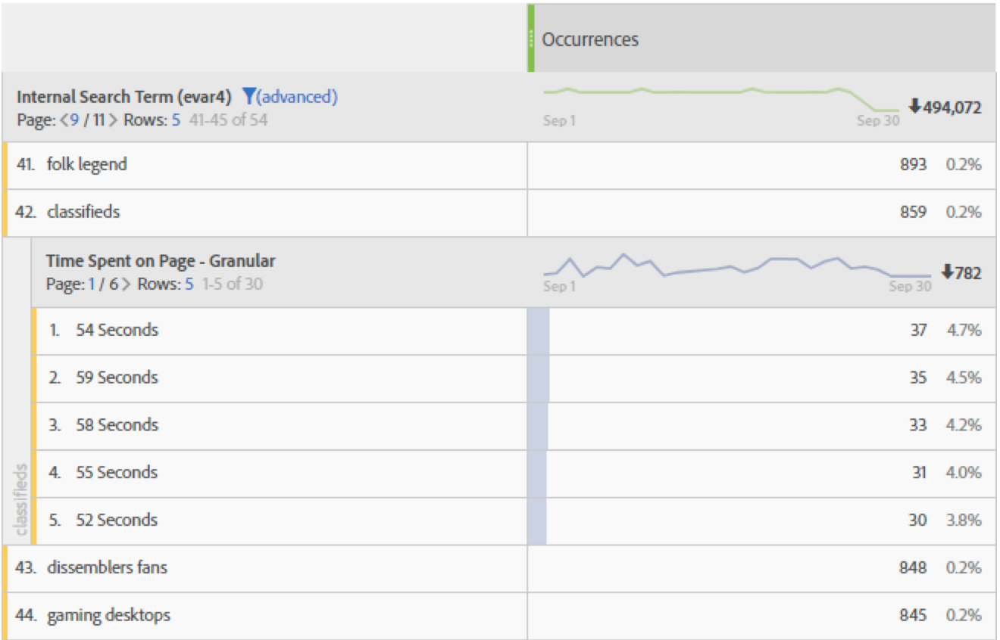

# [!UICONTROL Time spent]

In Adobe Analytics-producten worden verschillende [!UICONTROL 'time spent'] maatstaven en afmetingen aangeboden.

## [!UICONTROL 'Time spent'] cijfers

| Metrisch | Definitie | Beschikbaar in |
|---|---|---|
| [!UICONTROL Total seconds spent] | Vertegenwoordigt de totale hoeveelheid tijd bezoekers met een specifiek afmetingspunt in wisselwerking staan. Bevat de instantie van een waarde en persistentie voor alle volgende treffers. In het geval van props wordt de doorgebrachte tijd ook geteld bij volgende koppelingsgebeurtenissen. | De Werkruimte van de analyse, Rapporten &amp; Analytics, de Bouwer van het Rapport (genoemd &quot;totale bestede tijd&quot;), het Pakhuis van Gegevens, Ad hoc Analyse |
| [!UICONTROL Time spent per visit] (Seconden) | *Totaal aantal gebruikte seconden / (bezoek-grenzen)* Geeft de gemiddelde hoeveelheid tijd aan dat bezoekers interageren met een specifieke dimensie-item tijdens elk bezoek. | De Werkruimte van de analyse, Rapporten &amp; Analyse, Ad hoc Analyse |
| [!UICONTROL Time spent per visitor] (Seconden) | *Totaal aantal gebruikte seconden/unieke * bezoekerGeeft de gemiddelde hoeveelheid tijd aan dat bezoekers interageren met een specifiek dimensie-item over het leven van de bezoeker (duur van hun cookie). | De Werkruimte van de analyse, Rapporten &amp; Analyse, Ad hoc Analyse |
| [!UICONTROL Average time spent on site] (Seconden) | Vertegenwoordigt de totale hoeveelheid tijd bezoekers met een specifiek afmetingspunt, per opeenvolging met een afmetingspunt in wisselwerking staan. Het is niet alleen beperkt tot &quot;site&quot;-gemiddelden, zoals de naam suggereert. Zie de sectie &#39;Hoe tijd besteed wordt&#39; voor meer informatie over reeksen. **Opmerking **: Deze maatstaf verschilt zeer waarschijnlijk van &#39;Tijd per bezoek&#39; op het niveau van dimensiepunten als gevolg van de verschillen in de noemer in de berekening. | De Werkruimte van de analyse, Rapporten &amp; Analyse (getoond in notulen), de Bouwer van het Rapport (getoond in notulen), Ad hoc Analyse |
| [!UICONTROL Average time spent on page] | Vervangen metrisch.  In plaats daarvan raden we u aan &quot;Gemiddelde tijd die ter plekke wordt doorgebracht&quot; te gebruiken als er een gemiddelde tijd voor een dimensie-item nodig is. | De Bouwer van het rapport (wanneer een afmeting in het verzoek is) |
| [!UICONTROL Total session length], ook bekend als [!UICONTROL Previous session length] | Alleen mobiele App SDK.  De volgende keer dat de app wordt gestart, is bepaald voor de vorige sessie. Deze maateenheid wordt berekend in seconden en telt niet wanneer de toepassing op de achtergrond wordt uitgevoerd, alleen wanneer deze wordt gebruikt. Dit is metrisch op sessieniveau. Voorbeeld: We installeren app ABC, starten deze en gebruiken deze gedurende 2 minuten en sluiten de app vervolgens. Over deze sessietijd worden geen gegevens verzonden. De volgende keer dat we de app starten, [!UICONTROL Previous Session Length] wordt de waarde 120 verzonden. | De Werkruimte van de analyse, Rapporten &amp; Analyse, de Bouwer van het Rapport, Mobiele Diensten UI |
| [!UICONTROL Average session length] (mobiel) | *Totale sessieduur / (Starten - Eerste starten)Alleen * mobiele app-SDK. Dit is metrisch op sessieniveau. | RapportBuilder, gebruikersinterface voor mobiele services, ad-hocanalyse |

## Afmetingen van &#39;bestede tijd&#39;

| Dimensie | Definitie | Beschikbaar in |
|---|---|---|
| [!UICONTROL Time spent per visit - granular] | De totale tijd die tijdens het bezoek is doorgebracht, is ingekort tot de dichtstbijzijnde seconde en is van toepassing op elke hit die deel uitmaakte van het bezoek. Dit is een bezoek-niveau dimensie. | Analysewerkruimte, ad-hocanalyse |
| [!UICONTROL Time spent per visit - bucketed] | De korrelige afmeting wordt in 9 verschillende bereiken opgesloten. Dit is een bezoek-niveau dimensie. Bereiken zijn:<ul><li>Minder dan 1 minuut</li><li>1-5 minuten</li><li>5-10 minuten</li><li>10-30 minuten</li><li>30-60 minuten</li><li>1-2 uur</li><li>2-5 uur</li><li>5-10 uur</li><li>10-15 uur</li></ul>**Opmerking**: Er kunnen geen emmers meer zijn, omdat een bezoek na twaalf uur activiteit verloopt. | De Werkruimte van de analyse, Rapporten &amp; Analyse, de Bouwer van het Rapport, Ad hoc Analyse |
| [!UICONTROL Time spent on page - granular] | De totale tijd die aan elke treffer wordt doorgebracht, die aan de dichtstbijzijnde seconde wordt beknot. Dit is een dimensie op raakniveau en bevat zowel paginaweergaven als koppelingsgebeurtenissen. Ondanks zijn naam is het niet beperkt tot de &quot;pagina&quot;dimensie. | Analysewerkruimte, ad-hocanalyse |
| [!UICONTROL Time spent on page - bucketed] | de korreldimensie wordt in tien verschillende bereiken opgesloten; nochtans, telt de gekloonde afmeting slechts paginameningen (en sluit verbindingsgebeurtenissen uit). Dit is een raakvlak. Bereiken zijn:<ul><li>minder dan 15 seconden</li><li>15 tot 29 seconden</li><li>30 tot 59 seconden</li><li>1 tot 3 minuten</li><li>3 tot 5 minuten</li><li>5 tot 10 minuten</li><li>10 tot 15 minuten</li><li>15 tot 20 minuten</li><li>20 tot 30 minuten</li><li>meer dan 30 minuten</li></ul> | De Werkruimte van de analyse, Rapporten &amp; Analyse, Ad hoc Analyse |

## Hoe &#39;Tijd besteed&#39; wordt berekend

Adobe Analytics gebruikt expliciete waarden (inclusief koppelingsgebeurtenissen en videoweergaven) om te berekenen [!UICONTROL Time Spent].

>[!NOTE]
>
>Zonder verbindingsgebeurtenissen zoals [!UICONTROL Video Views] of [!UICONTROL Exit Links], kan de tijd die aan de laatste slag van een bezoek wordt doorgebracht niet gekend zijn. Om soortgelijke redenen heeft [!UICONTROL Bounce Visits] (d.w.z. bezoeken met één enkele hit) ook geen &quot;tijd besteed&quot; aan de reis.

De **teller** in alle tijd bestede berekeningen is totale bestede seconden.

De **noemer** is niet beschikbaar als een aparte metrische waarde in Adobe Analytics. Voor meetgegevens op raakniveau &#39;tijd besteed&#39; is de noemer reeksen. Een reeks is een opeenvolgende reeks resultaten waarbij een bepaalde variabele dezelfde waarde bevat (door deze in te stellen, naar voren te spreiden of voort te zetten). &#39;Spread forward&#39; verwijst naar de persistentie tussen paginaweergaven (d.w.z. over volgende koppelingsgebeurtenissen), voor het berekenen van de doorgebrachte tijd.

* In het geval van bijvoorbeeld [!UICONTROL Page Name] of andere dimensies op raakniveau wordt de noemer in wezen [!UICONTROL 'Instances'] of [!UICONTROL 'Page Views'], maar met herladingen en ongeplaatste waarden (bijvoorbeeld koppelingsgebeurtenissen) geteld als één enkele interactie (een opeenvolging).

* Bounce- en exit-hits worden ook uit de noemer verwijderd omdat de tijd die is besteed niet bekend is.

## Veelgestelde vragen

**V1: Kunnen alle metriek van &quot;tijd besteed&quot;op om het even welke dimensie worden toegepast?**

A: De metriek &#39;bestede tijd&#39; die op om het even welke dimensie kan worden toegepast zijn:

* [!UICONTROL Total seconds spent]

* [!UICONTROL Time spent per visit] (Seconden)

* [!UICONTROL Time spent per visitor] (Seconden)

* [!UICONTROL Average time spent on site] (Seconden)

**V2: Welke tijd bestede dimensie wordt het best gebruikt in uitsplitsingen met andere dimensies?**

A: De [!UICONTROL Time Spent on Page – granular] dimensie is een dimensie op raakniveau. Als je dit opsplitst naar een andere dimensie, zal je de seconden vertellen dat een hit bleef waar ook de afbraakdimensie aanwezig was.
In het onderstaande voorbeeld is de zoekterm &#39;classificfieds&#39; gekoppeld aan raaktijden van 54 seconden, 59 seconden, enz., wat er wellicht op duidt dat bezoekers tijd doorbrengen bij het lezen van inhoud die voor die termijn is geretourneerd.

**3e kwartaal: Welke metrisch is aangewezen tegen de afmeting van[!UICONTROL Time Spent on Page – granular]?**

A: Elke metrische waarde. De dimensie geeft de tijd weer die wordt besteed aan de exacte hit waar de gebeurtenis heeft plaatsgevonden. Hogere tijd betekent dat een bezoeker langer op een pagina (hit) is gebleven waar de gebeurtenis heeft plaatsgevonden.

**V4: Hoe verschilt[!UICONTROL Average Time Spent on Site]dit van[!UICONTROL Time Spent per Visit]?**

A: Het verschil is de noemer in metrisch:

* [!UICONTROL Average time spent on site] gebruikt de opeenvolgingen die een afmetingspunt omvatten.

* [!UICONTROL Time spent per visit] gebruikt het aantal bezoeken

Dit heeft tot gevolg dat deze meetgegevens bij een bezoek vergelijkbare resultaten opleveren, maar dat ze bij een treffer anders zijn.

## Voorbeelden van [!UICONTROL Time Spent] berekeningen

Veronderstel de volgende reeks servervraag voor één enkele bezoeker binnen één enkel bezoek is:

| Naar hit# | 1 | 2 | 3 | 4 | 5 | 6 | 7 |
|---|---|---|---|---|---|---|---|
| **Bezoek verstreken tijd (in sec)** | 0 | 30 | 80 | 180 | 190 | 230 | 290 |
| **Seconden besteed** | 30 | 50 | 100 | 10 | 40 | 60 | - |
| **Type hit** | Pagina | Koppeling | Pagina | Pagina | Pagina | Pagina | Pagina |
| **Paginanaam** | Home | - | Product | Home | Home (opnieuw laden) | Kar | Bevestiging van bestelling |
|  |  |  |  |  |  |  |  |
| **prop1** | A (set) | A (spread forward) | niet ingesteld | B (set) | B (set) | A(set) | C (set) |
| **prop1 seconden doorgebracht** | 30 | 50 | - | 10 | 40 | 60 | - |
|  |  |  |  |  |  |  |  |
| **eVar1** | Rood (set) | Rood (blijft bestaan) | (verlopen) | Blauw (set) | Blauw (set) | Blauw (blijvend) | Rood (set) |
| **eVar1 seconden doorgebracht** | 30 | 50 | - | 10 | 40 | 60 | - |

Op basis van de bovenstaande tabel worden de gebruikte tijdwaarden als volgt berekend:

| prop1 | Totaal aantal bestede seconden | Tijd besteed per bezoek | Tijd besteed per bezoeker | Aantal reeksen | Gemiddelde tijd besteed aan site |
|---|---|---|---|---|---|
| A | 30+50+60=140 | 140/1=140 | 140/1=140 | 2 | 140/2=70 |
| B | 10+40=50 | 50/1=50 | 50/1=50 | 1 | 50/1=50 |
| C | 0 | 0 | 0 | 0 | 0 |
| Onbekende tijd | 100 | - | - | - | - |

| eVar1 | Totaal aantal bestede seconden | Tijd besteed per bezoek | Tijd besteed per bezoeker | Aantal reeksen | Gemiddelde tijd besteed aan site |
|---|---|---|---|---|---|
| Rood | 30+50=80 | 80/1=80 | 80/1=80 | 1 | 80/1=80 |
| Blauw | 10+40+60=110 | 110/1=110 | 110/1=110 | 1 | 110/1=110 |
| Onbekende tijd | 100 | - | - | - | - |

Tijd besteed per bezoek (korrelig): 290Tijd besteed aan pagina (korrelig): 10, 30, 40, 50, 60, 100

Een aantal aanvullende opmerkingen ter ondersteuning van het voorbeeld:

* Alle gebruikte berekeningen zijn gebaseerd op de verstreken tijd van het bezoek, die bij de eerste treffer van het bezoek bij nul begint.

* &quot;Seconden besteed&quot; is het verschil tussen de tijdstempel van de huidige hit en de tijdstempel van de volgende hit. Als gevolg daarvan heeft de laatste treffer van het bezoek (en stormen) geen tijd doorgebracht.

* Een &quot;reeks&quot; is een opeenvolgende reeks resultaten waarbij een bepaalde variabele dezelfde waarde bevat (door deze in te stellen, door:sturen of blijvend). Voorbeeld1 &quot;A&quot; heeft bijvoorbeeld twee reeksen: hits 1 &amp; 2 en druk op 6. Waarden bij de laatste treffer van het bezoek beginnen geen nieuwe reeks omdat de laatste treffer geen tijd heeft doorgebracht. De gemiddelde tijd die aan plaats wordt doorgebracht gebruikt opeenvolgingen in de noemer.

   * Alleen ten behoeve van de doorgebrachte tijd worden de punten &#39;doorgestuurd&#39;, van paginakoppen tot volgende treffers voor koppelingen, zoals hierboven voor pop1 op hit 2 wordt getoond. Hierdoor kan de waarde die is ingesteld voor prop1 bij hit 1 (&quot;A&quot;), de tijd verzamelen die is besteed aan hit 2.

   * Vars verzamelen de tijd die wordt besteed aan elke hit waarbij de eVar is ingesteld of aanhoudt. De persistentie van eVar wordt bepaald door de eVar montages in Analytics > Admin.

