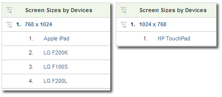

# Mobiel

Hiermee geeft u informatie weer over de toegang van websites vanaf een mobiel apparaat. Mobiele rapporten verbeteren de identificatie van bezoekers door gegevens te verzamelen over mobiele apparaten die worden gebruikt om uw site weer te geven. In mobiele rapporten kunnen de fabrikant en de mogelijkheden van een apparaat worden geïdentificeerd, zoals schermformaten, video, audio, ondersteuning voor cookies en andere meetgegevens. Mobiele rapporten zijn beschikbaar voor alle rapportsuites.

## Mobiel {#topic_D306EA4558194488AC47A45B9C570150}

Hiermee geeft u informatie weer over de toegang van websites vanaf een mobiel apparaat. Mobiele rapporten verbeteren de identificatie van bezoekers door gegevens te verzamelen over mobiele apparaten die worden gebruikt om uw site weer te geven. In mobiele rapporten kunnen de fabrikant en de mogelijkheden van een apparaat worden geïdentificeerd, zoals schermformaten, video, audio, ondersteuning voor cookies en andere meetgegevens. Mobiele rapporten zijn beschikbaar voor alle rapportsuites.

>[!NOTE] In Mobiele rapporten wordt alleen mobiel webverkeer weergegeven. Gegevens over mobiele apps die zijn verzameld met de native iOS-, Android- en andere SDK&#39;s, worden weergegeven in de rapporten voor mobiele apps en worden alleen weergegeven als deze zijn ingeschakeld in de beheerprogramma&#39;s.

De volgende mobiele rapporten zijn beschikbaar:

<table id="table_900BB8F2F3A746B6B97DC629B39910DA"> 
 <thead> 
  <tr> 
   <th colname="col1" class="entry"> Rapport </th> 
   <th colname="col2" class="entry"> Beschrijving </th> 
  </tr> 
 </thead>
 <tbody> 
  <tr> 
   <td colname="col1"> 
Apparaten 
 </td> 
   <td colname="col2"> 
Hier wordt het aantal bezoekers weergegeven dat uw site heeft geopend met mobiele apparaten, zoals apparaten waarop iOS of Android wordt uitgevoerd. Dit verslag kan u helpen het effect van mobiele initiatieven te begrijpen zodat u dienovereenkomstig kunt plannen. U kunt dit rapport gebruiken aan: 
 
 
     <ul id="ul_8CC40461C2944A63AED561E384275D24"> 
      <li id="li_4667815ED7384DE9824FB47F02040374"> 
Ontwikkelstrategieën voor mobiele gebruikers 
 </li> 
      <li id="li_12C1F430E5464FB4AC29C2D970165935"> 
De voorkeuren van uw publiek identificeren 
 </li> 
      <li id="li_BFECB3B1F5A345BA82FC22BF99E8E418"> 
De opkomst van draadloze en mobiele gebruikers volgen 
 </li> 
     </ul> 
 </td> 
  </tr> 
  <tr> 
   <td colname="col1"> Fabrikant </td> 
   <td colname="col2"> Groepeert de fabrikant van mobiele apparaten de resultaten van mobiele apparaten op uw site. In het rapport worden het type fabrikant, het aantal weergaven voor elke fabrikant en de overeenkomstige percentages weergegeven. </td> 
  </tr> 
  <tr> 
   <td colname="col1"> Schermgrootte </td> 
   <td colname="col2"> 
 Groepeert mobiele apparaten met de schermgrootte van het apparaat tot uw site. Het rapport toont elke schermgrootte, het aantal bezoekers van uw site die elke schermgrootte hebben gebruikt en elke schermgrootte als percentage van de totale weergaven. Het rapport Schermgrootte toont zowel de hoogte als de breedte van de schermgrootte in vergelijking met het rapport Schermhoogte en Schermbreedte. 
 
Het rapport Grootte mobiel scherm is momenteel statisch per apparaat. Ongeacht de schermoriëntatie heeft elk apparaat een vaste schermresolutie in het rapport. U kunt dit zien door de Schermgrootte op Mobiel apparaat in te delen. 
 </td> 
  </tr> 
  <tr> 
   <td colname="col1"> Schermhoogte </td> 
   <td colname="col2"> 
 Hiermee geeft u de schermhoogte voor verschillende mobiele apparaten weer en het aantal weergaven voor elke schermhoogte. U kunt ook het rapport  Schermgrootte weergeven om zowel de schermhoogte als de breedte weer te geven. 
 </td> 
  </tr> 
  <tr> 
   <td colname="col1"> Schermbreedte </td> 
   <td colname="col2"> 
 Geeft de schermbreedte voor verschillende mobiele apparaten weer en het aantal weergaven voor elke schermbreedte. U kunt ook het rapport  Schermgrootte weergeven om zowel de schermhoogte als de breedte weer te geven. 
 </td> 
  </tr> 
  <tr> 
   <td colname="col1"> Cookie-ondersteuning </td> 
   <td colname="col2"> 
Hiermee groepeert u bereiken op mobiele apparaten door of ze cookies ondersteunen of niet. Bezoekers zijn verdeeld in groepen van ondersteuningscookies en groepen die dat niet doen. Het type mobiel apparaat wordt geïdentificeerd in de userAgent-tekenreeks. Adobe houdt een lijst bij van mobiele apparaten waarvan bekend is dat ze cookies ondersteunen. Als het mobiele apparaat dat wordt vermeld in de userAgent-tekenreeks ook wordt vermeld in de lijst met mobiele apparaten van Adobe, wordt het  ondersteunde regelitem in het rapport  Cookie Support verhoogd. Anders, wordt het  Niet Gesteunde lijnpunt in het rapport verhoogd. 
 </td> 
  </tr> 
  <tr> 
   <td colname="col1"> Ondersteuning van afbeeldingen </td> 
   <td colname="col2"> 
 Hiermee groepeert u mobiele apparaten op basis van de typen afbeeldingen die ze ondersteunen. 
 
Als bijvoorbeeld een bezoekerstelefoon die  .jpeg -afbeeldingen ondersteunt toegang heeft tot een site, wordt het rapport  Afbeeldingsondersteuning met ten minste één verhoogd. Als de telefoon meer dan één beeldformaat steunt, dan zou een bezoek aan een plaats in veelvoudige verhogingen voor dat bezoek kunnen resulteren. Met andere woorden, als uw telefoon  .jpeg,  .png, en.gif  formaten steunt, dan wordt elk van die groepen in het rapport verhoogd. Als zodanig kan de som van de groepen groter zijn dan het totaal dat onder aan het verslag staat. 
 </td> 
  </tr> 
  <tr> 
   <td colname="col1"> Kleurdiepte </td> 
   <td colname="col2"> 
 Hiermee groepeert u bereiken op mobiele apparaten op basis van het aantal ondersteunde kleuren. Het rapport geeft het totale aantal bezoekers van uw site weer die een mobiel apparaat hebben gebruikt en deelt deze in groepen op basis van het aantal kleuren dat op hun mobiele apparaten is geconfigureerd. 
 
Als de mobiele telefoon van uw bezoeker bijvoorbeeld 24 kleuren ondersteunt, wordt het regelitem dat overeenkomt met 24 kleuren, in het rapport verhoogd. 
 </td> 
  </tr> 
  <tr> 
   <td colname="col1"> Audioondersteuning </td> 
   <td colname="col2"> 
 Hiermee groepeert u mobiele apparaten op basis van de typen audio-indelingen die ze ondersteunen. 
 
Als de telefoon van een bezoeker bijvoorbeeld de  .mp3 -indeling ondersteunt, wordt het rapport Audioondersteuning met ten minste één verhoogd. Als de telefoon meer dan één beeldformaat steunt, zou een bezoek aan een plaats in verhogingen voor elk gesteund audiotype kunnen resulteren. Met andere woorden, als een telefoon  .mp3,  .aac, en .amr  formaten steunt, dan wordt elk van die groepen in het rapport verhoogd. Als zodanig kan de som van de groepen groter zijn dan het totaal dat onder aan het verslag staat. 
 </td> 
  </tr> 
  <tr> 
   <td colname="col1"> Video-ondersteuning </td> 
   <td colname="col2"> 
 Hiermee groepeert u mobiele apparaten op basis van de typen video-indelingen die ze ondersteunen. 
 
Als het mobiele apparaat van een bezoeker bijvoorbeeld  .mp4ondersteunt, wordt het rapport Video Support met ten minste één verhoogd wanneer het uw site opent. Als de telefoon veelvoudige beeldformaten (zoals  .mp4 en  .wmv) steunt, wordt elk van die groepen in het rapport verhoogd. Daarom zou de som van de groepen groter kunnen zijn dan het totaal dat onder aan het rapport wordt getoond. 
 </td> 
  </tr> 
  <tr> 
   <td colname="col1"> DRM </td> 
   <td colname="col2"> 
 Hiermee groepeert u mobiele apparaten op basis van het type Digital Rights Management (DRM) dat ze ondersteunen. De groepen DRM omvatten Voorwaartse Slot  ,Gecombineerde Levering  ,Afzonderlijke Levering  , en Onbekend. 
 </td> 
  </tr> 
  <tr> 
   <td colname="col1"> Netto protocollen </td> 
   <td colname="col2"> 
 Groepeert mobiele apparaten die op de netwerkprotocollen (GPRS, CSD, EDGE, HSCSD, etc.) worden gebaseerd die zij steunen. Het rapport omvat ook een Onbekende groep voor onbekende netwerkprotocollen. 
 
Wanneer een bezoeker een mobiel apparaat gebruikt om toegang te krijgen tot uw site, wordt het rapport Netto protocollen met ten minste één verhoogd. Als de telefoon veelvoudige netwerkprotocollen dan elk van die groepen in de rapporttoename steunt. Daarom zou de som van de groepen groter kunnen zijn dan het totaal dat onder aan het rapport wordt getoond. 
 </td> 
  </tr> 
  <tr> 
   <td colname="col1"> Besturingssysteem (afgekeurd) </td> 
   <td colname="col2"> 
 Hiermee groepeert u mobiele apparaten op basis van het mobiele besturingssysteem dat op het apparaat wordt uitgevoerd. Mobiele besturingssystemen zijn onder andere Windows, RIM, iOS, Symbian enzovoort. Het rapport bevat ook een onbekende groep voor niet-geïdentificeerde mobiele besturingssystemen. 
 
Opmerking: Dit rapport is afgekeurd toen het rapport Technologie &gt; <a href="/help/components/c-variables/dimensionslist/reports-operating-system.md"  > Besturingssystemen</a> werd bijgewerkt en alle besturingssystemen, inclusief mobiele systemen, hierin werden opgenomen. U kunt een segment maken waarin "mobiel apparaat" bestaat en dit toepassen op het rapport Technologie &gt; Besturingssystemen om alleen mobiele besturingssystemen weer te geven. 
 </td> 
  </tr> 
  <tr> 
   <td colname="col1"> Java-versie </td> 
   <td colname="col2"> 
 Groepeert mobiele apparaten op basis van de Java-versie die ze ondersteunen. In het Java-versierapport wordt de Java-versie geïdentificeerd door het Java Specification Request (JSR) dat door het apparaat wordt ondersteund. Het rapport bevat ook een onbekende groep voor niet-geïdentificeerde mobiele besturingssystemen. 
 
Meer informatie over een bepaalde JSR vindt u op de website <a href="https://jcp.org/en/jsr/overview"  > Java Community Process</a> . 
 </td> 
  </tr> 
  <tr> 
   <td colname="col1"> URL-lengte bladwijzer </td> 
   <td colname="col2"> 
 Hiermee groepeert u mobiele apparaten op basis van de maximale ondersteunde lengte, in tekens, van een URL van een bladwijzer. 
 </td> 
  </tr> 
  <tr> 
   <td colname="col1"> Lengte URL-mail </td> 
   <td colname="col2"> 
 Hiermee groepeert u mobiele apparaten op basis van de maximale ondersteunde lengte, in tekens, van een e-mailURL. 
 </td> 
  </tr> 
  <tr> 
   <td colname="col1"> URL-lengte browser </td> 
   <td colname="col2"> 
 Hiermee groepeert u mobiele apparaten op basis van de maximale ondersteunde lengte, in tekens, van de URL van een webbrowser. 
 </td> 
  </tr> 
  <tr> 
   <td colname="col1"> Doorgeleiding apparaatnummer (AAN/UIT) </td> 
   <td colname="col2"> 
 Hiermee groepeert u mobiele apparaten op basis van de vraag of de verzending van apparaatnummers wordt ondersteund. Het rapport bevat ook een onbekende groep voor apparaten waarvoor de ondersteuning voor verzending van apparaatnummers niet kan worden bepaald. 
 </td> 
  </tr> 
  <tr> 
   <td colname="col1"> PTT </td> 
   <td colname="col2"> 
 Hiermee groepeert u mobiele apparaten op basis van het feit of het apparaat Push To Talk (PTT) ondersteunt. Het rapport bevat ook een  Onbekende groep voor apparaten waarvoor geen ondersteuning voor PTT kan worden vastgesteld. 
 </td> 
  </tr> 
  <tr> 
   <td colname="col1"> Ondersteuning voor Decoration Mail </td> 
   <td colname="col2"> 
 Hiermee groepeert u mobiele apparaten op basis van het feit of het apparaat DecoMail ondersteunt. Hiermee kan een gebruiker hun e-mail versieren met afbeeldingen en animaties. Het rapport bevat ook een  Onbekende groep voor apparaten waarvoor de ondersteuning voor Decoration Mail niet kan worden bepaald. 
 </td> 
  </tr> 
  <tr> 
   <td colname="col1"> Informatiediensten </td> 
   <td colname="col2"> 
 Groepeert mobiele apparaten op basis van de nieuwsservices (Kanaal I/B, EZ News Flash, W+INFO enzovoort.) zij steunen dat . Wanneer een bezoeker een mobiel apparaat met ondersteuning voor nieuwsservices gebruikt om toegang te krijgen tot uw site, wordt het rapport  Information Services met ten minste één verhoogd. Als de telefoon veelvoudige nieuwsdiensten steunt, elk van die groepen in het rapport stijgt. Daarom zou de som van de groepen groter kunnen zijn dan het totaal dat onder aan het rapport wordt getoond. 
 </td> 
  </tr> 
 </tbody> 
</table>

