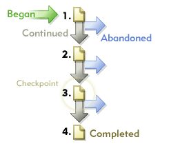

# Paden

Hiermee geeft u informatie weer over de volgorde waarin pagina&#39;s van uw website worden geopend. U kunt informatie verzamelen over waar een bezoeker voor en na elke bezochte pagina op uw site naartoe gaat.

## Paden {#topic_39F11BCBEDC3495EA1300149FC6D4F14}

Hiermee geeft u informatie weer over de volgorde waarin pagina&#39;s van uw website worden geopend. U kunt informatie verzamelen over waar een bezoeker voor en na elke bezochte pagina op uw site naartoe gaat.

Paderapporten bevatten standaard diepgaande en optionele geavanceerde analyserapporten die de klikstroom van weergegeven pagina&#39;s weergeven. U kunt volledige paden, langste paden en populairste paden onthullen. de paginastroom, fallout en dropout grafisch verklaren; nieuwe en veranderende patronen in de loop der tijd te tonen; en de in- en uitgangen analyseren.

**[!UICONTROL Next Page Flow]** of **[!UICONTROL Next Site Flow]**: Hiermee geeft u een vertakkende afbeelding op twee niveaus weer van een geselecteerde pagina (of sectie, afdeling, enzovoort) die uw bezoekers bekijken nadat ze zich van de geselecteerde pagina hebben verplaatst. Gebruik dit rapport om de stappen te analyseren en te identificeren die uw bezoekers het vaakst na het bekijken van een geselecteerde pagina nemen. U kunt:

* Begrijp welke stappen het vaakst na het bekijken van een geselecteerde pagina worden genomen.
* Optimaliseer uw ontwerp van de plaatsweg om uw verkeer aan een gewenste doelpagina te trechter.
* Bepaal waar bezoekers naartoe gaan in plaats van de gewenste doelpagina&#39;s.

**[!UICONTROL Next Page]** (of volgende rubrieken): Verstrekt gedetailleerde analyse van de plaatsweg door u de pagina&#39;s op uw plaats te tonen die bezoekers na het zien van een geselecteerde pagina bekeken. Als u bijvoorbeeld de hele site selecteert en rapporteert, ziet u in het rapport de tien bestemmingspagina&#39;s bovenaan, met de vijf populairste volgende pagina&#39;s onder elke bestemmingspagina. Deze gegevens kunnen u helpen begrijpen welke inhoud, functies en andere gegevens uw bezoekers meestal dwingen door uw site te gaan

**[!UICONTROL Previous Page Flow]** (of andere vorige categoriestroom): Hiermee geeft u twee niveaus weer van de populairste pagina&#39;s die uw bezoekers vóór de geselecteerde pagina weergeven. Het rapport wordt ook gemarkeerd wanneer bezoekers uw site betreden.

**[!UICONTROL Previous Page]** (of andere voorgaande categorieën): Verstrekt gedetailleerde analyse van de plaatsweg door u de pagina&#39;s op uw plaats te tonen die bezoekers alvorens een geselecteerde pagina op uw plaats te zien bekeken.

**[!UICONTROL Fallout]**: Hiermee geeft u de bezoekrichting en conversiesnelheden weer tussen elk controlepunt dat u definieert. Stappen worden van boven naar beneden gerangschikt, waarbij aan de linkerkant onbewerkte getallen en percentages en aan de rechterkant omrekeningspercentages en uitvalpercentages worden weergegeven.

Zie [Uitvalrapport](/help/components/c-variables/dimensionslist/reports-fallout.md).

**[!UICONTROL PathFinder]**: Hiermee kunt u uw volledige paden verder in fragmenten verdelen, zodat u precies dezelfde patronen krijgt die van nut zijn voor het optimaliseren van uw site. De tovenaar van de Pathfinder laat u selectiecriteria specificeren die worden gebruikt om het rapport te produceren, zodat u de wegfragmenten kunt analyseren en vragen voor degenen die met een bepaalde pagina beginnen, met een bepaalde pagina beëindigen, of zelfs degenen die met één pagina beginnen en met een andere beëindigen.

**[!UICONTROL Path Length]**: Toont hoe diep bezoekers in uw plaats (zowel door percentage als door totaal aantal) doorbladeren. Met andere woorden, het rapport geeft aan hoeveel pagina&#39;s de gemiddelde bezoeker van uw site weergeeft voordat hij of zij vertrekt.

**[!UICONTROL Page Analysis]**: Bevat een subset van rapporten waarmee u het volgende kunt analyseren:

* **[!UICONTROL Page Summary / Site Category Summary]**: Vertelt u alles u over het paginapport moet weten. Deze pagina verzamelt en ordent paginaspecifieke informatie over één pagina en presenteert deze in één rapport.
* **[!UICONTROL Reloads]**: Hiermee geeft u het aantal keren weer dat afzonderlijke pagina&#39;s door bezoekers opnieuw zijn geladen.
* **[!UICONTROL Time Spent on Page / Site Category]**: Hiermee geeft u de tijdsduur weer waarin bezoekers door afzonderlijke pagina&#39;s op uw site bladeren. De bestede tijd is verdeeld in tien categorieën: minder dan 15 seconden, 15-30 seconden, 30-60 seconden, 1-3 minuten, 3-5 minuten, 5-10 minuten, 10-15 minuten, 15-20 minuten, 20-30 minuten en meer dan 30 minuten.
* **[!UICONTROL Clicks to Page]**: Hiermee geeft u het aantal klikbezoekers aan dat wordt gebruikt voor toegang tot elke pagina op uw site. De diepte van een pagina wordt gemeten door het aantal pagina&#39;s vóór de pagina te tellen.

**[!UICONTROL Entries & Exits]**: In het rapport Itempagina ziet u per percentage en per totaal aantal bezoeken welke pagina&#39;s op uw site de eerste zijn die nieuwe bezoekers zien. U kunt het volgende weergeven:

* **[!UICONTROL Entry Pages]** (of secties): Hiermee geeft u op basis van het percentage en het totale aantal bezoeken weer welke pagina&#39;s op uw site de eerste pagina&#39;s zijn die een nieuwe bezoeker ziet. U kunt dit rapport gebruiken om vast te stellen welke van uw webpagina&#39;s de meest frequente toegangspunten zijn, de primaire toegangspunten op uw site te optimaliseren en het toegangsverkeer naar uw toetsberichten te sturen.
* **[!UICONTROL Original Entry Pages]**: Hiermee geeft u de eerste pagina weer die voor nieuwe bezoekers van uw site wordt weergegeven. Elke gebruiker wordt slechts één keer geteld, tenzij hij of zij zijn cookies verwijdert of niet met cookies wordt bijgehouden.
* **[!UICONTROL Single Page Visits]**: Hiermee geeft u pagina&#39;s weer die meestal zowel de in- als de eindpagina zijn voor bezoekerssessies.
* **[!UICONTROL Exit Pages]**: Hiermee geeft u per percentage en per totaal aantal bezoeken de pagina&#39;s op uw site weer die de laatste pagina waren die bezoekers hebben bekeken voordat ze uw site verlieten.

