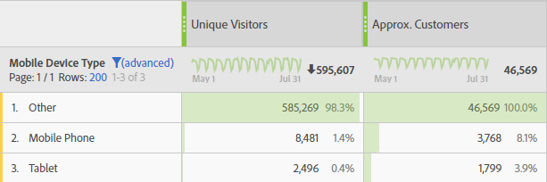

# Geavanceerde functies

De [ Berekende metrieke bouwer ](/help/components/calculated-metrics/workflow/c-build-metrics/cm-build-metrics.md) laat u statistische en wiskundige functies toepassen. Dit artikel documenteert alfabetische lijst van de geavanceerde functies en hun definities.

Heb toegang tot deze functies door **[!UICONTROL Show all]** te selecteren onder  **[!UICONTROL Functions]** lijst in het paneel van Componenten. Schuif omlaag om de lijst met **[!UICONTROL Advanced functions]** weer te geven.

## Tabelfuncties versus rijfuncties

Een tabelfunctie is een functie waarbij de uitvoer voor elke rij van de tabel hetzelfde is. Een rijfunctie is een functie waarbij de uitvoer voor elke rij van de tabel anders is.

Waar toepasselijk en relevant, is een functie geannoteerd met het type van functie: [!BADGE  Lijst ]{type="Neutral"} of [!BADGE  Rij ]{type="Neutral"}

## Wat betekent de parameter include-zeros?

Het vertelt of nullen in de berekening moeten worden opgenomen. Soms betekent nul *niets*, maar soms is het belangrijk.

Bijvoorbeeld, als u metrisch van de Opbrengst hebt, en dan metrische vertoningen van de Pagina aan het rapport toevoegt, zijn er plotseling meer rijen voor uw opbrengst, die allen nul zijn. U wilt waarschijnlijk niet dat extra metrisch om het even welke **[MEAN](cm-functions.md#mean)**, **[MINIMUM VAN DE RIJ](cm-functions.md#row-min)**, **[KWALITEIT](cm-functions.md#quartile)**, en meer berekeningen te beïnvloeden die u in de opbrengstkolom hebt. In dit geval controleert u de parameter `include-zeros` .

Een alternatief scenario is dat u twee metriek van rente hebt en één een hoger gemiddelde of een minimum heeft omdat sommige rijen nul zijn.  In dat geval kunt u ervoor kiezen om de parameter niet te controleren en nullen op te nemen.


## en {#and}

<!-- markdownlint-disable MD034 -->

>[!CONTEXTUALHELP]
>id="functions-and"
>title="en"
>abstract="Conjunctie. Niet gelijk aan nul wordt beschouwd als waar en gelijk aan nul wordt beschouwd als onwaar. De uitvoer is 0 (false) of 1 (true)."

<!-- markdownlint-enable MD034 -->

 **[!UICONTROL AND(logical_test)]**

Conjunctie. Niet gelijk aan nul wordt beschouwd als waar en gelijk aan nul wordt beschouwd als onwaar. De uitvoer is 0 (false) of 1 (true).

| Argument | Beschrijving |
|---|---|
| logical_test | Vereist minstens één parameter, maar kan om het even welk aantal parameters nemen. Elke waarde of expressie die kan worden geëvalueerd op TRUE of FALSE |


## Telling bij benadering onderscheiden {#approximate_count_distinct}

<!-- markdownlint-disable MD034 -->

>[!CONTEXTUALHELP]
>id="functions-count-distinct-metric"
>title="Telling bij benadering onderscheiden"
>abstract="Retourneert de geschatte, verschillende telling van dimensie-items voor de geselecteerde dimensie."

<!-- markdownlint-enable MD034 -->

 **[!UICONTROL APPROXIMATE COUNT DISTINCT(dimension)]**


Retourneert de geschatte, verschillende telling van dimensie-items voor de geselecteerde dimensie.


| Argument | Beschrijving |
|---|---|
| dimensie | De afmeting waarvoor u de benaderende verschillende punttelling wilt berekenen |

### Voorbeeld

Een veel voorkomend geval voor deze functie is wanneer u een benaderend aantal klanten wilt krijgen.


## Arc Cosine {#arc-cosine}

<!-- markdownlint-disable MD034 -->

>[!CONTEXTUALHELP]
>id="functions-acos"
>title="Arc Cosine"
>abstract="Retourneert de arccosinus, of omgekeerd van de cosinus, van een metrische waarde. De arccosinus is de hoek waarvan de cosinus getal is. De geretourneerde hoek wordt opgegeven in radialen tussen 0 (nul) en pi. Als u het resultaat wilt omzetten van radialen in graden, vermenigvuldigt u het met 180/PI()."

<!-- markdownlint-enable MD034 -->

 **[!UICONTROL ARC COSINE(metric)]**


[!BADGE  Rij ]{type="Neutral"} keert de arccosinus, of omgekeerd van de cosinus, van metrisch terug. De arccosinus is de hoek waarvan de cosinus getal is. De geretourneerde hoek wordt opgegeven in radialen tussen 0 (nul) en pi. Als u het resultaat wilt omzetten van radialen in graden, vermenigvuldigt u het met 180/PI().


| Argument | Beschrijving |
|---|---|
| metrisch | De cosinus van de hoek die u wilt instellen van -1 tot 1 |


## Boog sinus {#arc-sine}

<!-- markdownlint-disable MD034 -->

>[!CONTEXTUALHELP]
>id="functions-asin"
>title="Boog sinus"
>abstract="Retourneert de arcsinus, of omgekeerde sinus, van een getal. De arcsinus is de hoek waarvan de sinus een getal is. De geretourneerde hoek wordt opgegeven in radialen in het bereik -pi/2 tot pi/2. Als u de arcsinus in graden wilt uitdrukken, vermenigvuldigt u het resultaat met 180/PI()"

<!-- markdownlint-enable MD034 -->

 **[!UICONTROL ARC SINE(metric)]**


[!BADGE  Rij ]{type="Neutral"} keert de arcsinus, of omgekeerde sinus, van een aantal terug. De arcsinus is de hoek waarvan de sinus een getal is. De geretourneerde hoek wordt opgegeven in radialen in het bereik -pi/2 tot pi/2. Om de arcsinus in graden uit te drukken, vermenigvuldig het resultaat met 180/PI().


| Argument | Beschrijving |
|---|---|
| metrisch | De sinus van de hoek die u wilt instellen van -1 tot 1 |


## Booghoek {#arc-tangent}

<!-- markdownlint-disable MD034 -->

>[!CONTEXTUALHELP]
>id="functions-atan"
>title="Booghoek"
>abstract="Retourneert de arctangens, of omgekeerde tangens, van een getal. De arctangens is de hoek waarvan de tangens een getal is. De geretourneerde hoek wordt opgegeven in radialen in het bereik -pi/2 tot pi/2. Als u de arctangens in graden wilt uitdrukken, vermenigvuldigt u het resultaat met 180/PI()."

<!-- markdownlint-enable MD034 -->

 **[!UICONTROL ARC TANGENT(metric)]**


[!BADGE  Rij ]{type="Neutral"} keert de arctangent, of omgekeerde raaklijn, van een aantal terug. De arctangens is de hoek waarvan de tangens een getal is. De geretourneerde hoek wordt opgegeven in radialen in het bereik -pi/2 tot pi/2. Als u de arctangens in graden wilt uitdrukken, vermenigvuldigt u het resultaat met 180/PI().


| Argument | Beschrijving |
|---|---|
| metrisch | De tangens van de hoek u van -1 tot 1 wilt |


## Cdf-T {#cdf-t}

<!-- markdownlint-disable MD034 -->

>[!CONTEXTUALHELP]
>id="functions-cdf-t"
>title="Cdf-T"
>abstract="Keert de waarschijnlijkheid terug dat een willekeurige variabele met student-t distributie met n graden van vrijheid een z-score minder dan kolom heeft."

<!-- markdownlint-enable MD034 -->

 **[!UICONTROL CDF-T(metric, number)]**

Keert de waarschijnlijkheid terug dat een willekeurige variabele met student-t distributie met n graden van vrijheid een z-score minder dan kolom heeft.

| Argument | Beschrijving |
|---|---|
| metrisch | Metrisch waarvoor u de Cumulatieve Functie van de Distributie van de student t-distribution zou willen |
| getal | De vrijheidsgraden voor de cumulatieve distributiefunctie van de t-distribution van de student |

### Voorbeeld

```
CDF-T(-∞, n) = 0
CDF-T(∞, n) = 1
CDF-T(3, 5) ? 0.99865
CDF-T(-2, 7) ? 0.0227501
CDF-T(x, ∞) ? cdf_z(x)
```


## Cdf-Z {#cdf-z}

<!-- markdownlint-disable MD034 -->

>[!CONTEXTUALHELP]
>id="functions-cdf-z"
>title="Cdf-Z"
>abstract="Retourneert de waarschijnlijkheid dat een willekeurige variabele met een normale distributie een z-score heeft minder dan col."

<!-- markdownlint-enable MD034 -->

 **[!UICONTROL CDF-Z(metric, number)]**

Retourneert de waarschijnlijkheid dat een willekeurige variabele met een normale distributie een z-score heeft minder dan col.

| Argument | Beschrijving |
|---|---|
| metrisch | De metrische waarde waarvoor u de cumulatieve distributiefunctie van de Standaard Normale Distributie zou willen |

### Voorbeelden

```
CDF-Z(-∞) = 0
CDF-Z(∞) = 1
CDF-Z(0) = 0.5
CDF-Z(2) ? 0.97725
CDF-Z(-3) ? 0.0013499
```

## Plafond {#ceiling}

<!-- markdownlint-disable MD034 -->

>[!CONTEXTUALHELP]
>id="functions-ceil"
>title="Plafond"
>abstract="Geeft als resultaat het kleinste gehele getal dat niet kleiner is dan een bepaalde waarde. Als u bijvoorbeeld wilt voorkomen dat decimalen van valuta worden gerapporteerd voor inkomsten en een product $569,34 heeft, gebruikt u de formule CEILING(Revenue) om inkomsten naar de dichtstbijzijnde dollar te afronden, of $570."

<!-- markdownlint-enable MD034 -->

 **[!UICONTROL CEILING(metric)]**

[!BADGE  Rij ]{type="Neutral"} keert het kleinste geheel niet minder dan een bepaalde waarde terug. Als u bijvoorbeeld wilt voorkomen dat decimalen van valuta worden gerapporteerd voor inkomsten en een product $569,34 heeft, gebruikt u de formule CEILING(Revenue) om inkomsten naar de dichtstbijzijnde dollar te afronden, of $570.

| Argument | Beschrijving |
|---|---|
| metrisch | De metrische waarde die u wilt afronden |


<!-- Only available in CJA 

## Confidence {#confidence}

>[!CONTEXTUALHELP]
>id="functions-waskr-confidence"
>title="Confidence"
>abstract="Calculate the any-time-valid confidence using the WASKR method as described in [Time-uniform central limit theory and asymptotic confidence sequences](https://arxiv.org/pdf/2103.06476)."

 **[!UICONTROL CONFIDENCE(normalizing-container, success-metric, control, significance-treshold)]**

Calculate the any-time-valid confidence using the WASKR method as described in [Time-uniform central limit theory and asymptotic confidence sequences](https://arxiv.org/pdf/2103.06476).

Confidence is a probabilistic measure of how much evidence there is that a given variant is the same as the control variant. A higher confidence indicates less evidence for the assumption that control and non-control variant have equal performance. 

| Argument | Description |
| --- | --- |
| normalizing-container | The basis (People, Sessions, or Events) on which a test is run. |
| success-metric | The metric or metrics that a user is comparing variants with. |
| control | The variant that all other variants in the experiment are being compared with. Enter the name of the control variant dimension item. |
| significance-threshold | The threshold in this function is set to a default of 95%. |

-->


## Vertrouwen (onder) {#confidence-lower}

<!-- markdownlint-disable MD034 -->

>[!CONTEXTUALHELP]
>id="functions-waskr-lower-individual-confidence-sequence"
>title="Vertrouwen (onder)"
>abstract="Bereken het om het even welke tijd-geldige vertrouwen **lager** gebruikend de methode WASKR zoals die in [ wordt beschreven tijd-eenvormige centrale beperkingstheorie en asymptotische vertrouwensopeenvolgingen ](https://arxiv.org/pdf/2103.06476)."

<!-- markdownlint-enable MD034 -->

 **[!UICONTROL CONFIDENCE(normalizing-container, success-metric, control, significance-treshold)]**

Bereken het om het even welke tijd-geldige vertrouwen **lager** gebruikend de methode WASKR zoals die in [ wordt beschreven tijd-eenvormige centrale beperkingstheorie en asymptotische vertrouwensopeenvolgingen ](https://arxiv.org/pdf/2103.06476).

Vertrouwen is een waarschijnlijkheidsmeting van hoeveel bewijs er is dat een bepaalde variant dezelfde is als de besturingsvariant. Een hoger vertrouwen geeft minder bewijs voor de aanname dat de besturingsvariant en de niet-besturingsvariant dezelfde prestaties leveren.

| Argument | Beschrijving |
| --- | --- |
| normalizing-container | De basis (Mensen, Zittingen, of Gebeurtenissen) waarop een test in werking wordt gesteld. |
| succesmetrisch | De metrische of metrische waarde waarmee een gebruiker varianten vergelijkt. |
| besturen | De variant waarmee alle andere varianten in het experiment worden vergeleken. Voer de naam in van het element Dimensie besturingsvariant. |
| significantiedrempel | De drempel in deze functie is ingesteld op een standaardwaarde van 95%. |

## Vertrouwen (boven) {#confidence-upper}

<!-- markdownlint-disable MD034 -->

>[!CONTEXTUALHELP]
>id="functions-waskr-upper-individual-confidence-sequence"
>title="Vertrouwen (boven)"
>abstract="Bereken het om het even welk-tijd-geldige vertrouwen **hoger** gebruikend de methode WASKR zoals die in [ wordt beschreven tijd-eenvormige centrale beperkingstheorie en asymptotische vertrouwensopeenvolgingen ](https://arxiv.org/pdf/2103.06476)."

<!-- markdownlint-enable MD034 -->

 **[!UICONTROL CONFIDENCE(normalizing-container, success-metric, control, significance-treshold)]**

Bereken het om het even welk-tijd-geldige vertrouwen **hoger** gebruikend de methode WASKR zoals die in [ wordt beschreven tijd-eenvormige centrale beperkingstheorie en asymptotische vertrouwensopeenvolgingen ](https://arxiv.org/pdf/2103.06476).

Vertrouwen is een waarschijnlijkheidsmeting van hoeveel bewijs er is dat een bepaalde variant dezelfde is als de besturingsvariant. Een hoger vertrouwen geeft minder bewijs voor de aanname dat de besturingsvariant en de niet-besturingsvariant dezelfde prestaties leveren.

| Argument | Beschrijving |
| --- | --- |
| normalizing-container | De basis (Mensen, Zittingen, of Gebeurtenissen) waarop een test in werking wordt gesteld. |
| succesmetrisch | De metrische of metrische waarde waarmee een gebruiker varianten vergelijkt. |
| besturen | De variant waarmee alle andere varianten in het experiment worden vergeleken. Voer de naam in van het element Dimensie besturingsvariant. |
| significantiedrempel | De drempel in deze functie is ingesteld op een standaardwaarde van 95%. |


## Cosine {#cosine}

<!-- markdownlint-disable MD034 -->

>[!CONTEXTUALHELP]
>id="functions-cos"
>title="Cosine"
>abstract="Geeft als resultaat de cosinus van de opgegeven hoek. Als de hoek in graden is, vermenigvuldig de hoek met PI()/180."

<!-- markdownlint-enable MD034 -->

 **[!UICONTROL COSINE(metric)]**

[!BADGE  Rij ]{type="Neutral"} keert de cosinus van de bepaalde hoek terug. Als de hoek in graden is, vermenigvuldig de hoek met PI()/180.

| Argument | Beschrijving |
|---|---|
| metrisch | De hoek in radialen waarvoor u de cosinus wilt gebruiken |


## Kubus Root {#cube-root}

<!-- markdownlint-disable MD034 -->

>[!CONTEXTUALHELP]
>id="functions-cube-root"
>title="Kubus Root"
>abstract="Retourneert de positieve kubuswortel van een getal. De kubuswortel van een aantal is de waarde van dat aantal dat tot de macht van 1/3 wordt opgeheven."

<!-- markdownlint-enable MD034 -->

 **[!UICONTROL CUBE ROOT(metric)]**


Retourneert de positieve kubuswortel van een getal. De kubuswortel van een aantal is de waarde van dat aantal dat tot de macht van 1/3 wordt opgeheven.


| Argument | Beschrijving |
|---|---|
| metrisch | Metrisch waarvoor u de kubuswortel wilt berekenen |


## Cumulatief {#cumulative}

<!-- markdownlint-disable MD034 -->

>[!CONTEXTUALHELP]
>id="functions-cumul"
>title="Cumulatief"
>abstract="Retourneert de som van de laatste n-elementen van kolom x. Indien n > 0, som de laatste n elementen of x. Indien n &lt; 0, som de voorafgaande elementen."

<!-- markdownlint-enable MD034 -->

 **[!UICONTROL CUMULATIVE(number, metric)]**

Retourneert de som van de laatste n-elementen van kolom x. Indien n > 0, som de laatste n elementen of x. Indien n &lt; 0, som de voorafgaande elementen.

| Argument | Beschrijving |
| --- | --- |
| getal | The last N number of rows to return the sum for. Als N &lt;= 0 is, gebruikt u alle vorige rijen. |
| metrisch | Metrisch waarvoor u de Cumulatieve Som zou willen. |

### Voorbeelden

| Datum | Ontvangsten | CUMULATIEF(0, inkomsten) | CUMULATIEF(2, inkomsten) |
|------|------:|--------------:|--------------:|
| mei | $ 500 | $ 500 | $ 500 |
| juni | $ 200 | $ 700 | $ 700 |
| juli | $ 400 | $ 1.100 | $ 600 |


## Cumulatief (gemiddeld) {#cumulative-average}

<!-- markdownlint-disable MD034 -->

>[!CONTEXTUALHELP]
>id="functions-cumul-avg"
>title="Cumulatief (gemiddeld)"
>abstract="Retourneert het gemiddelde van de laatste n elementen van kolom x. Indien n > 0, som de laatste n elementen of x. Indien n &lt; 0, som de voorafgaande elementen."

<!-- markdownlint-enable MD034 -->

 **[!UICONTROL CUMULATIVE AVERAGE(number, metric)]**

Retourneert het gemiddelde van de laatste n elementen van kolom x. Indien n > 0, som de laatste n elementen of x. Indien n &lt; 0, som de voorafgaande elementen.

| Argument | Beschrijving |
| --- | --- |
| getal | Het laatste N aantal rijen om het gemiddelde voor terug te keren. Als N &lt;= 0 is, gebruikt u alle vorige rijen. |
| metrisch | Metrisch waarvoor u het Cumulatieve Gemiddelde zou willen. |

>[!NOTE]
>
>Deze functie werkt niet met tariefmaatstaven zoals opbrengst per persoon. De functie gebruikt het gemiddelde van de tarieven in plaats van de inkomsten over de laatste N op te tellen en personen over de laatste N op te tellen en hen vervolgens te verdelen. <br/> in plaats daarvan, gebruik [**[!UICONTROL CUMULATIVE(revenue)]**](#cumulative)  [**[!UICONTROL CUMULATIVE(person)]**](#cumulative).
>


## Gelijk {#equal}

<!-- markdownlint-disable MD034 -->

>[!CONTEXTUALHELP]
>id="functions-eq"
>title="Gelijk"
>abstract="Gelijk. De uitvoer is 0 (false) of 1 (true)."

<!-- markdownlint-enable MD034 -->

 **[!UICONTROL EQUAL()]**

Gelijk. De uitvoer is 0 (false) of 1 (true).


| Argument | Beschrijving |
|---|---|
| metrisch_X | |
| metrisch_Y | |

### Voorbeeld

`Metric 1 = Metric 2`


## Exponentiële regressie: Correlatiecoëfficiënt {#exponential-regression-correlation-coefficient}

<!-- markdownlint-disable MD034 -->

>[!CONTEXTUALHELP]
>id="functions-ls-corr-exp"
>title="Exponentiële regressie: Correlatiecoëfficiënt"
>abstract="Exponentiële regressie: Y = a exp(X) + b. Retourneert de correlatiecoëfficiënt."

<!-- markdownlint-enable MD034 -->

 **[!UICONTROL EXPONENTIAL REGRESSION: CORRELATION COEFFICIENT(metric_X, metric_Y, include_zeros)]**


[!BADGE  Lijst ]{type="Neutral"} Exponentiële regressie: Y = a exp (X) + b. Keert de correlatiecoëfficiënt terug.


| Argument | Beschrijving |
|---|---|
| metrisch_X | Metrisch die u met metrisch_Y zou willen correleren |
| metrisch_Y | Metrisch die u met metrisch_X zou willen correleren |
| include_zeros | Of nul-waarden in de berekeningen moeten worden opgenomen |

## Exponentiële regressie: voorspeld Y {#exponential-regression-predicted-y}

<!-- markdownlint-disable MD034 -->

>[!CONTEXTUALHELP]
>id="functions-ls-pred-exp"
>title="Exponentiële regressie: voorspeld Y"
>abstract="Exponentiële regressie: Y = a exp(X) + b. Retourneert Y."

<!-- markdownlint-enable MD034 -->

 **[!UICONTROL EXPONENTIAL REGRESSION: PREDICTED Y(metric_X, metric_Y, include_zeros)]**


[!BADGE  Rij ]{type="Neutral"} Exponentiële regressie: Y = a exp (X) + b. Keert Y terug.


| Argument | Beschrijving |
|---|---|
| metrisch_X | Metrisch die u als onafhankelijke gegevens zou willen aanwijzen. |
| metrisch_Y | Metrisch die u als afhankelijke gegevens zou willen aanwijzen. |
| include_zeros | Of nul-waarden in de berekeningen moeten worden opgenomen |


## Exponentiële regressie: Intercept {#exponential-regression-intercept}

<!-- markdownlint-disable MD034 -->

>[!CONTEXTUALHELP]
>id="functions-ls-intercept-exp"
>title="Exponentiële regressie: Intercept"
>abstract="Exponentiële regressie: Y = a exp(X) + b. Retourneert b."

<!-- markdownlint-enable MD034 -->

 **[!UICONTROL EXPONENTIAL REGRESSION: INTERCEPT(metric_X, metric_Y, include_zeros)]**


[!BADGE  Lijst ]{type="Neutral"} Exponentiële regressie: Y = a exp (X) + b. Keert b terug.

| Argument | Beschrijving |
|---|---|
| metrisch_X | Metrisch die u als afhankelijke gegevens zou willen aanwijzen |
| metrisch_Y | Metrisch die u als onafhankelijke gegevens zou willen aanwijzen |
| include_zeros | Of nul-waarden in de berekeningen moeten worden opgenomen |


## Exponentiële regressie: helling {#exponential-regression-slope}

<!-- markdownlint-disable MD034 -->

>[!CONTEXTUALHELP]
>id="functions-ls-slope-exp"
>title="Exponentiële regressie: helling"
>abstract="Exponentiële regressie: Y = a exp(X) + b. Retourneert a."

<!-- markdownlint-enable MD034 -->

 **[!UICONTROL EXPONENTIAL REGRESSION: SLOPE(metric_X, metric_Y, include_zeros)]**


[!BADGE  Lijst ]{type="Neutral"} Exponentiële regressie: Y = a exp (X) + b. Keert a terug.


| Argument | Beschrijving |
|---|---|
| metrisch_X | Metrisch die u als afhankelijke gegevens zou willen aanwijzen |
| metrisch_Y | Metrisch die u als onafhankelijke gegevens zou willen aanwijzen |
| include_zeros | Of nul-waarden in de berekeningen moeten worden opgenomen |


## Floor {#floor}

<!-- markdownlint-disable MD034 -->

>[!CONTEXTUALHELP]
>id="functions-floor"
>title="Floor"
>abstract="Geeft als resultaat het grootste gehele getal dat niet groter is dan een bepaalde waarde. Als u bijvoorbeeld wilt voorkomen dat decimalen van valuta worden gerapporteerd voor inkomsten en een product $569,34 heeft, gebruikt u de formule FLOOR(Revenue) om inkomsten naar de dichtstbijzijnde dollar te retourneren, oftewel $569."

<!-- markdownlint-enable MD034 -->

 **[!UICONTROL FLOOR(metric_X, metric_Y, include_zeros)]**

[!BADGE  Rij ]{type="Neutral"} keert het grootste geheel niet groter dan een bepaalde waarde terug. Als u bijvoorbeeld wilt voorkomen dat decimalen van valuta worden gerapporteerd voor inkomsten en een product $569,34 heeft, gebruikt u de formule FLOOR(Revenue) om inkomsten naar de dichtstbijzijnde dollar te retourneren, oftewel $569.

| Argument | Beschrijving |
|---|---|
| metrisch | De metrische waarde die u wilt afronden. |


## Groter dan {#greather-than}

<!-- markdownlint-disable MD034 -->

>[!CONTEXTUALHELP]
>id="functions-gt"
>title="Groter dan"
>abstract="De uitvoer is 0 (false) of 1 (true)."

<!-- markdownlint-enable MD034 -->

 **[!UICONTROL GREATER THAN()]**

De uitvoer is 0 (false) of 1 (true).

| Argument | Beschrijving |
|---|---|
| metrisch_X | |
| metrisch_Y | |

### Voorbeeld

`Metric 1 > Metric 2`


## Groter dan of gelijk aan {#greater-than-or-equal}

<!-- markdownlint-disable MD034 -->

>[!CONTEXTUALHELP]
>id="functions-ge"
>title="Groter dan of gelijk aan"
>abstract="Groter dan of gelijk aan. De uitvoer is 0 (false) of 1 (true)."

<!-- markdownlint-enable MD034 -->

 **[!UICONTROL GREATER THAN OR EQUAL()]**

Groter dan of gelijk aan. De uitvoer is 0 (false) of 1 (true).

| Argument | Beschrijving |
|---|---|
| metrisch_X |  |
| metrisch_Y |  |

### Voorbeeld

`Metric 1 >= Metric 2`


## Hyperbolische cosinus {#hyperbolic-cosine}

<!-- markdownlint-disable MD034 -->

>[!CONTEXTUALHELP]
>id="functions-cosh"
>title="Hyperbolische cosinus"
>abstract="Geeft de hyperbolische cosinus van een getal."

<!-- markdownlint-enable MD034 -->

 **[!UICONTROL HYPERBOLIC COSINE(metric)]**


[!BADGE  Rij ]{type="Neutral"} keert de hyperbolische cosinus van een aantal terug.


| Argument | Beschrijving |
|---|---|
| metrisch | De hoek in radialen waarvoor u de hyperbolische cosinus wilt vinden |


## Hyperbolische sinus {#hyperbolic-sine}

<!-- markdownlint-disable MD034 -->

>[!CONTEXTUALHELP]
>id="functions-sinh"
>title="Hyperbolische sinus"
>abstract="Geeft de hyperbolische sinus van een getal."

<!-- markdownlint-enable MD034 -->

 **[!UICONTROL HYPERBOLIC SINE(metric)]**

[!BADGE  Rij ]{type="Neutral"} keert de hyperbolische sinus van een aantal terug.

| Argument | Beschrijving |
|---|---|
| metrisch | De hoek in radialen waarvoor u de hyperbolische sinus wilt vinden |


## Hyperbolische hoek {#hyperbolic-tangent}

<!-- markdownlint-disable MD034 -->

>[!CONTEXTUALHELP]
>id="functions-tanh"
>title="Hyperbolische hoek"
>abstract="Retourneert de hyperbolische tangens van een getal."

<!-- markdownlint-enable MD034 -->

 **[!UICONTROL HYPERBOLIC TANGENT(metric)]**

[!BADGE  Rij ]{type="Neutral"} keert de hyperbolische tangens van een aantal terug.

| Argument | Beschrijving |
|---|---|
| metrisch | De hoek in radialen waarvoor u de hyperbolische tangens wilt vinden |


## Indien {#if}

<!-- markdownlint-disable MD034 -->

>[!CONTEXTUALHELP]
>id="functions-if"
>title="Indien"
>abstract="Als de waarde van de parameter condition niet-nul is (true), is het resultaat de waarde van de parameter value_if_true. Anders is het de waarde van de parameter value_if_false."

<!-- markdownlint-enable MD034 -->

 **[!UICONTROL IF(logical_test, value_if_true, value_if_false)]**


[!BADGE  Rij ]{type="Neutral"} als de waarde van de voorwaardenparameter niet-nul (waar) is, is het resultaat de waarde van de parameter value_if_true. Anders is het de waarde van de parameter value_if_false.


| Argument | Beschrijving |
|---|---|
| logical_test | Vereist. Elke waarde of expressie die kan worden geëvalueerd op TRUE of FALSE |
| value_if_true | De waarde die u wilt zijn teruggekeerd als het logical_test argument aan WAAR evalueert. (Dit argument wordt standaard ingesteld op 0 als het niet wordt opgenomen.) |
| value_if_false | De waarde die u wilt worden geretourneerd als het argument logical_test naar FALSE evalueert. (Dit argument wordt standaard ingesteld op 0 als het niet wordt opgenomen.) |


## Minder dan {#less-than}

<!-- markdownlint-disable MD034 -->

>[!CONTEXTUALHELP]
>id="functions-lt"
>title="Minder dan"
>abstract="De uitvoer is 0 (false) of 1 (true)."

<!-- markdownlint-enable MD034 -->

 **[!UICONTROL LESS THAN()]**

De uitvoer is 0 (false) of 1 (true).

| Argument | Beschrijving |
|---|---|
| metrisch_X | |
| metrisch_Y | |

### Voorbeeld

`Metric 1 < Metric 2`


## Kleiner dan of gelijk aan {#less-than-or-equal}

<!-- markdownlint-disable MD034 -->

>[!CONTEXTUALHELP]
>id="functions-le"
>title="Kleiner dan of gelijk aan"
>abstract="Kleiner dan of gelijk aan. De uitvoer is 0 (false) of 1 (true)."

<!-- markdownlint-enable MD034 -->

 **[!UICONTROL LESS THAN OR EQUAL()]**

Kleiner dan of gelijk aan. De uitvoer is 0 (false) of 1 (true).

| Argument | Beschrijving |
|---|---|
| metrisch_X | |
| metrisch_Y | |

### Voorbeeld

`Metric 1 <= Metric 2`


<!-- Only available in CJA 

## Lift (#lift)


>[!CONTEXTUALHELP]
>id="functions-waskr-lift"
>title="Lift"
>abstract="The lift of the ratio compared to the control value."


| Argument | Description |
| --- | --- |
| normalizing-container | The basis (People, Sessions, or Events) on which a test is run. |
| success-metric | The metric or metrics that a user is comparing variants with. |
| control | The variant that all other variants in the experiment are being compared with. Enter the name of the control variant dimension item. |

-->

## Lineaire regressie: Correlatiecoëfficiënt {#linear-regression-correlation-coefficient}

<!-- markdownlint-disable MD034 -->

>[!CONTEXTUALHELP]
>id="functions-ls-corr-linear"
>title="Lineaire regressie: Correlatiecoëfficiënt"
>abstract="Lineaire regressie: Y = a X + b. Retourneert de correlatiecoëfficiënt."

<!-- markdownlint-enable MD034 -->

 **[!UICONTROL LINEAR REGRESSION: CORRELATION COEFFICIENT(metric_X, metric_Y, include_zeros)]**


[!BADGE  Lijst ]{type="Neutral"} Lineaire regressie: Y = a X + b. Keert de correlatiecoëfficiënt terug.


| Argument | Beschrijving |
|---|---|
| metrisch_X | Metrisch die u met metrisch_Y zou willen correleren |
| metrisch_Y | Metrisch die u met metrisch_X zou willen correleren |
| include_zeros | Of nul-waarden in de berekeningen moeten worden opgenomen |


## Lineaire regressie: Intercept {#linear-regression-intercept}

<!-- markdownlint-disable MD034 -->

>[!CONTEXTUALHELP]
>id="functions-ls-intercept-linear"
>title="Lineaire regressie: Intercept"
>abstract="Lineaire regressie: Y = a X + b. Retourneert b."

<!-- markdownlint-enable MD034 -->

 **[!UICONTROL LINEAR REGRESSION: INTERCEPT(metric_X, metric_Y, include_zeros)]**


[!BADGE  Lijst ]{type="Neutral"} Lineaire regressie: Y = a X + b. Keert b terug.


| Argument | Beschrijving |
|---|---|
| metrisch_X | Metrisch die u als afhankelijke gegevens zou willen aanwijzen |
| metrisch_Y | Metrisch die u als onafhankelijke gegevens zou willen aanwijzen |
| include_zeros | Of nul-waarden in de berekeningen moeten worden opgenomen |


## Lineaire regressie: voorspeld Y {#linear-regression-predicted-y}

<!-- markdownlint-disable MD034 -->

>[!CONTEXTUALHELP]
>id="functions-ls-pred-linear"
>title="Lineaire regressie: voorspeld Y"
>abstract="Lineaire regressie: Y = a X + b. Retourneert Y."

<!-- markdownlint-enable MD034 -->

 **[!UICONTROL LINEAR REGRESSION: PREDICTED Y(metric_X, metric_Y, include_zeros)]**


[!BADGE  Rij ]{type="Neutral"} Lineaire regressie: Y = a X + b. Keert Y terug.


| Argument | Beschrijving |
|---|---|
| metrisch_X | Metrisch die u als afhankelijke gegevens zou willen aanwijzen |
| metrisch_Y | Metrisch die u als onafhankelijke gegevens zou willen aanwijzen |
| include_zeros | Of nul-waarden in de berekeningen moeten worden opgenomen |


## Lineaire regressie: helling {#linear-regression-slope}

<!-- markdownlint-disable MD034 -->

>[!CONTEXTUALHELP]
>id="functions-ls-slope-linear"
>title="Lineaire regressie: helling"
>abstract="Lineaire regressie: Y = a X + b. Retourneert a."

<!-- markdownlint-enable MD034 -->

 **[!UICONTROL LINEAR REGRESSION: SLOPE(metric_X, metric_Y, include_zeros)]**

[!BADGE  Lijst ]{type="Neutral"} Lineaire regressie: Y = a X + b. Keert a terug.

| Argument | Beschrijving |
|---|---|
| metrisch_X | Metrisch die u als afhankelijke gegevens zou willen aanwijzen |
| metrisch_Y | Metrisch die u als onafhankelijke gegevens zou willen aanwijzen |
| include_zeros | Of nul-waarden in de berekeningen moeten worden opgenomen |


## Logbestand basis 10 {#log-base-ten}

<!-- markdownlint-disable MD034 -->

>[!CONTEXTUALHELP]
>id="functions-log10"
>title="Logbestand basis 10"
>abstract="Retourneert de natuurlijke logaritme met grondtal 10 van een getal."

<!-- markdownlint-enable MD034 -->

 **[!UICONTROL LOG BASE 10(metric)]**


[!BADGE  Rij ]{type="Neutral"} keert logaritme basis-10 van een aantal terug.


| Argument | Beschrijving |
|---|---|
| metrisch | Het positieve reële getal waarvoor u de natuurlijke logaritme met grondtal 10 wilt gebruiken |


## Logboekregressie: Correlatiecoëfficiënt {#log-regression-correlation-coefficient}

<!-- markdownlint-disable MD034 -->

>[!CONTEXTUALHELP]
>id="functions-ls-corr-log"
>title="Logboekregressie: Correlatiecoëfficiënt"
>abstract="Logregressie: Y = a ln(X) + b. Retourneert de correlatiecoëfficiënt."

<!-- markdownlint-enable MD034 -->

 **[!UICONTROL LOG REGRESSION: CORRELATION COEFFICIENT(metric_X, metric_Y, include_zeros)]**

[!BADGE  Lijst ]{type="Neutral"} de regressie van het Logboek: Y = a ln (X) + b. Keert de correlatiecoëfficiënt terug.

| Argument | Beschrijving |
|---|---|
| metrisch_X | Metrisch die u met metrisch_Y zou willen correleren |
| metrisch_Y | Metrisch die u met metrisch_X zou willen correleren |
| include_zeros | Of nul-waarden in de berekeningen moeten worden opgenomen |


## Logboekregressie: Onderscheppen {#log-regression-intercept}

<!-- markdownlint-disable MD034 -->

>[!CONTEXTUALHELP]
>id="functions-ls-intercept-log"
>title="Logboekregressie: Onderscheppen"
>abstract="Logregressie: Y = a ln(X) + b. Retourneert b."

<!-- markdownlint-enable MD034 -->

 **[!UICONTROL LOG REGRESSION: INTERCEPT(metric_X, metric_Y, include_zeros)]**

[!BADGE  Lijst ]{type="Neutral"} de regressie van het Logboek: Y = a ln (X) + b. Keert b terug.

| Argument | Beschrijving |
|---|---|
| metrisch_X | Metrisch die u als afhankelijke gegevens zou willen aanwijzen |
| metrisch_Y | Metrisch die u als onafhankelijke gegevens zou willen aanwijzen |
| include_zeros | Of nul-waarden in de berekeningen moeten worden opgenomen |


## Logregressie: voorspeld Y {#log-regression-predicted-y}

<!-- markdownlint-disable MD034 -->

>[!CONTEXTUALHELP]
>id="functions-ls-pred-log"
>title="Logregressie: voorspeld Y"
>abstract="Logregressie: Y = a ln(X) + b. Retourneert Y."

<!-- markdownlint-enable MD034 -->

 **[!UICONTROL LOG REGRESSION: PREDICTED Y(metric_X, metric_Y, include_zeros)]**

[!BADGE  Rij ]{type="Neutral"} de regressie van het Logboek: Y = a ln (X) + b. Keert Y terug.

| Argument | Beschrijving |
|---|---|
| metrisch_X | Metrisch die u als afhankelijke gegevens zou willen aanwijzen |
| metrisch_Y | Metrisch die u als onafhankelijke gegevens zou willen aanwijzen |
| include_zeros | Of nul-waarden in de berekeningen moeten worden opgenomen |


## Logregressie: helling {#log-regression-slope}

<!-- markdownlint-disable MD034 -->

>[!CONTEXTUALHELP]
>id="functions-ls-slope-log"
>title="Logregressie: helling"
>abstract="Logregressie: Y = a ln(X) + b. Retourneert a."

<!-- markdownlint-enable MD034 -->

 **[!UICONTROL LOG REGRESSION: SLOPE(metric_X, metric_Y, include_zeros)]**

[!BADGE  Lijst ]{type="Neutral"} de regressie van het Logboek: Y = a ln (X) + b. Keert a terug.

| Argument | Beschrijving |
|---|---|
| metrisch_X | Metrisch die u als afhankelijke gegevens zou willen aanwijzen |
| metrisch_Y | Metrisch die u als onafhankelijke gegevens zou willen aanwijzen |
| include_zeros | Of nul-waarden in de berekeningen moeten worden opgenomen |


## Natuurlijk logboek {#natural-log}

<!-- markdownlint-disable MD034 -->

>[!CONTEXTUALHELP]
>id="functions-log"
>title="Natuurlijk logboek"
>abstract="Retourneert de natuurlijke logaritme van een getal. Natuurlijk logaritme is gebaseerd op de constante e (2.71828182845904). LN is het omgekeerde van de functie EXP."

<!-- markdownlint-enable MD034 -->

 **[!UICONTROL NATURAL LOG(metric)]**

Retourneert de natuurlijke logaritme van een getal. Natuurlijk logaritme is gebaseerd op de constante e (2.71828182845904). LN is het omgekeerde van de functie EXP.

| Argument | Beschrijving |
|---|---|
| metrisch | Het positieve reële getal waarvoor u de natuurlijke logaritme wilt |


## Niet {#not}

<!-- markdownlint-disable MD034 -->

>[!CONTEXTUALHELP]
>id="functions-not"
>title="Niet"
>abstract="Negatie als een booleaanse waarde. De uitvoer is 0 (false) of 1 (true)."

<!-- markdownlint-enable MD034 -->

 **[!UICONTROL NOT(logical)]**

Negatie als een booleaanse waarde. De uitvoer is 0 (false) of 1 (true).

| Argument | Beschrijving |
|---|---|
| logisch | Vereist. Een waarde of expressie die kan worden geëvalueerd op TRUE of FALSE |


## Niet gelijk {#not-equal}

<!-- markdownlint-disable MD034 -->

>[!CONTEXTUALHELP]
>id="functions-ne"
>title="Niet gelijk"
>abstract="Niet gelijk. De uitvoer is 0 (false) of 1 (true)."

<!-- markdownlint-enable MD034 -->

 **[!UICONTROL NOT EQUAL()]**


Niet gelijk. De uitvoer is 0 (false) of 1 (true).


| Argument | Beschrijving |
|---|---|
| metrisch_X | |
| metrisch_Y | |

### Voorbeeld

`Metric 1 != Metric 2`


## of {#or}

<!-- markdownlint-disable MD034 -->

>[!CONTEXTUALHELP]
>id="functions-or"
>title="of"
>abstract="Afscherming. Niet gelijk aan nul wordt beschouwd als waar en gelijk aan nul wordt beschouwd als onwaar. De uitvoer is 0 (false) of 1 (true)."

<!-- markdownlint-enable MD034 -->

 **[!UICONTROL OR(logical_test)]**


[!BADGE  Bevestiging van de Rij ]{type="Neutral"}. Niet gelijk aan nul wordt beschouwd als waar en gelijk aan nul wordt beschouwd als onwaar. De uitvoer is 0 (false) of 1 (true).


| Argument | Beschrijving |
|---|---|
| logical_test | Vereist minstens één parameter maar kan om het even welk aantal parameters nemen. Elke waarde of expressie die kan worden geëvalueerd op TRUE of FALSE |


>[!NOTE]
>
>0 (nul) betekent Onwaar en elke andere waarde is Waar.


## Pi {#pi}

<!-- markdownlint-disable MD034 -->

>[!CONTEXTUALHELP]
>id="functions-pi"
>title="Pi"
>abstract="Retourneert Pi: 3,14159..."

<!-- markdownlint-enable MD034 -->

 **[!UICONTROL PI()]**

Retourneert Pi: 3,14159...


## Regressie van het vermogen: Correlatiecoëfficiënt {#power-regression-correlation-coefficient}

<!-- markdownlint-disable MD034 -->

>[!CONTEXTUALHELP]
>id="functions-ls-corr-power"
>title="Regressie van het vermogen: Correlatiecoëfficiënt"
>abstract="Stroomregressie: Y = b X ^ a. Retourneert de correlatiecoëfficiënt."

<!-- markdownlint-enable MD034 -->

 **[!UICONTROL POWER REGRESSION: CORRELATION COEFFICIENT(metric_X, metric_Y, include_zeros)]**

[!BADGE  Lijst ]{type="Neutral"} de regressie van de Macht: Y = b X ^ a. Keert de correlatiecoëfficiënt terug.

| Argument | Beschrijving |
|---|---|
| metrisch_X | Metrisch die u met metrisch_Y zou willen correleren |
| metrisch_Y | Metrisch die u met metrisch_X zou willen correleren |
| include_zeros | Of nul-waarden in de berekeningen moeten worden opgenomen |


## Regressie voeding: onderscheppen {#power-regression-intercept}

<!-- markdownlint-disable MD034 -->

>[!CONTEXTUALHELP]
>id="functions-ls-intercept-power"
>title="Regressie voeding: onderscheppen"
>abstract="Stroomregressie: Y = b X ^ a. Retourneert b."

<!-- markdownlint-enable MD034 -->

 **[!UICONTROL POWER REGRESSION: INTERCEPT(metric_X, metric_Y, include_zeros)]**


[!BADGE  Lijst ]{type="Neutral"} de regressie van de Macht: Y = b X ^ a. Keert b terug.


| Argument | Beschrijving |
|---|---|
| metrisch_X | Metrisch die u als afhankelijke gegevens zou willen aanwijzen |
| metrisch_Y | Metrisch die u als onafhankelijke gegevens zou willen aanwijzen |
| include_zeros | Of nul-waarden in de berekeningen moeten worden opgenomen |


## Stroomregressie: voorspeld Y {#power-regression-predicted-y}

<!-- markdownlint-disable MD034 -->

>[!CONTEXTUALHELP]
>id="functions-ls-pred-power"
>title="Stroomregressie: voorspeld Y"
>abstract="Stroomregressie: Y = b X ^ a. Retourneert Y."

<!-- markdownlint-enable MD034 -->

 **[!UICONTROL POWER REGRESSION: PREDICTED Y(metric_X, metric_Y, include_zeros)]**

[!BADGE  Rij ]{type="Neutral"} de regressie van de Macht: Y = b X ^ a. Keert Y terug.

| Argument | Beschrijving |
|---|---|
| metrisch_X | Metrisch die u als afhankelijke gegevens zou willen aanwijzen |
| metrisch_Y | Metrisch die u als onafhankelijke gegevens zou willen aanwijzen |
| include_zeros | Of nul-waarden in de berekeningen moeten worden opgenomen |


## Stroomregressie: helling {#power-regression-slope}

<!-- markdownlint-disable MD034 -->

>[!CONTEXTUALHELP]
>id="functions-ls-slope-power"
>title="Stroomregressie: helling"
>abstract="Stroomregressie: Y = b X ^ a. Retourneert a."

<!-- markdownlint-enable MD034 -->

 **[!UICONTROL POWER REGRESSION: SLOPE(metric_X, metric_Y, include_zeros)]**

[!BADGE  Lijst ]{type="Neutral"} de regressie van de Macht: Y = b X ^ a. Keert a terug.

| Argument | Beschrijving |
|---|---|
| metrisch_X | Metrisch die u als afhankelijke gegevens zou willen aanwijzen |
| metrisch_Y | Metrisch die u als onafhankelijke gegevens zou willen aanwijzen |
| include_zeros | Of nul-waarden in de berekeningen moeten worden opgenomen |


## kwadratische regressie: correlatiecoëfficiënt {#quadratic-regression-correlation-coefficient}

<!-- markdownlint-disable MD034 -->

>[!CONTEXTUALHELP]
>id="functions-ls-corr-quadratic"
>title="kwadratische regressie: correlatiecoëfficiënt"
>abstract="Kwartaalregressie: Y = (a + bX) ^ 2, retourneert de correlatiecoëfficiënt."

<!-- markdownlint-enable MD034 -->

 **[!UICONTROL QUADRATIC REGRESSION: CORRELATION COEFFICIENT(metric_X, metric_Y, include_zeros)]**

[!BADGE  Lijst ]{type="Neutral"} kwadratische regressie: Y = (a + bX) ^ 2, keert de correlatiecoëfficiënt terug.

| Argument | Beschrijving |
|---|---|
| metrisch_X | Metrisch die u met metrisch_Y zou willen correleren |
| metrisch_Y | Metrisch die u met metrisch_X zou willen correleren |
| include_zeros | Of nul-waarden in de berekeningen moeten worden opgenomen |

## kwadratische regressie: onderscheppen {#quadratic-regression-intercept}

<!-- markdownlint-disable MD034 -->

>[!CONTEXTUALHELP]
>id="functions-ls-intercept-quadratic"
>title="kwadratische regressie: onderscheppen"
>abstract="Quadratische regressie: Y = (a + bX) ^ 2, Geeft a."

<!-- markdownlint-enable MD034 -->

 **[!UICONTROL QUADRATIC REGRESSION: INTERCEPT(metric_X, metric_Y, include_zeros)]**

[!BADGE  Lijst ]{type="Neutral"} kwadratische regressie: Y = (a + bX) ^ 2, keert a terug.

| Argument | Beschrijving |
|---|---|
| metrisch_X | Metrisch die u als afhankelijke gegevens zou willen aanwijzen |
| metrisch_Y | Metrisch die u als onafhankelijke gegevens zou willen aanwijzen |
| include_zeros | Of nul-waarden in de berekeningen moeten worden opgenomen |


## kwadratische regressie: voorspeld Y {#quadratic-regression-predicted-y}

<!-- markdownlint-disable MD034 -->

>[!CONTEXTUALHELP]
>id="functions-ls-pred-quadratic"
>title="kwadratische regressie: voorspeld Y"
>abstract="Quadratische regressie: Y = (a + bX) ^ 2, Geeft Y."

<!-- markdownlint-enable MD034 -->

 **[!UICONTROL QUADRATIC REGRESSION: PREDICTED Y(metric_X, metric_Y, include_zeros)]**

[!BADGE  Rij ]{type="Neutral"} kwadratische regressie: Y = (a + bX) ^ 2, keert Y terug.

| Argument | Beschrijving |
|---|---|
| metrisch_X | Metrisch die u als afhankelijke gegevens zou willen aanwijzen |
| metrisch_Y | Metrisch die u als onafhankelijke gegevens zou willen aanwijzen |
| include_zeros | Of nul-waarden in de berekeningen moeten worden opgenomen |


## kwadratische regressie: helling {#quadratic-regression-slope}

<!-- markdownlint-disable MD034 -->

>[!CONTEXTUALHELP]
>id="functions-ls-slope-quadratic"
>title="kwadratische regressie: helling"
>abstract="Quadratische regressie: Y = (a + bX) ^ 2, Retourneert b."

<!-- markdownlint-enable MD034 -->

 **[!UICONTROL QUADRATIC REGRESSION: SLOPE(metric_X, metric_Y, include_zeros)]**

[!BADGE  Lijst ]{type="Neutral"} kwadratische regressie: Y = (a + bX) ^ 2, Keert b terug.

| Argument | Beschrijving |
|---|---|
| metrisch_X | Metrisch die u als afhankelijke gegevens zou willen aanwijzen |
| metrisch_Y | Metrisch die u als onafhankelijke gegevens zou willen aanwijzen |
| include_zeros | Of nul-waarden in de berekeningen moeten worden opgenomen |


## Wederkerige regressie: Correlatiecoëfficiënt {#reciprocal-regression-correlation-coefficient}

<!-- markdownlint-disable MD034 -->

>[!CONTEXTUALHELP]
>id="functions-ls-corr-reciprocal"
>title="Wederkerige regressie: Correlatiecoëfficiënt"
>abstract="Wederkerige regressie: Y = a + b X ^ -1. Retourneert de correlatiecoëfficiënt."

<!-- markdownlint-enable MD034 -->

 **[!UICONTROL RECIPROCAL REGRESSION: CORRELATION COEFFICIENT(metric_X, metric_Y, include_zeros)]**

[!BADGE  Lijst ]{type="Neutral"} Wederkerige regressie: Y = a + b X ^ -1. Retourneert de correlatiecoëfficiënt.

| Argument | Beschrijving |
|---|---|
| metrisch_X | Metrisch die u met metrisch_Y zou willen correleren |
| metrisch_Y | Metrisch die u met metrisch_X zou willen correleren |
| include_zeros | Of nul-waarden in de berekeningen moeten worden opgenomen |


## Wederkerige regressie: onderscheppen {#reciprocal-regression-intercept}

<!-- markdownlint-disable MD034 -->

>[!CONTEXTUALHELP]
>id="functions-ls-intercept-reciprocal"
>title="Wederkerige regressie: onderscheppen"
>abstract="Wederkerige regressie: Y = a + b X ^ -1. Retourneert een."

<!-- markdownlint-enable MD034 -->

 **[!UICONTROL RECIPROCAL REGRESSION: INTERCEPT(metric_X, metric_Y, include_zeros)]**

[!BADGE  Lijst ]{type="Neutral"} Wederkerige regressie: Y = a + b X ^ -1. Retourneert een.

| Argument | Beschrijving |
|---|---|
| metrisch_X | Metrisch die u als afhankelijke gegevens zou willen aanwijzen |
| metrisch_Y | Metrisch die u als onafhankelijke gegevens zou willen aanwijzen |
| include_zeros | Of nul-waarden in de berekeningen moeten worden opgenomen |


## Wederkerige regressie: voorspeld Y {#reciprocal-regression-predicted-y}

<!-- markdownlint-disable MD034 -->

>[!CONTEXTUALHELP]
>id="functions-ls-pred-reciprocal"
>title="Wederkerige regressie: voorspeld Y"
>abstract="Wederkerige regressie: Y = a + b X ^ -1. Retourneert Y."

<!-- markdownlint-enable MD034 -->

 **[!UICONTROL RECIPROCAL REGRESSION: PREDICTED Y(metric_X, metric_Y, include_zeros)]**

[!BADGE  Rij ]{type="Neutral"} Wederkerige regressie: Y = a + b X ^ -1. Retourneert Y.

| Argument | Beschrijving |
|---|---|
| metrisch_X | Metrisch die u als afhankelijke gegevens zou willen aanwijzen |
| metrisch_Y | Metrisch die u als onafhankelijke gegevens zou willen aanwijzen |
| include_zeros | Of nul-waarden in de berekeningen moeten worden opgenomen |


## Wederkerige regressie: helling {#reciprocal-regression-slope}

<!-- markdownlint-disable MD034 -->

>[!CONTEXTUALHELP]
>id="functions-ls-slope-reciprocal"
>title="Reciprole regressie: helling"
>abstract="Wederkerige regressie: Y = a + b X ^ -1. Retourneert b."

<!-- markdownlint-enable MD034 -->

 **[!UICONTROL RECIPROCAL REGRESSION: SLOPE(metric_X, metric_Y, include_zeros)]**

[!BADGE  Lijst ]{type="Neutral"} Wederkerige regressie: Y = a + b X ^ -1. Retourneert b.

| Argument | Beschrijving |
|---|---|
| metrisch_X | Metrisch die u als afhankelijke gegevens zou willen aanwijzen |
| metrisch_Y | Metrisch die u als onafhankelijke gegevens zou willen aanwijzen |
| include_zeros | Of nul-waarden in de berekeningen moeten worden opgenomen |


## Sinus {#sine}

<!-- markdownlint-disable MD034 -->

>[!CONTEXTUALHELP]
>id="functions-sin"
>title="Sinus"
>abstract="Geeft als resultaat de sinus van de opgegeven hoek. Als de hoek in graden is, vermenigvuldig de hoek met PI()/180."

<!-- markdownlint-enable MD034 -->

 **[!UICONTROL SINE(metric)]**


[!BADGE  Rij ]{type="Neutral"} keert de sinus van de bepaalde hoek terug. Als de hoek in graden is, vermenigvuldig de hoek met PI()/180.


| Argument | Beschrijving |
|---|---|
| metrisch | De hoek in radialen waarvoor u de sinus wilt gebruiken |


## T-score {#t-score}

<!-- markdownlint-disable MD034 -->

>[!CONTEXTUALHELP]
>id="functions-t-score"
>title="T-score"
>abstract="De afwijking van [ MEAN ](cm-functions.md#mean), die door de standaardafwijking wordt verdeeld. Alias voor [ z-Score ](#z-score)."

<!-- markdownlint-enable MD034 -->

 **[!UICONTROL T-SCORE(metric, include_zeros)]**

De afwijking van [ MEAN ](cm-functions.md#mean), die door de standaardafwijking wordt verdeeld. Alias voor [ z-Score ](#z-score).

| Argument | Beschrijving |
|---|---|
| metrisch | Metrisch waarvoor u de Score van T zou willen |
| include_zeros | Of nul-waarden in de berekeningen moeten worden opgenomen |


## T-test {#t-test}

<!-- markdownlint-disable MD034 -->

>[!CONTEXTUALHELP]
>id="functions-t-test"
>title="T-test"
>abstract="Voert een t-test met mtailed t-score van x en n graden van vrijheid uit."

<!-- markdownlint-enable MD034 -->

 **[!UICONTROL T-TEST(metric, degrees, tails)]**

Voert een t-test met mtailed t-score van x en n graden van vrijheid uit.

| Argument | Beschrijving |
|---|---|
| metrisch | Metrisch waarop u een Test van T zou willen uitvoeren |
| graden | Vrijheidsgraden |
| staarten | De lengte van de staart die moet worden gebruikt voor de T-test |

### Details

De handtekening is T-TEST (metrisch, graden, staarten). Onder, roept het eenvoudig ***m***  **[[!DNL CDF-T(-ABSOLUTE VALUE(tails), degrees)]](#cdf-t)**. Deze functie is gelijkaardig aan **[z-TEST](#z-test)** functie, die ***m***  **[[!DNL CDF-Z(-ABSOLUTE VALUE(tails))]](#cdf-z)** in werking stelt.

- ***m*** is het aantal staarten.
- ***n*** is de graden van vrijheid, en zou een constant aantal voor het volledige rapport moeten zijn, namelijk niet veranderend op een rij door rijbasis.
- ***x*** is de t-test statistiek, en zou vaak een formule (bijvoorbeeld, **[z-SCORE](#z-score)**) zijn die op metrisch wordt gebaseerd en op elke rij wordt geëvalueerd.

De geretourneerde waarde is de waarschijnlijkheid dat de teststatistiek x gezien de vrijheidsgraad en het aantal staarten wordt weergegeven.

### Voorbeelden

1. Met de functie kunt u zoeken naar contouren:

   ```
   T-TEST(Z-SCORE(bouncerate), ROW COUNT - 1, 2)
   ```

1. Combineer de functie met **[ALS](#if)** om zeer hoge of lage stuiterende tarieven te negeren, en zittingen op alles anders te tellen:

   ```
   IF(T-TEST(Z-SCORE(bouncerate), ROW COUNT - 1, 2) < 0.01, 0, sessions )
   ```


## Raaklijn {#tangent}

<!-- markdownlint-disable MD034 -->

>[!CONTEXTUALHELP]
>id="functions-tan"
>title="Raaklijn"
>abstract="Retourneert de tangens van de opgegeven hoek. Als de hoek in graden is, vermenigvuldig de hoek met PI()/180."

<!-- markdownlint-enable MD034 -->

 **[!UICONTROL TANGENT(metric)]**

Retourneert de tangens van de opgegeven hoek. Als de hoek in graden is, vermenigvuldig de hoek met PI()/180.

| Argument | Beschrijving |
|---|---|
| metrisch | De hoek in radialen waarvoor u de tangens wilt |


## Z-score {#z-score}

<!-- markdownlint-disable MD034 -->

>[!CONTEXTUALHELP]
>id="functions-z-score"
>title="Z-score"
>abstract="De afwijking van het gemiddelde gedeeld door de standaardafwijking."

<!-- markdownlint-enable MD034 -->

 **[!UICONTROL Z-SCORE(metric, include_zeros)]**

[!BADGE  Rij ]{type="Neutral"} De afwijking van het gemiddelde dat door de standaardafwijking wordt verdeeld.

| Argument | Beschrijving |
|---|---|
| metrisch | De metrisch waarvoor u de Score van Z zou willen |
| include_zeros | Of nul-waarden in de berekeningen moeten worden opgenomen |

Een Z-score van 0 (nul) impliceert dat de score gelijk is aan het gemiddelde. Een Z-score kan positief of negatief zijn en geeft aan of deze boven of onder het gemiddelde ligt en hoeveel standaardafwijkingen er zijn.

De vergelijking voor Z-score is:


Waar ***[!DNL x]*** de onbewerkte score is, is ***[!DNL μ]*** het gemiddelde van de populatie en is ***[!DNL σ]*** de standaardafwijking van de populatie.

>[!NOTE]
>
>***[!DNL μ]*** (mu) en ***[!DNL σ]*** (sigma) worden automatisch berekend op basis van de metrische waarde.


## Z-test {#z-test}

<!-- markdownlint-disable MD034 -->

>[!CONTEXTUALHELP]
>id="functions-z-test"
>title="Z-test"
>abstract="Voert een n-tailed z-test met een z-score van x uit."

<!-- markdownlint-enable MD034 -->

 **[!UICONTROL Z-TEST(metric_tails)]**

Voert een n-tailed z-test met een z-score van x uit.

| Argument | Beschrijving |
|---|---|
| metrisch | Metrisch waarop u een Test van Z zou willen uitvoeren |
| staarten | De lengte van de staart die moet worden gebruikt voor de Z-test |

>[!NOTE]
>
>gaat ervan uit dat de waarden normaal worden verdeeld.


<!--


## AND

Returns the value of its argument. Use NOT to make sure that a value is not equal to one particular value.

>[!NOTE]
>
>0 (zero) means False, and any other value is True.

```
AND(logical_test1,[logical_test2],...)
```

|  Argument  | Description  |
|---|---|
|  *logical_test1* | Required. Any value or expression that can be evaluated to TRUE or FALSE.  |
|  *logical_test2* | Optional. Additional conditions that you want to evaluate as TRUE or FALSE  |

## Approximate Count Distinct (dimension)

Returns the approximated distinct count of dimension items for the selected dimension. The function uses the HyperLogLog (HLL) method of approximating distinct counts. It is configured to guarantee the value is within 5% of the actual value 95% of the time.

```
Approximate Count Distinct (dimension)
```

|  Argument  |  |
|---|---|
|  *dimension* | The dimension for which you want the approximate distinct item count.  |

### Example Use Case

Approximate Count Distinct (customer ID eVar) is a common use case for this function.

Definition for a new 'Approximate Customers' calculated metric:


This is how the "Approximate Customers" metric could be used in reporting:



### Comparing Count Functions

Approximate Count Distinct() is an improvement over Count() and RowCount() functions because the metric created can be used in any dimensional report to render an approximated count of items for a separate dimension. For example, a count of customer IDs used in a Mobile Device Type report.

This function will be marginally less accurate than Count() and RowCount() because it uses the HLL method, whereas Count() and RowCount() are exact counts.

## Arc Cosine (Row)

Returns the arccosine, or inverse of the cosine, of a metric. The arccosine is the angle whose cosine is number. The returned angle is given in radians in the range 0 (zero) to pi. If you want to convert the result from radians to degrees, multiply it by 180/PI( ).

```
ACOS(metric)
```

|  Argument  |  |
|---|---|
|  *metric* | The cosine of the angle you want from -1 to 1. |

## Arc Sine (Row)

Returns the arcsine, or inverse sine, of a number. The arcsine is the angle whose sine is number. The returned angle is given in radians in the range -pi/2 to pi/2. To express the arcsine in degrees, multiply the result by 180/PI( ).

```
ASIN(metric)
```

|  Argument  |  |
|---|---|
|  *metric* | The cosine of the angle you want from -1 to 1. |

## Arc Tangent (Row)

Returns the arctangent, or inverse tangent, of a number. The arctangent is the angle whose tangent is number. The returned angle is given in radians in the range -pi/2 to pi/2. To express the arctangent in degrees, multiply the result by 180/PI( ).

```
ATAN(metric)
```

|  Argument  |  |
|---|---|
|  *metric* | The cosine of the angle you want from -1 to 1. |

## Exponential Regression: Predicted Y (Row)

Calculates the predicted y-values (metric_Y), given the known x-values (metric_X) using the "least squares" method for calculating the line of best fit based on .

```
ESTIMATE.EXP(metric_X, metric_Y)
```

|  Argument  | Description  |
|---|---|
|  *metric_X* | A metric that you would like to designate as the dependent data.  |
|  *metric_Y* | A metric that you would like to designate as the independent data.  |

## Cdf-T

Returns the percentage of values in a student's t-distribution with n degrees of freedom that have a z-score less than x.

```
cdf_t( -∞, n ) = 0
cdf_t(  ∞, n ) = 1
cdf_t( 3, 5 ) ? 0.99865
cdf_t( -2, 7 ) ? 0.0227501
cdf_t( x, ∞ ) ? cdf_z( x )
```

## Cdf-Z

Returns the percentage of values in a normal distribution that have a z-score less than x.

```
cdf_z( -∞ ) = 0
cdf_z( ∞ ) = 1
cdf_z( 0 ) = 0.5
cdf_z( 2 ) ? 0.97725
cdf_z( -3 ) ? 0.0013499

```

## Exponential Regression: Intercept (Table)

Returns the intercept, *b*, between two metric columns ( *metric_X* and *metric_Y*) for

```
INTERCEPT.EXP(metric_X, metric_Y)
```

|  Argument  | Description  |
|---|---|
|  *metric_X* | A metric that you would like to designate as the dependent data.  |
|  *metric_Y* | A metric that you would like to designate as the independent data.  |

## Exponential Regression: Slope (Table)

Returns the slope, *a*, between two metric columns ( *metric_X* and *metric_Y*) for .

```
SLOPE.EXP(metric_X, metric_Y)
```

|  Argument  | Description  |
|---|---|
|  *metric_X* | A metric that you would like to designate as the dependent data.  |
|  *metric_Y* | A metric that you would like to designate as the independent data.  |

## Floor (Row)

Returns the largest integer not greater than a given value. For example, if you want to avoid reporting currency decimals for revenue and a product has $569.34, use the formula FLOOR( *Revenue*) to round revenue down to the nearest dollar, or $569.

```
FLOOR(metric)
```

|  Argument  | Description  |
|---|---|
|  *metric* | The metric you want to round.  |

## Greater Than

Returns items whose numeric count is greater than the value entered.

## Greater Than or Equal

Returns items whose numeric count is greater than or equal to the value entered.

## Hyperbolic Cosine (Row)

Returns the hyperbolic cosine of a number.

```
COSH(metric)
```

|  Argument  | Description  |
|---|---|
|  *metric* | The angle in radians for which you want to find the hyperbolic cosine.  |

## Hyperbolic Sine (Row)

Returns the hyperbolic sine of a number.

```
SINH(metric)
```

|  Argument  | Description  |
|---|---|
|  *metric* | The angle in radians for which you want to find the hyperbolic sine.  |

## Hyperbolic Tangent (Row)

Returns the hyperbolic tangent of a number.

```
TANH(metric)
```

|  Argument  | Description  |
|---|---|
|  *metric* | The angle in radians for which you want to find the hyperbolic tanget.  |

## IF (Row)

The IF function returns one value if a condition you specify evaluates to TRUE, and another value if that condition evaluates to FALSE.

```
IF(logical_test, [value_if_true], [value_if_false])
```

|  Argument  | Description  |
|---|---|
|  *logical_test* | Required. Any value or expression that can be evaluated to TRUE or FALSE.  |
|  *[value_if_true]* | The value that you want to be returned if the *logical_test* argument evaluates to TRUE. (This argument defaults to 0 if not included.)  |
|  *[value_if_false]* | The value that you want to be returned if the *logical_test* argument evaluates to FALSE. (This argument defaults to 0 if not included.)  |

## Less Than

Returns items whose numeric count is less than the value entered.

## Less Than or Equal

Returns items whose numeric count is less than or equal to the value entered.

## Lift

Returns the Lift a particular variant had in conversions over a control variant. It is the difference in performance between a given variant and the baseline, divided by the performance of the baseline, expressed as a percentage. 

```
fx Lift (normalizing-container, success-metric, control)
```

| Argument | Description |
| --- | --- |
| Normalizing Container | The basis (People, Sessions, or Events) on which a test will be run. |
| Success Metric | The metric or metrics that a user is comparing variants with. |
| Control | The variant that all other variants in the experiment are being compared with. Enter the name of the control variant dimension item. |

{style="table-layout:auto"}

## Linear regression_ Correlation Coefficient

Y = a X + b. Returns the correlation coefficient

## Linear regression_ Intercept

Y = a X + b. Returns b.

## Linear regression_ Predicted Y

Y = a X + b. Returns Y.

## Linear regression_ Slope

Y = a X + b. Returns a.

## Log Base 10 (Row)

Returns the base-10 logarithm of a number.

```
LOG10(metric)
```

|  Argument  | Description  |
|---|---|
|  *metric* | The positive real number for which you want the base-10 logarithm.  |

## Log regression: Correlation coefficient (Table)

Returns the correlation coefficient, *r*, between two metric columns (*metric_X* and *metric_Y*) for the regression equation [!DNL Y = a ln(X) + b]. It is calculated using the CORREL equation.

```
CORREL.LOG(metric_X,metric_Y)
```

|  Argument  | Description  |
|---|---|
|  *metric_X* | A metric that you would like to correlate with *metric_Y*.  |
|  *metric_Y* | A metric that you would like to correlate with *metric_X*.  |

## Log regression: Intercept (Table)

Returns the intercept *b* as the least squares regression between two metric columns (*metric_X* and *metric_Y*) for the regression equation [!DNL Y = a ln(X) + b]. It is calculated using the INTERCEPT equation.

```
INTERCEPT.LOG(metric_X, metric_Y)
```

|  Argument  | Description  |
|---|---|
|  *metric_X* | A metric that you would like to designate as the dependent data.  |
|  *metric_Y* | A metric that you would like to designate as the independent data.  |

## Log Regression: Predicted Y (Row)

Calculates the predicted [!DNL y] values (metric_Y), given the known [!DNL x] values (metric_X) using the "least squares" method for calculating the line of best fit based on [!DNL Y = a ln(X) + b]. It is calculated using the ESTIMATE equation.

In regression analysis, this function calculates the predicted [!DNL y] values (*metric_Y*), given the known [!DNL x] values (*metric_X*) using the logarithm for calculating the line of best fit for the regression equation [!DNL Y = a ln(X) + b]. The [!DNL a] values correspond to each x value, and [!DNL b] is a constant value.

```
ESTIMATE.LOG(metric_X, metric_Y)
```

|  Argument  | Description  |
|---|---|
|  *metric_X* | A metric that you would like to designate as the dependent data.  |
|  *metric_Y* | A metric that you would like to designate as the independent data.  |

## Log regression: Slope (Table)

Returns the slope, *a*, between two metric columns (*metric_X* and *metric_Y*) for the regression equation [!DNL Y = a ln(X) + b]. It is calculated using the SLOPE equation.

```
SLOPE.LOG(metric_A, metric_B)
```

|  Argument  | Description  |
|---|---|
|  *metric_A* | A metric that you would like to designate as the dependent data.  |
|  *metric_B* | A metric that you would like to designate as the independent data.  |

## Natural Log

Returns the natural logarithm of a number. Natural logarithms are based on the constant *e* (2.71828182845904). LN is the inverse of the EXP function.

```
LN(metric)
```

|  Argument  | Description  |
|---|---|
|  *metric* | The positive real number for which you want the natural logarithm.  |

## NOT

Returns 1 if the number is 0 or returns 0 if another number.

```
NOT(logical)
```

|  Argument  | Description  |
|---|---|
|  *logical* | Required. A value or expression that can be evaluated to TRUE or FALSE.  |

Using NOT requires knowing if the expressions (<, >, =, <> , etc.) return 0 or 1 values.

## Not equal

Returns all items that do not contain the exact match of the value entered.

## Or (Row)

Returns TRUE if any argument is TRUE, or returns FALSE if all arguments are FALSE.

>[!NOTE]
>
>0 (zero) means False, and any other value is True.

```
OR(logical_test1,[logical_test2],...)
```

|  Argument  | Description  |
|---|---|
|  *logical_test1* | Required. Any value or expression that can be evaluated to TRUE or FALSE.  |
|  *logical_test2* | Optional. Additional conditions that you want to evaluate as TRUE or FALSE  |

## Pi

Returns the constant PI, 3.14159265358979, accurate to 15 digits.

```
PI()
```

The [!DNL PI]function has no arguments.

## Power regression: Correlation coefficient (Table)

Returns the correlation coefficient, *r*, between two metric columns (*metric_X* and *metric_Y*) for [!DNL Y = b*X].

```
CORREL.POWER(metric_X, metric_Y)
```

|  Argument  | Description  |
|---|---|
|  *metric_X* | A metric that you would like to correlate with *metric_Y*.  |
|  *metric_Y* | A metric that you would like to correlate with *metric_X*.  |

## Power regression: Intercept (Table)

Returns the intercept, *b*, between two metric columns (*metric_X* and *metric_Y*) for [!DNL Y = b*X].

```
 INTERCEPT.POWER(metric_X, metric_Y)
```

|  Argument  | Description  |
|---|---|
|  *metric_X* | A metric that you would like to designate as the dependent data.  |
|  *metric_Y* | A metric that you would like to designate as the independent data.  |

## Power regression: Predicted Y (Row)

Calculates the predicted [!DNL y] values ( [!DNL metric_Y]), given the known [!DNL x] values ( [!DNL metric_X]) using the "least squares" method for calculating the line of best fit for [!DNL Y = b*X].

```
 ESTIMATE.POWER(metric_X, metric_Y)
```

|  Argument  | Description  |
|---|---|
|  *metric_X* | A metric that you would like to designate as the dependent data.  |
|  *metric_Y* | A metric that you would like to designate as the independent data.  |

## Power regression: Slope (Table)

Returns the slope, *a*, between two metric columns (*metric_X* and *metric_Y*) for [!DNL Y = b*X].

```
SLOPE.POWER(metric_X, metric_Y)
```

|  Argument  | Description  |
|---|---|
|  *metric_X* | A metric that you would like to designate as the dependent data.  |
|  *metric_Y* | A metric that you would like to designate as the independent data.  |

## Quadratic regression: Correlation coefficient (Table)

Returns the correlation coefficient, *r*, between two metric columns (*metric_X* and *metric_Y*) for [!DNL Y=(a*X+b)]****.

```
CORREL.QUADRATIC(metric_X, metric_Y)
```

|  Argument  | Description  |
|---|---|
|  *metric_X* | A metric that you would like to correlate with *metric_Y*.  |
|  *metric_Y* | A metric that you would like to correlate with *metric_X*.  |

## Quadratic regression: Intercept (Table)

Returns the intercept, *b*, between two metric columns (*metric_X* and *metric_Y*) for [!DNL Y=(a*X+b)]****.

```
INTERCEPT.POWER(metric_X, metric_Y)
```

|  Argument  | Description  |
|---|---|
|  *metric_X* | A metric that you would like to designate as the dependent data.  |
|  *metric_Y* | A metric that you would like to designate as the independent data.  |

## Quadratic regression: Predicted Y (Row)

Calculates the predicted [!DNL y] values (metric_Y), given the known [!DNL x] values (metric_X) using the least squares method for calculating the line of best fit using [!DNL Y=(a*X+b)]**** .

```
ESTIMATE.QUADRATIC(metric_A, metric_B)
```

|  Argument  | Description  |
|---|---|
|  *metric_A* | A metric that you would like to designate as the dependent data.  |
|  *metric_B* | A metric that you would like to designate as the dependent data.  |

## Quadratic regression: Slope (Table)

Returns the slope, *a*, between two metric columns (*metric_X* and metric_Y) for [!DNL Y=(a*X+b)]****.

```
SLOPE.QUADRATIC(metric_X, metric_Y)
```

|  Argument  | Description  |
|---|---|
|  *metric_X* | A metric that you would like to designate as the dependent data.  |
|  *metric_Y* | A metric that you would like to designate as the independent data.  |

## Reciprocal regression: Correlation coefficient (Table)

Returns the correlation coefficient, *r*, between two metric columns (*metric_X)* and *metric_Y*) for [!DNL Y = a/X+b].

```
CORREL.RECIPROCAL(metric_X, metric_Y)
```

|  Argument  | Description  |
|---|---|
|  *metric_X* | A metric that you would like to correlate with *metric_Y*.  |
|  *metric_Y* | A metric that you would like to correlate with *metric_X*.  |

## Reciprocal regression: Intercept (Table)

Returns the intercept, *b*, between two metric columns (*metric_X* and *metric_Y*) for [!DNL Y = a/X+b].

```
INTERCEPT.RECIPROCAL(metric_A, metric_B)
```

|  Argument  | Description  |
|---|---|
|  *metric_X* | A metric that you would like to designate as the dependent data.  |
|  *metric_Y* | A metric that you would like to designate as the independent data.  |

## Reciprocal regression: Predicted Y (Row)

Calculates the predicted [!DNL y] values (metric_Y), given the known [!DNL x] values (metric_X) using the least squares method for calculating the line of best fit using [!DNL Y = a/X+b].

```
ESTIMATE.RECIPROCAL(metric_X, metric_Y)
```

|  Argument  | Description  |
|---|---|
|  *metric_X* | A metric that you would like to designate as the dependent data.  |
|  *metric_Y* | A metric that you would like to designate as the independent data.  |

## Reciprocal regression: Slope (Table)

Returns the slope, *a*, between two metric columns (*metric_X* and *metric_Y*) for [!DNL Y = a/X+b].

```
SLOPE.RECIPROCAL(metric_X, metric_Y)
```

|  Argument  | Description  |
|---|---|
|  *metric_X* | A metric that you would like to designate as the dependent data.  |
|  *metric_Y* | A metric that you would like to designate as the independent data.  |

## Sine (Row)

Returns the sine of the given angle. If the angle is in degrees, multiply the angle by PI( )/180.

```
SIN(metric)
```

|  Argument  | Description  |
|---|---|
|  *metric* | The angle in radians for which you want the sine.  |

## T-Score

Alias for Z-Score, namely the deviation from the mean divided by the standard deviation

## T-Test

Performs an m-tailed t-test with t-score of col and n degrees of freedom.

The signature is `t_test( x, n, m )`. Underneath, it simply calls `m*cdf_t(-abs(x),n)`. (This is similar to the z-test function which runs `m*cdf_z(-abs(x))`.

Here, `m` is the number of tails, and `n` is the degrees of freedom. These should be numbers (constant for the whole report, i.e. not changing on a row by row basis).

`X` is the t-test statistic, and would often be a formula (e.g. zscore) based on a metric and will be evaluated on every row.

The return value is the probability of seeing the test statistic x given the degrees of freedom and number of tails.

**Examples:**

1. Use it to find outliers:

   ```
   t_test( zscore(bouncerate), row-count-1, 2)
   ```

1. Combine it with `if` to ignore very high or low bounce rates, and count visits on everything else:

   ```
   if ( t_test( z-score(bouncerate), row-count, 2) < 0.01, 0, visits )
   ```

## Tangent

Returns the tangent of the given angle. If the angle is in degrees, multiply the angle by PI( )/180.

```
TAN (metric)
```

|  Argument  | Description  |
|---|---|
|  *metric* | The angle in radians for which you want the tangent.  |

## Z-Score (Row)

Returns the Z-score, or normal score, based upon a normal distribution. The Z-score is the number of standard deviations an observation is from the mean. A Z-score of 0 (zero) means the score is the same as the mean. A Z-score can be positive or negative, indicating whether it is above or below the mean and by how many standard deviations.

The equation for Z-score is:


where [!DNL x] is the raw score, [!DNL μ] is the mean of the population, and [!DNL σ] is the standard deviation of the population.

>[!NOTE]
>
>[!DNL μ] (mu) and[!DNL σ] (sigma) are automatically calculated from the metric.

Z-score(metric)

<table id="table_AEA3622A58F54EA495468A9402651E1B">
 <thead>
  <tr>
   <th colname="col1" class="entry"> Argument </th>
   <th colname="col2" class="entry"> Description </th>
  </tr>
 </thead>
 <tbody>
  <tr>
   <td colname="col1"> <i>metric</i> </td>
   <td colname="col2"> <p> Returns the value of its first non-zero argument. </p> </td>
  </tr>
 </tbody>
</table>

## Z-Test

Performs an n-tailed Z-test with Z-score of A.

Returns the probability that the current row could be seen by chance in the column.

>[!NOTE]
>
>Assumes that the values are normally distributed.

-->