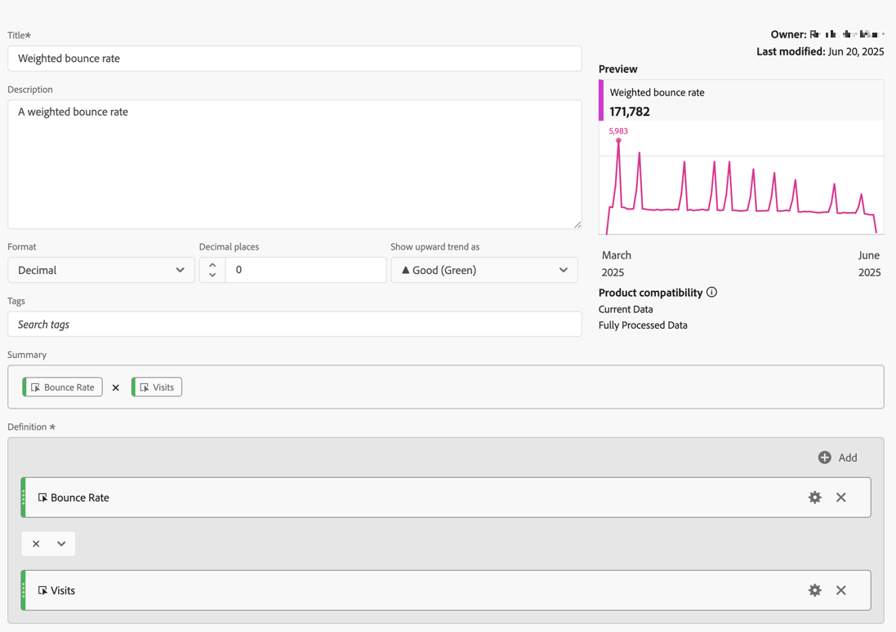

# Gefilterde en gewogen cijfers

Dit artikel bevat voorbeelden van gefilterde en gewogen meetwaarden.

## Gefilterde stuitsnelheid

Deze eenvoudige gefilterde metrische gegevens laten alleen de stuiterende frequentie zien voor die pagina&#39;s met meer dan 100 bezoeken:

{zoomable="yes"}

Onthoud dat deze formule afhankelijk is van een consistent tijdsbereik. Als u één enkele dag een rapport in werking stelt, is om het even welke pagina met meer dan 20 bezoeken de moeite waard het bekijken. Als u het een maand in werking stelt, kunt u het filter willen meer bezoeken omvatten.

## Gefilterde stuitsnelheid met percentiel

Dit filter toont het stuitpercentage voor de bovenste 30 procent van de pagina&#39;s, wanneer gesorteerd op bezoeken.

{zoomable="yes"}

## Gewogen stuitkoers

Stel dat u wilt sorteren op stuitfrequentie in het algemeen, maar pagina&#39;s met hogere bezoeken moeten hoger in de lijst staan. U kunt een gewogen Bounce Rate maken die er als volgt uitziet:

