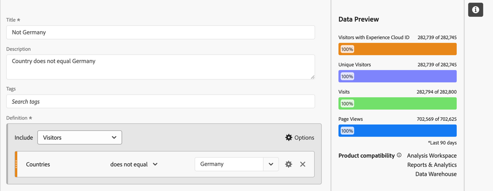
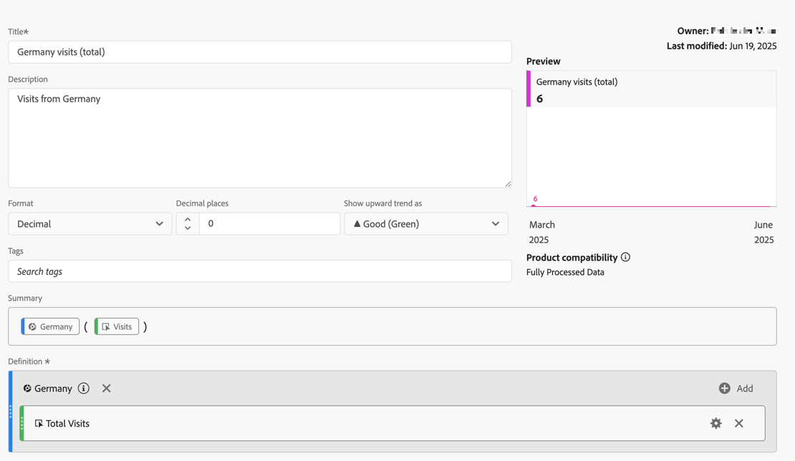

# Gesegmenteerde metriek

In de [ Berekende metrische bouwer ](cm-build-metrics.md#definition-builder), kunt u segmenten binnen uw metrische definitie toepassen. Het toepassen van segmenten is nuttig als u metriek voor een ondergroep van uw gegevens in uw analyse wilt gebruiken.

>[!NOTE]
>
>De definities van het segment worden bijgewerkt door de [ bouwer van het Segment ](/help/components/segmentation/segmentation-workflow/seg-build.md). Als u een verandering in een segment aanbrengt, wordt het segment automatisch bijgewerkt overal het wordt gebruikt, met inbegrip van als het segment deel van een berekende metrische definitie uitmaakt.
>

Je wilt meetgegevens vergelijken voor Duitse mensen die interageren met je merk versus mensen buiten Duitsland. U kunt dus vragen beantwoorden zoals:

1. Hoeveel Duitse versus internationale mensen bezoeken uw meest [ populaire pagina&#39;s ](#popular-pages).
1. Hoeveel Duitse versus internationale mensen in [ totaal ](#totals) online met uw merk deze maand hebben gecommuniceerd.
1. Wat zijn de [ percentages ](#percentages) van Duitsers en internationale mensen die uw populaire pagina&#39;s hebben bezocht?

Zie de volgende secties om te illustreren hoe u deze vragen kunt beantwoorden met gesegmenteerde meetgegevens. In voorkomend geval wordt verwezen naar meer gedetailleerde documentatie.

## Populaire pagina&#39;s

1. [ creeer berekende metrisch ](../cm-workflow.md) van een project van Workspace, genoemd `Germany`.
1. Van binnen de [ Berekende metrische bouwer ](cm-build-metrics.md), [ creeer een segment ](/help/components/segmentation/segmentation-workflow/seg-build.md), titel `Germany`, dat het gebied van Landen gebruikt.

   >[!TIP]
   >
   >In de Berekende metrische bouwer, kunt u een segment tot stand brengen direct gebruikend het paneel van Componenten.
   >   

   Je segment zou er zo kunnen uitzien.

   

1. Terug in de Berekende metrische bouwer, gebruik het segment om berekende metrisch bij te werken.

   

Herhaal bovenstaande stappen voor de internationale versie van de berekende metrische waarde.

1. Maak een berekende metrische waarde van het Workspace-project met de naam `Non Germany visits` .
1. Van binnen de Berekende metrische bouwer, creeer een segment, genoemd `Not Germany`, dat het gebied van het Land van CRM van uw gegevens van CRM gebruikt om te bepalen waar een persoon uit komt.

   Uw segment zou moeten kijken als.

   

1. Terug in de Berekende metrische bouwer, gebruik het segment om berekende metrisch bij te werken.

   

1. Maak een project in Analysis Workspace, waar je kijkt naar pagina&#39;s die door Duitse en niet-Duitse bezoekers worden bezocht.

   

## Totalen

1. Creeer twee nieuwe berekende metriek die op het Grote Totaal wordt gebaseerd. Open elk van de eerder gemaakte segmenten, wijzig de naam van het segment, stel de **[!UICONTROL Metric type]** for **[!UICONTROL People]** to **[!UICONTROL Grand Total]** in en gebruik **[!UICONTROL Save As]** om het segment op te slaan met de nieuwe naam. Bijvoorbeeld:

   

1. Voeg een nieuwe tabelvisualisatie voor vrije vorm toe aan uw Workspace-project en geef het totaal aantal pagina&#39;s voor dit jaar weer.

   

## Percentage

1. Creeer twee nieuwe berekende metriek die een percentage van de berekende metriek berekenen u vroeger creeerde.

    toont

1. Werk uw Workspace-project bij.

   

