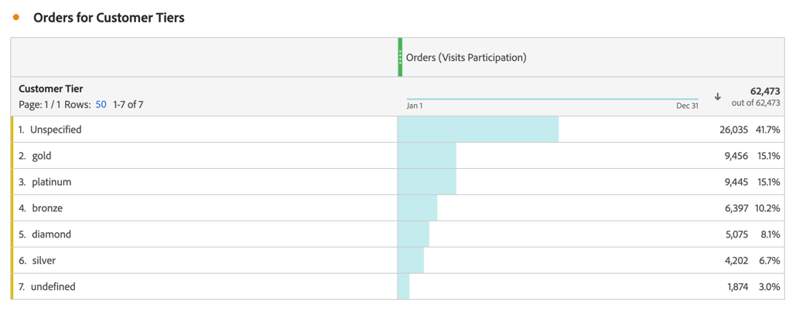

# Metrische gegevens voor deelname

De metriek van de participatie wordt gebruikt om te kwantificeren hoe de individuele waarden voor een afmeting (zoals de Mening van de Pagina) tot bijdragen, of aan bezoeken deelnemen die specifieke metrisch (zoals Orders) bevatten.

In de onderstaande stappen ziet u hoe u een metrische deelname kunt maken.

1. [ creeer een berekende metrische ](../cm-workflow.md), en in [ Berekende metrieke bouwer ](cm-build-metrics.md), noem metrisch `Orders (Visit Participation)` of iets gelijkaardig.
1. Sleep een metrische waarde met een succesgebeurtenis, bijvoorbeeld [!DNL Online Orders] , naar het [!UICONTROL **[!UICONTROL Definition]**] -gebied.
1. Selecteer  voor metrisch.
1. In popup die verschijnt, selecteer **[!UICONTROL Use a non-default attribution model]** om het [ attributiemodel ](m-metric-type-alloc.md#attribution-models) van die gebeurtenis aan **[!UICONTROL Participation]** te bepalen en **[!UICONTROL Visits]** voor [!UICONTROL Container] te selecteren. Selecteer **[!UICONTROL Apply]** om te bevestigen.

   

   **(Verdeling|Bezoekingen|30 dagen)** wordt toegevoegd aan de naam van de metrische component.

1. Selecteer [!UICONTROL **sparen**] om metrisch te bewaren.
1. Gebruik berekende metrisch in uw rapport. Gebruik bijvoorbeeld de berekende [!DNL Orders (Session Participation)] -metrische waarde in een rapport om te tonen welke Klantreeks heeft bijgedragen aan (of heeft deelgenomen aan) sessies die een bestelling bevatten.

   

<!--

The following information explains how to create a metric that shows which pages contributed to (or participated in) visits that contained an order.

This type of information could be useful for any content owner.

>[!NOTE]
>
>You can enable participation metrics in the Admin Tools, but only for custom events 1 - 100.

1. Begin creating a calculated metric, as described in [Build metrics](/help/components/calculated-metrics/workflow/c-build-metrics/cm-build-metrics.md).

1. In the Calculated metrics builder, name the metric "Participation".

1. Drag the success event "Orders" into the Definition canvas.

1. Change the [attribution model](/help/components/calculated-metrics/workflow/c-build-metrics/m-metric-type-alloc.md) of that event to **[!UICONTROL Participation]** under the **[!UICONTROL Settings]** gear. Select **[!UICONTROL Visit]** lookback. The definition should look similar to this:

   

1. Select [!UICONTROL **Save**] to save the metric.

1. Use the calculated metric in a **[!UICONTROL Pages]** report.

    

1. (Optional) Share the metric with other users in your organization, as described in [Share calculated metrics](/help/components/calculated-metrics/workflow/cm-sharing.md).
-->