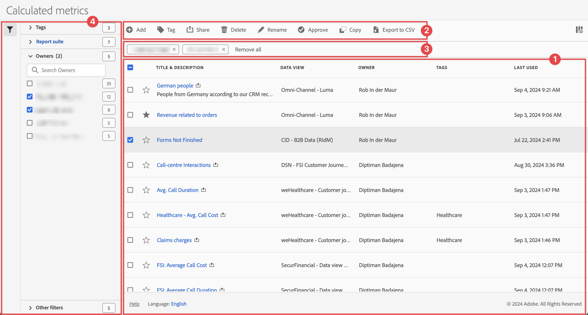

# Berekende waarden beheren

U kunt berekende metriek delen, filteren, labelen, goedkeuren, hernoemen, kopiëren, verwijderen, exporteren en berekende metriek markeren als favoriet vanuit een centrale beheerinterface van [!UICONTROL Calculated metrics] . Berekende waarden beheren:

* Selecteer **[!UICONTROL Components]** in de hoofdinterface en selecteer vervolgens **[!UICONTROL Calculated metrics]** .

## Het berekende manager van metriek

Het Berekende manager van metriek heeft de volgende interfaceelementen:

### Lijst met berekende metriek

In de lijst met berekende metriek ➊ worden alle berekende metriek weergegeven die u bezit of die met u hebt gedeeld. De lijst heeft de volgende kolommen:

<!-- I think this table incorrectly talks about quick calculated metrics -->

| Kolom | Beschrijving |
| --- | --- | 
|  | Selecteer om  of niet-gunst  te begunstigen berekende metrisch. Zie [&#x200B; Metrisch berekend Teken als favoriet &#x200B;](cm-favorite.md) |
| **[!UICONTROL Title and description]** | Om berekende metrisch uit te geven, selecteer de titelverbinding, die [&#x200B; Berekende metriek bouwer &#x200B;](c-build-metrics/cm-build-metrics.md) opent. Een gedeelde berekende metrische waarde wordt vermeld met . |
| **[!UICONTROL Report suite]** | De rapportsuites die dit berekende metrisch van toepassing is. |
| **[!UICONTROL Owner]** | Eigenaar van de berekende metrische waarde. Als gebruiker ziet u alleen de annotaties die u hebt of de annotaties die met u worden gedeeld. |
| **[!UICONTROL Tags]** | Hier worden de codes voor deze berekende metrische waarde weergegeven. |
| **[!UICONTROL Shared with]** | Hiermee geeft u aan met hoeveel personen of groepen u de berekende metrische waarde hebt gedeeld. Selecteer deze optie om het dialoogvenster **[!UICONTROL Share Calculated metric]** te openen. Zie [&#x200B; Aandeel berekende metriek &#x200B;](cm-sharing.md) voor meer informatie. |
| **[!UICONTROL Date modified]** | De datum en de tijd dat berekende metrisch het laatst werd gewijzigd. |
| **[!UICONTROL Used in]** | Hiermee kunt u zien waar berekende metriek momenteel worden gebruikt en hoe vaak deze in elk gebied worden gebruikt. 
Bijvoorbeeld, als berekende metrisch in 40 projecten en 2 alarm wordt gebruikt, dan toont de waarde van deze kolom als [!UICONTROL **42 componenten**]. 
Selecteer de waarde in deze kolom om de uitsplitsing te zien van waar de berekende metriek (bijvoorbeeld, [!UICONTROL **Projecten (40)**] worden gebruikt, [!UICONTROL **Mobiele Scorecards (2)**]). Bovendien kunt u de lijst van punten bekijken waar de berekende metriek worden gebruikt. Bijvoorbeeld, zie zo de lijst van projecten waar zij worden gebruikt, selecteer de [!UICONTROL **Projecten (40)**] verbinding.

Elk van de volgende gebieden toont het aantal instanties van berekende metriek die in dat gebied worden gebruikt:
 <ul><li>[!UICONTROL **Projecten**]
Bevat berekende metriek die [&#x200B; in de berekende metrische bouwer &#x200B;](c-build-metrics/cm-build-metrics.md) werden gecreeerd en voor alle projecten beschikbaar zijn.
</li><li>[!UICONTROL **Ad hoc componenten**]
Bevat berekende metriek die [&#x200B; als snelle berekende metriek &#x200B;](/help/analyze/analysis-workspace/components/apply-create-metrics.md#create-calculated-metrics-for-a-single-project) werden gecreeerd en beschikbaar slechts binnen één enkel project zijn.
</li><li>[!UICONTROL **Geplande projecten**]</li><li>[!UICONTROL **Mobiele Scorecards**]</li><li>[!UICONTROL **Annotaties**]</li><li>[!UICONTROL **Report Builder**]
Als u deze optie selecteert, wordt een CSV-bestand gedownload met de volgende kolommen gegevens:
<ul><li>Report Builder-naam</li><li>Laatst geopend</li><li>Laatst geopende IMS-gebruikersnaam</li><li>Laatst geopende gebruikersnaam</li></ul></li></ul>
Deze informatie kan u helpen bepalen of een component voor gebruikers in uw organisatie waardevol is, waar het wordt gebruikt, en of het moet worden geschrapt of worden gewijzigd.

Houd rekening met het volgende wanneer u deze kolom weergeeft:
<ul><li>Deze informatie is alleen beschikbaar voor systeembeheerders.</li><li>[!UICONTROL **Gebruikt in**] kolom toont niet door gebrek. Gebruik  om de vertoning van deze kolom te vormen.</li><li>Deze informatie omvat geen gebruik van de API of de Data Warehouse.</li><li>Als er geen gegevens in deze kolom voor een bepaalde component zijn maar het heeft a [!UICONTROL **laatst gebruikte**] datum, zou de component in een analyse kunnen worden gebruikt zonder worden bewaard.</li><li>Gebruiksgegevens zijn beschikbaar vanaf september 2023.</li></ul>
U kunt het [&#x200B; Woordenboek van Gegevens &#x200B;](/help/analyze/analysis-workspace/components/data-dictionary/data-dictionary-overview.md) samen met deze informatie gebruiken om u spoor van te houden en beter te begrijpen hoe de componenten in uw organisatie worden gebruikt.
 |
| **[!UICONTROL Last Used]** | Wanneer de berekende metrische waarde het laatst werd gebruikt. |

{style="table-layout:auto"}

Gebruik  om te specificeren welke kolommen u wilt tonen.

### Actiebalk

U kunt op filters actie ondernemen met de actiebalk ➋ . De actiebalk bevat de volgende handelingen:

| Pictogram | Handeling | Beschrijving |
|:---:|---|---|
|  | **[!UICONTROL Add]** | Voeg een andere berekende metriek toe, gebruikend [&#x200B; Berekende metrische bouwer &#x200B;](c-build-metrics/cm-build-metrics.md). |
|  | [!UICONTROL *Onderzoek door titel*] | Wanneer er geen berekende metrisch is geselecteerd in de lijst, zoekt u naar filters met dit zoekveld. |
|  | **[!UICONTROL Tag]** | Label de geselecteerde berekende metriek. Selecteer in het dialoogvenster **[!UICONTROL Tag Calculated metric]** de labels voor de geselecteerde berekende metrische waarde of hef de selectie hiervan op. Selecteer **[!UICONTROL Save]** om de labels voor de geselecteerde berekende metriek op te slaan. Zie [&#x200B; Markering berekende metriek &#x200B;](cm-tagging.md) voor meer informatie. |
|  | **[!UICONTROL Share]** | Deel de geselecteerde berekende metriek. In de **[!UICONTROL Share Calculated metrics]** dialoog, kunt u  *individuen of groepen van het Onderzoek* of u kunt selecteren **[!UICONTROL Organization]** of **[!UICONTROL Groups]**. Selecteer **[!UICONTROL Save]** om deeldetails voor de geselecteerde berekende metriek op te slaan. Zie [&#x200B; Aandeel berekende metriek &#x200B;](cm-sharing.md) voor meer informatie. |
|  | **[!UICONTROL Delete]** | Verwijder de geselecteerde berekende metriek. U wordt gevraagd om een bevestiging. |
|  uit | **[!UICONTROL Rename]** | Wijzig de naam van één geselecteerde berekende metrische waarde. Als deze optie is geselecteerd, kunt u de naam van de berekende metrische waarde inline wijzigen. |
|  | **[!UICONTROL Approve]** | Goedkeuren van de geselecteerde berekende metriek. Zie [&#x200B; berekende metriek goedkeuren &#x200B;](cm-approving.md). |
|  | **[!UICONTROL Copy]** | Kopieer de geselecteerde berekende metriek. Nieuwe berekende metriek worden gemaakt met dezelfde naam en hetzelfde achtervoegsel `(Copy)` |
|  | **[!UICONTROL Export to CSV]** | Exporteer de berekende metriek naar een `Calculated  metric List.csv` -bestand. |

### Actieve filterbalk

De filterbalk ➌ geeft de actieve filters weer die van het filterdeelvenster zijn toegepast op de lijst met berekende metriek (indien aanwezig). U kunt een filter snel verwijderen gebruikend . Als er meer dan één filter is opgegeven, kunt u alle filters verwijderen met **[!UICONTROL Remove all]** .

### Deelvenster Filter

U kunt de lijst van berekende metrisch filtreren gebruikend  **[!UICONTROL Filter]** linkerpaneel ➍. In het filterdeelvenster worden het type filter en het aantal berekende metingen weergegeven die het specifieke filter respecteren. Selecteer  om de vertoning van het filterpaneel van een knevel te voorzien.

Zie [&#x200B; Filter de lijst van berekende metriek &#x200B;](cm-filter.md) voor meer informatie.

<!-- OLD CONTENT

The Calculated metrics page offers many ways of curating metrics, such as sharing, filtering, tagging, approving, copying, deleting, and marking as favorites.

The Calculated metrics page shows you all the segments you own and that have been shared with you. Admin-level users can see all custom metrics in the organization. 

## Access the Calculated metrics manager

1. In Adobe Analytics, select [!UICONTROL **Components**] > [!UICONTROL **Calculated metrics**].

## Available actions in the Calculated metrics manager

In the Calculated metrics manager, you can:

* [Filter calculated metrics](/help/components/calculated-metrics/workflow/cm-filter.md)

* [Mark calculated metrics as favorites](/help/components/calculated-metrics/workflow/cm-favorite.md)

* [Approve calculated metrics](/help/components/calculated-metrics/workflow/cm-approving.md)

* [Tag calculated metrics](/help/components/calculated-metrics/workflow/cm-tagging.md)

* [Share calculated metrics](/help/components/calculated-metrics/workflow/cm-sharing.md)

* Export a calculated metric to a CSV file. 

* [Copy calculated metrics](/help/components/calculated-metrics/workflow/cm-copy.md)

* Delete calculated metrics

## Configure columns

You can configure the information displayed for each calculated metric in the Calculated metrics manager by configuring the columns that are displayed.

To configure the visible columns in the Calculated metrics manager:

1. In Adobe Analytics, select the **[!UICONTROL Components]** tab, then select **[!UICONTROL Calculated metrics]**. 

1. In the Calculated metrics manager, select the **Customize columns** icon , then select the columns that you want to be displayed in the Calculated metrics manager.

   The following columns are available:

   | Column title  | Description |
   |---|---|
   | Favorites  | Displays star icons next to each calculated metric, allowing you to mark calculated metrics as favorites. For more information, see [Mark calculated metrics as favorites](/help/components/calculated-metrics/workflow/cm-favorite.md). |
   | Title and description | These values are provided in the Calculated metric builder. To edit the title and description, select the title link to open the Calculated metric builder.  |
   | Report suite | Indicates in which report suite the metric was last saved.  |
   | Owner | Indicates who owns the custom metric. As a non-admin, you can see only metrics you own or those that were shared with you.  |
   | Tags | Shows tags that were applied to the metric, either by you or by people who shared the calculated metric with you.  |
   | Shared with | Lists individuals or groups (admin only) or All (admin only) that you shared the calculated metric with. 
When a calculated metric is being shared, a share icon displays next to the calculated metric name.
  |
   | Date modified | Indicates the date when the custom metric was last modified.  |
   | Used in | Shows where calculated metrics are currently being used, and how many times they are being used in each area. 
For example, if the calculated metric is being used in 40 projects and 2 alerts, then the value of this column shows as [!UICONTROL **42 components**]. 
Select the value in this column to see the breakdown of where the calculated metrics are being used (for example, [!UICONTROL **Projects (40)**], [!UICONTROL **Alerts (2)**]). Furthermore, you can view the list of items where the calculated metrics are being used. For example, so see the list of projects where they are being used, select the [!UICONTROL **Projects (40)**] link.

Each of the following areas shows the number of instances of calculated metrics being used in that area:
 <ul><li>[!UICONTROL **Projects**]
Contains calculated metrics that were [created in the calculated metric builder](/help/analyze/analysis-workspace/components/apply-create-metrics.md#create-calculated-metrics-for-all-projects) and are available for all projects.
</li><li>[!UICONTROL **Ad hoc components**]
Contains calculated metrics that were [created as quick calculated metrics ](/help/analyze/analysis-workspace/components/apply-create-metrics.md#create-calculated-metrics-for-a-single-project) and are available only within a single project.
</li><li>[!UICONTROL **Scheduled projects**]</li><li>[!UICONTROL **Mobile Scorecards**]</li><li>[!UICONTROL **Annotations**]</li><li>[!UICONTROL **Alerts**]</li><li>[!UICONTROL **Report Builder**]
Selecting this option downloads a CSV file, with the following columns of data:
<ul><li>Report Builder Name</li><li>Last accessed</li><li>Last accessed IMS User ID</li><li>Last accessed user name</li></ul>
When viewing information for Report Builder, usage information is available starting in September 2024.
</li></ul>
This information can help you determine whether a component is valuable to users in your organization, where it is used, and if it needs to be deleted or modified.

Consider the following when viewing this column:
<ul><li>This information is available only to system administrators.</li><li>The [!UICONTROL **Used in**] column does not display by default. [Configure columns](#configure-columns) to display it.</li><li>If a calculated metric includes another calculated metric in its definition, any use of that calculated metric is not shown in the [!UICONTROL **Used in**] column. If a calculated metric is included in the definition of another type of component (such as a segment), then usage is shown in the [!UICONTROL **Used in**] column.</li><li>This information does not include usage from the API or Data Warehouse.</li><li>If there is no data in this column for a given component but it has a [!UICONTROL **Last used**] date, the component might have been used in an analysis without being saved.</li><li>Usage information is available starting in September 2023.</li></ul>
You can use the [Data Dictionary](/help/analyze/analysis-workspace/components/data-dictionary/data-dictionary-overview.md) along with this information to help you keep track of and better understand how components are being used in your organization.
 |
   | Last used | Shows the date when the calculated metric was last used in any of the following areas: <ul><li>Alerts</li><li>Calculated metrics</li><li>Projects</li><li>Scheduled projects</li></ul> 
This information can help you determine whether a component is valuable to users in your organization, where it is used, and if it needs to be deleted or modified.

Consider the following when viewing this column:
<ul><li>This information does not include usage from the API, Report Builder, or Data Warehouse.</li><li>For some components, this column might not contain data if the component was last used prior to September 2023.</li><li>This information is available only to system administrators.</li></ul>
You can use the [Data Dictionary](/help/analyze/analysis-workspace/components/data-dictionary/data-dictionary-overview.md) along with this information to help you keep track of and better understand how components are being used in your organization. |

   {style="table-layout:auto"}

-->