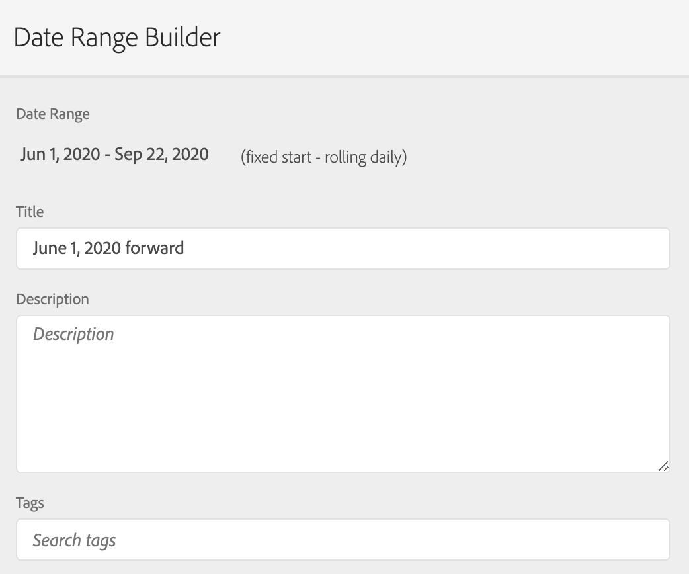

# Beperk een Virtuele rapportreeks tot bepaalde data

{{available-existing-customers}}

Wanneer we stitching inschakelen, begint de stitching op een bepaalde datum. Laten we ervan uitgaan dat de datum 1 juni is. De CDA Virtual Report suite bevat niet-opgeslagen gegevens voor 1 juni. U kunt om het even welke gegevens in de Virtuele rapportreeks vóór 1 Juni willen verbergen zodat uw analyse zich op datumwaaiers kan concentreren nadat het stitching begon.

U kunt de gegevens van de Virtuele rapportreeks tot bepaalde data beperken door het volgende te doen:

## Stap 1: Creëer Virtuele rapportreeks met een het rollen-dagelijkse datumwaaier

Wanneer u de Virtuele rapportreeks, onder Componenten opstelt, voeg in een datumwaaier toe die een vaste begin, met een het rollen-dagdatumwaaier heeft. De vaste start zou de dag moeten zijn waarop stitching begon.

## Stap 2: Maak een &quot;exclude-segment&quot;

Vervolgens maakt u een raaksegment dat het datumbereik in een container voor uitsluiten in een andere container voor uitsluiten plaatst. Het is een &quot;uitsluiting&quot;.

De reden voor &quot;sluit uit&quot;is dat de datumwaaiers bedoeld zijn om de datumwaaier van het rapport met voeten te treden. Als u dus slechts 1 juni vooruitgaat, zal het altijd de rapportdatum bereiken 1 juni vooruit. Dit zal tot ongewenste resultaten leiden. Wanneer u &quot;uitsluiten&quot; kiest, wordt dit gedrag genegeerd en worden alleen de gegevens die u kunt tekenen beperkt tot het juiste datumbereik.

## Stap 3: Pas dit segment toe op uw Virtual Report-suite voor analysemogelijkheden tussen apparaten

## Stap 4: Zie de resultaten in de rapportage

De rapportage begint nu op de gewenste datum, dezelfde dag waarop de stitching voor het eerst is uitgevoerd:

