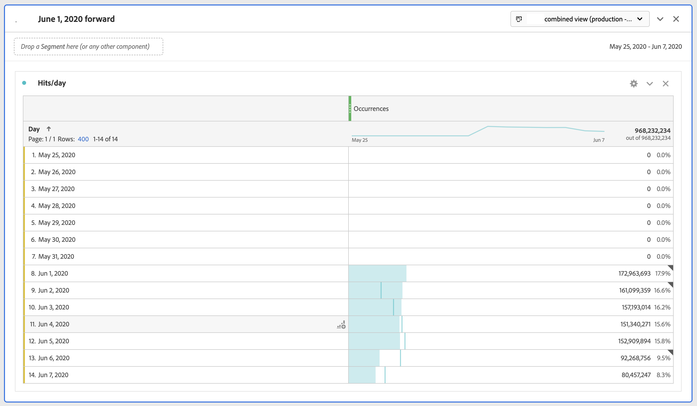

# Een vrijwillige VUT-regeling beperken tot bepaalde datums

Wanneer we stitching inschakelen, begint de stitching op een bepaalde datum. Laten we ervan uitgaan dat de datum 1 juni is. De vrijwillige VUT-regeling van de CDA zal vóór 1 juni onaangekondigde gegevens bevatten. U kunt om het even welke gegevens in het VRS vóór 1 Juni willen verbergen zodat uw analyse zich op datumwaaiers kan concentreren nadat het stitching begon.

U kunt de VRS-gegevens als volgt beperken tot bepaalde datums:

## Stap 1: VRS maken met een datumbereik dat dagelijks wordt verschoven

Als u de vrijwillige VUT-regeling instelt, voegt u onder Componenten een datumbereik toe met een vaste start, met een doorlopend-dagelijks datumbereik. De vaste start zou de dag moeten zijn waarop stitching begon.

## Stap 2: Een segment voor uitsluiten maken

Vervolgens maakt u een raaksegment dat het datumbereik in een container voor uitsluiten in een andere container voor uitsluiten plaatst. Het is een &quot;uitsluiting&quot;.

De reden voor &quot;sluit uit&quot;is dat de datumwaaiers bedoeld zijn om de datumwaaier van het rapport met voeten te treden. Als u dus slechts 1 juni vooruitgaat, zal het altijd de rapportdatum bereiken 1 juni vooruit. Dit zal tot ongewenste resultaten leiden. Wanneer u &quot;uitsluiten&quot; kiest, wordt dit gedrag genegeerd en worden alleen de gegevens die u kunt tekenen beperkt tot het juiste datumbereik.

## Stap 3: Dit segment toepassen op uw CDA VRS

## Stap 4: Zie de resultaten in de rapportage

De rapportage begint nu op de gewenste datum, dezelfde dag waarop de stitching voor het eerst is uitgevoerd:

