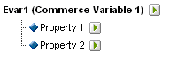
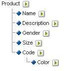

# Informatie over subclassificaties

Adobe Analytics ondersteunt classificatiemodellen op één niveau en die op meerdere niveaus. Met een classificatiehiërarchie kunt u een classificatie toepassen op een classificatie.

>[!NOTE]
>
>Subclassificatie heeft betrekking op de mogelijkheid classificaties van classificaties te maken. Dit is echter niet hetzelfde als een [!UICONTROL Classification Hierarchy] dat wordt gebruikt om [!UICONTROL Hierarchy]-rapporten te maken. Zie [Classificatiehiërarchieën](/help/admin/admin/conversion-var-admin/classification-hierarchies.md) voor meer informatie over classificatiehiërarchieën.

Bijvoorbeeld:

Elke classificatie in dit model is onafhankelijk en komt overeen met een nieuw subrapport voor de geselecteerde rapportagevariabele. Bovendien vormt elke classificatie één gegevenskolom in het gegevensbestand, met de classificatienaam als kolomkop. Bijvoorbeeld:

| SLEUTEL | EIGENSCHAP 1 | EIGENSCHAP 2 |
|---|---|---|
| 123 | ABC | A12B |
| 456 | DEF | C3D4 |

Zie [Classificatiegegevensbestanden](/help/components/classifications/importer/c-saint-data-files.md) voor meer informatie over het gegevensbestand.

Classificaties op meerdere niveaus bestaan uit ouder- en onderliggende classificaties. Bijvoorbeeld:

**Bovenliggende classificaties:** een bovenliggende classificatie is elke classificatie die een bijbehorende onderliggende classificatie heeft. Een classificatie kan zowel een ouderclassificatie als een kindclassificatie zijn. De bovenliggende classificaties komen overeen met classificaties op één niveau.

**Onderliggende classificaties:** Een onderliggend classificatienummer is een classificatie die een andere classificatie heeft als bovenliggend in plaats van de variabele. Onderliggende classificaties bieden aanvullende informatie over hun ouderclassificatie. Een [!UICONTROL Campaigns]-classificatie kan bijvoorbeeld een onderliggende classificatie van eigenaar van campagne hebben. [!UICONTROL Numeric] classificaties functioneren ook als metriek in classificatierapporten.

Elke classificatie, bovenliggend of onderliggend, vormt één gegevenskolom in het gegevensbestand. De kolomkop voor een onderliggende classificatie met de volgende notatie:

`<parent_name>^<child_name>`

Zie [Classificatiegegevensbestanden](/help/components/classifications/importer/c-saint-data-files.md) voor meer informatie over de gegevensbestandsindeling.

Bijvoorbeeld:

| SLEUTEL | EIGENSCHAP 1 | Eigenschap 1^Eigenschap 1-1 | Eigenschap 1^Eigenschap 1-2 | Eigenschap 2 |
|---|---|---|---|---|
| 123 | ABC | Groen | Klein | A12B |
| 456 | DEF | Rood | Groot | C3D4 |

Hoewel het dossiermalplaatje voor een classificatie op meerdere niveaus complexer is, is de macht van classificaties op meerdere niveaus dat de afzonderlijke niveaus als afzonderlijke dossiers kunnen worden geupload. Deze benadering kan worden gebruikt om de hoeveelheid gegevens te minimaliseren die periodiek (dagelijks, wekelijks, etc.) moet worden geupload door gegevens in classificatieniveaus te groeperen die in tijd tegenover die veranderen die niet.

>[!NOTE]
>
>Als de kolom [!UICONTROL Key] in een gegevensbestand leeg is, genereert Adobe automatisch unieke sleutels voor elke gegevensrij. U voorkomt mogelijke bestandsbeschadiging wanneer u een gegevensbestand uploadt met classificatiegegevens van het tweede niveau of het hogere niveau door elke rij van de kolom [!UICONTROL Key] te vullen met een asterisk (*).

## Voorbeelden

>[!NOTE]
>
>Gegevens over de indeling van producten zijn beperkt tot gegevenskenmerken die rechtstreeks verband houden met het product. De gegevens zijn niet beperkt tot de wijze waarop de producten zijn gecategoriseerd of op de website worden verkocht. Gegevenselementen zoals verkoopcategorieën, browserknooppunten van sites of verkoopitems zijn geen gegevens over de productclassificatie. In plaats daarvan worden deze elementen vastgelegd in de conversievariabelen van rapporten.

Wanneer u gegevensbestanden uploadt voor deze productclassificatie, kunt u de classificatiegegevens uploaden als één bestand of als meerdere bestanden (zie hieronder). Door de kleurcode in bestand 1 en de kleurnaam in bestand 2 te scheiden, hoeven de gegevens over de kleurnaam (die mogelijk slechts een paar rijen zijn) alleen te worden bijgewerkt wanneer nieuwe kleurcodes worden gemaakt. Hiermee verwijdert u het kleurnaamveld (CODE^COLOR) uit het vaker bijgewerkte bestand 1 en verkleint u de bestandsgrootte en complexiteit bij het genereren van het gegevensbestand.

### Productclassificatie - Enkel bestand {#section_E8C5E031869C449F9B636F5EB3BFEC17}

| SLEUTEL | PRODUCTNAAM | PRODUCTGEGEVENS | GENDER | GROOTTE | CODE | CODE^KLEUR |
|---|---|---|---|---|---|---|
| 410390013 | Polo-SS | Polo Shirt, korte hoes (M,01) voor heren | M | M | 01 | Steen |
| 410390014 | Polo-SS | Polo Shirt, korte hoes (L,03) voor heren | M | L | 03 | Heather |
| 410390015 | Polo-LS | Polo Shirt, lange hoes (S,23) | F | S | 23 | Aqua |

### Productclassificatie - Meerdere bestanden (bestand 1) {#section_A99F7D0F145540069BA4EEC0597FF13F}

| SLEUTEL | PRODUCTNAAM | PRODUCTGEGEVENS | GENDER | GROOTTE | CODE |
|---|---|---|---|---|---|
| 410390013 | Polo-SS | Polo Shirt, korte hoes (M,01) voor heren | M | M | 01 |
| 410390014 | Polo-SS | Polo Shirt, korte hoes (L,03) voor heren | M | L | 03 |
| 410390015 | Polo-LS | Polo Shirt, lange hoes (S,23) | F | S | 23 |

### Productclassificatie - Meerdere bestanden (bestand 2) {#section_19ED95C33B174A9687E81714568D56A3}

| SLEUTEL | CODE | CODE^KLEUR |
|---|---|---|
| * | 01 | Steen |
| * | 03 | Heather |
| * | 23 | Aqua |
