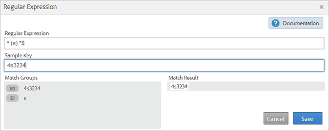

# Classificatieregels (verouderd)

De classificatieregels kijken regelmatig naar niet-geclassificeerde termen. Als een regelovereenkomst wordt gevonden, voegen de regels automatisch de termijnen aan uw lijsten van classificatiegegevens toe. U kunt classificatieregels ook gebruiken om bestaande sleutels te overschrijven.

**[!UICONTROL Analytics]** > **[!UICONTROL Admin]** > **[!UICONTROL Classification Rule Builder]**

De Bouwer van de Regel laat u de reeks van de a *classificatieregel* tot stand brengen, die een lijst van *classificatieregels* is. Een regel komt overeen met criteria die u opgeeft en voert vervolgens een handeling uit.

Classificatieregels zijn handig voor:

* **E-mail** en **de advertenties van de Vertoning**: Creeer classificatieregels om individuele vertoning en campagnes te groeperen zodat u kunt leren hoe de campagnes van de Vertoning tegen e-mailcampagnes presteren.

* **het Volgen codes**: Creeer classificatieregels om zeer belangrijke waarden te categoriseren die uit koorden in het volgen codes worden afgeleid, en hen aan specifieke criteria aan te passen u bepaalt.
* **termijnen van het Onderzoek**: Gebruik [ regelmatige uitdrukkingen ](/help/components/classifications/crb/classification-quickstart-rules.md) en vervangingen om het classificeren van onderzoekstermijnen te vereenvoudigen. Als een zoekterm bijvoorbeeld *`baseball`* bevat, kunt u een *`Sports League`* classificatie instellen op *`MLB`* .

Stel bijvoorbeeld dat een code voor bijhouden van een e-mailcampagne-id:

`em:Summer:20XX:Sale`.

U kunt drie regels instellen in een regelset die de delen van de tekenreeks identificeren en vervolgens de waarden classificeren:

| Regeltype selecteren | Overeenkomstcriteria invoeren | Classificatie instellen | Naar |
|---|---|---|---|
| Begint met | em: | Kanaal | E-mail |
| Eindigt met | Verkoop | Type | Verkoop |
| Bevat | 20XX | Jaar | 20XX |

## Hoe regels worden verwerkt {#how-rules-are-processed}

Belangrijke informatie over de manier waarop classificatieregels worden verwerkt.

<!-- 

about_classification_rules.xml

 -->

* [ Belangrijke Informatie over Regels ](/help/components/classifications/crb/classification-rule-builder.md)
* [ wanneer classificeren de Regels niet Sleutels?](/help/components/classifications/crb/classification-rule-builder.md)
* [Info over Prioriteit regel](/help/components/classifications/crb/classification-quickstart-rules.md)

>[!NOTE]
>
>De [!UICONTROL Rule Builder] biedt geen ondersteuning voor classificaties van het type Numeric 2.

## Belangrijke informatie over regels

* Specificeer [ groepstoestemmingen ](https://experienceleague.adobe.com/docs/analytics/admin/user-product-management/user-groups/groups.html) voor classificaties in [!UICONTROL Admin Tools].

* **Reguliere uitdrukkingen**: De hulp is beschikbaar onder [ Reguliere Uitdrukkingen in de Regels van de Classificatie ](/help/components/classifications/crb/classification-quickstart-rules.md).

* **de suites van het Rapport**: U kunt geen classificatie kiezen tot minstens één rapportreeks wordt geselecteerd. U kunt niet de rapportreeks toepassen tot u de regelreeks hebt gecreeerd en een variabele toegewezen.

  Wanneer u de regelreeks test, gebruik sleutels (de variabele die) van het rapport wordt geclassificeerd om te zien hoe zij door de regelreeks zullen worden beïnvloed. (De [ sleutel ](/help/components/classifications/importer/c-saint-data-files.md) is de variabele die, of de eerste kolom in de classificatie wordt geclassificeerd uploadt lijst.)

* **prioriteit van de Regel**: Als een sleutel veelvoudige regels aanpast die de zelfde classificatie (in de [!UICONTROL Set Classification] kolom) plaatsen, wordt de laatste regel die de classificatie aanpast gebruikt. Zie [ Ongeveer Prioriteit van de Regel ](/help/components/classifications/crb/classification-quickstart-rules.md).

* **Beperkingen op aantal regels**: Geen vastgestelde grens bestaat voor het aantal regels u kunt tot stand brengen. Een groot aantal regels kan echter van invloed zijn op de prestaties van de browser.
* **Verwerking**: De regels worden verwerkt met frequente intervallen, afhankelijk van uw volume van classificatie verwant verkeer.

  De actieve regelverwerking om de vier uur, die classificatiegegevens onderzoeken die typisch één maand teruggaan. De regels controleren automatisch op nieuwe waarden en uploaden de classificaties gebruikend de importeur.

* **die bestaande classificaties** overschrijven: Zie [ wanneer Regels niet Sleutels classificeren?](/help/components/classifications/crb/classification-quickstart-rules.md) Indien nodig kunt u bestaande classificaties verwijderen of verwijderen met de importer.

## Wanneer classificeren de regels sleutels niet?

Wanneer u regels activeert, kunt u bestaande classificaties overschrijven. In de volgende situaties, classificeert een classificatieregel a [ sleutel ](/help/components/classifications/importer/c-saint-data-files.md) niet (variabele) als:

* De sleutel is reeds geclassificeerd en u selecteert niet [ classificaties ](/help/components/classifications/crb/classification-rule-definitions.md) overschrijven.

  U kunt classificaties beschrijven wanneer [ toevoegend en activerend ](/help/components/classifications/crb/classification-quickstart-rules.md) een regel, en wanneer het activeren van een integratie van gegevensschakelaars. (Voor gegevensschakelaars, worden de regels gecreeerd door partners in het Dev Centrum en getoond in [!UICONTROL Classification Rule Builder].)

* Een geclassificeerde sleutel is niet verschenen in de gegevens na een bepaald tijdkader wanneer het beschrijven van een sleutel, zelfs nadat u [ toelaat overschrijft Classificaties ](/help/components/classifications/crb/classification-rule-definitions.md).
* De sleutel wordt niet geclassificeerd en de sleutel wordt nooit doorgegeven in [!DNL Adobe Analytics] na het tijdkader dat ongeveer een maand geleden begint.

  >[!NOTE]
  >
  >In rapporten zijn classificaties van toepassing op elk opgegeven tijdkader, telkens wanneer een sleutel bestaat. Het datumbereik van een rapport heeft geen invloed op de rapportage.


## Regelmatige expressies in classificatieregels {#regex-in-classification-rules}

Gebruik reguliere expressies om consistent opgemaakte tekenreekswaarden te laten overeenkomen met een classificatie. U kunt bijvoorbeeld een classificatie maken van specifieke tekens in een trackingcode. U kunt bepaalde tekens, woorden of tekenpatronen met elkaar in overeenstemming brengen.

>[!NOTE]
>
>Reguliere expressies zijn het meest geschikt voor het bijhouden van codes die gebruikmaken van scheidingstekens.

## Reguliere expressie - voorbeeld van code bijhouden {#section_2EF7951398EB4C2F8E52CEFAB4032669}

>[!NOTE]
>
>Als het volgen code URL wordt gecodeerd, zal het **niet** door de Bouwer van de Regel worden geclassificeerd.

In dit voorbeeld, veronderstel u volgende campagne-identiteitskaart wilt classificeren:

Voorbeeldtoets: `em:JuneSale:20XX0601`

De delen van de volgende code die u wilt classificeren zijn:

* `em` = email
* `JuneSale` = naam campagne
* `20XX0601` = datum

Gewone uitdrukking: `^(.+)\:(.+)\:(.+)$`

Hoe de reguliere expressie correleert met de campagne-id:


Identieke groepen: toont hoe de reguliere expressie overeenkomt met de campagne-id-tekens, zodat u een positie in de campagne-id kunt classificeren.


In dit voorbeeld wordt de regel doorgegeven dat de datum van de campagne `20XX0601` zich op de derde groep `(.+)` bevindt, aangeduid door `$3` .

**[!UICONTROL Rule Builder]**

In [!UICONTROL Rule Builder], vorm de regel als volgt:

| Regeltype selecteren | Overeenkomstcriteria invoeren | Classificatie instellen | Naar |
|---|---|---|---|
| Gewone uitdrukking | &Hoed;(.+)\:(.+)\:(.+)$ | Campagnedatum | $ 3 |

**Syntaxis**

| Gewone uitdrukking | Tekenreeks of resultaat afstemmen | Overeenkomende overeenkomende groepen |
|--- |--- |--- |
| `^(.+)\:(.+)\:(.+)$` | `em:JuneSale:20XX0601` | `$0`: `em:JuneSale:20XX0601` `$1` : em `$2` : JuneSale `$3` : 20XX0601 |
| De syntaxis maken | `^` = begint de lijn () = groepeert karakters en laat u passende karakters tussen de haakjes halen.  `(.+)` = legt één vast ( . ) en ( + ) nog \ = begin van een tekenreeks.  `$` = geeft aan dat het voorgaande teken (of de vorige tekengroep) de laatste op de regel is. |

Zie [ Regelmatige Uitdrukkingen - de Lijst van de Verwijzing ](/help/components/classifications/crb/classification-quickstart-rules.md) voor informatie over wat de karakters in een regelmatige uitdrukking betekenen.

## Reguliere expressie - een specifiek teken classificeren {#section_5D300C03FA484BADACBFCA983E738ACF}

Een manier om een reguliere expressie te gebruiken, is het classificeren van een specifiek teken in een tekenreeks. Stel dat de volgende code twee belangrijke tekens bevat:

Voorbeeldtoets: `4s3234`

* `4` = merknaam
* `s` = identificeert een zoekmachine, zoals Google



**[!UICONTROL Rule Builder]**

In [!UICONTROL Rule Builder], vorm de regel als volgt:

| Regeltype selecteren | Overeenkomstcriteria invoeren | Classificatie instellen | Naar |
|--- |--- |--- |--- |
| Gewone uitdrukking | `^.(s).*$` | Merk en motor | `$0` (legt de eerste twee tekens vast voor de merknaam en het zoekprogramma.) |
| Gewone uitdrukking | `^.(s).*$` | Zoekmachine | `$1` (legt het tweede teken voor Google vast.) |

## Reguliere expressies - overeenstemmende volgcodes van variabele lengte {#section_E86F5BF5C2F44ABC8FFCE3EA67EE3BB2}

In dit voorbeeld wordt getoond hoe u specifieke tekens kunt identificeren tussen dubbele scheidingstekens wanneer u volgcodes van verschillende lengte hebt. Adobe raadt u aan één reguliere expressie te gebruiken voor elke trackingcode.

Voorbeeldtoetsen:

* `a:b`
* `a:b:c`
* `a:b:c:d`

**Syntaxis**


**[!UICONTROL Rule Builder]**

In [!UICONTROL Rule Builder], vorm de regel als volgt:

| Regeltype selecteren | Overeenkomstcriteria invoeren | Classificatie instellen | Naar |
|--- |--- |--- |--- |
| Gewone expressie voor overeenkomende tekenreeks `a:b` | `^([^\:]+)\:([^\:]+)$` | a | `$1` |
| Gewone expressie voor overeenkomende tekenreeks `a:b` | `^([^\:]+)\:([^\:]+)$` | b | `$2` |
| Gewone expressie voor overeenkomende tekenreeks `a:b:c` | `^([^\:]+)\:([^\:]+)\:([^\:]+)$` | a | `$1` |
| Gewone expressie voor overeenkomende tekenreeks `a:b:c` | `^([^\:]+)\:([^\:]+)\:([^\:]+)$` | b | `$2` |
| Gewone expressie voor overeenkomende tekenreeks `a:b:c` | `^([^\:]+)\:([^\:]+)\:([^\:]+)$` | c | `$3` |
| Gewone expressie voor overeenkomende tekenreeks `a:b:c:d` | `^([^\:]+)\:([^\:]+)\:([^\:]+)\:([^\:])$` | d | `$4` |

## Reguliere expressies - voorbeeld &quot;Bevat niet&quot; {#section_FCA88A612A4E4B099458E3EF7B60B59C}

Dit voorbeeld biedt een reguliere expressie die overeenkomt met elke tekenreeks die geen specifieke tekens bevat, in dit geval `13` .

Reguliere expressie:

`^(?!.*13.*).*$`

Testen:

```
a:b:
a:b:1313
c:d:xoxo
c:d:yoyo
```

Resultaten afstemmen:

```
a:b:
c:d:xoxo
c:d:yoyo
```

In dit resultaat geeft `a:b:1313` geen overeenkomst aan.

## Reguliere expressies - referentietabel {#section_0211DCB1760042099CCD3ED7A665D716}

| Uitdrukking | Beschrijving |
|---|---|
| `(?ms)` | Hiermee zorgt u dat de volledige reguliere expressie overeenkomt met een invoer van meerdere regels, zodat de eigenschap . jokerteken voor nieuwe-regeltekens |
| (`?i`) | Maakt het gehele reguliere-expressiefase ongevoelig |
| [`abc`] | Eén teken van: a, b of c |
| [`^abc`] | Elk enkel teken behalve: a, b of c |
| [`a-z`] | Eén teken in het bereik a-z |
| [`a-zA-Z`] | Eén teken in het bereik a-z of A-Z |
| `^` | Begin van regel (komt overeen met het begin van de regel) |
| `$` | Komt overeen met het einde van de regel (of voor nieuwe regel aan het einde) |
| `\A` | Begin van tekenreeks |
| `\z` | Einde van tekenreeks |
| `.` | Willekeurig teken (behalve een nieuwe regel) |
| `\s` | Willekeurig spatieteken |
| `\S` | Willekeurig teken voor niet-witruimte |
| `\d` | Willekeurig cijfer |
| `\D` | Willekeurig niet-cijfer |
| `\w` | Willekeurig woordteken (letter, getal, onderstrepingsteken) |
| `\W` | Willekeurig niet-woordteken |
| `\b` | Willekeurige woordgrens |
| `(...)` | Alle ingesloten gegevens vastleggen |
| `(a\b)` | a of b |
| `a?` | Nul of een van een |
| `a*` | Nul of meer van een |
| `a+` | Een of meer van een |
| `a{3}` | Precies 3 van a |
| `a{3,}` | 3 of meer van |
| `a{3,6}` | Tussen 3 en 6 van een |

Een goed middel voor het testen van regelmatige uitdrukkingsgeldigheid is [ https://rubular.com/ ](https://rubular.com/).

## Info over Prioriteit regel

Als een sleutel aan veelvoudige regels wordt aangepast, en het de zelfde classificatiekolom plaatst die in de [!UICONTROL Set Classification] kolom wordt getoond, wordt de laatste regel gebruikt. Als dusdanig, zou u het belangrijkste laatste in uw regelreeks kunnen willen rangschikken.

<!-- 

rule_priority.xml

 -->

Als u veelvoudige regels creeert die niet de zelfde classificatie delen, is de verwerkingsorde niet van belang.

Wat volgt een onderzoek-termijn regelvoorbeeld dat onderzoekstypes voor een atlete classificeert:

| Regelnummer | Type regel | Overeenkomst | Classificatie instellen | Naar |
|---|---|---|---|---|
| 1 | Bevat | Cowboy | Zoektype | Team |
| 2 | Bevat | Fantastische | Zoektype | Fantastische |
| 3 | Bevat | Romo | Zoektype | Speler |

Als een gebruiker naar *`Cowboys fantasy Tony Romo`* zoekt, wordt de term *`Player`* geclassificeerd, omdat deze overeenkomt met de laatst opgegeven classificatie in de kolom Classificatie instellen.

Stel dat u twee regels instelt in een set voor de volgende zoektermen:

| Regelnummer | Type regel | Overeenkomst | Classificatie instellen | Naar |
|---|---|---|---|---|
| 1 | Bevat | Cowboy | Plaats | Dallas |
| 2 | Bevat | Broncos | Plaats | Denver |

Een gebruiker zoekt naar *`Cowboys vs. Broncos`* . Als de regelbouwer een conflict in regel het aanpassen vindt, is de classificatie voor de tweede regel (Ontkent) op dit onderzoek van toepassing.

## Een classificatieregel toevoegen aan een regelset {#add-classification-to-rule-set}

<!-- 

t_classification_rule.xml

 -->

Voeg regels toe door een voorwaarde aan een classificatie aan te passen, en de actie te specificeren.

>[!NOTE]
>
>In deze procedure, moet u de regels op één of meerdere rapportsuites toepassen. Het aanbevolen aantal regels per regel ligt tussen 500 en 1000, hoewel er geen limieten zijn. Als u meer dan 100 regels hebt, denk na vereenvoudigend uw regel die door [ wordt geplaatst subclassifications ](/help/components/classifications/importer/subclassifications.md) te gebruiken.

Een classificatieregel toevoegen of bewerken:

1. [ creeer een Reeks van de Regel van de Classificatie ](/help/components/classifications/crb/classification-rule-set.md).
1. Klik op **[!UICONTROL Add Rule]** op de pagina met regelsets.

   

1. Klik naast **[!UICONTROL Report Suites]** op **[!UICONTROL Add Suites]** om een of meer rapportsuites op te geven die aan deze regelset moeten worden toegewezen.

   De pagina **[!UICONTROL Select Report Suites]** wordt weergegeven.

   >[!NOTE]
   >
   >De valenvertoning van het rapport op deze pagina *slechts* wanneer de volgende voorwaarden worden voldaan aan:
   >
   >* In de rapportsuites is ten minste één classificatie gedefinieerd voor die variabele in [!UICONTROL Admin Tools] .
   >
   >   (Zie *Variabele* in [ Reeksen van de Regel van de Classificatie ](/help/components/classifications/crb/classification-rule-set.md) voor een verklaring over deze voorwaarde.)
   >
   >* U selecteerde de rapportreeks op de **[!UICONTROL Available Report Suites]** pagina, die vertoningen nadat u [ klikt voeg de Reeks van de Regel ](/help/components/classifications/crb/classification-rule-set.md) toe om de regelreeks tot stand te brengen.

1. Geef op of bestaande waarden moeten worden overschreven:

   | **Regels beschrijven om het even welke bestaande waarden** | (Standaardinstelling) Overschrijf altijd bestaande classificatietoetsen, inclusief classificaties die via de importer (SAINT) zijn geüpload. |
   |---|---|
   | **Regels beschrijven slechts unset waarden** | Vul alleen lege (niet-ingestelde) cellen in. Bestaande classificaties worden niet gewijzigd. |

1. [ bepaalt de regel of de regels ](/help/components/classifications/crb/classification-rule-definitions.md#section_4A5BF384EEEE4994B6DC888339833529).

   

   Voor voorbeelden van het bouwen van regels, zie {de Bouwer van de Regel van de Regel van 0} Classificaties [&#128279;](/help/components/classifications/crb/classification-rule-builder.md) en [ Regelmatige Uitdrukkingen in de Regels van de Classificatie ](/help/components/classifications/crb/classification-quickstart-rules.md).

   >[!NOTE]
   >
   >Als een sleutel overeenkomt met meerdere regels die dezelfde classificatie instellen (in de kolom Indeling instellen), wordt de laatste regel gebruikt die overeenkomt met de classificatie. Zie **Ongeveer Prioriteit van de Regel** hierboven voor meer informatie over het sorteren regels.

1. [ Test uw regelreeks ](/help/components/classifications/crb/classification-quickstart-rules.md).
1. Klik na het testen op **[!UICONTROL Active]** om de regel te valideren en te activeren.

   Als u een regel activeert, wordt het bestand automatisch samengesteld en voor u geüpload.

   De definities van het gebied: Zie [&#128279;](/help/components/classifications/crb/classification-rule-definitions.md) de Bouwer van de Regel van de Classificatie  voor volledige definities van interfaceopties op deze pagina.

## Een set classificatieregel testen

<!-- 

t_classifications_test_rule.xml

 -->

U kunt een classificatieregel of een regelset testen. Als u een test uitvoert, worden alle regels in een set gecontroleerd.

Een set classificatieregel testen:

1. [ creeer een Reeks van de Regel van de Classificatie ](/help/components/classifications/crb/classification-rule-set.md).
1. Voor [!UICONTROL Classification Rule Builder], klik de naam van de regelreeks.
1. Zorg ervoor dat de regelreeks met een rapportreeks wordt geassocieerd.
1. Klik in de regeleditor op **[!UICONTROL Test Rule Set]** .

   

1. Typ of plak testtoetsen in het veld [!UICONTROL Sample Keys] .

   Voorbeelden van voorbeeldtoetsen zijn:

   * Trackingcodes
   * Trefwoorden of woordgroepen zoeken

   Zie [ Regelmatige Uitdrukkingen in de Regels van de Classificatie ](/help/components/classifications/crb/classification-quickstart-rules.md) voor informatie over het testen van regelmatige uitdrukkingen.
1. Klik op **[!UICONTROL Run Test]**.

   Regels die overeenkomen, worden weergegeven in de tabel [!UICONTROL Results] .
1. (Optioneel) Klik op **[!UICONTROL Activate]** om de regel te activeren en bestaande classificaties te overschrijven.

   Zie voor meer informatie over het gebruiken van regels om bestaande classificaties te beschrijven.

## Classificatieregels valideren en activeren

<!-- 

t_validate_rules.xml

 -->

Classificatieregels valideren en activeren:

1. [ creeer een Reeks van de Regel van de Classificatie ](/help/components/classifications/crb/classification-rule-set.md), dan [ voeg classificatieregels ](/help/components/classifications/crb/classification-quickstart-rules.md) aan de reeks toe.
1. Klik in de regeleditor op **[!UICONTROL Activate]** .

   

1. (Facultatief) om classificaties te beschrijven, laat **[!UICONTROL Overwrite classifications for]** &lt; *selectie*> toe.

   Met deze optie kunt u bestaande classificaties voor desbetreffende toetsen overschrijven.

   Zie [ Pagina van Regels ](/help/components/classifications/crb/classification-rule-definitions.md#section_4A5BF384EEEE4994B6DC888339833529) voor een definitie van deze optie.
