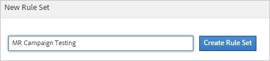

# Classificatiereeksen (verouderd)

{{classification-rulebuilder-deprecation}}

*Deze pagina verklaart classificatiereekreeksen als deel van de [ bouwer van de classificatieregel ](classification-rule-builder.md). Zie [ de reeksen van de Classificatie ](../sets/overview.md) voor de huidige methode om gegevens in Adobe Analytics te classificeren.*

Een regelset is een groep classificatieregels voor een specifieke variabele. U past een variabele op de regelreeks toe. Als u veelvoudige regelreeksen voor één variabele wilt tot stand brengen, moet u elke regel toepassen die op veelvoudige rapportreeksen wordt geplaatst.

## pagina van de opbouwfunctie voor classificatieregel {#section_C60B0888C76D49C596EF19F11808B718}

**[!UICONTROL Analytics]** > **[!UICONTROL Admin]** > **[!UICONTROL Classification Rule Builder]**

De volgende velden en opties zijn beschikbaar in de [!UICONTROL Classifications Rule Builder] .

<table id="table_A5D92409969747E39E041216A5AA32CD"> 
 <thead> 
  <tr> 
   <th colname="col1" class="entry"> Element </th> 
   <th colname="col2" class="entry"> Beschrijving </th> 
  </tr> 
 </thead>
 <tbody> 
  <tr> 
   <td colname="col1"> 
<a href="/help/components/classifications/crb/classification-rule-set.md"  > Regelset toevoegen </a> 
 </td> 
   <td colname="col2"> 
Maakt een regelset. 
 </td> 
  </tr> 
  <tr> 
   <td colname="col1"> 
Regels 
 </td> 
   <td colname="col2"> Geeft het aantal regels in de set weer. </td> 
  </tr> 
  <tr> 
   <td colname="col1"> 
Status 
 </td> 
   <td colname="col2"> Toont de activiteitenstatus van de regelreeks, zoals Ontwerp of Actief. De actieve regels verwerken dagelijks, onderzoek classificatiegegevens die typisch één maand teruggaan. De regels controleren automatisch op nieuwe waarden en uploaden de classificaties. </td> 
  </tr> 
  <tr> 
   <td colname="col1"> 
Laatst gewijzigd 
 </td> 
   <td colname="col2"> Geeft aan wanneer de regelset is bewerkt. </td> 
  </tr> 
  <tr> 
   <td colname="col1"> 
Dupliceren 
 </td> 
   <td colname="col2"> Dupliceert (kopieert) een regelreeks, zodat u de regel kunt toepassen die aan een andere variabele, of aan de zelfde variabele in een verschillende rapportreeks wordt geplaatst. </td> 
  </tr> 
 </tbody> 
</table>

## Een set classificatieregel maken {#create-classification-rule-set}

Geef de classificatieregel een naam, pas de variabele toe en geef instellingen voor overschrijven op.

1. (Vereiste) Definieer de classificatiestructuur in **[!UICONTROL Admin]** > **[!UICONTROL Report Suites]** .

   Variabelen worden pas in het deelvenster [!UICONTROL New Rule Set] weergegeven als er ten minste één classificatie is gedefinieerd voor die variabele.

   U kunt classificaties maken voor een variabele in **[!UICONTROL Admin]** > **[!UICONTROL Report Suites]** > **[!UICONTROL Traffic]** > **[!UICONTROL Traffic Classifications]** (of **[!UICONTROL Conversion]** > **[!UICONTROL Conversion Classifications]**). Selecteer vervolgens de variabele en klik op **[!UICONTROL Add Classification]** .

1. Klik op **[!UICONTROL Admin]** > **[!UICONTROL Classification Rule Builder]** > **[!UICONTROL Add Rule Set]** om de regelset te maken.

   

1. Geef een naam op voor de regelset en klik op **[!UICONTROL Create Rule Set]** .
1. Selecteer de regelset die u wilt bewerken.

   

1. Klik op **[!UICONTROL Select Report Suites and Variables]**.

   De rapportreeks en de veranderlijke lijst zijn bevolkt met alle gerubriceerde variabelen beschikbaar in alle rapportreeksen in uw login bedrijf. Één enkele variabele in een rapportreeks kan tot slechts één regelreeks behoren.

   Zie *`Variable`* in de definities voor de [ pagina van de Bouwer van de Regel van de Classificatie ](/help/components/classifications/crb/classification-rule-definitions.md) voor meer informatie.
1. Geef de te gebruiken rapportsuites en -variabelen op en klik op **[!UICONTROL Save]** .
1. Ga door [ het toevoegen van classificatieregels ](/help/components/classifications/crb/classification-rule-set.md) aan de regelreeks voort.
