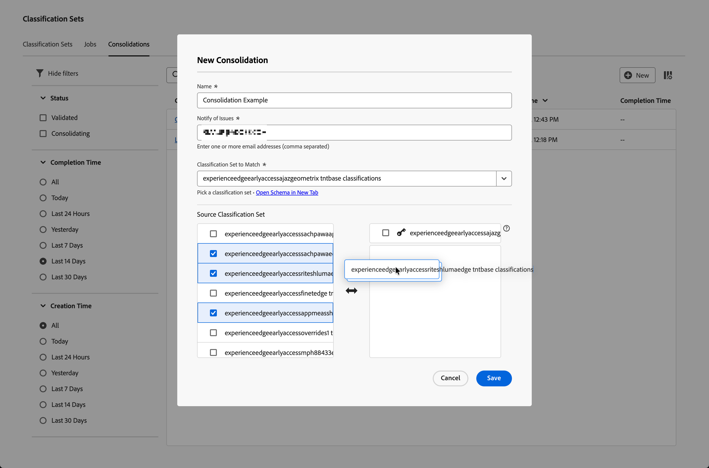

# Classificatieconsolisies maken en bewerken

Met een classificatieset kunt u classificaties van meerdere classificatiesets samenvoegen tot één set. Gebruik deze interface om een consolidatie van classificatiesets te maken van begin tot eind. Deze interface is van het grootste belang voor organisaties die van oude classificaties naar classificatiesets overgaan. Organisaties die classificatiesets gebruiken, hoeven deze consolidatieworkflow al niet te gebruiken.

## Een consolidatie maken {#create-a-consolidation}

>[!CONTEXTUALHELP]
>id="classificationsets_consolidation_setpriority"
>title="Prioriteit van de classificatie"
>abstract="De  *classificatiereeks* is de reeks van de basisclassificatie en bepaalt het algemene schema en neemt belangrijkheid in om het even welke fusieconflicten. De andere classificatiesets worden op volgorde van boven naar beneden toegepast."

Een classificatieconsolidatie maken in de Adobe Analytics-hoofdinterface:

1. Selecteer **[!UICONTROL Classification sets]** in het menu **[!UICONTROL Components]** .
1. Selecteer in **[!UICONTROL Classification Sets]** Manager de tab **[!UICONTROL Consolidations]** .
1. In de **[!UICONTROL Classification Sets - Consolidations]** manager, uitgezochte  **[!UICONTROL New]**.
1. In het dialoogvenster **[!UICONTROL New Consolidation]**

   
   1. Voer een **[!UICONTROL Name]** in. Bijvoorbeeld: `Consolidation Example` .
   1. Voer een **[!UICONTROL Description (optional)]** in. Bijvoorbeeld `Example classification set` .
   1. Voer een of meer e-mailadressen (gescheiden door komma&#39;s) in **[!UICONTROL Notify of issues]** in. E-mailmeldingen worden naar deze gebruikers verzonden bij problemen.
   1. Selecteer een classificatieset in het vervolgkeuzemenu **[!UICONTROL Classification Set To Match]** .

      De lijst links van **[!UICONTROL Source Classification Set]** wordt gevuld met classificatiesets die vergelijkbaar zijn met de geselecteerde classificatielijst en die beschikbaar zijn voor consolidatie. De juiste lijst wordt automatisch bevolkt met de geselecteerde  classificatiereeks. Die basisreeks bepaalde het algemene schema en neemt altijd belangrijkheid in om het even welke samenvoegconflicten.

   1. Selecteer classificatiereeksen die u van de linkerlijst wilt consolideren en de geselecteerde reeksen op de juiste lijst onder de geselecteerde  classificatiereeks van de 0&rbrace; Sleutel **[!UICONTROL _laten vallen._]**

      De extra classificatiesets worden in oplopende volgorde geconsolideerd wanneer u de consolidatie uitvoert. Als een sleutel in veelvoudige extra reeksen bestaat, wordt de waarde voor de sleutel van de hoogste rangschikkende classificatiereeks genomen. Als een sleutel in zowel de  basisreeks als om het even welke extra reeks bestaat, wordt de waarde van de basisreeks gebruikt.

      U kunt bepalen welke waarden voor toetsen worden gebruikt door afzonderlijke en geselecteerde classificatiesets in de lijst te slepen en neer te zetten. U kunt de  **[!UICONTROL _classificatiereeks_]** met een geselecteerde classificatie ook vervangen die door belemmering en daling wordt geplaatst.

   1. Selecteer **[!UICONTROL Save]** om de classificatieconsolidatie op te slaan. Selecteer **[!UICONTROL Cancel]** om te annuleren.

Zodra het bewaard, wordt een classificatieconsolidatie bevestigd automatisch voor consolidatie. Deze validatie zorgt ervoor dat elk afzonderlijk classificatieset geldig is voor deze consolidatie. Wanneer dit is gelukt, wordt in het item in de consolidatielijst Indelingen de status **[!UICONTROL Validated]** weergegeven.

Nadat u een consolidatie hebt gemaakt, zijn de volgende stappen:

* [&#x200B; re-Valideer &#x200B;](#re-validate) de classificatieconsolidatie wanneer u veranderingen in de aanvankelijke configuratie hebt aangebracht.
* [&#x200B; Looppas &#x200B;](#run) de classificatieconsolidatie.
* [&#x200B; keur &#x200B;](#approve) de classificatieconsolidatie goed.

<!--
         
  

**[!UICONTROL Components]** > **[!UICONTROL Classification sets]** > **[!UICONTROL Consolidations]** > **[!UICONTROL Add]**

The following fields are available when creating a consolidation:

* **[!UICONTROL Name]**: The name of the consolidation.
* **[!UICONTROL Notify of issues]**: A comma-delimited list of email addresses that are notified of issues with this consolidation.
* **[!UICONTROL Dataset to match]**: A drop-down list of all classification sets.

Once you select a classification set, a table with two columns appears:

* The right column contains all classification sets that you want to consolidate. It starts with the classification set selected using the above drop-down list.
* The left column contains all classification sets eligible to be merged with the originally selected dataset. **Schemas must exactly match to be eligible for consolidation**. If schemas do not match the selected classification set, they do not appear in this left column.

Drag the desired classification sets from the available column on the left to the consolidation column on the right. Once the consolidation is given a name and two or more classification sets are in the right column, click **[!UICONTROL Save & Continue]**.

-->

## Een consolidatie bewerken

Als u een classificatieconsolidatie wilt bewerken, gaat u naar de Adobe Analytics-hoofdinterface:

1. Selecteer **[!UICONTROL Classification sets]** in het menu **[!UICONTROL Components]** .
1. Selecteer in **[!UICONTROL Classification Sets]** Manager de tab **[!UICONTROL Consolidations]** .
1. In de manager **[!UICONTROL Classification Sets Consolidations]** :
   1. Selecteer de naam van uw classificatieconsolidatie. De **[!UICONTROL Consolidation: _dialoog van de classificatieconsolidatie naam_]** verschijnt. De vormgeving en beschikbare acties zijn afhankelijk van de huidige status van de consolidatie en of u nog steeds de optie hebt om de classificatieconsolidatie te wijzigen.

      | Beschikbare acties | Beschrijving |
      |---|---|
      |  **[!UICONTROL Cancel]** | [&#x200B; annuleert de consolidatie &#x200B;](#cancel). |
      |  **[!UICONTROL Re-Validate]** | [&#x200B; bevestigt opnieuw de consolidatie &#x200B;](#re-validate). |
      |  **[!UICONTROL Run]** | [&#x200B; stel de consolidatie &#x200B;](#run) in werking. |
      |  **[!UICONTROL Approve]** | [&#x200B; keur de consolidatie &#x200B;](#approve) goed. |

### Opnieuw valideren

U kunt een classificatieconsolidatie opnieuw valideren in het dialoogvenster Consolidatie: classificatieconsolidatie. Een  zou extra informatie over kwesties met uw consolidatie kunnen verstrekken die vereisen om de consolidatie opnieuw te vormen.

De classificatieconsolidatie opnieuw valideren:

1. Configureer de consolidatie opnieuw met dezelfde interface voor slepen en neerzetten als waarmee u de consolidatie hebt gemaakt.
1. Selecteer  **[!UICONTROL Re-Validate]**. De validatie zorgt ervoor dat elk afzonderlijk classificatieset geldig is voor deze consolidatie. Wanneer succesvol, wordt een pop-upbericht getoond:  **[!UICONTROL Successfully submitted consolidation for validation!]**
1. Selecteer  om de dialoog te sluiten. Of selecteer  **[!UICONTROL Run]** om de consolidatie in werking te stellen of  **[!UICONTROL Cancel]** om de classificatie te annuleren.

<!--
Once you have created a consolidation, a list of source datasets appears on the right. The **[!UICONTROL Validate]** button makes sure that each individual classification set is valid for this consolidation. You can reorder the classification steps here to determine priority in cases of mismatched classification values. **The highest classification set in the list overwrites any mismatched values in other classification sets.**

-->

### Uitvoeren

Nadat een consolidatie van de classificatie is gevalideerd, kunt u de consolidatie uitvoeren.

Een classificatieconsolidatie uitvoeren:

1. Selecteer  **[!UICONTROL Run]**. Een pop-upbericht toont  **[!UICONTROL Successfully submitted consolidation for processing!]**
1. Selecteer  om de dialoog te sluiten.

### Goedkeuren {#approve}

>[!CONTEXTUALHELP]
>id="classificationsets_consolidations_mismatch"
>title="Verkeerd"
>abstract="Het percentage van de sleutel komt niet overeen wanneer de waarde in de geconsolideerde classificatieset niet overeenkomt met de bronclassificatieset."

>[!CONTEXTUALHELP]
>id="classificationsets_consolidations_absent"
>title="Afwezig"
>abstract="Het percentage sleutels in het geconsolideerde classificatieset, maar niet in het bronclassificatieset."

Zodra een classificatieconsolidatie met succes heeft in werking gesteld, is de consolidatiestatus  **[!UICONTROL Waiting for Approval]**. De goedkeuring van een classificatieconsolidatie vervangt de afzonderlijke classificatiesets door het samenstel van geconsolideerde classificaties en de afzonderlijke classificatiesets worden geschrapt.

Een consolidatie van een classificatieset goedkeuren:

1. Gebruik **[!UICONTROL Similarity Reports]** om de consolidatie te controleren. Dit rapport toont een lijst met de volgende kolommen:

   * **[!UICONTROL Classification Set Name]**: De naam van de classificatieset.
   * **[!UICONTROL Mismatch]**: Het percentage rijen waarin de sleutelwaarden niet overeenkomen met de bronclassificatieset. Als het percentage niet-overeenkomende items hoog is, kan dit een aanwijzing zijn dat de classificatiegegevens te verschillend zijn. Controleer en controleer of de geselecteerde classificatiesets vergelijkbare classificatiegegevens hebben.
   * **[!UICONTROL Absent]**: Het percentage rijen waar de zeer belangrijke waarden in de  classificatiereeks maar niet in de bronclassificatiereeks zijn. Alle afwezige rijen worden toegevoegd aan de geconsolideerde classificatieset.

1. Als de classificatieconsolidatie klaar voor goedkeuring is, uitgezochte  **[!UICONTROL Approve]**. Een dialoogvenster van **[!UICONTROL Approve Consolidation?]** vraagt om bevestiging. Selecteer **[!UICONTROL Approve]** om de consolidatie goed te keuren. Selecteer **[!UICONTROL Cancel]** om te annuleren.

Na goedkeuring wordt het geconsolideerde classificatieset gemaakt. De status wordt ingesteld op **[!UICONTROL Complete]** .

### Annuleren

U kunt een classificatieconsolidatie vóór goedkeuring annuleren.

Een classificatieconsolidatie annuleren:

1. Selecteer **[!UICONTROL Cancel]**.

   U kunt een consolidatie niet hervatten wanneer de consolidatie is geannuleerd.
1. Selecteer **[!UICONTROL Cancel Consolidation]** om de consolidatie te annuleren. Selecteer **[!UICONTROL Go Back]** om de annulering te herstellen.
