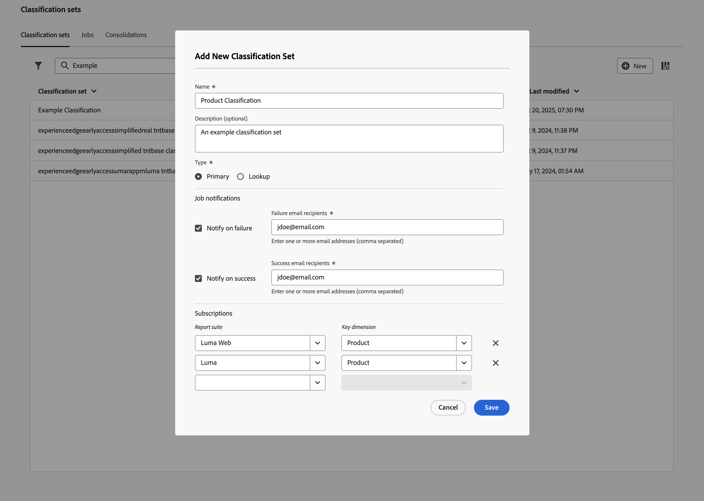

# Classificatiesets maken en bewerken

U [&#x200B; creeert &#x200B;](#create-a-classification-set) en [&#x200B; geeft &#x200B;](#edit-a-classification-set) classificatiereeksen van de manager van de Reeksen van de Classificatie uit.

## Een classificatieset maken

Een classificatieset maken:

1. Selecteer **[!UICONTROL Components]** in de bovenste menubalk van Adobe Analytics en selecteer vervolgens **[!UICONTROL Classification sets]** .
1. Selecteer in **[!UICONTROL Classification sets]** de tab **[!UICONTROL Classification sets]** .
1. Selecteer  **[!UICONTROL New]**.
1. In het dialoogvenster **[!UICONTROL Add New Classification Set]** :

   

   1. Voer een **[!UICONTROL Name]** in. Bijvoorbeeld: `Classification Set Example` .
   1. Voer een **[!UICONTROL Description (optional)]** in. Bijvoorbeeld `Example classification set` .
   1. Selecteer de **[!UICONTROL Type]** classificatieset. Mogelijke typen zijn:
      * **[!UICONTROL Primary]**. Een primair classificatieset is van toepassing op in Adobe Analytics verzamelde afmetingen. Primaire classificaties zijn een manier om waarden van korreldimensies te groeperen (classificeren) in zinvollere niveaus van gegevens. U kunt bijvoorbeeld interne zoektrefwoorden groeperen in interne zoekcategorieën om de thema&#39;s in uw zoekgegevens te begrijpen. Of classificeer product SKUs door kleur of categorie.
      * **[!UICONTROL Lookup]**. Een opzoektabel wordt meestal aangeduid als onderliggende of subclassificaties en is een classificatie van een primaire classificatie. Een zoekopdracht bestaat uit metagegevens over een classificatiewaarde in plaats van de oorspronkelijke dimensie. Bijvoorbeeld, zou de dimensie van het a *Product* een primaire classificatie van *Code van de Kleur* kunnen hebben. Een raadplegingslijst van *naam van de Kleur* kon dan aan de *code van de Kleur* worden vastgemaakt om elke kleurencode te verklaren.
1. Selecteer in de sectie **[!UICONTROL Job notifications]** wie u een melding wilt sturen als de indelingsset is mislukt of geslaagd.
   * Gebruikers op de hoogte stellen van een fout:
      1. Schakel **[!UICONTROL Notify on failure]** in.
      1. Geef een of meer door komma&#39;s gescheiden e-mailadressen op in **[!UICONTROL Failure email recipients]** .
   * Gebruikers op de hoogte stellen van succes:
      1. Schakel **[!UICONTROL Notify on success]** in.
      1. Geef een of meer door komma&#39;s gescheiden e-mailadressen op in **[!UICONTROL Success email recipients]** .
1. Voer in de sectie **[!UICONTROL Subscriptions]** een of meer **[!UICONTROL Primary]** in voor het geval u **[!UICONTROL Subscriptions]** hebt geselecteerd.  U kunt meerdere combinaties **[!UICONTROL Report Suite]** en **[!UICONTROL Dimension]** definiëren voor een classificatieset.

   * Selecteer  om een **[!UICONTROL Report Suite]** en **[!UICONTROL Key Dimension]** combinatie te schrappen.

   Als u een combinatie **[!UICONTROL Report Suite]** en **[!UICONTROL Key Dimension]** toevoegt die al in een andere classificatieset bestaat, wordt een rood gekleurd bericht weergegeven.
U kunt:
   * Selecteer **[!UICONTROL Add to existing]** om de andere classificatiereeks te openen en [&#x200B; classificaties aan het schema &#x200B;](manage/schema.md) voor die andere classificatiereeks toe te voegen.
   * Wijzig **[!UICONTROL Report Suite]** en **[!UICONTROL Key Dimension]** in een combinatie die niet is geabonneerd op een andere classificatieset.
1. Selecteer **[!UICONTROL Save]** om de classificatieset op te slaan. Selecteer **[!UICONTROL Cancel]** om de definitie te annuleren.

Om het schema voor de classificatiereeks te bepalen, selecteer uw onlangs gecreeerde classificatiereeks van de **[!UICONTROL Classification Sets]** manager om [&#x200B; de classificatiereeks &#x200B;](#edit-a-classification-set) uit te geven.

## Een classificatieset bewerken

Een classificatieset bewerken:

1. Selecteer **[!UICONTROL Components]** in de bovenste menubalk van Adobe Analytics en selecteer vervolgens **[!UICONTROL Classification sets]** .
1. Selecteer in **[!UICONTROL Classification Sets]** de tab **[!UICONTROL Classification Sets]** .
1. Selecteer de naam van de classificatieset.
1. In de **[!UICONTROL Classification Set: _dialoog van de classificatiereeks naam_]**, kunt u de [&#x200B; montages &#x200B;](manage/settings.md) en het [&#x200B; schema &#x200B;](manage/schema.md) voor de classificatiereeks bepalen.
1. Als u klaar bent, selecteert u **[!UICONTROL Save]** om de wijzigingen op te slaan. Selecteer **[!UICONTROL Cancel]** om te annuleren.
