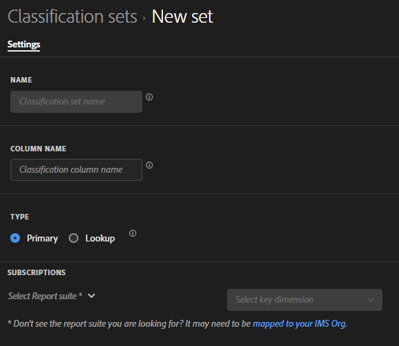

# Een classificatieset maken

U kunt de functie voor classificatiesets gebruiken om een classificatieset te maken.

**[!UICONTROL Components]** > **[!UICONTROL Classification sets]** > **[!UICONTROL Sets]** > **[!UICONTROL Add]**

Wanneer u een classificatieset maakt, zijn de volgende velden beschikbaar.

* **[!UICONTROL Name]**: Een tekstveld dat wordt gebruikt om de classificatieset te identificeren. Dit veld kan niet worden bewerkt tijdens het maken, maar u kunt de naam later wijzigen.
* **[!UICONTROL Column Name]**: De naam van de eerste classificatiedimensie die u wilt maken. Dit veld is de naam van de dimensie die in Analysis Workspace wordt gebruikt en de kolomnaam bij het exporteren van classificatiegegevens. U kunt meer kolomnamen toevoegen nadat de classificatieset is gemaakt.
* **[!UICONTROL Type]**: keuzerondjes die het type classificatie aangeven.
   * **[!UICONTROL Primary]**: toepassen op afmetingen die zijn verzameld in Analytics. Op deze manier kunt u waarden van korreldimensies groeperen (classificeren) in zinvollere gegevensniveaus. U kunt bijvoorbeeld interne zoektrefwoorden groeperen in interne zoekcategorieën om de thema&#39;s in uw zoekgegevens beter te begrijpen.
   * **[!UICONTROL Lookup]**: een opzoektabel wordt meestal onderliggende of subclassificaties genoemd en is een classificatie van een primaire classificatie. Het zijn metagegevens over een classificatiewaarde in plaats van de oorspronkelijke dimensie. De variabele Product kan bijvoorbeeld een primaire classificatie van &#39;Kleurcode&#39; hebben. Vervolgens kan een opzoektabel met &#39;Kleurnaam&#39; worden toegevoegd aan &#39;Kleurcode&#39; om uit te leggen wat elke code bedoelt.
* **[!UICONTROL Subscriptions]** De rapportsuites en afmetingen waarop deze classificatieset van toepassing is. U kunt veelvoudige rapportreeks en afmetingscombinaties aan een classificatiereeks toevoegen.

Als een classificatieset voor een bepaalde rapportreeks + variabele bestaat, wordt de classificatie toegevoegd aan het schema. Een bepaalde rapportsuite + variabele combinatie kan niet tot meerdere classificatiesets behoren.
