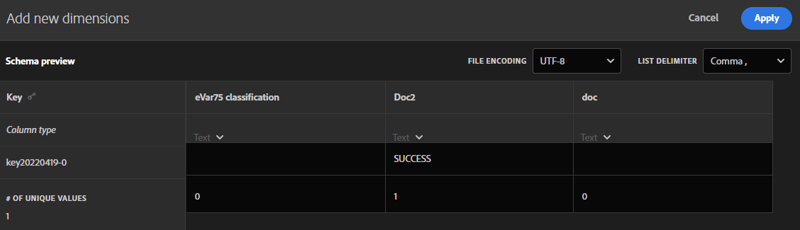

# Schema voor classificatieset

Het schema is de lijst met classificaties die u wilt toepassen op de belangrijkste dimensies die u voor de classificatieset hebt gedefinieerd. Als u bijvoorbeeld het product hebt gedefinieerd als de belangrijkste dimensie en dit veld een product-SKU bevat, gebruikt u het schema om classificaties toe te voegen zoals productnaam, productkleur, productgrootte en meer.

Het schema voor een classificatieset bewerken:

1. Selecteer **[!UICONTROL Components]** in de bovenste menubalk van Adobe Analytics en selecteer vervolgens **[!UICONTROL Classification sets]** .
1. Selecteer in **[!UICONTROL Classification Sets]** de tab **[!UICONTROL Classification Sets]** .
1. Selecteer in Beheer **[!UICONTROL Classifications Sets]** de classificatieset waarvoor u het schema wilt bewerken.
1. In de **[!UICONTROL Classification Set: _dialoog van de classificatiereeks naam_]**, selecteer het **[!UICONTROL Schema]** lusje. Dat tabblad bestaat uit de volgende interface-elementen:

   

   * [Classificatielijst](#classification-list)
   * [Zoeken](#search)
   * [Handelingen](#actions)
   * [Actiebalk](#action-bar)

## Classificatielijst

De lijst van classificaties heeft de volgende kolommen:

| Kolom | Beschrijving |
|---|---|
| **[!UICONTROL Classification Name]** | De naam die u hebt opgegeven voor de classificatie. |
| **[!UICONTROL Identity Name]** | De afgeleide naam door het systeem voor de classificatie. Deze naam is een alleen-lezen waarde en u kunt de naam Identiteit gebruiken |
| **[!UICONTROL Classified By]** | Indien gebruikt, een verbinding aan de reeks van raadplegingsclassificatie die wordt gebruikt om deze classificatie te classificeren. |

## Zoeken

U kunt  voor één of meerdere classificaties snel zoeken. Gebruik  om het onderzoek te ontruimen.

## Handelingen

De volgende acties zijn beschikbaar als knoppen boven aan de classificatielijst:

| Pictogram | Handeling | Beschrijving |
|---|---|---|
|  | **[!UICONTROL Add]** | [ voeg een classificatie ](#add) aan de lijst toe. |
|  | **[!UICONTROL Upload]** | [ upload een JSON, CSV, TSV, of dossier van het LUSJE ](#upload). |
|  | **[!UICONTROL Download]** | [ de classificatiegegevens van de Download ](#download). |
|  | **[!UICONTROL Template]** | [ Download een malplaatje ](#template) voor classificatiegegevens. |
|  | **[!UICONTROL Job History]** | Toon de [ manager van de classificatiereeks ](/help/components/classifications/sets/job-manager.md), voor de geselecteerde classificatiereeks wordt gefiltreerd. |
|  | **[!UICONTROL Automate]** | [ automatiseer de opname van classificatiegegevens ](#automate) door het gebruik van een wolkenplaats. |

### Toevoegen

Om een nieuwe classificatie toe te voegen, voegt de uitgezochte  toe **[!UICONTROL Add]**.

 toe

In de **[!UICONTROL Add a new classification for _dialoog van de classificatiereeks naam_]**, ga **[!UICONTROL Classification Name]** in en selecteer **[!UICONTROL Add]**. De classificatie wordt toegevoegd aan de lijst.

### Uploaden

Om classificatiegegevens in het schema voor een classificatie in te voeren, uitgezochte  **[!UICONTROL Upload]**.

1. In het dialoogvenster **[!UICONTROL Add new classifications]** :

   * Sleep een bestand dat classificatiegegevens bevat en zet het bestand neer op **[!UICONTROL Drag and drop here]** .
   * Selecteer **[!UICONTROL Browse]** en kies een bestand van uw computer of netwerk.

   U ziet een **[!UICONTROL Schema Preview]** van de inhoud van het bestand. In de voorvertoning worden de kolommen met gegevens uit het bestand weergegeven. Om een kolom te resize, selecteer  en selecteer **[!UICONTROL Resize column]**. Er wordt een greep weergegeven waarmee u het formaat van de kolom kunt wijzigen.

   Wanneer geen classificatie in de classificatiereeks voor een kolom wordt bepaald, wordt een alarm  getoond. In de waarschuwing wordt uitgelegd dat een classificatie niet aanwezig is in de bestaande set classificatieschema&#39;s en bij importeren wordt gemaakt.

1. Selecteer **[!UICONTROL Overwrite data on conflict?]** als u de huidige classificatiegegevens wilt overschrijven met het nieuwe geïmporteerde bestand. Bijvoorbeeld:

   | | Sleutel | Huidige productkleur | Bestand importeren | Nieuwe productkleur |
   |---|---|---|---|---|
   |  **[!UICONTROL Overwrite data on conflict?]** | 1234 | groen | blauw | blauw |
   |  **[!UICONTROL Overwrite data on conflict?]** | 1234 | groen | blauw | groen |

1. Selecteer **[!UICONTROL Apply]** . Er wordt een waarschuwing weergegeven als kolommen niet aanwezig zijn als classificaties in de bestaande schemaset. Deze kolommen worden toegevoegd als nieuwe classificaties wanneer u het uploaden bevestigt.

   

   Selecteer **[!UICONTROL Confirm Upload]** om het uploaden te bevestigen. Selecteer **[!UICONTROL Cancel Upload]** om het uploaden te annuleren.

### Downloaden

Om classificatiegegevens te downloaden, uitgezochte  **[!UICONTROL Download]**.

In de **[!UICONTROL Download data for _dialoog van de classificatiereeks naam_]**:

1. Voer het aantal **[!UICONTROL Rows]** in dat u wilt downloaden. Bijvoorbeeld: `10000` .
1. Als u de periode wilt selecteren waarvoor u rijen met classificatiegegevens wilt downloaden, voert u een begin- en eindgegevens in voor **[!UICONTROL Download Rows Received Between]** . Of gebruik  om een kalenderpopup te gebruiken om de periode te selecteren.
1. Selecteer een optie in **[!UICONTROL Data Returned]** om te selecteren welke gegevens u wilt retourneren.

   * **[!UICONTROL All values]** retourneert alle waarden voor de huidige classificatiegegevens.
   * **[!UICONTROL Any columns empty]** retourneert een kolom met sleutelwaarden voor de bestaande classificatiegegevens. En kolommen zonder waarde voor classificatiegegevens waarvoor geen waarden bestaan.
   * **[!UICONTROL All columns empty]** retourneert een sleutelkolom met waarden voor de bestaande classificatiegegevens. En kolommen zonder waarde voor classificatiegegevens.
1. Om het [ dossierformaat ](/help/components/classifications/sets/data-files.md#general-file-requirements) van de gedownloade classificatiegegevens te selecteren, selecteer een optie van het **[!UICONTROL File Format]** drop-down menu. De opties zijn:

   * **[!UICONTROL JSON]**.
   * **[!UICONTROL Comma separated values]** (CSV).
   * **[!UICONTROL Excel tab separated values]** (TSV of TAB).

1. Om het [ dossier te selecteren coderend ](/help/components/classifications/sets/data-files.md#general-file-requirements) aan wanneer het dossier wordt gedownload, selecteer een optie van het dossier-Coderen drop-down menu. De opties zijn:

   * **[!UICONTROL UTF-8]**.
   * **[!UICONTROL Latin-1]**.

1. Selecteer **[!UICONTROL Download]** om de classificatiegegevens te downloaden. U kunt het gedownloade dossier in de standaarddownloadfolder van uw browser vinden, en het dossier is genoemd <code><i> Reeks van de Classificatie </i>.<i> json </i>|<i> csv </i>|<i> tsv </i></code>. Als het dossier reeds bestaat, een opeenvolgingsaantal <code> (<i> x </i>)</code> wordt toegevoegd aan de bestandsnaam.  als u opties hebt gespecificeerd die geen gegevens terugkeren, ziet u een **[!UICONTROL Notice]** dialoog om u te informeren om de opties voor datumwaaier en teruggekeerde gegevens te veranderen.

### Sjabloon

Om een malplaatje voor classificatiegegevens te downloaden, selecteer  **[!UICONTROL Template]**.

In de **[!UICONTROL Download template for _dialoog van de classificatiereeks naam_]**:

1. Om het [ dossierformaat ](/help/components/classifications/sets/data-files.md#general-file-requirements) van de gedownloade classificatiegegevens te selecteren, selecteer een optie van het **[!UICONTROL File Format]** drop-down menu. De opties zijn:

   * **[!UICONTROL Comma separated values]**.
   * **[!UICONTROL Excel tab separated values]**.

1. Om het [ dossier te selecteren coderend ](/help/components/classifications/sets/data-files.md#general-file-requirements) aan wanneer het dossier wordt gedownload, selecteer een optie van het dossier-Coderen drop-down menu. De opties zijn:

   * **[!UICONTROL UTF-8]**.
   * **[!UICONTROL Latin-1]**.

1. Selecteer **[!UICONTROL Download]** om de sjabloon voor classificatiegegevens te downloaden. U kunt het gedownloade dossier in de standaarddownloadfolder van uw browser vinden, en is genoemd <code><i> Vastgestelde Indeling van de Classificatie </i>.<i> csv </i>|<i> tsv </i></code>. Als het dossier reeds bestaat, een opeenvolgingsaantal <code> (<i> x </i>)</code> wordt toegevoegd aan de bestandsnaam.

### Automatisch {#automate}

>[!CONTEXTUALHELP]
>id="classificationsets_schema_automate_locationaccount"
>title="Locatieaccount"
>abstract="Lijst met locatierekeningen van accounttypen die de invoer van classificatiegegevens ondersteunen. Selecteer **[!UICONTROL New account]** om een nieuw locatieaccount te maken."
>additional-url="https://experienceleague.adobe.com/docs/analytics/components/locations/configure-import-accounts.html?lang=en" text="Cloud-import- en exportaccounts configureren"

>[!CONTEXTUALHELP]
>id="classificationsets_schema_automate_location"
>title="Locatie"
>abstract="Lijst met locaties op een geselecteerde locatie die het importeren van classificatiegegevens ondersteunen. Selecteer **[!UICONTROL New location]** om een nieuwe locatie te maken."
>additional-url="https://experienceleague.adobe.com/docs/analytics/components/locations/configure-import-locations.html?lang=en" text="Locaties voor het importeren en exporteren van cloud configureren"

Om de opname van classificatie te automatiseren, uitgezochte  **[!UICONTROL Automate]**.

In de **[!UICONTROL Associate / Update Ingest Location for _dialoog van de classificatiereeks naam_]**:

1. Selecteer een optie in **[!UICONTROL Location Account]** om een locatie in de cloud te selecteren. Slechts [ plaatsrekeningen van gesteunde rekeningstypes die de invoer van classificatiegegevens ](https://experienceleague.adobe.com/en/docs/analytics/components/locations/configure-import-accounts) toestaan worden getoond. Selecteer **[!UICONTROL New account]** als u een nieuwe account wilt maken.
1. Als u een locatie wilt selecteren, selecteert u een optie in **[!UICONTROL Location]** . Alleen de locaties van geselecteerde accounttypen voor het importeren van classificatiegegevens worden weergegeven. Selecteer **[!UICONTROL New location]** als u een nieuwe locatie wilt maken.

   >[!IMPORTANT]
   >
   >De locatie die u maakt of selecteert, moet een **[!UICONTROL Prefix]** (map) in **[!UICONTROL Bucket]** bevatten die als host fungeert voor de bestanden met classificatiegegevens. Bijvoorbeeld een map met de naam `files` . Het hosten van dossiers bij de wortel van een emmertje werkt niet met de meeste wolkenplaatsen.
   >

1. Als u een scheidingsteken wilt selecteren, selecteert u een optie in de vervolgkeuzelijst **[!UICONTROL List delimiter]** . De opties zijn:
   * **[!UICONTROL Comma ,]**
   * **[!UICONTROL Semicolon ;]**
   * **[!UICONTROL Colon :]**
   * **[!UICONTROL Vertical bar |]**
   * **[!UICONTROL Space]**
   * **[!UICONTROL Tab]**
1. Om het [ dossier te selecteren die ](/help/components/classifications/sets/data-files.md#general-file-requirements) coderen wanneer het dossier wordt gedownload, selecteer een optie van het **[!UICONTROL File Encoding]** drop-down menu. De opties zijn:

   * **[!UICONTROL UTF-8]**.
   * **[!UICONTROL Latin-1]**.

1. Als u gebruikers wilt informeren over het voltooien van taken met inst, voert u voor **[!UICONTROL Email(s) to notify when ingest jobs completes (comma separated)]** een e-mailadres in, gescheiden door komma&#39;s.
1. Selecteer **[!UICONTROL Validate]** . De verbinding met de locatie van de cloud wordt gevalideerd.
1. Als de bevestiging succesvol is, ziet u een pop-upbericht dat  Uitgezocht CheckmarkCircle **[!UICONTROL Location validation successful. Connection to cloud storage verified.]** toont als u de verbinding aan de wolkenverbinding hebt gecreeerd.**[!UICONTROL Save]**Anders selecteert u **[!UICONTROL Update]**. Of selecteer **[!UICONTROL Cancel]**om de configuratie van de cloudlocatie te annuleren.

Wanneer u bestanden uploadt naar de locatie in de cloud, wordt het bestand binnen 15 minuten gedetecteerd en verzonden als importtaak. Het resultaat van die de invoerbaan wordt gemeld in [ de baanmanager van classificaties ](/help/components/classifications/sets/job-manager.md). Als u aan de lijst met gebruikers wordt toegevoegd om meldingen te ontvangen over het voltooien van taken die u toevoegt, ontvangt u ook e-mailberichten.

Bijvoorbeeld:

{width="400"}

## Actiebalk

Op de actiebalk staan acties die beschikbaar zijn voor de geselecteerde classificatie. Beschikbare opties zijn:

| Pictogram | Handeling | Beschrijving |
|---|---|---|
|  | **[!UICONTROL Add Lookup]** | Voeg een classificatieset toe als een zoekopdracht (subclassificatie).  in de **[!UICONTROL Attach lookup]** lijst: <ol><li>Selecteer een opzoekclassificatie in het vervolgkeuzemenu **[!UICONTROL Classification Name]** .</li><li>Selecteer **[!UICONTROL Add]**.</li></ol>De opzoekclassificatie wordt toegevoegd aan de classificatie en vermeld in de **[!UICONTROL Classified by]** kolom gebruikend interne identiteitskaart. |
|  | **[!UICONTROL Remove Lookup]** | Een classificatieset verwijderen als een zoekopdracht. Om de raadpleging van de classificatie permanent te schrappen, in de **[!UICONTROL Remove _classificatiereeks _van_ de dialoog van de classificatiebevestiging_]** uitgezocht **[!UICONTROL Delete]**. |
|  | **[!UICONTROL Rename]** | Wijzig de naam van de **[!UICONTROL Classification Name]** van een classificatie. In de **[!UICONTROL Rename: _dialoog van de classificatienaam_]**, ga een nieuwe naam in en selecteer **[!UICONTROL Rename]**. |
|  | **[!UICONTROL Delete]** | Een classificatie verwijderen. De **[!UICONTROL Delete _dialoog van de classificatienaam_]** verschijnt. Selecteer **[!UICONTROL Delete]** om de classificatie te verwijderen. |

<!--

View currently configured classification dimensions for this classification set.

**[!UICONTROL Components]** > **[!UICONTROL Classification sets]** > **[!UICONTROL Sets]** > Click the desired classification set name > **[!UICONTROL Schema]**

The following buttons are available:

* **[!UICONTROL Upload]**: Manually upload classification data for a classification dimensions. `JSON`, `CSV`, `TSV`, and `TAB` files are supported. Uploading a valid file shows a table preview of data to classify.
  * **[!UICONTROL File encoding]**: Select the correct file encoding using this drop-down. Valid options include [!UICONTROL UTF-8] and [!UICONTROL Latin1].
  * **[!UICONTROL List delimiter]**: Select the correct list delimiter. If using a downloaded file or template file, make sure that the [!UICONTROL List delimiter] here matches the [!UICONTROL List delimiter] when the file was downloaded.
  * **[!UICONTROL Apply]**: Save the uploaded classification data to the classification set.

  

* **[!UICONTROL Download]**: Download key values and their classification columns.
  * **[!UICONTROL Rows]**: The maximum number of rows to include in the download file.
  * **[!UICONTROL Download rows received between]**: A calendar date picker that allows you to filter key values by when they appear in reporting. If a key value was not collected in this date range, it does not appear in the downloaded file.
  * **[!UICONTROL Data returned]**: A drop-down list that lets you filter key values included in the downloaded file based on their associated classification data.
    * **[!UICONTROL All classified values]**: Includes rows where classification data is included in at least one column.
    * **[!UICONTROL All unclassified values]**: Includes rows where classification data is missing in at least one column.
  * **[!UICONTROL File format]**: A drop-down list that determines the file format that the download file is in. Options include [!UICONTROL JSON], [!UICONTROL Comma separated values], and [!UICONTROL Excel tab separated values].
  * **[!UICONTROL File encoding]**: A drop-down list that determines the file encoding. Options include [!UICONTROL UTF-8] and [!UICONTROL Latin1]. UTF-8 is recommended.

  

* **[!UICONTROL Template]**: Download a template file. This file is similar to the [!UICONTROL Download] button, except it does not contain any classification data or key values.
  * **[!UICONTROL File format]**: A drop-down list that determines the file format that the template file is in. Options include [!UICONTROL Comma separated values], and [!UICONTROL Excel tab separated values].
  * **[!UICONTROL File encoding]**: A drop-down list that determines the file encoding. Options include [!UICONTROL UTF-8] and [!UICONTROL Latin1]. UTF-8 is recommended.
  * **[!UICONTROL List delimiters]**: A drop-down list that determines the list delimiter separating classification columns on each row.

  

* **[!UICONTROL Job history]**: A shortcut link that takes you to the [Job manager](../job-manager.md), showing jobs only for this classification set.
* **[!UICONTROL Automate]**: Automatically ingest data from external storage locations.
  * **[!UICONTROL Location account]**: A drop-down list showing existing location accounts that your organization has configured. If your organization hasn't already configured a location account, you can configure one by selecting [!UICONTROL **Create a new account**].
    
    For information about configuring the location account, see [Configure cloud import and export accounts](/help/components/locations/configure-import-accounts.md).

  * **[!UICONTROL Location]**: A drop-down list showing existing locations that your organization has configured. If your organization hasn't already configured a location, you can configure one by selecting [!UICONTROL **Create a new location**]. 

    For information about configuring a location, see [Configure cloud import and export locations](/help/components/locations/configure-import-locations.md). 

  * **[!UICONTROL Delimiter]**: The column delimiter for uploaded files. Options include [!UICONTROL Comma], [!UICONTROL Semicolon], [!UICONTROL Colon], [!UICONTROL Vertical bar], [!UICONTROL Space], [!UICONTROL Forward slash], [!UICONTROL Backward slash], [!UICONTROL Dash], or [!UICONTROL Underscore].

  * **[!UICONTROL Encoding]**: A drop-down list that determines the file encoding. Options include [!UICONTROL UTF-8] and [!UICONTROL Latin1]. UTF-8 is recommended.

The following actions are available only after selecting a classification.

* **Add lookup**: A lookup table is a classification of a classification. It is metadata about a classification value, rather than the variable itself. For example, the Product variable might have a classification of "color code". A lookup table of "color name" might be attached to "color code" to explain what the colors are.

  

* **Rename**: Lets you rename the classification.

* **Delete**: Lets you delete the classification.
-->