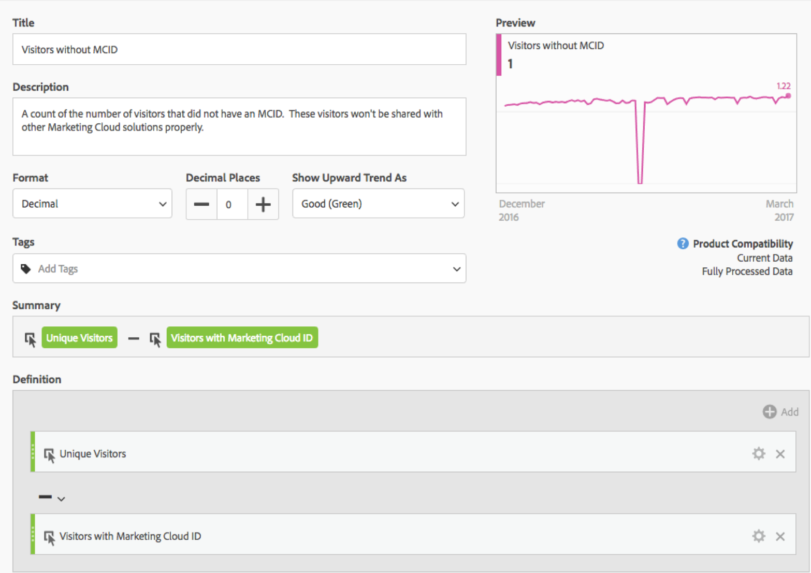

# Bezoekers met Experience Cloud ID

De maatstaf &#39;Bezoekers met Experience Cloud-id&#39; toont het aantal unieke bezoekers dat door Adobe is geïdentificeerd met behulp van de [Experience Cloud-id-service](https://docs.adobe.com/content/help/nl-NL/id-service/using/home.html). Deze dimensie is handig om te vergelijken met de metrische waarde voor [Unieke bezoekers](unique-visitors.md) om ervoor te zorgen dat de meeste bezoekers van uw site de id-service gebruiken. Als een groot deel van bezoekers de de dienstkoekjes van identiteitskaart niet gebruikt, kan het op een kwestie binnen uw implementatie wijzen.

>[!NOTE]
>
>Deze metrische waarde is vooral belangrijk voor het zuiveren als u de veelvoudige diensten van Experience Cloud, zoals Adobe Target of Adobe Audience Manager gebruikt. Segmenten die worden gedeeld door Experience Cloud-producten, omvatten geen bezoekers zonder Experience Cloud-id.

## Hoe deze metrische waarde wordt berekend

Deze metrische waarde is gebaseerd op de metrische waarde voor [Unieke bezoekers](unique-visitors.md) , maar bevat alleen personen die zijn geïdentificeerd met de `mid` queryreeks (gebaseerd op het [`s_ecid`](https://docs.adobe.com/content/help/en/core-services/interface/ec-cookies/cookies-analytics.html) cookie).

## Fouten opsporen in de configuratie van Experience Cloud-id&#39;s

De metrische &#39;Bezoekers met Experience Cloud-id&#39; kan nuttig zijn bij het oplossen van problemen met de integratie in Experience Cloud of bij het identificeren van gebieden van uw site waarvoor de id-service niet is geïmplementeerd.

Sleep Bezoekers met Experience Cloud-id naast elkaar met Unieke bezoekers om ze te vergelijken:

In dit voorbeeld heeft elke pagina hetzelfde aantal &#39;Unieke bezoekers&#39; als &#39;Bezoekers met een Experience Cloud-id&#39;. Het totale aantal unieke bezoekers is echter groter dan het totale aantal bezoekers met Experience Cloud-id. U kunt een [berekende metrisch](../c-calcmetrics/cm-overview.md) tot stand brengen om te weten te komen welke pagina&#39;s de dienst van identiteitskaart niet plaatsen. U kunt de volgende definitie gebruiken:

Door berekende metrisch aan het rapport toe te voegen, kunt u het rapport van Pagina&#39;s sorteren zodat de pagina&#39;s met het hoogste aantal bezoekers zonder MCID worden bedekt:

Merk op dat de waarde van de &quot;Snelle meningen van het Product&quot;dimensie niet behoorlijk met de Dienst van de Identiteit wordt uitgevoerd. U kunt met de juiste teams binnen uw organisatie samenwerken om deze pagina&#39;s zo snel mogelijk bij te werken. U kunt een gelijkaardig rapport met om het even welk type van afmeting zoals [Browser type](../dimensions/browser-type.md), de sectie [van de](../dimensions/site-section.md)Plaats, of om het even welk [eVar](../dimensions/evar.md)construeren.
