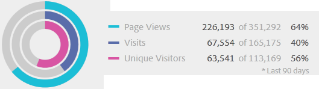
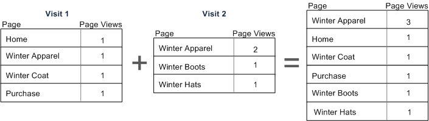
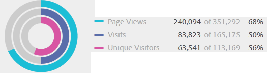
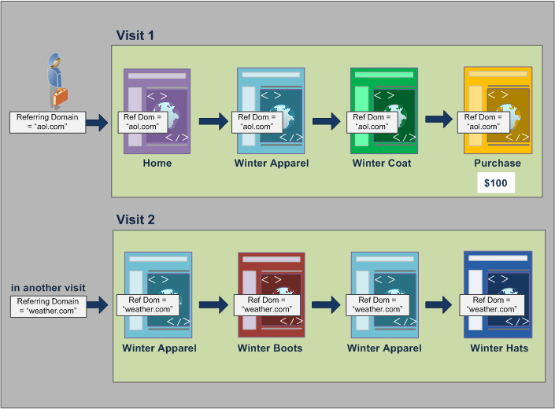

# Segmentcontainers

Een segment stelt voorwaarden in om een bezoeker te filteren op basis van de kenmerken van de bezoeker of de interacties met uw site. Als u voorwaarden in een segment wilt instellen, stelt u regels in om bezoekers te filteren op basis van bezoekerskenmerken en/of navigatiekenmerken. Als u bezoekersgegevens verder wilt onderverdelen, kunt u filteren op basis van specifieke bezoeken en/of toeschouwers in de paginaweergave voor elke bezoeker. De bouwer van het Segment verstrekt een eenvoudige architectuur om deze subsets te bouwen en regels als genestelde, hiërarchische Bezoeker, Bezoek, of de containers van het Actief toe te passen.

De containerarchitectuur die in de [&#x200B; bouwer van het Segment &#x200B;](/help/components/segmentation/segmentation-workflow/seg-build.md) wordt gebruikt bepaalt:

-  **[!UICONTROL Visitor]** als buitenste container, die overkoepelende gegevens specifiek voor de bezoeker over bezoeken en paginameningen bevat.
-  een genestelde **[!UICONTROL Visit]** container laat u regels plaatsen om de gegevens van de bezoeker te onderbreken die op bezoeken worden gebaseerd, en
-  een genestelde **[!UICONTROL Hit]** container laat u bezoekersinformatie onderbreken die op individuele paginameningen wordt gebaseerd.

Met elke container kunt u de geschiedenis van een bezoeker doorlopen, interacties splitsen op bezoeken of afzonderlijke treffers splitsen.

<table style="table-layout: fixed; border: none;">

<tr>
<td style="background-color: #E5E4E2;" colspan="3" width="200" height="100"> Bezoekers</td>
</tr>

<tr>
<td style="background-color: #E5E4E2;" width="200"></td>
<td style="background-color: #D3D3D3;" colspan="2" width="200" height="100"> Bezoeken</td>
</tr>

<tr>
<td style="background-color: #E5E4E2;" width="200" height="100"></td>
<td style="background-color: #D3D3D3;" width="200" height="100"></td>
<td style="background-color: #C0C0C0;" width="200" height="100" colspan="1"> Hits</td>
</tr>
</table>

<!---->


>[!BEGINSHADEBOX]

Zie  [&#x200B; de containers van het Segment &#x200B;](https://video.tv.adobe.com/v/3429104?captions=dut&quality=12&learn=on){target="_blank"} voor een demo video.

>[!ENDSHADEBOX]


## Bezoekercontainer

De bezoekerscontainer bevat elk bezoek en elke paginaweergave voor bezoekers binnen een opgegeven tijdsperiode. Een segment op het niveau van de Bezoeker keert de pagina terug die aan de voorwaarde plus alle andere pagina&#39;s voldoet die door de bezoeker (en slechts beperkt door bepaalde datumwaaiers) worden bekeken. Als meest algemeen bepaalde container, de rapporten die op het containerniveau van de Bezoeker worden geproduceerd terugkeert paginameningen over alle bezoeken en laat u een multi-bezoek analyse produceren. Daarom is de container van de Bezoeker het meest vatbaar om te veranderen gebaseerd op bepaalde datumwaaiers.

Bezoekerscontainers kunnen waarden bevatten op basis van de algemene geschiedenis van een bezoeker:

- Dagen vóór eerste aankoop
- Oorspronkelijke invoerpagina
- Oorspronkelijke verwijzende domeinen

## Bezoek container

Met de container Visit kunt u paginainteracties, campagnes of conversies voor een specifieke websessie identificeren. Een segment op het niveau van het Bezoek keert de pagina terug die aan de voorwaarde plus alle andere pagina&#39;s voldoet die als deel van de bezoekzitting (en slechts beperkt door bepaalde datumwaaiers) worden bekeken. De container van het Bezoek is de gemeenschappelijkste gebruikte container omdat het gedrag voor de volledige bezoekzitting vangt zodra de regel wordt ontmoet. Met de container Visit kunt u definiëren welke bezoeken u wilt opnemen in het maken en toepassen van een segment of deze wilt uitsluiten. Het kan u helpen de vraag te beantwoorden hoeveel bezoekers de sectie Nieuws en Sport tijdens hetzelfde bezoek bekeken? Of pagina&#39;s die zijn toegewezen aan een geslaagde omzetting in een uitverkoop?

De containers van het bezoek omvatten waarden die op voorkomen per bezoek worden gebaseerd:

- Bezoek nummer
- Itempagina
- Geretourneerde frequentie
- Deelnamemetriek
- Lineaire toegewezen metriek

## Actief

De container Actief definieert welke pagina treffers u van een segment wilt opnemen of uitsluiten. De container Actief is het meest smalle van de containers beschikbaar om u specifieke kliks en paginamening te laten identificeren waar een voorwaarde waar is. U kunt één code voor bijhouden weergeven of gedrag in een bepaalde sectie van uw site isoleren. U kunt ook een specifieke waarde aanwijzen wanneer een handeling plaatsvindt, zoals het marketingkanaal wanneer een order is geplaatst.

Actief containers bevatten op één pagina gebaseerde waarden:

- Producten
- Props weergeven
- Lijstvariabelen
- Merchandising Vars (in de context van gebeurtenissen)

  >[!NOTE]
  >
  >Als u deze container gebruikt op een waarde die aanhoudt, zoals een evar, trekt het in elke slag waar die waarde voortduurt. Als er een volgende code is die na een week verloopt, zou die waarde over veelvoudige bezoeken kunnen voortbestaan.

## Container voor logische groep

Met de container van de Logische Groep kunt u een afzonderlijke container binnen de segmentregels verstrekken om entiteiten te filteren die niet op hiërarchie worden gebaseerd. U kunt bijvoorbeeld een container toevoegen die in het segment is genest en die filters toepast op basis van de bezoeker. Voor dit type logica moet u de hiërarchie afbreken (aangezien u al een bezoekercontainer op hoofdniveau hebt gebruikt) om alleen voor geselecteerde bezoekers te filteren. Zie {de voorbeelden van de Groep van 0} Logica [&#x200B; voor extra informatie.](/help/components/segmentation/segmentation-workflow/seg-sequential-build.md)

## Nesten van containers {#nest-containers}

Wanneer u segmentcontainers maakt in andere containers, maakt u in wezen een segment binnen een segment. De volgende logica wordt gebruikt bij geneste containers:

1. Bepaal welke gegevens worden opgenomen met de buitenste container. Om het even welke gegevens die deze buitenregel niet aanpassen worden verworpen in het gesegmenteerde rapport.
1. Pas de geneste regel toe op de resterende gegevens. De geneste regel is NIET van toepassing op alle treffers die door de eerste regel worden gegenereerd.
1. Herhaal deze bewerking totdat alle geneste containerregels zijn berekend. De resterende gegevens worden vervolgens opgenomen in het resulterende rapport.

>[!NOTE]
>
>Wanneer u een segment neest binnen een segment (bijvoorbeeld, sleept u een segment van het paneel van Componenten op uw segmentdefinitie), wordt een container gecreeerd met een exemplaar (niet een verwijzing) van de gesleepte segmentregel.

U kunt het nesten tussen containers en tussen regels binnen een container gebruiken. Dit is wat u in elke container kunt nesten:

| Containernaam | Wat u in kunt nesten |
|---|---|
| Actief | Alleen gebeurtenissen |
| Bezoek | Actief, container, gebeurtenissen |
| Bezoeker | Bezoek container, Actief container, Gebeurtenissen |
| Logische groep | Visitor container, Visitor container, Hit container |

### Meerdere containers opnemen binnen één definitie

Als u meerdere segmenten in een nieuw samengesteld segment opneemt, kunt u gegevens nog verder verfijnen. Wanneer u twee bestaande segmenten samen sleept, fungeert dit als een &quot;OR&quot;-instructie bij het filteren van bezoekers. Alle containers in het canvas worden gecontroleerd op basis van alle gegevens en alle gegevens die overeenkomen met een van de containers worden opgenomen in de rapportage.

Sleep bijvoorbeeld een container Visit waarbij Land = Verenigde Staten met een container Visit waarbij Order = True,

```
Country = United States + Order = True
```

bouwt een segment dat zich in deze orde gedraagt:

1. Dit segment zou eerst uw volledige gegevens bekijken en alle bezoekers binnen de Verenigde Staten identificeren.
2. Het segment zou dan al uw gegevens opnieuw bekijken, zoekend om te zien of om het even welke bezoekers een orde maakten.
3. Beide reeksen gegevens zouden dan op het rapport worden toegepast.

## Containers voor opeenvolgende segmenten {#containers-sequential}

Opeenvolgende segmentatie maakt gebruik van dezelfde hiërarchisch geneste basiscontainers, inclusief [!UICONTROL Visitors] , [!UICONTROL Visits] en [!UICONTROL Hits] (inclusief paginaweergaven of andere afmetingen).

<table style="table-layout:fixed; border: none;">

<tr>
<td style="background-color: #E5E4E2;" colspan="3" width="200" height="100"> Bezoekers</td>
</tr>

<tr>
<td style="background-color: #E5E4E2;" width="200"></td>
<td style="background-color: #D3D3D3;" colspan="2" width="200" height="100"> Bezoeken</td>
</tr>

<tr>
<td style="background-color: #E5E4E2;" width="200" height="100"></td>
<td style="background-color: #D3D3D3;" width="200" height="100"></td>
<td style="background-color: #C0C0C0;" width="200" height="100" colspan="1"> Hits</td>
</tr>
</table>

<!---->

[!UICONTROL Visitors] vormt de container met de hoogste volgorde in opeenvolgende segmentatie, met [!UICONTROL Visits] in de [!UICONTROL Visitors] -container en [!UICONTROL Hits] in de [!UICONTROL Visitors] - of [!UICONTROL Visits] -containers. Deze [&#x200B; containerhiërarchie &#x200B;](/help/components/segmentation/seg-overview.md#section_7FDF47B3C6A94C38AE40D3559AFFAF70) moet worden gehandhaafd om goed-bevolen opeenvolgende segmenten te bouwen.

**om opeenvolgende segmenten** te bouwen, zijn de containers genest en opeenvolgende logica die met de [!UICONTROL THEN] exploitant wordt verbonden die elke container vereist om `true` op de opeenvolging van de bezoeker worden gebaseerd.

<table style="table-layout:fixed; border: none;">

<tr>

<td style="background-color: #E5E4E2;" colspan="3" width="200" height="100"> Bezoekers</td>
</tr>

<tr>
<td style="background-color: #E5E4E2;" width="200"></td>
<td style="background-color: #D3D3D3;" colspan="2" width="200" height="100"> Bezoeken</td>
</tr>

<tr>
<td style="background-color: #E5E4E2;" width="200" height="100"></td>
<td style="background-color: #D3D3D3;" width="200" height="100"></td>
<td style="background-color: #C0C0C0;" width="200" height="100" colspan="1"> Hits</td>
</tr>

<tr>
<td style="background-color: #E5E4E2;"></td><td colspan="2">DAN</td></td>
</tr>

<tr>
<td style="background-color: #E5E4E2;" width="200"></td>
<td style="background-color: #D3D3D3;" colspan="2" width="200" height="100"> Bezoeken</td>
</tr>

<tr>
<td style="background-color: #E5E4E2;" width="200" height="100"></td>
<td style="background-color: #D3D3D3;" width="200" height="100"></td>
<td style="background-color: #C0C0C0;" width="200" height="100" colspan="1"> Hits</td>
</tr>
</table>

<!---->

De enige uitzondering op deze hiërarchie van containers is wanneer het gebruiken van de [&#x200B; container van de Groep van de Logica &#x200B;](/help/components/segmentation/segmentation-workflow/seg-sequential-build.md). Met de container [!UICONTROL Logic Group] kunt u een hit in een container nesten zonder volgorde om gebeurtenissen en afmetingen vast te leggen, maar buiten een opeenvolgende volgorde.

<table style="table-layout:fixed; border: none;">

<tr>
<td style="background-color: #E5E4E2;" colspan="3" width="200" height="100"> Bezoekers</td>
</tr>

<tr>
<td style="background-color: #E5E4E2;" width="200"></td>
<td style="background-color: #D3D3D3;" colspan="2" width="200" height="100"> Bezoeken</td>
</tr>

<tr>
<td style="background-color: #E5E4E2;" width="200" height="100"></td>
<td style="background-color: #D3D3D3;" width="200" height="100"></td>
<td style="background-color: #C0C0C0;" width="200" height="100" colspan="1"> Hits</td>
</tr>

<tr>
<td style="background-color: #E5E4E2;"></td><td colspan="2">DAN</td></td>
</tr>

<tr>
<td style="background-color: #E5E4E2;" width="200"></td>
<td style="background-color: #D3D3D3;" colspan="2" width="200" height="100"> Groep</td>
</tr>

<tr>
<td style="background-color: #E5E4E2;" width="200" height="100"></td>
<td style="background-color: #D3D3D3;" width="200" height="100"></td>
<td style="background-color: #C0C0C0;" width="200" height="100" colspan="1"> Hits</td>
</tr>

<tr>
<td style="background-color: #E5E4E2;" width="200" height="100"></td>
<td style="background-color: #D3D3D3;" width="200" height="100"></td>
<td style="background-color: #C0C0C0;" width="200" height="100" colspan="1"> Bezoeken</td>
</tr>

</table>

<!---->

## Rapporten op basis van containergegevens {#reports}

Met containers kunt u verschillende gegevens op basis van rapportagewaarden filteren wanneer u segmenten splitst en deze op rapporten toepast.

Gegevens die zijn vastgelegd op elk niveau van de Bezoeker > Bezoek > Actief in de containerhiërarchie, zijn van invloed op de manier waarop u uw segmenten maakt. Als u het zelfde segment neemt dat op het zelfde rapport wordt toegepast gebruikend de zelfde gegevensreeks, krijgt u verschillende waarden die op de container worden gebaseerd waarvan u het rapport produceert. Factoren zoals het rapportageniveau van de container en de persistentie van waarden in verschillende treffers kunnen belangrijke wijzigingen in uw rapportnauwkeurigheid betekenen.

### Basisbeginselen van containergegevens {#container-data}

De bezoeker die hieronder is afgebeeld, heeft bijvoorbeeld tijdens het eerste bezoek een site bezocht, op de startpagina geland en vervolgens drie extra pagina&#39;s bezocht en het bezoek omgezet in een verkoop. Tijdens een afzonderlijk bezoek landde de bezoeker deze keer via de productpagina, vervolgens naar de startpagina, terug naar de productpagina en sloot hij de sessie na de Winter Hats te hebben bekeken. Gebaseerd in de gegevens die voor elke container voor het segment worden gevangen, worden de verschillende waarden getoond in het rapport.

Het `Pages equals Winter Coat` hieronder segment wordt toegepast op het **Rapport van Pagina&#39;s**.


Gebaseerd op de geselecteerde container, toont het rapport verschillende resultaten voor de volgende bezoeken en paginameningen door een bezoeker.

<table style="table-layout:auto; border: 0;">

<tr>
<td style="background-color: #E5E4E2;"></td>
<td style="background-color: #E5E4E2;" colspan="4"><b>Bezoek 1</b></td>
</tr>
<tr>
<tr>
<td style="background-color: #E5E4E2;">

</td>
<td style="background-color: #FFFFFF; "><br/>Startpagina</td>
<td style="background-color: #FFFFFF;"><br/>Winter, kleding</td>
<td style="background-color: #FFFFFF;"><br/>Winter</td>
<td style="background-color: #FFFFFF;"><br/>Koop $100</td>
</tr>
<tr>
<td colspan="5">
</tr>
<tr>
<td style="background-color: #E5E4E2;"></td>
<td style="background-color: #E5E4E2;"colspan="4"><b>Bezoek 2</b></td>
</tr>
<tr>
<tr style="border: 0;">

<td style="background-color: #E5E4E2;">

</td>
<td style="background-color: #FFFFFF; "><br/>Winter, kleding</td>
<td style="background-color: #FFFFFF;"><br/>Winter Bots</td>
<td style="background-color: #FFFFFF;"><br/>Winter, kleding</td>
<td style="background-color: #FFFFFF;"><br/>Winter</td>

</table>


<!---->

### Rapportage van de container van de Actief

Wanneer deze voorwaarde binnen een container van het Actief is, dan maakt het rapport van slechts pagina&#39;s waar *Pagina = de Koats van de Winter* waar is. Aangezien slechts één pagina met deze voorwaarde overeenkomt in een container van slechts één pagina, wordt alleen de pagina Winter Coats weergegeven.

| Pagina | Paginaweergaven |
|---|--:|
| Winter | 1 |

<!---->

De rapportering van de container van het Actief, kunt u zien hoe het melden van verschillende containers algemene rapporteringswaarden beïnvloedt. Wanneer u het segmentrapport bekijkt, ziet u dat de paginaweergaven ongeveer gelijk zijn aan bezoeken (ongeveer 2000 bezoekers zagen tijdens een bezoek dubbele pagina&#39;s die het totale aantal paginaweergaven optellen). En unieke bezoekers zijn ongeveer gelijk aan het aantal bezoeken (ongeveer 2.000 unieke bezoekers hebben meer dan één keer bezocht).

|  | Metrisch | Aantal | % |
|---|---|--:|--:|
| | De Mening van de pagina:<br/> Mening:<br/> Unieke Bezoekers: | **69.252** van 351.292 <br/>**67.554** van 165.175 <br/>**63.541** van 113.169 | **19%**<br/>**40%**<br/>**56%** |


<!---->

>[!IMPORTANT]
>
>Ongeacht hoe u de gegevens bekijkt (van de containers Actief, Bezoek of Bezoeker), hebben ze allemaal hetzelfde aantal bezoekers, 63.541, in dit voorbeeld. Ongeacht hoe u het rapport genereert, blijft de oorspronkelijke bezoekersvoorwaarde (bezoekers die de pagina Winter Coats bekeken) intact. Het is de subset van gegevens waarvan u op de verschillende niveaus rapporteert.

### Rapportage van de container van Visit

Als deze zelfde voorwaarde binnen een container van het Bezoek is, dan maakt een lijst het rapport van alle pagina&#39;s in het bezoek waar *de Pagina de Gelijken van de Winter* waar is. De pagina Winter bevat filters, maar ook alle andere pagina&#39;s in het bezoek waar de voorwaarde waar is. Omdat de bezoeker ook de pagina&#39;s Home, Product en Aankoop tijdens het bezoek heeft bezocht, worden deze extra pagina&#39;s in het rapport vermeld wanneer ze worden gerapporteerd met de containergegevens van de bezoeker.

| Pagina | Paginaweergaven |
|---|--:|
| Startpagina | 1 |
| Product | 1 |
| Winter | 1 |
| Aanschaffen | 1 |

<!---->

Als u segmentwaarden uit de container Visit weergeeft, ziet u dat het aantal paginaweergaven aanzienlijk is toegenomen. Deze verhoging komt doordat de rapportage van de container Visit alle pagina&#39;s identificeert die aan de voorwaarden voldoen, plus alle andere pagina&#39;s die tijdens het bezoek worden weergegeven (met alle paginaweergaven die in elke container Visit zijn vastgelegd).

|  | Metrisch | Aantal | % |
|---|---|--:|--:|
| | De Mening van de pagina:<br/> Mening:<br/> Unieke Bezoekers: | **226,193** van 351.292 <br/>**67.554** van 165.175 <br/>**63.541** van 113.169 | **64%**<br/>**40%**<br/>**56%** |

<!---->

### Rapportage van de bezoekerscontainer

Als deze zelfde voorwaarde binnen een container van de Bezoeker is, maakt een lijst het rapport van alle pagina&#39;s die door om het even welke bezoeker worden bekeken waar *de Pagina de Koats van de Winter* gelijk is. Deze voorwaarde betekent dat als een bezoeker de pagina Winter Coats heeft bekeken, alle pagina&#39;s in de bezoekerscontainer (inclusief paginaweergaven tijdens andere bezoeken) worden weergegeven. Pagina&#39;s die niet overeenkomen met de voorwaarde worden daarom ook vermeld in het rapport omdat de bezoeker deze pagina&#39;s eerder heeft bekeken. Alle pagina&#39;s in de container van de Bezoeker worden vermeld in het rapport, zelfs als deze eerder zijn opgetreden en niet specifiek aan de voorwaarden voldoen.

| Bezoek 1 <br/> Pagina | <br/> Paginaweergaven |
|---|--:|
| Startpagina | 1 |
| Winter, kleding | 1 |
| Winter | 1 |
| Aanschaffen | 1 |

| Bezoek 2 <br/> Pagina | <br/> Paginaweergaven |
|---|--:|
| Winter, kleding | 2 |
| Winter Bots | 1 |
| Winter | 1 |

| Bezoek 1 + Bezoek 2 <br/> Pagina | <br/> Paginaweergaven |
|---|--:|
| Winter, kleding | 3 |
| Startpagina | 1 |
| Winter | 1 |
| Aanschaffen | 1 |
| Winter Bots | 1 |
| Winter | 1 |

<!---->

Als u segmenten uit de container Visitor weergeeft, ziet u dat de weergave Pagina&#39;s en Bezoekingen zijn vergroot. Deze toename is omdat, vanaf het bezoekersniveau, als de bezoeker de pagina van de Lagen van de Winter slechts één keer (die de voorwaarde waar maakt) bezocht, dan alle andere paginameningen en alle andere bezoeken die voor die bezoeker worden gevangen.

|  | Metrisch | Aantal | % |
|---|---|--:|--:|
| | De Mening van de pagina:<br/> Mening:<br/> Unieke Bezoekers: | **240.094** van 351.292 <br/>**83.823** van 165.175 <br/>**63.541** van 113.169 | **68%**<br/>**50%**<br/>**56%** |

<!---->

Samengevat, is het begrip van hoe de segmentatie op diverse gegevensuitsplitsingen werkt zeer belangrijk om de gegevens te interpreteren het terugkeert.

## Rapportage op basis van de container {#reporting}

Elke uitsplitsing van segmentgegevens heeft een bereik waarop deze worden toegepast. De meeste onderverdelingen zijn gebaseerd op *Mening van de Pagina*, echter, zijn vele waardevolle segmenten gebaseerd op de *container van het Bezoek*, en in mindere mate de *Bezoeker* container. Het is belangrijk om rapportering te begrijpen die op het werkingsgebied van uw container wordt gebaseerd.

Met behulp van het segmentvoorbeeld `Page equals Winter Coats` hieronder volgen voorbeelden van de resultaten van dit segment op basis van hoe de containergegevens worden toegepast en hoe het bereik van de gegevens overeenkomt met het segmenttype.

### Segmentcontainer gebaseerd op overeenkomende segmentregel

Het toepassen van de segmentcontainer op een natuurlijk werkingsgebied van gegevens brengt verwachte resultaten op waar de lijnpunten de segmentregel aanpassen.

- **de container van het Actief waar de pagina &quot;de Coat van de Winter&quot;evenaart**: Het bekijken van het rapport van de a *Pagina* met dit segment keert slechts de waarden terug die &quot;de Coat van de Winter&quot;evenaren. Alle andere pagina&#39;s worden uitgesloten van rapportage.
- **Bezoek container waar de ingangspagina &quot;de Divisie van de Winter&quot;** evenaart: Het bekijken van een *pagina van de Ingang* rapport met dit segment keert slechts het tweede bezoek terug omdat zijn ingangspagina de segmentregel aanpast.
- **de container van het Bezoek waar het bezoekaantal 1** evenaart: Het bekijken van Bezoek Alle paginameningen van het eerste bezoek zijn inbegrepen in het rapport omdat het de segmentregel aanpast.

### Paginaweergaven op containerniveau Visit

Veel segmentregels identificeren paginaweergaven per bezoek. Wanneer deze identificatie voorkomt, wordt de volledige container van de Bezoeker toegepast, als slechts één enkele slag de regel aanpast. Dit segmentrapport is vooral waardevol omdat paginaweergaven op basis van bezoeken insight bieden op basis van paginaweergaven per bezoek.

- **de container van het Bezoek waar de pagina &quot;de Laag van de Winter&quot;pagina** evenaart: In een rapport van de Pagina op het de containerniveau van de Bezoeker toont alle paginameningen van bezoeken die een mening van de pagina &quot;van het Palet van de Winter&quot;omvatten. Als een pagina de segmentregel aanpast, zijn alle paginameningen verbonden aan dat bezoek inbegrepen in het rapport.
- **Bezoek container waar de pagina &quot;Huis&quot;pagina** evenaart: In een rapport van de Pagina met dit segment toont slechts gegevens van het eerste bezoek, omdat in het tweede bezoek de bezoeker geen &quot;Huis&quot;pagina bekeken.
- **de container van de Bezoeker waar de pagina &quot;Winterkleding&quot;evenaart**: In een rapport van de Pagina, wint dit segment alle gegevens van beide bezoeken terug omdat in beide bezoeken de bezoeker de &quot;pagina van het Palet van de Winter&quot;bekeken.

### De container van het segment identificeert Hits kleiner dan de Mening van de Pagina

Het gebruiken van segment met een kleinere container dan het verdelingswerkingsgebied keert onverwachte gegevens terug. Het gebruiken van een kleinere onderbreking trekt nog in alle klappen van dat werkingsgebied van gegevens.

- **de container van het Actief waar de ingangspagina de pagina van het Product** evenaart: Elke pagina associeert met de de ingangspagina van het bezoek, makend het een op bezoek-gebaseerde uitsplitsing. Wanneer u dit segment gebruikt, wordt niet alleen de productpagina van de invoerpagina weergegeven, maar worden ook alle resultaten van dat bezoek weergegeven.
- **de container van het Actief waar Lijst Var 1 ValueA** bevat: Als de veelvoudige waarden op de zelfde slag zoals de lijst var werden bepaald, dan zijn alle veranderlijke waarden inbegrepen in het segment. Er is geen manier om waarden te scheiden die in de zelfde paginamening voorkomen omdat de container van het Actief de kleinste segmentcontainer is om hits te breken.
- **de container van het Actief waar de Pagina &quot;Aankoop&quot;** evenaart: Als het gebruiken van paginameningen als metrisch, slechts wordt de pagina van de Aankoop getoond (zoals verwacht). Als u een rapport Inkoopdeelname gebruikt, ontvangen alle pagina&#39;s van het eerste bezoek $100, omdat de maatstaven voor deelname op bezoek zijn gebaseerd.
- **de container van het Actief waar de Pagina &quot;de Coat van de Winter&quot;** evenaart: Als het gebruiken van paginameningen als metrisch, slechts wordt de pagina van de Coat van de Winter getoond (zoals verwacht). Als u een Inkomstendeelnemingsrapport gebruikt, krijgen geen pagina&#39;s krediet omdat deze dimensie een blijvende dimensie vereist. De paginaweergave die de aankoop daadwerkelijk heeft gemaakt (de pagina Aankoop), is niet opgenomen in de container Actief, dus er wordt geen inkomstendeelname aan enig item gegeven. Als u echter een rapport uitvoert vanuit de container Visit, worden alle paginaweergaven in dat bezoek opgenomen en wordt de deelname aan de inkomsten ($100) verdeeld over alle pagina&#39;s die in de sessie worden weergegeven.

## Persistentie in containers {#persistence}

Filteren op afmetingen die aanwezig blijven op een paginabereik, zoals een campagne-eVar of een verwijzingsdimensie, heeft invloed op de gegevens die worden verzameld op containerniveau en moet worden begrepen voor de rapportnauwkeurigheid.

Segmentgegevens kunnen variëren op basis van de persistentie van een dimensie of de toegepaste variabele op geselecteerde pagina&#39;s. Sommige afmetingen, zoals de pagina-afmetingen, bieden unieke waarden op paginaniveau en worden gefilterd op basis van gegevens uit de container Actief. (Zie de [&#x200B; Rapporten die op de Gegevens van de Container &#x200B;](/help/components/segmentation/seg-overview.md) voorbeeld worden gebaseerd). Andere dimensies, zoals de dimensie Refererend Domein, blijven over veelvoudige pagina&#39;s voor een bezoek bestaan. Bijvoorbeeld: `Referring Domain equals aol.com` . Bepaalde afmetingen of toegepaste variabelen, zoals Bezoekduur, beslaan de gehele geschiedenis van een bezoeker.

<!---->

In tegenstelling tot de pagina-dimensie wordt de waarde van het Refererend domein aan elke pagina in dit bezoek toegevoegd. De bezoeker hieronder komt bijvoorbeeld op de startpagina van een site waarnaar wordt verwezen. Daarom wordt aan alle pagina&#39;s in dat bezoek dezelfde waarde voor het verwijzende domein toegewezen.

Het `Referring Domain equals aol.com` hieronder segment wordt toegepast op het **Rapport van Pagina&#39;s**.

<table style="table-layout:fixed; border: 0;">

<tr>
<td style="background-color: #E5E4E2;"></td>
<td style="background-color: #E5E4E2;" colspan="4"><b>Bezoek 1</b></td>
</tr>
<tr>
<tr>
<td style="background-color: #E5E4E2;">
<br/> aol.com
</td>
<td style="background-color: #FFFFFF; "><br/>Startpagina</td>
<td style="background-color: #FFFFFF;"><br/>Winter, kleding</td>
<td style="background-color: #FFFFFF;"><br/>Winter</td>
<td style="background-color: #FFFFFF;"><br/>Koop $100</td>
</tr>
<tr>
<td colspan="5">
</tr>
<tr>
<td style="background-color: #E5E4E2;"></td>
<td style="background-color: #E5E4E2;"colspan="4"><b>Bezoek 2</b></td>
</tr>
<tr>
<tr style="border: 0;">

<td style="background-color: #E5E4E2;">
<br/> weather.com
</td>
<td style="background-color: #FFFFFF; "><br/>Winter, kleding</td>
<td style="background-color: #FFFFFF;"><br/>Winter Bots</td>
<td style="background-color: #FFFFFF;"><br/>Winter, kleding</td>
<td style="background-color: #FFFFFF;"><br/>Winter</td>

</table>

<!---->

Bij een nieuw bezoek wordt de bezoeker doorverwezen van een andere site. Daarom wordt aan alle pagina&#39;s in het nieuwe bezoek de nieuwe waarde voor het verwijzende domein toegewezen voor elke paginaweergave.

### Rapportage van de container van de Actief

Omdat aan alle paginaweergaven in hetzelfde bezoek dezelfde waarde voor Refererend domein wordt toegewezen, wordt bij rapportage op het containerniveau Actief geretourneerd, waarbij `Referring Domain equsls 'aol.com'` alle pagina&#39;s retourneert die in de onderstaande tabel worden vermeld.

| Refererend Domein is gelijk aan &#39;aol.com&#39; | Paginaweergaven |
|----|---:|
| Startpagina | 1 |
| Winter, kleding | 1 |
| Winter | 1 |
| Aanschaffen | 1 |

<!---->

Met gegevens uit de container Actief werden iets meer dan 92.000 paginaweergaven weergegeven in meer dan 33.000 Bezoekingen door iets meer dan 32.000 Bezoekers. Gemiddeld waren er drie pagina&#39;s in elk bezoek, en bijna alle bezoeken waren door unieke bezoekers.

|  | Metrisch | Aantal | % |
|---|---|--:|--:|
| | De Mening van de pagina:<br/> Mening:<br/> Unieke Bezoekers: | **98.234** van 351.165 <br/>**33.203** van 165.173 <br/>**32.269** van 113.110 | **27%**<br/>**20%**<br/>**28%** |

<!---->

### Rapportage van de container van Visit

Als deze zelfde voorwaarde in de container van het Bezoek voor een rapport van Pagina&#39;s wordt gefiltreerd, dan alle pagina&#39;s in het bezoek waar `Referring Domain equals 'aol.com'` waar is. Omdat de waarde van het verwijzende domein op het bezoekniveau wordt geplaatst, zijn de rapporten bij de niveaus van de Mening van de Pagina en van het Bezoek het zelfde.

| Refererend Domein is gelijk aan &#39;aol.com&#39; | Paginaweergaven |
|----|---:|
| Startpagina | 1 |
| Winter, kleding | 1 |
| Winter | 1 |
| Aanschaffen | 1 |

<!---->

Omdat alle pagina&#39;s de zelfde verwijzende domeinwaarde hebben die op het bezoek wordt gebaseerd, is het rapport van het de containerniveau van het Bezoek (bijna) het zelfde aan het rapport van de container van de Mening van de Pagina. Er is een lichte verschuiving (98.234 versus 98.248) als gevolg van gegevensanomalieën.

|  | Metrisch | Aantal | % |
|---|---|--:|--:|
| | De Mening van de pagina:<br/> Mening:<br/> Unieke Bezoekers: | **98.248** van 351.165 <br/>**33.203** van 165.173 <br/>**32.269** van 113.110 | **27%**<br/>**20%**<br/>**28%** |

<!---->

### Rapportage van de bezoekerscontainer

In het paginapport van de bezoekercontainer worden alle pagina&#39;s weergegeven die door een bezoeker worden weergegeven waarbij `Referring Domain equals 'aol.com'` true is. Daarom als een bezoeker *&quot;aol.com&quot;* als verwijzend domein op om het even welk ogenblik in de geschiedenis (binnen de bepaalde tijdspanne) had, dan zijn alle pagina&#39;s in de container van de Bezoeker (met inbegrip van paginameningen in andere bezoeken) vermeld. Zelfs de pagina&#39;s die niet aan de primaire voorwaarde aanpassen worden vermeld in het rapport omdat deze pagina&#39;s in de container van de Bezoeker inbegrepen zijn. Alle pagina&#39;s in de container van de Bezoeker worden vermeld in het rapport, zelfs als zij eerder voorkwamen en niet specifiek aan de voorwaarden voldoen.

In een rapport Refering Domain is `Referring Domain equals 'aol.com'` true in vier paginaweergaven, maar is `Referring Domain equals "weather.com"` true op de andere pagina&#39;s die de bezoeker heeft gekozen. Vanuit de bezoekercontainer krijgt u een lijst met bezoekers waar &#39;aol.com&#39; is. Maar het geeft u ook pagina&#39;s waar het verwijzende domein &quot;weer.com&quot;is, niet de waarde die uw aanvankelijke verzoek in het segment aansloot.

| Bezoek 1 <br/> Verwijzend Domein evenaart &quot;aol.com&quot; | <br/> Paginaweergaven |
|----|---:|
| Startpagina | 1 |
| Winter, kleding | 1 |
| Winter | 1 |
| Aanschaffen | 1 |

| Bezoek 2 <br/> Verwijzend Domein = &quot;weer.com&quot; | <br/> Paginaweergaven |
|----|---:|
| Winter, kleding | 2 |
| Winter | 1 |
| Aanschaffen | 1 |

| De container van de bezoeker <br/> Verwijzend Domein evenaart &quot;aol.com&quot; | Paginaweergaven |
|----|---:|
| Winter Apparel <br/> Verwijzend Domein: &quot;aol.com&quot; | 1 |
| Winter Apparel <br/> Verwijzend Domein: &quot;weer.com&quot; | 1 |
| Huis <br/> Verwijzend Domein: &quot;aol.com&quot; | 1 |
| Winter Coat <br/> Verwijzend Domein: &quot;aol.com | 1 |
| Koop <br/> Verwijzend Domein: &quot;aol.com&quot; | 1 |
| De Boeken van de winter <br/> Verwijzend Domein: &quot;weer.com&quot; | 1 |
| Winter Hats <br/> Verwijzend Domein: &quot;weer.com&quot; | 1 |


<!---->

Wanneer u gegevens van de container van de Bezoeker bekijkt, ziet u dat de paginaweergaven aanzienlijk zijn toegenomen (van 98.248 tot 112.925). Deze verhoging is omdat alle paginameningen door de bezoeker (met inbegrip van die pagina&#39;s met andere verwijzende domeinwaarden die aan op het de containerniveau van de Bezoeker worden bewaard) zijn vermeld. En de extra bezoeken van die bezoeker, die de bezoeken van 33.203 tot 43.448 verhoogden.

|  | Metrisch | Aantal | % |
|---|---|--:|--:|
| | De Mening van de pagina:<br/> Mening:<br/> Unieke Bezoekers: | **112.925** van 351.165 <br/>**43.448** van 165.173 <br/>**32.269** van 113.110 | **32%**<br/>**26%**<br/>**28%** |

<!---->

## Samenvatting

- De bezoekercontainer retourneert alle pagina&#39;s die een bezoeker ziet, waarbij ten minste één pagina aan de criteria voldoet. Als een pagina dus alleen op bezoek 1 op dag 1 wordt weergegeven, worden alle pagina&#39;s die door de bezoeker tijdens meerdere bezoeken worden bekeken, in de gegevens opgenomen.
- De container Visit retourneert alle pagina&#39;s die tijdens een bezoek worden weergegeven en waarvoor ten minste één pagina aan de criteria voldoet. Als een pagina dus alleen wordt weergegeven tijdens bezoek 1 op dag 1, worden alle pagina&#39;s die tijdens het hele bezoek worden bekeken, opgenomen in de gegevens.
- Wees voorzichtig met het baseren van de voorwaarde die u voor segmentatie gebruikt op een eVar of een ander type permanente variabele. U kunt bijvoorbeeld de voorwaarde &quot;waar de campagne e-mail bevat&quot; gebruiken en deze vervalt na zeven dagen. Dus als de campagne op het eerste bezoek wordt gezet, duurt het nog zeven dagen. Elk bezoek is inbegrepen, hoewel de campagne pas bij het eerste bezoek werd ingesteld. De andere bezoeken zijn ook inbegrepen (zolang zij binnen het datumbereik van het verslag vallen). Als u wilt voorkomen dat permanente waarden worden opgenomen, gebruikt u de gebeurtenis &quot;instance of&quot; of een equivalente Prop-variabele, indien beschikbaar.
