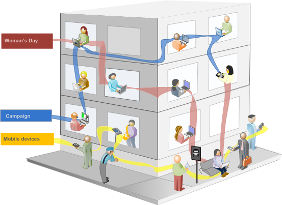
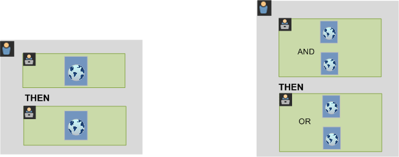

# Segmenten

Met segmenten kunt u subsets bezoekers identificeren op basis van kenmerken of interacties op de website. De segmenten worden ontworpen als publieksinzichten die u voor uw specifieke behoeften kunt bouwen, en dan verifiëren, uitgeven, en delen met andere teamleden of gebruik in andere producten van de Adobe en de mogelijkheden van de Analyse.

Segmenten zijn gebaseerd op een [!UICONTROL Visitor], [!UICONTROL Visit] en [!UICONTROL Hit] niveauhiërarchie die een genest containermodel gebruikt. Met de geneste containers kunt u bezoekerskenmerken en handelingen definiëren op basis van regels tussen en binnen de containers. Analysesegmenten kunnen worden gemaakt, goedgekeurd, gedeeld, opgeslagen en uitgevoerd voor meerdere producten en mogelijkheden in het deelvenster [!DNL Adobe Experience Cloud]. De segmenten kunnen van een rapport worden geproduceerd, in een dashboardrapport worden ingebouwd, of worden bookmarked voor snelle toegang.

U kunt segmenten bouwen en bewaren in de Bouwer van het Segment, of segmenten van een rapport van de Vallout produceren (in  Analysis Workspace). U kunt ook vooraf gebouwde segmenten op basis van specifieke regels tussen geneste containers gebruiken en uitbreiden, zodat u resultaten kunt filteren en op rapporten kunt toepassen. Daarnaast kunnen segmenten samen worden gebruikt als [gestapelde segmenten](/help/components/segmentation/segmentation-workflow/seg-workflow.md).

Segmenten identificeren wie uw bezoekers zijn (land, geslacht, koffiewinkel), welke apparaten en services ze gebruiken (browser, zoekmachine, mobiel apparaat), waar ze naartoe zijn genavigeerd (zoekmachine, vorige exitpagina, natuurlijke zoekactie) en nog veel meer.

Segmenten kunnen op de volgende waarden worden gebaseerd:

* Bezoekers op basis van kenmerken: browsertype, apparaat, aantal bezoeken, land, geslacht.
* Bezoekers op basis van interacties: campagnes, sleutelwoordonderzoek, onderzoeksmotor.
* Bezoekers op basis van uitgangen en binnenkomsten: bezoekers uit Facebook, een gedefinieerde landingspagina, verwijzend domein.
* Bezoekers op basis van aangepaste variabelen: formulierveld, gedefinieerde categorieën, klant-id.

Wanneer het bouwen van publiekssegmenten in de Bouwer van het Segment, bepaalt u voorwaarden gebruikend [!UICONTROL AND] en [!UICONTROL OR] operatoren tussen containers.

Dit type van segmentfilters gegevensreeksen die op eigenschappen worden gebaseerd die met het worden verbonden [!UICONTROL AND] en [!UICONTROL OR] operatoren.

* U kunt [pas veelvoudige segmenten op een rapport of een project toe](/help/components/segmentation/segmentation-workflow/seg-workflow.md).
* De segmenten zijn universeel aan alle rapportseries.
* De [Segment Builder](/help/components/segmentation/segmentation-workflow/seg-workflow.md) vereenvoudigt het maken van segmenten.
* De [Segmentbeheer](/help/components/segmentation/segmentation-workflow/seg-workflow.md) laat u opstelling [workflows](/help/components/segmentation/segmentation-workflow/seg-workflow.md) met functies voor segmentdeling, codering, verificatie en goedkeuring.
* U kunt [tagsegmenten](/help/components/segmentation/segmentation-workflow/seg-workflow.md) om later te organiseren en te zoeken in plaats van omslagen te gebruiken.
* U kunt [Opeenvolgende segmenten](/help/components/segmentation/segmentation-workflow/seg-sequential-build.md).
* De [!UICONTROL Page View] container is nu de [!UICONTROL Hit] container om erop te wijzen dat deze container alle types van gegevens en niet alleen paginameningen segmenteert. De aanroepen voor het bijhouden van koppelingen en trackhandelingen van de mobiele SDK&#39;s worden bijvoorbeeld allemaal opgenomen of uitgesloten in de aanraakcontainer.

## Segmentering in Analysis Workspace

Analysis Workspace bevat de volgende aanvullende functies:

* U kunt [vergelijken, segmenten](https://experienceleague.adobe.com/docs/analytics/analyze/analysis-workspace/panels/segment-comparison/segment-comparison.html).
* Gebruiken [segmenten als afmetingen](https://experienceleague.adobe.com/docs/core-services/interface/audiences/audience-library.html) in een vergelijking.
* Segmenten gebruiken in [valutanotatie](https://experienceleague.adobe.com/docs/analytics/analyze/analysis-workspace/visualizations/fallout/compare-segments-fallout.html).

## Door Adobe verschafte segmenten

De componentrails aan de linkerkant van het scherm geven segmenten weer die door u en uw bedrijf zijn gemaakt, en Adobe-segmenten die uit het vak worden geleverd. Wanneer u op **[!UICONTROL Show all]** Deze segmenten worden doorgaans onder aan de lijst weergegeven en worden aan de rechterkant aangeduid met het Adobe-logo. Dit is een gedeeltelijke lijst van Adobe-Geleverde segmenten:

## Opeenvolgende segmenten {#sequential}

Met opeenvolgende segmenten kunt u bezoekers identificeren op basis van navigatie en paginaweergave op uw site. Zo kunt u een segment van gedefinieerde handelingen en interacties opgeven. Met behulp van opeenvolgende segmenten kunt u bepalen wat een bezoeker leuk vindt en wat een bezoeker vermijdt. Bij het samenstellen van opeenvolgende segmenten [!UICONTROL THEN] wordt gebruikt om bezoekersnavigatie te bepalen en te bestellen.

| Eén bezoeken | Twee bezoeken | Drie bezoeken |
|---|---|---|
| Tijdens het eerste bezoek ging de bezoeker naar de hoofdbestemmingspagina (A), de campagnepagina (B) werd uitgesloten en de productpagina (C) werd weergegeven. | Tijdens het tweede bezoek ging de bezoeker opnieuw naar de hoofdbestemmingspagina (A), de campagnepagina (B) werd uitgesloten en ging hij opnieuw naar de productpagina (C) en vervolgens naar een nieuwe pagina (D). | Tijdens het derde bezoek heeft de bezoeker hetzelfde pad ingevoerd en gevolgd als bij het eerste en tweede bezoek, en vervolgens pagina F geschrapt om rechtstreeks naar een bepaalde productpagina (G) te gaan. |

De opeenvolgende segmenten kunnen op de volgende klapwaarden worden gebaseerd:

* Bezoekers die zijn gebaseerd op een reeks pagina-pagina-weergaven tijdens één bezoek, paginaweergaven tijdens afzonderlijke bezoeken, bezoeken die paginaweergaven uitsluiten.
* Bezoekers op basis van de weergaven tussen en na de pagina, na een bepaalde tijdslimiet, tussen hits, na een gebeurtenis.

Een opeenvolgend segment filtert gegevensreeksen die op gebruikersacties worden gebaseerd gebruikend [!UICONTROL THEN] operator.

## Hoe kan ik-segmentatievideo {#segment-video}

In deze video ziet u een kort overzicht van de containers voor segmenten en hoe u deze kunt gebruiken: [Containers voor segmenten in Adobe Analytics](https://experienceleague.adobe.com/docs/analytics-learn/tutorials/components/segmentation/segment-containers.html)

## Toegang tot de segmentatiehulpmiddelen {#access}

+++ **Hoe kan ik de Segment Builder bereiken?**

U kunt tot de Bouwer van het Segment toegang hebben door:

* Een bestaand rapport weergeven en op het pictogram Segmenten klikken   in de linkernavigatie. Klik in de segmenttrack die wordt weergegeven op **[!UICONTROL Add]**, of

* Klik boven aan Segmentbeheer op **[!UICONTROL + Add]**.  

   of

* Klik op een bestaande segmenttitel in Segmentbeheer om het segment te bewerken in Segmentbouwer.

+++

+++ **Hoe kan ik Segmentbeheer openen?**

Toegang tot Segmentbeheer via:

* Ga naar  **[!UICONTROL Analytics]** > **[!UICONTROL Components]** in de bovenste navigatie. Klik vervolgens op **[!UICONTROL Segments]**, of

* Een bestaand rapport weergeven en op het pictogram Segmenten klikken   in de linkernavigatie. Klik vervolgens op **[!UICONTROL Manage]**, of

* Druk op de schuine streep &#39;/&#39; in de interface en zoek naar segmentmanager.

+++

## Toestemmingen {#section_648DFA3A882146C485A84ED014EEC707}

+++ **Welke rechten en voorrechten moet ik gebruiken, creëren, en segmenten beheren?**

Standaard kunnen alle gebruikers persoonlijke segmenten maken en bewerken. Beheerders kunnen echter bepalen wie [machtigingen om segmenten te maken](https://experienceleague.adobe.com/docs/analytics/admin/user-product-management/user-groups/groups.html) en kan ze toewijzen aan specifieke groepen. Deze segmenten kunnen rechtstreeks met andere gebruikers van Analytics worden gedeeld.

Beheerders kunnen elk segment bewerken en segmenten delen met groepen en met iedereen in de organisatie. [Meer...](/help/components/segmentation/seg-reference/seg-rights.md)

+++

+++ **Kan ik alle segmenten in mijn bedrijf zien?**

Ja, beheerders kunnen alle segmenten binnen de [!DNL Analysis Workspace] en [!DNL Reports & Analytics] gebruikersinterfaces.

Report Builder geeft de segmenten weer die u bezit en de segmenten die met u worden gedeeld.

+++

+++ **Kan ik alle segmenten Analytics in de Manager van het Segment beheren?**

Ja, kunnen alle segmenten worden beheerd in de Manager van het Segment. Segmentbeheer geeft segmenten weer die zichtbaar zijn voor de eigenaar (gebruiker die het segment heeft gemaakt), gedeelde gebruikers en beheerders. De segmentkiezer geeft segmenten weer die eigendom zijn van en gedeeld worden met de gebruiker.

Beheerders kunnen alle segmenten in de Analysis Workspace en [!DNL Reports & Analytics] gebruikersinterfaces.

Report Builder toont slechts segmenten die door u of segmenten worden gebouwd die specifiek met u zijn gedeeld.

+++

+++ **Waarom kan ik dit segment niet verwijderen?**

Als het segment [gepubliceerd aan de Experience Cloud](/help/components/segmentation/segmentation-workflow/seg-workflow.md), kunt u deze niet verwijderen of bewerken. U kunt de gekopieerde versie echter wel kopiëren en bewerken.

+++
