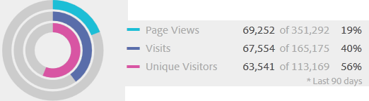
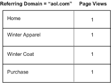
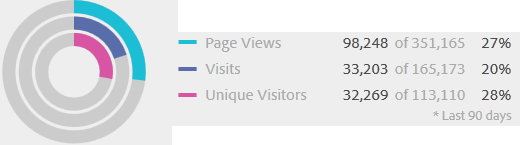

# Informatie over segmenten en containers

Met segmenten kunt u subsets bezoekers identificeren op basis van kenmerken of interacties op de website. De segmenten worden ontworpen als gecodificeerde publieksinzichten die u voor uw specifieke behoeften kunt bouwen, en dan verifiëren, uitgeven, en delen met andere teamleden of gebruik in andere producten van de Adobe en de mogelijkheden van de Analyse.

Segmenten zijn gebaseerd op een [!UICONTROL Visitor]-, [!UICONTROL Visit]- en [!UICONTROL Hit]-niveauhiërarchie met behulp van een genest containermodel. Met de geneste containers kunt u bezoekerskenmerken en handelingen definiëren op basis van regels tussen en binnen de containers. De segmenten van Analytics kunnen worden gebouwd, worden goedgekeurd, worden gedeeld, worden bewaard, en over veelvoudige producten en mogelijkheden in [!DNL Adobe Experience Cloud] lopen. De segmenten kunnen van een rapport worden geproduceerd, in een dashboardrapport worden ingebouwd, of worden bookmarked voor snelle toegang.

U kunt segmenten bouwen en bewaren in de Bouwer van het Segment, of segmenten van een rapport van de Vallout produceren (in  Analysis Workspace). U kunt ook vooraf gebouwde segmenten op basis van specifieke regels tussen geneste containers gebruiken en uitbreiden, zodat u resultaten kunt filteren en op rapporten kunt toepassen. Daarnaast kunnen segmenten samen worden gebruikt als [gestapelde segmenten](/help/components/segmentation/segmentation-workflow/seg-workflow.md).

## Segmenten {#section_CC4EBA2A6CCB4F8BBB8437052A880657}

Segmenten identificeren wie uw bezoekers zijn (land, geslacht, koffiewinkel), welke apparaten en services ze gebruiken (browser, zoekmachine, mobiel apparaat), waar ze naartoe zijn genavigeerd (zoekmachine, vorige exitpagina, natuurlijke zoekactie) en nog veel meer.


Segmenten kunnen op de volgende waarden worden gebaseerd:

* Bezoekers op basis van kenmerken: browsertype, apparaat, aantal bezoeken, land, geslacht.
* Bezoekers op basis van interacties: campagnes, sleutelwoordonderzoek, onderzoeksmotor.
* Bezoekers op basis van uitgangen en binnenkomsten: bezoekers van Facebook, een gedefinieerde bestemmingspagina, verwijzend domein.
* Bezoekers op basis van aangepaste variabelen: formulierveld, gedefinieerde categorieën, klant-id.

Wanneer het bouwen van publiekssegmenten in de Bouwer van het Segment, bepaalt u voorwaarden gebruikend [!UICONTROL AND] en [!UICONTROL OR] exploitanten tussen containers.


Dit type van segmentfilters gegevensreeksen die op kenmerken worden gebaseerd die met de [!UICONTROL AND] en [!UICONTROL OR] exploitanten worden verbonden.

## Opeenvolgende segmenten {#section_EE5B14287FC44E0B96E77679A2438948}

Met opeenvolgende segmenten kunt u bezoekers identificeren op basis van navigatie en paginaweergave op uw site. Zo kunt u een segment van gedefinieerde handelingen en interacties opgeven. Met behulp van opeenvolgende segmenten kunt u bepalen wat een bezoeker leuk vindt en wat een bezoeker vermijdt. Bij het bouwen van opeenvolgende segmenten wordt de [!UICONTROL THEN] operator gebruikt om bezoekersnavigatie te definiëren en te bestellen.


| Eén bezoeken | Twee bezoeken | Drie bezoeken |
|---|---|---|
| Tijdens het eerste bezoek ging de bezoeker naar de hoofdbestemmingspagina (A), de campagnepagina (B) werd uitgesloten en de productpagina (C) werd weergegeven. | Tijdens het tweede bezoek ging de bezoeker opnieuw naar de hoofdbestemmingspagina (A), de campagnepagina (B) werd uitgesloten en ging hij opnieuw naar de productpagina (C) en vervolgens naar een nieuwe pagina (D). | Tijdens het derde bezoek heeft de bezoeker hetzelfde pad ingevoerd en gevolgd als bij het eerste en tweede bezoek, en vervolgens pagina F geschrapt om rechtstreeks naar een bepaalde productpagina (G) te gaan. |

De opeenvolgende segmenten kunnen op de volgende klapwaarden worden gebaseerd:

* Bezoekers die zijn gebaseerd op een reeks pagina-pagina-weergaven tijdens één bezoek, paginaweergaven tijdens afzonderlijke bezoeken, bezoeken die paginaweergaven uitsluiten.
* Bezoekers op basis van de weergaven tussen en na de pagina, na een bepaalde tijdslimiet, tussen hits, na een gebeurtenis.


Een opeenvolgend segment filtert gegevensreeksen die op gebruikersacties worden gebaseerd gebruikend de [!UICONTROL THEN] exploitant.

## Hoe kan ik-video {#section_89D6184890AF4086A8056BFBB0B68C29}

In deze video ziet u een kort overzicht van de containers voor segmenten en hoe u deze kunt gebruiken: [Containers voor segmenten in Adobe Analytics](https://docs.adobe.com/content/help/en/analytics-learn/tutorials/components/segmentation/segment-containers.html)

## Informatie over containers {#section_AF2A28BE92474DB386AE85743C71B2D6}

Een segment stelt voorwaarden in om een bezoeker te filteren op basis van zijn of haar kenmerken of interacties met uw site. Als u voorwaarden in een segment wilt instellen, stelt u regels in om bezoekers te filteren op basis van bezoekerskenmerken en/of navigatiekenmerken. Als u bezoekersgegevens verder wilt onderverdelen, kunt u filteren op basis van specifieke bezoeken en/of toeschouwers in de paginaweergave voor elke bezoeker. De Bouwer van het Segment verstrekt een eenvoudige architectuur om deze subsets te bouwen en regels als genestelde, hiërarchische Bezoeker, Bezoek, of de containers van het Actief toe te passen.

De containerarchitectuur die in de Bouwer van het Segment wordt gebruikt bepaalt **[!UICONTROL Visitor]** als buitenste container, die overkoepelende gegevens specifiek voor de bezoeker over bezoeken en paginameningen bevat. Met een geneste **[!UICONTROL Visit]**-container kunt u regels instellen om de gegevens van de bezoeker op basis van bezoeken af te splitsen. Met een geneste **[!UICONTROL Hit]**-container kunt u bezoekersinformatie afsplitsen op basis van afzonderlijke paginaweergaven. Met elke container kunt u de geschiedenis van een bezoeker doorlopen, interacties splitsen op bezoeken of afzonderlijke treffers splitsen.


**Bezoekercontainer**

De bezoekerscontainer bevat elk bezoek en elke paginaweergave voor bezoekers binnen een opgegeven tijdsperiode. Een segment op het niveau van de Bezoeker keert de pagina terug die aan de voorwaarde plus alle andere pagina&#39;s voldoet die door de bezoeker (en slechts beperkt door bepaalde datumwaaiers) worden bekeken. Als meest breed-bepaalde container, zullen de rapporten die op het containerniveau van de Bezoeker worden geproduceerd paginameningen over alle bezoeken terugkeren en laat u een multi-bezoek analyse produceren. Daarom is de container van de Bezoeker de meest vatbare om te veranderen gebaseerd op bepaalde datumwaaiers.

Bezoekerscontainers kunnen waarden bevatten op basis van de algemene geschiedenis van een bezoeker:

* Dagen vóór eerste aankoop
* Oorspronkelijke invoerpagina
* Oorspronkelijke verwijzende domeinen

**Bezoek container**

Met de container Visit kunt u paginainteracties, campagnes of conversies voor een specifieke websessie identificeren. De container van het Bezoek is de gemeenschappelijkste gebruikte container omdat het gedrag voor de volledige bezoekzitting vangt zodra de regel wordt ontmoet en u laat bepalen welke bezoeken u in de bouw en het toepassen van een segment wilt omvatten of uitsluiten. Het kan u helpen de vraag te beantwoorden hoeveel bezoekers de sectie Nieuws en Sport tijdens hetzelfde bezoek bekeken? Of pagina&#39;s die zijn toegewezen aan een geslaagde omzetting in een uitverkoop?

De containers van het bezoek omvatten waarden die op voorkomen per bezoek worden gebaseerd:

* Bezoeknummer
* Itempagina
* Retourfrequentie
* Deelnamemetriek
* Lineaire toegewezen metriek

**Actief**

De container Actief definieert welke pagina treffers u van een segment wilt opnemen of uitsluiten. Het is het meest smalle van de beschikbare containers om u specifieke kliks en paginamening te laten identificeren waar een voorwaarde waar is, latend u één enkele het volgen code bekijken, of gedrag binnen een bepaalde sectie van uw plaats isoleren. U kunt ook een specifieke waarde aanwijzen wanneer een handeling plaatsvindt, zoals het marketingkanaal wanneer een order is geplaatst.

Actief containers bevatten op één pagina gebaseerde waarden:

* Producten
* Props weergeven
* Lijstvariabelen
* Merchandising Vars (in de context van gebeurtenissen)

   >[!NOTE]
   >
   >Als u deze container gebruikt op een waarde die aanhoudt, zoals een evar, trekt het in elke hit waar die waarde aanhoudt. In het geval van een volgende code die na een week verloopt, zou die waarde over veelvoudige bezoeken kunnen voortbestaan.

**Container voor logische groep**

Met de container van de Logische Groep kunt u een afzonderlijke container binnen de segmentregels verstrekken om entiteiten te filteren die niet op hiërarchie worden gebaseerd. U kunt bijvoorbeeld een container toevoegen die in het segment is genest en die filters toepast op basis van de bezoeker. Voor dit type logica moet u de hiërarchie afbreken (aangezien u al een container op hoofdniveau van de Bezoeker hebt) om alleen voor geselecteerde bezoekers te filteren. Dit kan worden verwezenlijkt gebruikend de container van de Logische Groep. Zie [Voorbeelden van logische groepen](/help/components/segmentation/segmentation-workflow/seg-sequential-build.md) voor aanvullende informatie.

## Containers {#section_7FDF47B3C6A94C38AE40D3559AFFAF70} nesten

Wanneer u segmentcontainers maakt in andere containers, maakt u in wezen een segment binnen een segment. De volgende logica wordt gebruikt bij geneste containers:

1. Bepaal welke gegevens worden opgenomen met de buitenste container. Om het even welke gegevens die deze buitenregel niet aanpassen worden verworpen in het gesegmenteerde rapport.
1. Pas de geneste regel toe op de resterende gegevens. De geneste regel is NIET van toepassing op alle treffers die door de eerste regel worden uitgelijnd.
1. Herhaal deze bewerking totdat alle geneste containerregels zijn berekend. De resterende gegevens worden vervolgens opgenomen in het resulterende rapport.

U kunt het nesten tussen containers evenals tussen regels binnen een container gebruiken. Dit is wat u in elke container kunt nesten:

| Containernaam | Wat u in kunt nesten |
|---|---|
| Actief | Alleen gebeurtenissen |
| Bezoek | Actief, container, gebeurtenissen |
| Bezoeker | Bezoek container, Actief container, Gebeurtenissen |
| Logische groep | Visitor container, Visitor container, Hit container |

**Meerdere containers opnemen binnen één definitie**

Als u meerdere segmenten in een nieuw samengesteld segment opneemt, kunt u gegevens nog verder verfijnen. Wanneer u twee bestaande segmenten samen sleept, fungeert dit als een &quot;OR&quot;-instructie bij het filteren van bezoekers. Alle containers in het canvas worden gecontroleerd op basis van alle gegevens en alle gegevens die overeenkomen met een van de containers worden opgenomen in de rapportage.

Bijvoorbeeld, het slepen van een container van het Bezoek waar Land = Verenigde Staten met een container van het Bezoek waar de Orde = Waar

```
Country = United States + Order = True
```

bouwt een segment dat zich in deze volgorde gedraagt:

1. Dit segment zou eerst uw volledige gegevens bekijken en alle bezoekers binnen de Verenigde Staten identificeren.
1. Het segment zou dan al uw gegevens opnieuw bekijken, zoekend om te zien of om het even welke bezoekers een orde maakten.
1. Beide reeksen gegevens zouden dan op het rapport worden toegepast.

## Containers voor opeenvolgende segmenten {#section_324AF503F51A4A62806151FE440F3B2E}

De opeenvolgende segmentatie gebruikt de zelfde basiscontainers, met inbegrip van [!UICONTROL Visitors], [!UICONTROL Visits], en [!UICONTROL Hits] (met inbegrip van paginameningen of andere dimensies) hiërarchisch genestelde.


[!UICONTROL Visitors] vormen de container met de hoogste orde in opeenvolgende segmentatie,  [!UICONTROL Visits] in de  [!UICONTROL Visitors] container, en  [!UICONTROL Hits] bevinden zich in de  [!UICONTROL Visitors] of  [!UICONTROL Visits] containers. Deze [containerhiërarchie](/help/components/segmentation/seg-overview.md#section_7FDF47B3C6A94C38AE40D3559AFFAF70) moet worden gehandhaafd om goed-geordende opeenvolgende segmenten te bouwen.

**Om opeenvolgende segmenten** te bouwen, zijn de containers genest en opeenvolgende logica verbonden die gebruikend de  [!UICONTROL THEN] exploitant die elke container vereist om waar te zijn gebaseerd op de opeenvolging van de bezoeker.


De enige uitzondering op deze hiërarchie van containers is wanneer het gebruiken van [Logische container van de Groep](/help/components/segmentation/segmentation-workflow/seg-sequential-build.md). Met de container [!UICONTROL Logic Group] kunt u een hit in een container nesten zonder volgorde om gebeurtenissen en afmetingen vast te leggen, maar buiten een opeenvolgende volgorde.


## Rapporten gebaseerd op containergegevens {#concept_BE822C12F87C4F07B7147D80BEFBAB87}

Met containers kunt u verschillende gegevens op basis van rapportagewaarden filteren wanneer u segmenten splitst en deze op rapporten toepast.

Gegevens die zijn vastgelegd op elk niveau van de Bezoeker > Bezoek > Actief in de containerhiërarchie, zijn van invloed op de manier waarop u uw segmenten maakt. Als u het zelfde segment neemt dat op het zelfde rapport wordt toegepast gebruikend de zelfde gegevensreeks, zult u verschillende waarden krijgen die op de container worden gebaseerd waarvan u het rapport produceert. Factoren zoals het rapportageniveau van containers en de persistentie van waarden in verschillende treffers kunnen grote wijzigingen in de rapportnauwkeurigheid betekenen.

## Basisbeginselen van containergegevens {#section_9576D970F912450191AFB5B83F7F1656}

De bezoeker die hieronder is afgebeeld, heeft bijvoorbeeld tijdens het eerste bezoek een site bezocht, op de startpagina geland en vervolgens drie extra pagina&#39;s bezocht en het bezoek omgezet in een verkoop. Tijdens een afzonderlijk bezoek landde de bezoeker deze keer via de productpagina, vervolgens naar de startpagina, terug naar de productpagina en sloot hij de sessie na de Winter Hats te hebben bekeken. Gebaseerd in de gegevens die voor elke container voor het segment worden gevangen, zullen de verschillende waarden in het rapport worden getoond.

Het onderstaande segment *Pagina&#39;s is winterlaag* wordt toegepast op het **Pagina-rapport**.


Gebaseerd op de geselecteerde container, toont het rapport verschillende resultaten.


**Rapportage van de container van de Actief**

Wanneer deze voorwaarde binnen een container van het Actief is, dan maakt het rapport van slechts pagina&#39;s een lijst waar *Pagina = Winter Coats* waar is. Aangezien slechts één pagina met deze voorwaarde overeenkomt in een container van slechts één pagina, wordt alleen de pagina Winter Coats weergegeven.


De rapportering van de container van het Actief, kunt u zien hoe het melden van verschillende containers algemene rapporteringswaarden beïnvloedt. Wanneer u het segmentrapport bekijkt, ziet u dat de paginaweergaven ongeveer gelijk zijn aan bezoeken (ongeveer 2000 bezoekers zagen tijdens een bezoek dubbele pagina&#39;s die het totale aantal paginaweergaven optellen) en dat unieke bezoekers ongeveer gelijk zijn aan het aantal bezoeken (ongeveer 2000 unieke bezoekers hebben meer dan één keer bezocht).



>[!IMPORTANT]
>
>Ongeacht hoe u de gegevens-van Hit bekijkt, Bezoek, of container-zij allen hebben het zelfde aantal bezoekers, 63, 541, in dit voorbeeld. Ongeacht hoe u het rapport produceert, blijft de aanvankelijke bezoekersvoorwaarde - Bezoekers die de pagina van de Mantels van de Winter bekeken - intact. Het is de subset van gegevens waarvan u op de verschillende niveaus rapporteert.

**Rapportage van de container van Visit**

Als deze zelfde voorwaarde binnen een container van het Bezoek is, dan maakt het rapport een lijst van alle pagina&#39;s in het bezoek waar *Pagina is de Borsten van de Winter* waar is. De pagina Winter bevat filters, maar ook alle andere pagina&#39;s in het bezoek waar de voorwaarde waar is. Omdat de bezoeker ook de pagina&#39;s Home, Product en Aankoop heeft bezocht tijdens het bezoek waar aan de voorwaarde is voldaan, worden deze extra pagina&#39;s in het rapport vermeld wanneer ze worden gerapporteerd met de containergegevens van de bezoeker.


Als u segmentwaarden uit de container Visit weergeeft, ziet u dat het aantal paginaweergaven aanzienlijk is toegenomen. De reden hiervoor is dat de rapportage van de container Visit alle pagina&#39;s identificeert die aan de voorwaarden voldoen, plus alle andere pagina&#39;s die tijdens het bezoek worden weergegeven (met alle paginaweergaven die in elke container Visit zijn vastgelegd).


**Rapportage van de bezoekerscontainer**

Als deze zelfde voorwaarde binnen een container van de Bezoeker is, maakt het rapport een lijst van alle pagina&#39;s die door om het even welke bezoeker worden bekeken waar *de Pagina is winterjassen* waar is. Dit betekent dat als een bezoeker de pagina Winter Coats heeft bekeken, alle pagina&#39;s in de bezoekercontainer, inclusief paginaweergaven tijdens andere bezoeken, worden weergegeven. Daarom worden pagina&#39;s die niet aan de voorwaarde voldoen, vermeld in het rapport omdat de bezoeker deze pagina&#39;s eerder heeft bekeken. Alle pagina&#39;s in de container van de Bezoeker worden vermeld in het rapport, zelfs als ze eerder zijn opgetreden en niet specifiek aan de voorwaarden voldoen.


Als u segmenten uit de container Visitor weergeeft, ziet u dat de weergave Pagina&#39;s en Bezoekingen zijn vergroot. Dit komt doordat op bezoekersniveau, als de bezoeker de pagina Winter Coats slechts één keer heeft bezocht (waardoor de voorwaarde waar is), alle andere paginaweergaven en alle andere bezoeken voor die bezoeker worden vastgelegd.


Samenvattend, is het begrip van hoe de segmentatie op diverse gegevensuitsplitsingen werkt zeer belangrijk om de gegevens te interpreteren het terugkeert.

## Rapportage op basis van de container {#section_D0604748F2794327B8C668617A31EC18}

Elke uitsplitsing van segmentgegevens heeft een bereik waarop deze worden toegepast. De meeste uitsplitsingen zijn gebaseerd op *Paginaweergaven*. Veel waardevolle segmenten zijn echter gebaseerd op de container *Visit* en in mindere mate op de container *Visitor*. Het is belangrijk om rapportering te begrijpen die op het werkingsgebied van uw container wordt gebaseerd.

Gebaseerd op het *Pagina = de segmentvoorbeeld van de Winter* eerder gebruikt, bepalen de hieronder vermelde kwesties andere aspecten van uw segment die op hoe worden gebaseerd de containergegevens toegepast en hoe het werkingsgebied van de gegevens het segmenttype zou moeten aanpassen.

**Segmentcontainer gebaseerd op overeenkomende segmentregel**

Het toepassen van de segmentcontainer op een natuurlijk werkingsgebied van gegevens brengt verwachte resultaten op waar de lijnpunten de segmentregel aanpassen.

* **Actcontainer waarbij de pagina staat voor &quot;Winter Coat&quot;**: Als u een  ** Paginarapport met dit segment weergeeft, worden alleen de waarden met de waarde &quot;Winter Coat&quot; geretourneerd. Alle andere pagina&#39;s worden uitgesloten van rapportage.
* **Bezoek de container waar de ingangspagina gelijk is aan &quot;Winter kleding&quot;**: Het bekijken van een  *Paginaverslag van de* Ingang met dit segment keert slechts het tweede bezoek terug omdat zijn ingangspagina de segmentregel aanpast.
* **Bezoek de container waar het bezoeknummer gelijk is aan 1**: Het bekijken van Bezoek Alle paginameningen van het eerste bezoek zijn inbegrepen in het rapport omdat het de segmentregel aanpast.

**Paginaweergaven op containerniveau Visit**

Veel segmentregels identificeren paginaweergaven per bezoek. Wanneer dit voorkomt, wordt de volledige container van de Bezoeker toegepast, als slechts één enkele slag de regel aanpast. Dit segmentrapport is vooral waardevol omdat paginaweergaven op basis van bezoeken inzicht bieden op basis van paginaweergaven per bezoek.

* **Bezoek de container waarin de pagina staat voor de pagina** Winterlaag: In een paginapport op het containerniveau van de Bezoeker worden alle paginaweergaven van bezoeken weergegeven die een weergave van de pagina &quot;Winter kleding&quot; bevatten. Als een pagina de segmentregel aanpast, zijn alle paginameningen verbonden aan dat bezoek inbegrepen in het rapport.
* **Bezoek de container waarin de pagina staat voor de startpagina**: In een rapport van de Pagina met dit segment toont slechts gegevens van het eerste bezoek. De reden hiervoor is dat de bezoeker tijdens het tweede bezoek geen homepage heeft weergegeven.
* **Bezoekercontainer met de pagina staat voor &quot;Winter kleding&quot;**: In een paginapport haalt dit segment alle gegevens van beide bezoeken op, omdat de bezoeker de pagina &quot;Winter Apparel&quot; tijdens beide bezoeken heeft weergegeven.

**De container van het segment identificeert Hits kleiner dan de Mening van de Pagina**

Het gebruiken van segment met een kleinere container dan het verdelingswerkingsgebied keert onverwachte gegevens terug. Het gebruiken van een kleinere onderbreking trekt nog in alle klappen van dat werkingsgebied van gegevens.

* **De container van de greep waar de ingangspagina de pagina** van het Product evenaart: Elke pagina associeert met de ingangspagina van het bezoek, die van het maken van het op bezoek-gebaseerde uitsplitsing. Wanneer u dit segment gebruikt, wordt niet alleen de productpagina van de invoerpagina weergegeven, maar worden ook alle resultaten van dat bezoek weergegeven.
* **De container van de greep waar Lijst Var 1 ValueA** bevat: Als er meerdere waarden zijn gedefinieerd op hetzelfde resultaat als de lijst var, worden alle waarden van variabelen opgenomen in het segment. Er is geen manier om waarden te scheiden die in de zelfde paginamening voorkomen omdat de container van het Actief de kleinste segmentcontainer is om hits te breken.
* **Aanraakcontainer waarbij pagina gelijk is aan &quot;Aankoop&quot;**: Als u paginaweergaven als metrisch gebruikt, wordt alleen de pagina Aankoop weergegeven (zoals verwacht). Als u een rapport Inkoopdeelname gebruikt, ontvangen alle pagina&#39;s van het eerste bezoek $100, omdat de maatstaven voor deelname op bezoek zijn gebaseerd.
* **Aanraakcontainer waarbij pagina gelijk is aan &quot;Winterlaag&quot;**: Als u paginaweergaven als metrische weergave gebruikt, wordt alleen de pagina Winterlaag weergegeven (zoals verwacht). Als u een Inkomstendeelnemingsrapport gebruikt, krijgen geen pagina&#39;s krediet omdat deze dimensie een blijvende dimensie vereist. De paginaweergave die de aankoop daadwerkelijk heeft gemaakt (de pagina Aankoop), is niet opgenomen in de container Actief, dus er wordt geen inkomstendeelname aan enig item gegeven. Als u echter een rapport uitvoert vanuit de container Visit, worden alle paginaweergaven in dat bezoek opgenomen en wordt de deelname aan de inkomsten ($100) verdeeld over alle pagina&#39;s die in de sessie worden weergegeven.

## Persistentie in containers {#concept_E579D72B1C644AE9A4C4EAF6B47A4DCB}

Filteren op afmetingen die over een paginabereik blijven, zoals een campagne-eVar of een verwijzingsdimensie, beïnvloedt de gegevens die op containerniveau worden verzameld en moet worden begrepen voor het rapporteren van nauwkeurigheid.

Segmentgegevens kunnen variëren op basis van de persistentie van een dimensie of de toegepaste variabele op geselecteerde pagina&#39;s. Sommige afmetingen, zoals de pagina-afmetingen, bieden unieke waarden op paginaniveau en worden gefilterd op basis van gegevens uit de container Actief. (Zie [Rapporten die op de Gegevens van de Container](/help/components/segmentation/seg-overview.md) voorbeeld worden gebaseerd). Andere dimensies, zoals de dimensie Refererend Domein, blijven over veelvoudige pagina&#39;s voor een bezoek bestaan. Sommige afmetingen of toegepaste variabelen, zoals Duur van bezoek, strekken zich over de volledige geschiedenis van een bezoeker uit.


In tegenstelling tot de pagina-dimensie wordt de waarde van het Refererend domein aan elke pagina in dit bezoek toegevoegd. De bezoeker hieronder komt bijvoorbeeld op de startpagina van een site waarnaar wordt verwezen. Daarom wordt aan alle pagina&#39;s in dat bezoek dezelfde waarde voor het verwijzende domein toegewezen.

Het *Refering Domain is gelijk aan aol.com* segment hieronder wordt toegepast op **Pagina&#39;s Report**.


Bij een nieuw bezoek wordt de bezoeker doorverwezen van een andere site. Daarom wordt aan alle pagina&#39;s in het nieuwe bezoek de nieuwe waarde voor het verwijzende domein toegewezen voor elke paginaweergave.

**Rapportage van de container van de Actief**

Omdat aan alle paginaweergaven in hetzelfde bezoek dezelfde waarde voor Refererend domein wordt toegewezen, wordt bij rapportage op het containerniveau Actief de waarde *Refering Domain = &quot;aol.com&quot;* geretourneerd die op alle pagina&#39;s in de onderstaande tabel wordt weergegeven.



Met gegevens uit de container Actief werden iets meer dan 92.000 paginaweergaven weergegeven in meer dan 33.000 Bezoekingen door iets meer dan 32.000 Bezoekers. Gemiddeld waren er drie pagina&#39;s in elk bezoek, en bijna alle bezoeken waren door unieke bezoekers.


**Rapportage van de container van Visit**

Als deze zelfde voorwaarde in de container van het Bezoek voor een rapport van Pagina&#39;s wordt gefiltreerd, dan alle pagina&#39;s in het bezoek waar *Refering Domein = &quot;aol.com&quot;* waar is. Omdat de waarde van het verwijzende domein op het bezoekniveau wordt geplaatst, zijn de rapporten bij de niveaus van de Mening van de Pagina en van het Bezoek het zelfde.


In dit voorbeeld, omdat alle pagina&#39;s de zelfde verwijzende domeinwaarde hebben die op het bezoek wordt gebaseerd, is het rapport van het de containerniveau van het Bezoek (bijna) het zelfde aan het rapport van de container van de Mening van de Pagina (met lichte verschuiving-98, 234 tot 98.248-wegens gegevensanomalieën).



**Rapportage van de bezoekerscontainer**

Van de container van de Bezoeker, maakt het rapport van de Pagina een lijst van alle pagina&#39;s die door om het even welke bezoeker worden bekeken waar *Verwijzend Domein &quot;aol.com&quot;* waar is. Als een bezoeker *&quot;ol.com&quot;* als verwijzend domein op om het even welk ogenblik in de geschiedenis (binnen de bepaalde tijdspanne) had, dan zullen alle pagina&#39;s in de container van de Bezoeker—met inbegrip van paginameningen in andere bezoeken-worden vermeld. Zelfs de pagina&#39;s die niet aan de primaire voorwaarde aanpassen zullen in het rapport worden vermeld omdat deze pagina&#39;s in de container van de Bezoeker inbegrepen zijn. Alle pagina&#39;s in de container van de Bezoeker worden vermeld in het rapport, zelfs als ze eerder zijn opgetreden en niet specifiek aan de voorwaarden voldoen.

In een Verwijzend Rapport van het Domein, *Verwijzend Domein = &quot;aol.com&quot;* is waar in vier paginameningen, maar *Verwijzend Domein = &quot;weer.com&quot;* is waar in de andere pagina&#39;s de bezoeker sloeg. Van de container van de Bezoeker, krijgt u een lijst van Bezoekers waar &quot;aol.com&quot;waar is, maar het geeft u ook pagina&#39;s waar het verwijzende domein &quot;weer.com&quot;is, niet de waarde die uw aanvankelijke verzoek in het segment aanpaste.


Wanneer u gegevens van de container van de Bezoeker bekijkt, ziet u dat de paginaweergaven aanzienlijk zijn toegenomen (van 98.248 tot 112.925). Dit komt doordat alle paginaweergaven door de bezoeker, inclusief die met andere waarden voor het verwijzende domein die zijn opgeslagen op het containerniveau van de Bezoeker, zijn weergegeven (en ook de extra bezoeken van die bezoeker, die bezoeken verhogen van 33.203 tot 43.448).


Samenvattend,

* De container van het Bezoek keert alle pagina&#39;s terug die in een bezoek worden gezien waar minstens één pagina aan de criteria voldoet. Als een pagina dus alleen wordt weergegeven tijdens bezoek 1 op dag 1, worden alle pagina&#39;s die tijdens het hele bezoek worden bekeken, opgenomen in de gegevens.
* Wees voorzichtig wanneer de voorwaarde waarop u segmenteert zich op een eVar of ander type van blijvende variabele bevindt. U kunt bijvoorbeeld de voorwaarde &quot;waar de campagne e-mail bevat&quot; gebruiken en deze vervalt na 7 dagen. Dus als de campagne op het eerste bezoek wordt gezet, zal ze nog 7 dagen duren. Elk bezoek zal worden meegenomen, ook al werd de campagne pas tijdens het eerste bezoek gepland. De andere bezoeken zullen ook worden opgenomen (zolang zij binnen het datumbereik van het verslag vallen). Als u wilt voorkomen dat permanente waarden worden opgenomen, gebruikt u de gebeurtenis &quot;instance of&quot; of een equivalente Prop-variabele, indien beschikbaar.
