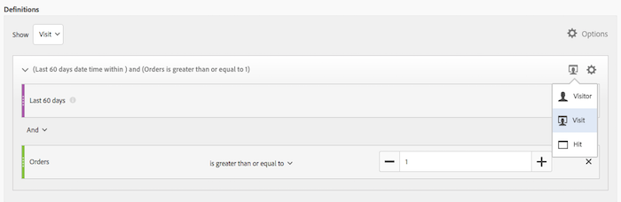

# Segment Builder

De [!UICONTROL Segment Builder] Hiermee kunt u eenvoudige of complexe segmenten maken die bezoekerskenmerken en -acties identificeren voor bezoeken en pagina-einden. Het verstrekt een canvas om metrische afmetingen, gebeurtenissen, of andere segmenten te slepen en te laten vallen om bezoekers te segmenteren die op hiërarchische logica, regels, en exploitanten worden gebaseerd.

Er zijn verscheidene manieren om tot de Bouwer van het Segment toegang te hebben:

* **Bovenste navigatie van analysemogelijkheden**: Klikken **[!UICONTROL Analytics]** > **[!UICONTROL Components]** > **[!UICONTROL Segments]**.
* **[!UICONTROL Analysis Workspace]**: Klikken **[!UICONTROL Analytics]** > **[!UICONTROL Workspace]**, opent u een project en klikt u op **[!UICONTROL + New]** > **[!UICONTROL Create Segment]**.
* **[!UICONTROL Reports & Analytics]**: Klikken **[!UICONTROL Analytics]** > **[!UICONTROL Reports]**, opent u een bestaand rapport en klikt u op het pictogram Segmenten   in de linkernavigatie, dan klik **[!UICONTROL Add]**.
* **[!UICONTROL Report Builder]**: [Segmenten toevoegen of bewerken in Report Builder](https://experienceleague.adobe.com/docs/analytics/analyze/report-builder/data-requests/segmentation.html).

## Builder-criteria {#section_F61C4268A5974C788629399ADE1E6E7C}

U kunt regeldefinities en containers toevoegen om de segmenten te definiëren.

1. **[!UICONTROL Title]**: Geef het segment een naam.
1. **[!UICONTROL Description]**: Geef een beschrijving voor het segment op.
1. **[!UICONTROL Tags]**: [Het segment coderen](/help/components/segmentation/segmentation-workflow/seg-workflow.md) u maakt door tags te kiezen uit een lijst met bestaande tags of door een nieuwe tag te maken.
1. **[!UICONTROL Definitions]**: Dit is waar u [segmenten samenstellen en configureren](/help/components/segmentation/segmentation-workflow/seg-workflow.md), voegt regels toe en nest- en reekscontainers.
1. **[!UICONTROL Show]**: (Selector bovenste container.) Hiermee kunt u het bovenste niveau selecteren [container](/help/components/segmentation/seg-overview.md) ( [!UICONTROL Visitor], [!UICONTROL Visit], [!UICONTROL Hit]). De standaard container op hoofdniveau is de container Actief.
1. **[!UICONTROL Options]**: (tandwiel) pictogram

   * **[!UICONTROL + Add container]**: Hiermee kunt u een nieuwe container (onder de container op het hoogste niveau) toevoegen aan de segmentdefinitie.
   * **[!UICONTROL Exclude]**: Hiermee kunt u het segment definiëren door een of meer dimensies, segmenten of metriek uit te sluiten.

1. **[!UICONTROL Dimensions]**: Componenten worden uit de lijst Dimension gesleept en verwijderd (oranje zijbalk).
1. **[!UICONTROL Operator]**: U kunt waarden vergelijken en beperken gebruikend geselecteerde exploitanten.
1. **[!UICONTROL Value]**: De waarde die u hebt ingevoerd of geselecteerd voor de afmeting of het segment of metrisch.
1. **[!UICONTROL Attribution Models]**: Deze modellen zijn alleen beschikbaar voor dimensies. Met deze modellen wordt bepaald voor welke waarden in een dimensie een segment moet worden gemaakt. Dimension-modellen zijn vooral handig voor opeenvolgende segmentatie.

   * **[!UICONTROL Repeating]** (standaard): Bevat varianten en doorlopende waarden voor de dimensie.
   * **[!UICONTROL Instance]**: Bevat exemplaren voor de dimensie.
   * **[!UICONTROL Non-repeating instance]**: Hiermee worden unieke (niet-herhalende) instanties voor de dimensie opgenomen. Dit is het model dat wordt toegepast in Flow wanneer herhaalde instanties worden uitgesloten.

   

   **Voorbeeld: Het segment van de hoogte waar eVar1 = A**

   | Voorbeeld | A | A | A (blijft bestaan) | B | A | C |
   |---|---|---|---|---|---|---|
   | Herhalend | X | X | X | - | X | - |
   | Instance | X | X | - | - | X | - |
   | Niet-herhalende instantie | X | - | - | - | X | - |
1. **[!UICONTROL And/Or/Then]**: Wijst het [!UICONTROL AND/OR/THEN] operatoren tussen containers of regels. Met de operator THEN kunt u [opeenvolgende segmenten definiëren](/help/components/segmentation/segmentation-workflow/seg-sequential-build.md).
1. **[!UICONTROL Metric]**: (Groene zijbalk) Metrisch die is gesleept en verwijderd uit de lijst Metriek.
1. **[!UICONTROL Comparison]** operator: U kunt waarden vergelijken en beperken gebruikend geselecteerde exploitanten.
1. **[!UICONTROL Value]**: De waarde die u hebt ingevoerd of geselecteerd voor de afmeting of het segment of metrisch.
1. **[!UICONTROL X]**: (Verwijderen) Hiermee kunt u dit deel van de segmentdefinitie verwijderen.
1. **[!UICONTROL Experience Cloud publishing]**: Als u een Adobe Analytics-segment naar de Experience Cloud publiceert, kunt u het segment gebruiken voor marketingactiviteiten in [!DNL Audience Manager] en in andere activeringskanalen. [Meer informatie...](/help/components/segmentation/segmentation-workflow/seg-publish.md)
1. **[!UICONTROL Audience library]**: Adobe beheren de vertaling van bezoekersgegevens in publiekssegmentatie. Als dusdanig, is het creëren van en het leiden van publiek gelijkaardig aan het creëren van en het gebruiken van segmenten, met de toegevoegde capaciteit om het publiekssegment aan de Experience Cloud te delen. [Meer informatie...](https://experienceleague.adobe.com/docs/core-services/interface/audiences/audience-library.html)
1. **[!UICONTROL Search]**: Hiermee doorzoekt u de lijst met afmetingen, segmenten of metriek.
1. **[!UICONTROL Dimensions]**: (Lijst) Klik de kopbal om uit te breiden.
1. **[!UICONTROL Metrics]**: Klik op de koptekst om deze uit te vouwen.
1. **[!UICONTROL Segments]**: Klik op de koptekst om deze uit te vouwen.
1. **[!UICONTROL Report suite selector]**: Hiermee selecteert u de rapportsuite waarin dit segment wordt opgeslagen. U kunt het segment in alle rapportsuites nog gebruiken.
1. **[!UICONTROL Segment Preview]**: Hiermee kunt u een voorvertoning van de belangrijkste metriek bekijken om te zien of u een geldig segment hebt en hoe breed het segment is. Geeft de uitsplitsing aan van de gegevensset die u kunt verwachten om te zien of u dit segment toepast. Toont 3 concentrische cirkels en een lijst om het aantal en het percentage gelijken voor te tonen [!UICONTROL Hits], [!UICONTROL Visits], en [!UICONTROL Visitors] voor een segment dat tegen een gegevensreeks in werking wordt gesteld. Dit diagram wordt meteen bijgewerkt nadat u de segmentdefinitie hebt gemaakt of gewijzigd.
1. **[!UICONTROL Product Compatibility]**: Bevat een lijst met Adobe Analytics-producten (Analysis Workspace, [!UICONTROL Reports & Analytics], Data Warehouse) waarmee het segment dat u hebt gemaakt compatibel is. De meeste segmenten zijn compatibel met alle producten. Niet alle operatoren en dimensies zijn echter compatibel met alle analytische producten, met name [Data Warehouse](/help/components/segmentation/seg-reference/seg-compatibility.md). Dit diagram wordt onmiddellijk bijgewerkt nadat u veranderingen in uw segmentdefinitie aanbrengt.
1. **[!UICONTROL Save]** of **[!UICONTROL Cancel]**: Hiermee slaat u het segment op of annuleert u het. Na klikken **[!UICONTROL Save]**, wordt u genomen aan de Manager van het Segment waar u het segment kunt beheren.

Segmenten met ingesloten datumbereiken werken in Analysis Workspace nog steeds anders dan [!UICONTROL Reports & Analytics]: In Workspace overschrijft een segment met een ingesloten datumbereik het datumbereik van het deelvenster. Daarentegen [!UICONTROL Reports & Analytics] geeft u de doorsnede van de waaier van de rapportdatum en de ingebedde de datumwaaier van het segment.

## Segmenten maken {#build-segments}

1. U sleept gewoon een Dimension-, Segment- of metrische gebeurtenis van het linkerdeelvenster naar het deelvenster [!UICONTROL Definitions] veld.

   

   Standaard op hoofdniveau [!UICONTROL Hit] container wordt weergegeven nadat een element naar is gesleept [!UICONTROL Definitions]. U kunt het containertype wijzigen in Bezoek of Bezoeker via het dialoogvenster **[!UICONTROL Show]** vervolgkeuzemenu.

1. Stel de [operator](/help/components/segmentation/seg-reference/seg-operators.md) in het keuzemenu.
1. Voer een waarde in voor het geselecteerde item of selecteer een waarde.
1. Voeg indien nodig extra containers toe met **[!UICONTROL And]**, **[!UICONTROL Or]**, of **[!UICONTROL Then]** regels.
1. Na het plaatsen van de containers en het plaatsen van de regels, zie de resultaten van het segment in de bevestigingsgrafiek bij het hoogste recht. De validator geeft het percentage en het absolute aantal paginaweergaven, bezoeken en unieke bezoekers aan die overeenkomen met het segment dat u hebt gemaakt.
1. Onder **[!UICONTROL Tags]**, [tag](/help/components/segmentation/segmentation-workflow/seg-tag.md) de container door een bestaande tag te selecteren of een nieuwe tag te maken.
1. Klikken **[!UICONTROL Save]** om het segment op te slaan.

U wordt nu naar de [Segmentbeheer](/help/components/segmentation/segmentation-workflow/seg-manage.md), waar u uw segment op meerdere manieren kunt labelen, delen en beheren.

## Containers toevoegen {#section_1C38F15703B44474B0718CEF06639EFD}

U kunt [een kader van containers opbouwen](/help/components/segmentation/seg-overview.md) en plaatst u vervolgens tussen logische regels en operatoren.

1. Klik op **[!UICONTROL Options > Add Container]**.

   

   Een nieuwe [!UICONTROL Hit] container wordt geopend zonder [!UICONTROL Hit] (Paginaweergave) geïdentificeerd.

   

1. Wijzig desgewenst het containertype.
1. Sleep een Dimension, Segment, of Gebeurtenis van de linkerruit aan de container.
1. Doorgaan met het toevoegen van nieuwe containers van het hoogste niveau **[!UICONTROL Options]** > **[!UICONTROL Add container]** boven aan de definitie of voeg containers vanuit een container toe om logica te nesten.

   **OF**

   Selecteer een of meer regels en klik op **[!UICONTROL Options]** > **[!UICONTROL Add container from selection]**. Hierdoor verandert uw selectie in een aparte container.

## Datumbereiken gebruiken {#concept_252A83D43B6F4A4EBAB55F08AB2A1ACE}

U kunt segmenten bouwen die het rollen datumwaaiers bevatten om vragen over aan de gang zijnde campagnes of gebeurtenissen te beantwoorden.

U kunt bijvoorbeeld eenvoudig een segment maken dat &#39;iedereen bevat die de afgelopen 60 dagen een aankoop heeft gedaan&#39;.

U maakt een Bezoek-container en voegt de [!UICONTROL Last 60 days] tijdbereik en metrisch [!UICONTROL Orders is greater than or equal to 1], met een operator AND:

Hier volgt een video over het gebruik van roldatumbereiken in segmenten:

>[!VIDEO](https://video.tv.adobe.com/v/25403/?quality=12)

## Segmenten stapelen {#task_58140F17FFD64FF1BC30DC7B0A1B0E6D}

Het stapelen van segmenten werkt door de criteria in elk segment te combineren gebruikend een &quot;en&quot;exploitant, en dan de gecombineerde criteria toe te passen. Dit kan in een project van de Werkruimte direct of in segmentbouwer worden gedaan.

Het stapelen van bijvoorbeeld een segment van &quot;mobiele telefoongebruikers&quot; en een segment van &quot;Amerikaanse geografie&quot; zou alleen gegevens voor mobiele telefoongebruikers in de VS retourneren.

Denk aan deze segmenten als bouwstenen of modules die u in een segmentbibliotheek kunt omvatten, voor gebruikers om te gebruiken aangezien zij passen zien. Op die manier kunt u het aantal benodigde segmenten aanzienlijk verminderen. Stel dat u 40 segmenten hebt:

* 20 voor gebruikers van mobiele telefoons in verschillende landen (VS_mobile, Duitsland_mobile, Frankrijk_mobile, Brazilië_mobile, enz.)
* 20 voor gebruikers van tablets in verschillende landen (US_tablet, Germany_tablet, France_tablet, Brazilië_tablet, enz.)

Door segment het stapelen te gebruiken, kunt u uw segmentaantal tot 22 verminderen en hen stapelen zoals nodig. U moet deze segmenten maken:

* één segment voor mobiele gebruikers
* één segment voor tabletgebruikers
* 20 segmenten voor de verschillende geografische gebieden

>[!NOTE]
>
>Wanneer het stapelen van twee segmenten, worden zij door gebrek verbonden door een EN verklaring. Dit kan niet in een OF verklaring worden veranderd.

1. Ga naar de Segment Builder.
1. Geef een titel en een beschrijving voor het segment op.

   Stap Resultaat 1. Klikken **[!UICONTROL Show Segments]** om de lijst met segmenten in de linkernavigatie weer te geven.

   Stap Resultaat 1. Sleep de segmenten die u wilt stapelen naar het segmentdefinitiekanvas. Hier is een voorbeeld van een segment dat de bestaande segmenten &quot;Visits from Tablets&quot; en &quot;US Geo&quot; stapelt:

   

1. Sla het segment op.

   Stap Resultaat

## Segmentsjablonen {#concept_5098446CC78D441E93B8E4D1D1EA6558}

Segmentsjablonen worden aangeboden voor algemene segmentatiegebruikstoepassingen, zoals &quot;Eerste bezoeken&quot; of &quot;Lijsten van mobiele apparaten&quot;. Zij zijn beschikbaar in de projecten van de Werkruimte en in de segmentbouwer als bouwstenen voor nieuwe segmenten.

Sjablonen worden aangeduid met het logo Adobe &quot;A&quot;. Hieronder vindt u een voorbeeld van de sjablonen:

<table id="table_98B87D807E9344C9BEBF072C65D87B1B"> 
 <thead> 
  <tr> 
   <th colname="col1" class="entry"> Sjabloonnaam </th> 
   <th colname="col2" class="entry"> Definitie </th> 
  </tr> 
 </thead>
 <tbody> 
  <tr> 
   <td colname="col1"> Abandon Cart </td> 
   <td colname="col2">Gegevens weergeven voor bezoekers die items aan hun winkelwagentjes hebben toegevoegd, maar geen bestellingen hebben gedaan. In de Definitie van het Segment, is de container Bezoek. De regel voor dit opeenvolgende segment is 
 Toevoegingen voor illustraties zijn niet null 
 
Vervolgens 
 
Orders is gelijk aan 0. 
 </td> 
  </tr> 
  <tr> 
   <td colname="col1"> Eerste bezoeken </td> 
   <td colname="col2">Gegevens weergeven voor bezoekers die maximaal één [1] keer hebben bezocht. In de Definitie van het Segment, is de container Bezoek. De regel is 
Visit Number is gelijk aan 1. 
 </td> 
  </tr> 
  <tr> 
   <td colname="col1"> Niet-aankoopcentrales </td> 
   <td colname="col2">Gegevens weergeven voor bezoekers die niet hebben deelgenomen aan een bestelgebeurtenis. In de Definitie van het Segment, is de container Bezoeker. In dit segment wordt de logica voor uitsluiten gebruikt. De regel is 
Bestellingen zijn niet null. 
 </td> 
  </tr> 
  <tr> 
   <td colname="col1"> Bezoek van niet-enkele pagina (niet-gebonden) </td> 
   <td colname="col2">Gegevens weergeven voor bezoekers die meerdere keren een bezoek hebben gebracht. In de Definitie van het Segment, is de container Bezoeker. In dit segment wordt de logica voor uitsluiten gebruikt. De regel is 
Single Access is niet null. 
 </td> 
  </tr> 
  <tr> 
   <td colname="col1"> Betaalde zoekopdracht </td> 
   <td colname="col2">Gegevens van bezoekers die afkomstig zijn van een betaalde zoekopdracht bekijken. In de Definitie van het Segment, is de container Bezoek. De regel is 
Betaalde zoekopdracht is gelijk aan 1. 
 </td> 
  </tr> 
  <tr> 
   <td colname="col1"> Aankopers </td> 
   <td colname="col2">Gegevens weergeven voor bezoekers die hebben deelgenomen aan een bestelgebeurtenis. In de Definitie van het Segment, is de container Bezoeker. De regel is 
Bestellingen zijn niet null. 
 </td> 
  </tr> 
  <tr> 
   <td colname="col1"> Terugkerende bezoeken </td> 
   <td colname="col2">Gegevens weergeven van bezoekers die ten minste één keer een bezoek hebben gebracht. In de Definitie van het Segment, is de container Bezoek. De regel is 
Visitenummer is groter dan 1. 
 </td> 
  </tr> 
  <tr> 
   <td colname="col1"> Bezoeken van één pagina </td> 
   <td colname="col2"> Gegevens van bezoeken weergeven waarin u een waarde van één pagina ziet, ook al kunt u tijdens dat bezoek meerdere paginaweergaven verzenden. Bezoeken van één pagina met gebeurtenissen van de uitgangsverbinding zijn inbegrepen in het segment. In de Definitie van het Segment, is de container Bezoek. De regel is 
Bezoekingen van één pagina zijn gelijk aan 1. 
 </td> 
  </tr> 
  <tr> 
   <td colname="col1"> Bekeken product niet aan winkelwagentje toegevoegd </td> 
   <td colname="col2">Gegevens weergeven voor bezoekers die producten hebben bekeken maar geen extra winkelwagentjes hebben. In de Definitie van het Segment, is de container Bezoek. De regel voor dit opeenvolgende segment is 
Productweergaven zijn niet null 
 
Vervolgens 
 
 Kart optellen is gelijk aan 0. 
 </td> 
  </tr> 
  <tr> 
   <td colname="col1"> Bezoeken van campagne </td> 
   <td colname="col2">Gegevens van bezoekers weergeven die door campagnes worden genoemd. In de Definitie van het Segment, is de container Bezoek. De regel is 
Trackingcode is niet null. 
 </td> 
  </tr> 
  <tr> 
   <td colname="col1"> Bezoeken van mobiele apparaten </td> 
   <td colname="col2">Gegevens van bezoekers weergeven die mobiele apparaten gebruiken. In de Definitie van het Segment, is de container Bezoek. De regel is 
Mobiel apparaat is niet null. 
 </td> 
  </tr> 
  <tr> 
   <td colname="col1"> Bezoeken van Natuurlijk zoeken </td> 
   <td colname="col2">Gegevens van bezoekers bekijken die niet afkomstig zijn van een betaalde zoekopdracht. In de Definitie van het Segment, is de container Bezoek. De regel is 
Betaalde zoekopdracht is gelijk aan 0. 
 </td> 
  </tr> 
  <tr> 
   <td colname="col1"> Bezoeken van niet-mobiel apparaat </td> 
   <td colname="col2">Gegevens weergeven van bezoekers die geen mobiele apparaten gebruiken. In de Definitie van het Segment, is de container Bezoek. In dit segment wordt de logica voor uitsluiten gebruikt. De regel is 
Mobiel apparaattype is gelijk aan mobiele telefoon 
 
of 
 
Mobiel apparaattype is gelijk aan tablet. 
 </td> 
  </tr> 
  <tr> 
   <td colname="col1"> Bezoeken van telefoons </td> 
   <td colname="col2">Gegevens van bezoekers weergeven met telefoons. In de Definitie van het Segment, is de container Bezoek. De regel is 
Apparaattype is gelijk aan mobiele telefoon. 
 </td> 
  </tr> 
  <tr> 
   <td colname="col1"> Bezoeken van zoekmachines </td> 
   <td colname="col2">Gegevens van bezoekers weergeven die door zoekprogramma's worden genoemd. In de Definitie van het Segment, is de container Bezoek. De regel is 
Het verwijzingstype is zoekmachines. 
 </td> 
  </tr> 
  <tr> 
   <td colname="col1"> Bezoeken van sociale sites </td> 
   <td colname="col2">Gegevens weergeven van bezoekers die door sociale sites worden genoemd. In de Definitie van het Segment, is de container Bezoek. De regel is 
Het verwijzingstype is sociale netwerken. 
 </td> 
  </tr> 
  <tr> 
   <td colname="col1"> Bezoeken van tabletten </td> 
   <td colname="col2">Gegevens van bezoekers weergeven met tablets. In de Definitie van het Segment, is de container Bezoek. De regel is 
Apparaattype is gelijk aan tablet. 
 </td> 
  </tr> 
  <tr> 
   <td colname="col1"> Bezoeken met cookie van bezoeker-id </td> 
   <td colname="col2">Gegevens van bezoekers van uw site weergeven, waar een permanente cookie vereist is. In de Definitie van het Segment, is de container Bezoek. De regel is 
Blijvende cookie is gelijk aan 1. 
 </td> 
  </tr> 
 </tbody> 
</table>
