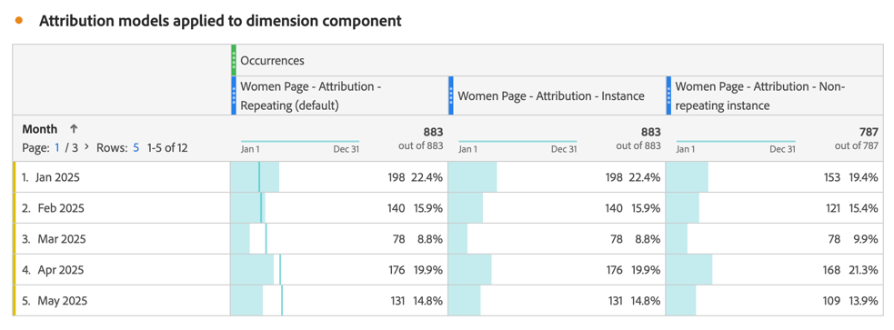

# Segmenten maken {#build-segments}

>[!CONTEXTUALHELP]
>id="components_segments_productcompatibility"
>title="Productcompatibiliteit"
>abstract="Een klein aantal beschikbare segmentcriteria is niet compatibel met alle Adobe Analytics-tools. De hulpmiddelen die met het segment compatibel zijn worden vermeld in deze lijst. Als u een segment compatibel wilt maken met alle Adobe Analytics-gereedschappen, bewerkt u de criteria."

>[!CONTEXTUALHELP]
>id="components_filters_createaudience"
>title="Publiek maken"
>abstract="Soorten publiek kan worden gemaakt op basis van een segment en worden gedeeld met de Adobe Experience Platform voor activering."

>[!CONTEXTUALHELP]
>id="components_filters_datapreview"
>title="Gegevensvoorbeeld"
>abstract="Vergelijkt de gegevens van dit segment met gegevens van de rapportreeks. Het voorproefpercentage is gebaseerd op het totale aantal van **laatste 90 dagen**.   als de voorproef niet laadt, zou uw verbinding nog kunnen terugvullen."

Het dialoogvenster **[!UICONTROL Segment builder]** wordt gebruikt om nieuwe segmenten te maken of bestaande segmenten te bewerken. Het dialoogvenster krijgt de naam **[!UICONTROL New segment]** of **[!UICONTROL Edit segment]** voor segmenten die u maakt of beheert met de [[!UICONTROL Segment] manager &#x200B;](/help/components/segmentation/segmentation-workflow/seg-manage.md) .

>[!BEGINTABS]

>[!TAB  de bouwer van het Segment ]

>[!TAB creeer of geef segment  uit]

>[!ENDTABS]

1. Specificeer de volgende details ( wordt vereist):

   | Element | Beschrijving |
   | --- | --- |
   | **[!UICONTROL Report suite]** | U kunt de rapportreeks voor het segment selecteren. |
   | **[!UICONTROL Project-only segment]** | Een infovakje om uit te leggen dat het segment slechts zichtbaar in het project is waar het wordt gecreeerd. En dat het segment niet aan uw componentenlijst wordt toegevoegd. Schakel **[!UICONTROL Make this segment available to all your projects and add it to your component list]** in om die instelling te wijzigen. Dit infovakje is slechts zichtbaar wanneer u a [&#x200B; snel segment &#x200B;](seg-quick.md) creeert en de snelle segmentinfo een regelmatig segment draait gebruikend **[!UICONTROL Open builder]** van de [!UICONTROL Quick segment] interface. |
   | **[!UICONTROL Title]**  | Geef het segment een naam, bijvoorbeeld `Last month mobile visitors` . |
   | **[!UICONTROL Description]** | Geef een beschrijving voor het segment op, bijvoorbeeld `Segment to define the mobile customers for the last month` . |
   | **[!UICONTROL Tags]** | Organiseer het segment door een of meer tags te maken of toe te passen. Begin te typen om naar bestaande tags te zoeken die u kunt selecteren. Of druk op **[!UICONTROL ENTER]** om een nieuwe tag toe te voegen. Selecteer  om een markering te verwijderen. |
   | **[!UICONTROL Definition]**  | Bepaal uw segment gebruikend de [&#x200B; bouwer van de Definitie &#x200B;](#definition-builder). |

   {style="table-layout:auto"}

1. Om te verifiëren of uw segmentdefinitie correct is, gebruik de constant bijgewerkte voorproef van de resultaten van het segment bij hoogste recht.
1. Om uw segment aan Experience Cloud te publiceren, selecteer **[!UICONTROL Publish this segment to the  Experience Cloud (for *rapportreeks *)]**. Zie [&#x200B; segmenten aan Experience Cloud &#x200B;](/help/components/segmentation/segmentation-workflow/seg-publish.md) voor meer informatie publiceren.
1. Selecteren:
   * **[!UICONTROL Save]** om het segment op te slaan.
   * **[!UICONTROL Save As]** om een kopie van het segment op te slaan.
   * **[!UICONTROL Delete]** om het segment te verwijderen.
   * **[!UICONTROL Cancel]** om eventuele wijzigingen die u hebt aangebracht in het segment te annuleren of om het maken van een nieuw segment te annuleren.

## Definition builder

U gebruikt de Bouwer van de Definitie om uw segmentdefinitie te construeren. In die constructie, gebruikt u componenten, containers, exploitanten en logica.

U kunt het type en het werkingsgebied van uw definitie vormen:

1. Om het type van uw definitie te specificeren, specificeer of u de bouwstijl wilt omvatten of definitie uitsluiten. Selecteer  **[!UICONTROL Options]** en van het drop-down menu **[!UICONTROL Include]** of **[!UICONTROL Exclude]**.
1. Als u het bereik van uw definitie wilt opgeven, selecteert u in het vervolgkeuzemenu **[!UICONTROL Include]** of **[!UICONTROL Exclude]** of het bereik van de definitie **[!UICONTROL Hits]** , **[!UICONTROL Visits]** of **[!UICONTROL Visitors]** moet zijn.

U kunt deze instellingen altijd later wijzigen.

### Onderdelen

Een essentieel onderdeel van de constructie van uw segmentdefinitie is het gebruik van dimensies, metriek, bestaande segmenten en datumbereiken. Al deze componenten zijn beschikbaar bij het componentenpaneel in de Bouwer van het Segment.

{width=100%}

Een component toevoegen:

1. Sleep een component van het deelvenster Componenten naar **[!UICONTROL Drag and drop Metric(s), Segment(s), and/or Dimensions here]** . U kunt het  in de componentenbar gebruiken om naar specifieke componenten te zoeken.
1. Geef details voor de component op. Selecteer bijvoorbeeld een waarde in **[!UICONTROL Select value]** . Of voer een waarde in. Wat en hoe u een of meer waarden kunt opgeven, is afhankelijk van de component en de operator.
1. Wijzig desgewenst de standaardoperator. Bijvoorbeeld van **[!UICONTROL equals]** tot **[!UICONTROL equals any of]** . Zie [&#x200B; Exploitanten &#x200B;](../seg-reference/seg-operators.md) voor een gedetailleerd overzicht van de beschikbare exploitanten.

Een component bewerken:

* Selecteer een nieuwe operator voor de component in het vervolgkeuzemenu van de operator.
* Selecteer indien van toepassing een andere waarde voor de operator of geef deze op.
* Als het componenttype een dimensie is, kunt u het attributiemodel definiëren. Zie [&#x200B; model van de Attributie &#x200B;](#attribution) voor meer informatie.

Een component verwijderen:

* Selecteer  in een component.

### Containers

U kunt meerdere componenten groeperen in een of meer containers en logica definiëren binnen en tussen containers. Met containers kunt u complexe definities voor uw segment maken.

{Width=100%} toe

* Om een container toe te voegen, selecteer **[!UICONTROL Add container]** van  **[!UICONTROL Options]**.
* Als u een bestaande component aan de container wilt toevoegen, sleept u de component naar de container.
* Als u een andere component aan de container wilt toevoegen, sleept u een component uit het deelvenster met componenten naar de container. Gebruik de blauwe invoeglijn als hulplijn.
* Als u een andere component buiten de container wilt toevoegen, sleept u een component uit het deelvenster met componenten buiten de container, maar binnen de container met de hoofddefinitie. Gebruik de blauwe invoeglijn als hulplijn.
* Als u de logica tussen componenten in een container, tussen containers of tussen een container en een component wilt wijzigen, selecteert u de desbetreffende **[!UICONTROL And]**, **[!UICONTROL Or]**, **[!UICONTROL Then]** . Wanneer u **[!UICONTROL Then]** selecteert, verandert u het segment in een opeenvolgend segment. Zie [&#x200B; opeenvolgend segment &#x200B;](seg-sequential-build.md) voor meer informatie creëren.
* Om het containerniveau te schakelen, selecteer  **[!UICONTROL Hits]**,  **[!UICONTROL Visits]** of  **[!UICONTROL Visitors]**.

U kunt  in een container voor de volgende acties gebruiken:

| Container, actie | Beschrijving |
|---|---|
| **[!UICONTROL Add container]** | Voeg een geneste container toe aan de container. |
| **[!UICONTROL Exclude]** | Sluit het resultaat uit van de container in de segmentdefinitie uit. Een dunne, rode linkerbalk geeft een uitsluitingscontainer aan. |
| **[!UICONTROL Include]** | Neem het resultaat van de container op in de segmentdefinitie. Opnemen is de standaardinstelling. Een dunne grijze linkerbalk geeft een include-container aan. |
| **[!UICONTROL Name container]** | Wijzig de naam van de container ten opzichte van de standaardbeschrijving. Typ een naam in het tekstveld. Als u geen invoer opgeeft, wordt de standaardbeschrijving gebruikt. |
| **[!UICONTROL Delete container]** | Verwijder de container uit de definitie. |

## Datumbereiken

U kunt segmenten samenstellen die roldatumbereiken bevatten. Op deze manier kunt u vragen beantwoorden over lopende campagnes of gebeurtenissen. Bijvoorbeeld, kunt u een segment bouwen dat *iedereen omvat die een online aankoop in de afgelopen 60 dagen* heeft gemaakt.

>[!BEGINSHADEBOX]

Zie  [&#x200B; Rolling datumwaaiers in segmenten &#x200B;](https://experienceleague.adobe.com/nl/docs/analytics-learn/tutorials/components/segmentation/rolling-date-ranges-in-segments){target="_blank"} voor een demo video.

>[!ENDSHADEBOX]

## Segmenten stapelen {#stack}

U kunt segmenten samenstellen met behulp van segmenten. Wanneer u segmenten in een segment gebruikt, kunt u het segment optimaliseren en de complexiteit verminderen.

Stel u voor dat u wilt segmenteren op de combinatie van interactiekanaal (5) en Amerikaanse staten (50). U zou of 250 segmenten, elk voor de unieke combinatie apparatentype (mobiele telefoon tegenover tablet) en de staat van de V.S. kunnen bouwen. Om de tabletgebruikers in Californië te krijgen, zou u één van de 250 segmenten gebruiken:

Of u kunt 55 segmenten definiëren: 50 segmenten voor de Amerikaanse staten en 5 voor de mogelijke interactiekanalen. Vervolgens stapelt u de segmenten om dezelfde resultaten te verkrijgen. Als u de gebruikers van de mobiele app uit Californië wilt ophalen, stapelt u twee segmenten:

## Attributie {#attribution}

>[!CONTEXTUALHELP]
>id="components_filters_attribution_repeating"
>title="Herhalend"
>abstract="Bevat varianten en doorlopende waarden voor de dimensie."

>[!CONTEXTUALHELP]
>id="components_filters_attribution_instance"
>title="Instantie"
>abstract="Bevat exemplaren voor de dimensie."

>[!CONTEXTUALHELP]
>id="components_filters_attribution_nonrepeatinginstance"
>title="Niet-herhalende instantie"
>abstract="Bevat unieke (niet-herhalende) instanties voor de dimensie."

Wanneer u een afmeting in de bouwer van het Segment gebruikt, hebt u de opties om het attributiemodel voor die afmeting te specificeren. Het toewijzingsmodel dat u selecteert, bepaalt of de gegevens in aanmerking komen voor de voorwaarde die u voor de dimensie-component hebt opgegeven.

Selecteer  binnen de afmetingscomponent en selecteer één van de modellen van de Attributie van popup:

| Modellen | Beschrijving |
|---|---|
| **[!UICONTROL Repeating model (default)]** | Instantie en doorlopende waarden voor de dimensie opnemen om kwalificatie te bepalen. |
| **[!UICONTROL Instance]** | Neem alleen instantiewaarden op voor de dimensie om de kwalificatie te bepalen. |
| **[!UICONTROL Non-repeating instance]** | U kunt unieke instantie-waarden (niet-herhalende waarden) voor de dimensie opnemen om de kwalificatie te bepalen. |

### Voorbeeld

Als onderdeel van een segmentdefinitie hebt u de volgende voorwaarde opgegeven: De paginanaam is gelijk aan Vrouwen. Vergelijkbaar met het bovenstaande voorbeeld. U herhaalt deze segmentdefinitie met de twee andere attributiemodellen. Dus hebt u elk drie segmenten met hun eigen attributiemodel:

* Vrouwenpagina - Attributie - Herhaling (standaard)
* Women page - Attribution - Instance
* Vrouwenpagina - Attributie - Niet-herhalende instantie

De lijst verklaart hieronder, voor elk attributiemodel, die de inkomende gebeurtenissen  voor die voorwaarde gekwalificeerd zijn.

| De Pagina van vrouwen - Attributie -  *attributiemodel* | Gebeurtenis 1:  de Naam van de Pagina evenaart   Vrouwen | Gebeurtenis 2:  de Naam van de Pagina evenaart   Mannen | Gebeurtenis 3:  de Naam van de Pagina evenaart   Vrouwen | Gebeurtenis 4:  de Naam van de Pagina evenaart   Vrouwen   (voortgeduurd) | Gebeurtenis 5:  de Naam van de Pagina evenaart   Controle | Gebeurtenis 6:  de Naam van de Pagina evenaart   Vrouwen | Gebeurtenis 7:  de Naam van de Pagina evenaart   Huis |
|---|:---:|:---:|:---:|:---:|:---:|:---:|:--:|
| Herhaald (standaard) |  |  |  |  |  |  |  |
| Instantie |  |  |  |  |  |  |  |
| Niet-herhalende instantie |  |  |  |  |  |  |  |

Een voorbeeldrapport over gebeurtenissen die de drie segmenten gebruiken ziet er als volgt uit:

<!--

The [!UICONTROL Segment builder] lets you build simple or complex segments that identify visitor attributes and actions across visits and page hits. It provides a canvas to drag and drop metric dimensions, events, or other segments in order to segment visitors based on hierarchy logic, rules, and operators.

There are several ways to access the Segment builder:

* **Analytics top navigation**: Click **[!UICONTROL Analytics]** > **[!UICONTROL Components]** > **[!UICONTROL Segments]**.
* **[!UICONTROL Analysis Workspace]**: Click **[!UICONTROL Analytics]** > **[!UICONTROL Workspace]**, open a project and click **[!UICONTROL + New]** > **[!UICONTROL Create Segment]**.
* **[!UICONTROL Report Builder]**: [Add or edit segments in Report Builder](/help/analyze/report-builder/work-with-segments.md).

## Builder criteria {#section_F61C4268A5974C788629399ADE1E6E7C}

You can add rule definitions and containers to define your segments.

1. **[!UICONTROL Title]**: Name the segment.
1. **[!UICONTROL Description]**: Provide a description for the segment. 
1. **[!UICONTROL Tags]**: [Tag the segment](/help/components/segmentation/segmentation-workflow/seg-workflow.md) you are creating by picking from a list of existing tags or creating a new tag.
1. **[!UICONTROL Definitions]**: This is where you [build and configure segments](/help/components/segmentation/segmentation-workflow/seg-workflow.md), add rules, and nest and sequence containers. 
1. **[!UICONTROL Show]**: (Top Container selector.) Lets you select the top-level [container](/help/components/segmentation/seg-overview.md) ( [!UICONTROL Visitor], [!UICONTROL Visit], [!UICONTROL Hit]). The default top-level container is the Hit container.
1. **[!UICONTROL Options]**: (gear) icon

   * **[!UICONTROL + Add container]**: Lets you add a new container (below the top-level container) to the segment definition.
   * **[!UICONTROL Exclude]**: Lets you define the segment by excluding one or more dimensions, segments, or metrics.

1. **[!UICONTROL Dimensions]**: Components are dragged and dropped from the Dimensions list (orange sidebar).
1. **[!UICONTROL Operator]**: You can compare and constrain values using selected operators.
1. **[!UICONTROL Value]**: The value you entered or selected for the dimension or segment or metric.
1. **[!UICONTROL Attribution Models]**: Available for dimensions only, these models determine what values in a dimension to segment for. Dimension models are particularly useful in sequential segmentation.

   * **[!UICONTROL Repeating]** (default): Includes instances and persisted values for the dimension.
   * **[!UICONTROL Instance]**: Includes instances for the dimension.
   * **[!UICONTROL Non-repeating instance]**: Includes unique instances (non-repeating) for the dimension. This is the model applied in Flow when repeat instances are excluded.

   

   **Example: Hit segment where eVar1 = A** 

   |  Example  | A  | A  |  A (persisted) | B  | A  | C  |
   |---|---|---|---|---|---|---|
   |  Repeating  | X  | X  | X  | -  | X  | -  |
   |  Instance  | X  | X  | - | - | X | - |
   |  Non-repeating instance  | X | - | - | -  | X  | -  |

1. **[!UICONTROL And/Or/Then]**: Assigns the [!UICONTROL AND/OR/THEN] operators between containers or rules. The THEN operator lets you [define sequential segments](/help/components/segmentation/segmentation-workflow/seg-sequential-build.md).
1. **[!UICONTROL Metric]**: (Green sidebar) Metric that was dragged and dropped from the Metrics list.
1. **[!UICONTROL Comparison]** operator: You can compare and constrain values using selected operators.
1. **[!UICONTROL Value]**: The value you entered or selected for the dimension or segment or metric.
1. **[!UICONTROL X]**: (Delete) Lets you delete this part of the segment definition.
1. **[!UICONTROL Experience Cloud publishing]**: Publishing an Adobe Analytics segment to the Experience Cloud lets you use the segment for marketing activity in [!DNL Audience Manager] and in other activation channels. [Learn more...](/help/components/segmentation/segmentation-workflow/seg-publish.md)
1. **[!UICONTROL Audience library]**: Adobe's audience services manage the translation of visitor data into audience segmentation. As such, creating and managing audiences is similar to creating and using segments, with the added ability to share the audience segment to the Experience Cloud. [Learn more...](https://experienceleague.adobe.com/docs/core-services/interface/audiences/audience-library.html?lang=nl-NL)
1. **[!UICONTROL Search]**: Searches the list of dimensions, segments, or metrics.
1. **[!UICONTROL Dimensions]**: (List) Click the header to expand.
1. **[!UICONTROL Metrics]**: Click the header to expand.
1. **[!UICONTROL Segments]**: Click the header to expand.
1. **[!UICONTROL Report suite selector]**: Lets you select the report suite that this segment will be saved under. You can still utilize the segment in all report suites.
1. **[!UICONTROL Segment Preview]**: Lets you preview the key metrics to see whether you have a valid segment and how broad the segment is. Represents the breakdown of the data set you can expect to see if you apply this segment. Shows 3 concentric circles and a list to show the number and percentage of matches for [!UICONTROL Hits], [!UICONTROL Visits], and [!UICONTROL Visitors] for a segment run against a data set. This chart is updated immediately after you create or make changes to your segment definition.
1. **[!UICONTROL Product Compatibility]**: Provides a list of which Adobe Analytics products (Analysis Workspace, Data Warehouse) with which the segment you created is compatible. Most segments are compatible with all products. However, not all operators and dimensions are compatible with all Analytics products, especially [Data Warehouse](/help/components/segmentation/seg-reference/seg-compatibility.md). This chart is updated immediately after you make changes to your segment definition.
1. **[!UICONTROL Save]** or **[!UICONTROL Cancel]**: Saves or cancels the segment. After clicking **[!UICONTROL Save]**, you are taken to the Segment manager where you can manage the segment.

## Build segments {#build-segments}

1. Simply drag a Dimension, Segment, or Metric Event from the left pane to the [!UICONTROL Definitions] field.

   

   The default top-level [!UICONTROL Hit] container is shown after dragging an element to [!UICONTROL Definitions]. You can change the container type to Visit or Visitor from the **[!UICONTROL Show]** drop-down menu.

1. Set the [operator](/help/components/segmentation/seg-reference/seg-operators.md) from the drop-down menu.
1. Enter or select a value for the item selected.
1. Add additional containers if needed, using **[!UICONTROL And]**, **[!UICONTROL Or]**, or **[!UICONTROL Then]** rules.
1. After placing the containers and setting the rules, see the results of the segment in the validation chart at the top right. The validator indicates the percentage and absolute number of page views, visits, and unique visitors that match the segment you created.
1. Under **[!UICONTROL Tags]**, [tag](/help/components/segmentation/segmentation-workflow/seg-tag.md) the container by selecting an existing tag or creating a new one.
1. Click **[!UICONTROL Save]** to save the segment.

You are now taken to the [Segment manager](/help/components/segmentation/segmentation-workflow/seg-manage.md), where you can tag, share, and manage your segment in multiple ways.

## Add containers {#section_1C38F15703B44474B0718CEF06639EFD}

You can [build a framework of containers](/help/components/segmentation/seg-overview.md) and then place logic rules and operators between.

1. Click **[!UICONTROL Options > Add Container]**.

   

   A new [!UICONTROL Hit] container opens without a [!UICONTROL Hit] (Page View) identified.

   

1. Change the container type as needed.
1. Drag a Dimension, Segment, or Event from the left pane to the container.
1. Continue to add new containers from the top-level **[!UICONTROL Options]** > **[!UICONTROL Add container]** button at the top of the definition, or add containers from within a container to nest logic.

   **OR**

   Select one or more rules and then click **[!UICONTROL Options]** > **[!UICONTROL Add container from selection]**. This turns your selection into a separate container.

## Use date ranges {#concept_252A83D43B6F4A4EBAB55F08AB2A1ACE}

You can build segments that contain rolling date ranges in order to answer questions about ongoing campaigns or events.

For example, you can easily build a segment that includes "everyone who has made a purchase over the past 60 days".

You create a Visit container and within it, add the [!UICONTROL Last 60 days] time range and the metric [!UICONTROL Orders is greater than or equal to 1], with an AND operator:

>[!BEGINSHADEBOX]

See  [Rolling date ranges in segments](https://experienceleague.adobe.com/nl/docs/analytics-learn/tutorials/components/segmentation/rolling-date-ranges-in-segments){target="_blank"} for a demo video.

>[!ENDSHADEBOX]

## Stack segments {#task_58140F17FFD64FF1BC30DC7B0A1B0E6D}

Stacking segments works by combining the criteria in each segment using an 'and' operator, and then applying the combined criteria. This can be done in a Workspace project directly or in segment builder. 

For example, stacking a "mobile phone users" segment and a "US geography" segment would return data only for mobile phone users in the US.

Think of these segments as building blocks or modules that you can include in a segment library, for users to use as they see fit. That way, you can dramatically reduce the number of segments needed. For example, assume you have 40 segments:

* 20 for mobile phone users in different countries (US_mobile, Germany_mobile, France_mobile, Brazil_mobile, etc.) 
* 20 for tablet users in different countries (US_tablet, Germany_tablet, France_tablet, Brazil_tablet, etc.)

By using segment stacking, you can reduce your segment count to 22 and stack them as needed. You would need to create these segments:

* one segment for mobile users 
* one segment for tablet users 
* 20 segments for the different geographies

>[!NOTE]
>
>When stacking two segments, they are by default joined by an AND statement. This cannot be changed to an OR statement.

1. Go to the Segment builder.
1. Provide a title and description for the segment.

   Step Result 1. Click **[!UICONTROL Show Segments]** to bring up the list of segments in the left navigation.

   Step Result 1. Drag and drop the segments you want to stack to the segment definition canvas. Here is an example of a segment that stacks the existing segments "Visits from Tablets" and "US Geo":

   

1. Save the segment.

   Step Result 

-->

## Segmentsjablonen {#concept_5098446CC78D441E93B8E4D1D1EA6558}

Segmentsjablonen worden aangeboden voor algemene segmentatiegebruikstoepassingen, zoals **[!UICONTROL First-time Visits]** of **[!UICONTROL Visits from Mobile Devices]** . Zij zijn beschikbaar in de projecten van Workspace en in de segmentbouwer als bouwstenen voor nieuwe segmenten.

Een embleem van Adobe  identificeert malplaatjes. Hieronder ziet u een voorbeeld van de beschikbare sjablonen:

<table id="table_98B87D807E9344C9BEBF072C65D87B1B"> 
 <thead> 
  <tr> 
   <th colname="col1" class="entry"> Sjabloonnaam </th> 
   <th colname="col2" class="entry"> Definitie </th> 
  </tr> 
 </thead>
 <tbody> 
  <tr> 
   <td colname="col1"> Abandon Cart </td> 
   <td colname="col2">Gegevens weergeven voor bezoekers die items aan hun winkelwagentjes hebben toegevoegd, maar geen bestellingen hebben gedaan. In de segmentdefinitie is de container Visit. </td> 
  </tr> 
  <tr> 
   <td colname="col1"> Eerste bezoeken </td> 
   <td colname="col2">Gegevens weergeven voor bezoekers die maximaal één [1] keer hebben bezocht. In de segmentdefinitie is de container Visit. 
 </td> 
  </tr> 
  <tr> 
   <td colname="col1"> Niet-aankoopcentrales </td> 
   <td colname="col2">Gegevens weergeven voor bezoekers die niet hebben deelgenomen aan een bestelgebeurtenis. </td> 
  </tr> 
  <tr> 
   <td colname="col1"> Bezoekingen zonder enkele pagina (niet-gebonden) </td> 
   <td colname="col2">Gegevens weergeven voor bezoekers die meerdere keren een bezoek hebben gebracht.
 </td> 
  </tr> 
  <tr> 
   <td colname="col1"> Betaalde zoekopdracht </td> 
   <td colname="col2">Gegevens van bezoekers die afkomstig zijn van een betaalde zoekopdracht bekijken.  </td> 
  </tr> 
  <tr> 
   <td colname="col1"> Aankopers </td> 
   <td colname="col2">Gegevens weergeven voor bezoekers die hebben deelgenomen aan een bestelgebeurtenis.  </td> 
  </tr> 
  <tr> 
   <td colname="col1"> Retourbezoeken </td> 
   <td colname="col2">Gegevens weergeven van bezoekers die ten minste één keer een bezoek hebben gebracht.  </td> 
  </tr> 
  <tr> 
   <td colname="col1"> Bezoeken van één pagina </td> 
   <td colname="col2"> Gegevens van bezoeken weergeven waarin u een waarde van één pagina ziet, ook al kunt u tijdens dat bezoek meerdere paginaweergaven verzenden. Bezoeken van één pagina met gebeurtenissen van de uitgangsverbinding zijn inbegrepen in het segment.  </td> 
  </tr> 
  <tr> 
   <td colname="col1"> Bekeken product niet aan winkelwagentje toegevoegd </td> 
   <td colname="col2">Gegevens weergeven voor bezoekers die producten hebben bekeken maar geen extra winkelwagentjes hebben.  </td> 
  </tr> 
  <tr> 
   <td colname="col1"> Bezoeken van de campagne </td> 
   <td colname="col2">Gegevens van bezoekers weergeven die door campagnes worden genoemd. </td> 
  </tr> 
  <tr> 
   <td colname="col1"> Bezoeken van mobiele apparaten </td> 
   <td colname="col2">Gegevens van bezoekers weergeven die mobiele apparaten gebruiken. </td> 
  </tr> 
  <tr> 
   <td colname="col1"> Bezoeken van Natuurlijk zoeken </td> 
   <td colname="col2">Gegevens van bezoekers bekijken die niet afkomstig zijn van een betaalde zoekopdracht.  </td> 
  </tr> 
  <tr> 
   <td colname="col1"> Bezoeken van niet-mobiel apparaat </td> 
   <td colname="col2">Gegevens weergeven van bezoekers die geen mobiele apparaten gebruiken. </td> 
  </tr> 
  <tr> 
   <td colname="col1"> Bezoeken van telefoons </td> 
   <td colname="col2">Gegevens van bezoekers weergeven met telefoons.  </td> 
  </tr> 
  <tr> 
   <td colname="col1"> Bezoeken van zoekmachines </td> 
   <td colname="col2">Gegevens van bezoekers weergeven die door zoekprogramma's worden genoemd.</td> 
  </tr> 
  <tr> 
   <td colname="col1"> Bezoeken van sociale sites </td> 
   <td colname="col2">Gegevens weergeven van bezoekers die door sociale sites worden genoemd.</td> 
  </tr> 
  <tr> 
   <td colname="col1"> Bezoeken van tabletten </td> 
   <td colname="col2">Gegevens van bezoekers weergeven met tablets.</td> 
  </tr> 
  <tr> 
   <td colname="col1"> Bezoeken met cookie van bezoeker-id </td> 
   <td colname="col2">Gegevens van bezoekers van uw site weergeven, waar een permanente cookie vereist is.</td> 
  </tr> 
 </tbody> 
</table>

Om de definitie van elk segment te bekijken, gebruik . Voor de sjabloon **[!UICONTROL iOS]** bijvoorbeeld:

