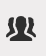

# Segmenten beheren

In Segmentbeheer kunt u op verschillende manieren segmenten curven, zoals delen, filteren, labelen, goedkeuren, kopiëren, verwijderen en markeren als favorieten.

De manager van het Segment van Analytics toont u alle segmenten u bezit en die met u zijn gedeeld. Gebruikers op beheerniveau kunnen alle segmenten in de organisatie zien. Dit overzicht bevat de gebruikersinterface en de mogelijkheden van Segmentbeheer. Open Segmentbeheer via

* Ga naar **[!UICONTROL Analytics]** > **[!UICONTROL Components]** > **[!UICONTROL Segments]** in de bovenste navigatie.
* Een bestaand rapport weergeven en op het pictogram Segmenten klikken   in de linkernavigatie. Klik vervolgens op **[!UICONTROL Manage]**.

## Hoe kan ik-video {#section_B3C5DA22DC5248DBA17C56E03DA2D4F2}

Dit [Adobe Analytics-video](https://experienceleague.adobe.com/docs/analytics-learn/tutorials/components/segmentation/segment-management-and-sharing.html) geeft een kort overzicht van hoe te om de Manager van het Segment te gebruiken.

## Gebruikersinterface Segmentbeheer {#section_7FDCD12949BE4741A402DB83AB7B37DF}

| Aantal | UI-onderdeel | Beschrijving |
|---|---|---|
| 1 | Werkbalk Segmentbeheer | Nadat u een segment hebt gecontroleerd, wordt deze werkbalk weergegeven. De meeste beheertaken kunnen vanaf deze werkbalk worden voltooid. |
| 2 | Filters tonen | Als u op het filterpictogram klikt, wordt het filtermenu weergegeven. U kunt filteren op Tags, Eigenaars, Alles tonen (alleen Admin), Mijne waarden, Favorieten, Goedgekeurd en Gedeeld met mij. |
| 3 | Selectievakjes | Controleer een segment om het te beheren. |
| 4 | Favorieten | Als u op de ster naast een segment klikt, wordt de ster geel en wordt het segment gemarkeerd als een favoriet. |
| 5 | Segmenttitels en -beschrijvingen | Opgegeven in de Segment Builder. Als u de titel en beschrijving wilt bewerken, klikt u op de titelkoppeling. Hiermee gaat u terug naar de Segment Builder. |
| 6 | Rapportsuites | Deze kolom geeft aan in welke rapportsuite het segment het laatst is opgeslagen. |
| 7 | Eigenaar | Geeft aan wie eigenaar is van het segment. Als niet-beheerder, kunt u slechts segmenten zien u bezit of die met u werden gedeeld. |
| 8 | Labels (niet gecontroleerd in kolomkiezer, vandaar dat de kolom niet wordt weergegeven) | Tags die op het segment zijn toegepast, door u of door personen die het segment met u hebben gedeeld. |
| 9 | Gedeeld met | Hier worden personen of groepen weergegeven (alleen Admin) of Alle personen (alleen Admin) waarmee u het segment hebt gedeeld. |
| 10 | Datum gewijzigd | Hiermee geeft u de datum weer waarop het segment voor het laatst is gewijzigd. |
| 11 | Kolomkiezer | Hiermee kunt u kolommen in Segmentbeheer selecteren of deselecteren. |
| 12 | Gedeeld pictogram | Geeft aan dat dit segment door u of met u wordt gedeeld. |
| 13 | Goedgekeurd pictogram | Geeft aan dat dit segment is goedgekeurd door een beheerder. |
| 14 | Filters | Hiermee kunt u de filters onder Codes, Rapportagesuites, Eigenaars en Overige (Alles tonen, Mijnbouw, Delen met mij, Goedgekeurd, Favorieten.) weergeven en selecteren. |
