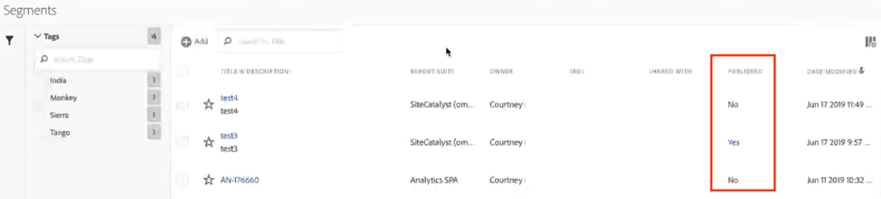
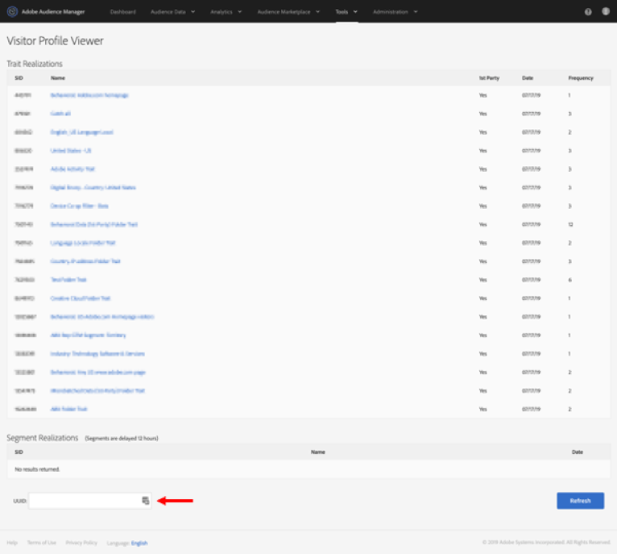

# Segmenten publiceren naar Experience Cloud

Als u een Adobe Analytics-segment naar de Experience Cloud publiceert, kunt u het segment gebruiken voor marketingactiviteiten in [!DNL Audience Manager] en in andere activeringskanalen, zoals [!DNL Advertising Cloud], [!DNL Target] en a3/>. [!DNL Campaign] Recente updates hebben de publicatieworkflow aanzienlijk geoptimaliseerd. U kunt de segmenten Analytics nu publiceren naar Experience Cloud binnen 8 uur. Gebruik deze segmenten om publiek in Audience Manager aan alle stroomafwaartse bestemmingen te activeren.

We hebben ook het maximumaantal publiceerbare Adobe Analytics-segmenten verhoogd naar 75 (van 20). U kunt gepubliceerde segmenten weergeven in [!UICONTROL Analytics > Components > Segments].

>[!NOTE]
>
>Adobe Campaign (Classic en Standard) gedraagt zich anders in die zin dat er een extra latentie van 24 uur bovenop de 8-uurs latentie ontstaat.

## Vereisten

* Zorg ervoor dat de rapportsuite waarin u dit segment opslaat [ingeschakeld is voor de Experience Cloud](https://experienceleague.adobe.com/docs/core-services/interface/audiences/t-publish-audience-segment.html). Anders kunt u het niet naar de Experience Cloud publiceren.
* Zorg ervoor dat uw organisatie Experience Cloud-id&#39;s gebruikt.
* Voordat u segmenten kunt publiceren, moet uw beheerder de [!UICONTROL Segment Publishing]-machtiging toewijzen aan een productprofiel in de [Admin Console](https://experienceleague.adobe.com/docs/core-services/interface/manage-users-and-products/admin-getting-started.html) en u toevoegen aan het productprofiel.

## Overwegingen

* **Limieten** voor rapportsuite: U kunt tot 75 segmenten per rapportreeks publiceren. Deze limiet geldt. Als u al 75 gepubliceerde segmenten hebt, kunt u geen extra segmenten publiceren tot u unpublish genoeg segmenten om onder de 75-segmentdrempel te krijgen.
* **Lidmaatschapgrenzen**: Het publiek dat  [!DNL Experience Cloud] uit Adobe Analytics wordt gedeeld, mag niet meer dan 20 miljoen unieke leden tellen.
* **Gegevensprivacy**: Het publiek wordt niet gefilterd op basis van de verificatiestatus van een bezoeker. Als een bezoeker in een niet-geverifieerde en geverifieerde status door uw site kan bladeren, kan een bezoeker door handelingen die plaatsvinden wanneer een bezoeker niet-geverifieerd is, toch worden opgenomen in een publiek. Bekijk [Adobe Experience Cloud privacy](https://www.adobe.com/privacy/experience-cloud.html) om de volledige privacyimplicaties van het delen van publiek te begrijpen.
* Voor een bespreking over de **verschillen tussen segmenten in [!DNL Adobe Analytics] en[!DNL Audience Manager]**, ga [hier](https://experienceleague.adobe.com/docs/analytics/integration/audience-analytics/audience-analytics-workflow/aam-analytics-segments.html).

## Tijdlijn voor segmentpublicatie

| Beschikbaar | Wanneer deze beschikbaar is | Waar beschikbaar |
|---|---|---|
| Metagegevens (segmenttitel en -definitie) | Onmiddellijk na publicatie | [!DNL Audience Manager], [!UICONTROL Experience Cloud Audience Library], [!DNL Target] |
| Nuttig segment met lidmaatschap | ~ 8 uur na publicatie | Bezoekerprofiel van viewer in [!DNL Audience Manager] |
| Treinen en lidmaatschapspopulatie | Binnen 24-48 uur | [!DNL Audience Manager] |

>[!NOTE]
>Eenmaal per week worden alle gegevens volledig gesynchroniseerd om rekening te houden met eventuele delta&#39;s of discrepanties die in de voorgaande week niet zijn vastgelegd.

## Segmenten publiceren in [!UICONTROL Segment Builder]

1. Ga naar **[!UICONTROL Analytics > Workspace > Components > Segments]> +**
1. Creeer een segment in [!UICONTROL Segment Builder].
1. Geef een titel en een beschrijving voor het segment op. U kunt het segment dan niet opslaan.
1. Controleer **[!UICONTROL Publish this segment to the Experience Cloud (for *rapportsuite *)]**.

>[!IMPORTANT]
>Gebruik &quot;Bezoekers met Experience Cloud-id&quot; wanneer u segmentvoorvertoningen bekijkt in Analytics in plaats van de totale segmentvoorvertoning &quot;unieke bezoekers&quot; wanneer u Adobe Analytics-nummers vergelijkt met Audience Manager-nummers:
>
>

| Element | Beschrijving |
|---|---|
| **[!UICONTROL Publish this segment to the Experience Cloud (for *`<report suite>`*)]** | Wanneer deze optie wordt toegelaten, worden de segmenttitel en de definitie (d.w.z. het shell publiek zoals vaak gebruikt in advertentieplatforms) onmiddellijk gedeeld met de Experience Cloud, terwijl het segmentlidmaatschap wordt geëvalueerd en om de 4 uur gedeeld.   Wanneer dat publiek is gekoppeld aan een activiteit in  [!DNL Target],  [!DNL Analytics] begint bijvoorbeeld met het verzenden van id&#39;s voor bezoekers die in aanmerking komen voor die Experience Cloud en dat  [!DNL Target] publiek. Op dat punt, beginnen de publieksnaam en de overeenkomstige gegevens te tonen op de pagina van het publiek van de Experience Cloud.   |
| **[!UICONTROL Audience Creation Window]** | Het tijdkader dat u selecteert, wordt gebruikt om het publiek te maken op basis van een rolkalender. Bijvoorbeeld, &quot;Laatste 30 dagen&quot;(gebrek) omvat bezoekers die voor het publiek in de laatste 30 dagen van de datum van vandaag (NIET van de originele datum hebben gekwalificeerd toen het segment werd gecreeerd.) |
| **[!UICONTROL Create in Audience Library]** | De segmenten die u creeert en publiceert kunnen zonder latentie in de Bibliotheek van het publiek van de Experience Cloud beschikbaar worden gemaakt. Ze zijn niet afhankelijk van analytische updates. Deze segmenten tellen niet tegen uw grens van 75 gepubliceerde segmenten. |
| **[!UICONTROL x of 75 Published]** | Hiermee geeft u het aantal segmenten weer dat u naar de Experience Cloud hebt gepubliceerd. Klik op de koppeling om een lijst met gepubliceerde segmenten en de bijbehorende rapportsuite en eigenaar weer te geven. |
| **[!UICONTROL Save]** | Hiermee slaat u dit segment op. |

## Segmenten verwijderen of verwijderen

Als u een segment wilt verwijderen dat naar de Experience Cloud is gepubliceerd, moet u eerst de publicatie ongedaan maken. Als u de publicatie van een segment ongedaan wilt maken, klikt u **unclick** op het selectievakje dat u hebt gebruikt om het te publiceren.

>[!NOTE]
>
>U **kunt niet** unpublish een segment dat momenteel in gebruik door om het even welke volgende oplossingen van Adobe is: [!DNL Analytics] (in [!DNL Audience Analytics]), [!DNL Campaign], [!DNL Advertising Cloud] (voor [!DNL Core Service] &amp; [!DNL Audience Manager] klanten) en alle andere externe partners (voor [!DNL Audience Manager] klanten). U **kunt** unpublish een segment dat door [!DNL Target] in gebruik is.

## De status voor het publiceren van segmenten weergeven in [!UICONTROL Segment Manager]

1. Ga naar [!UICONTROL Analytics > Components > Segments].
1. Merk de nieuwe [!UICONTROL Published] kolom op. Ja/Nee verwijst naar de vraag of het segment al dan niet aan de Experience Cloud is gepubliceerd.

## De [!DNL Audience Manager] UUID ophalen

Er zijn twee manieren om de AAM UUID vast te leggen die momenteel aan de browser is gekoppeld:

* Adobe Experience Cloud Debugger
* Native ontwikkelaarsprogramma in browsers (bijv. Chrome Developer Tools)

De volgende schermafbeeldingen tonen u hoe te om AAM UUID op uw browser terug te winnen en het in de Kijker van het Profiel van de Bezoeker van de Audience Manager te gebruiken om spoor en segmentlidmaatschap te bevestigen.

**Methode 1: Adobe Experience Cloud Debugger gebruiken**

1. Download en installeer [Adobe Experience Cloud Debugger](/help/implement/validate/debugger.md) in de Chrome Web Store.
1. Start de foutopsporing wanneer u een pagina laadt.
1. Blader naar de sectie Audience Manager en zoek de AAM UUID die op de huidige browserpagina is ingesteld.
(`50814298273775797762943354787774730612` in het onderstaande voorbeeld)

**Methode 2: Chrome Developer Tools (of andere browsergereedschappen) gebruiken**

1. Chrome Developer Tools starten voordat een pagina wordt geladen
1. Laad de pagina en controleer Toepassingen > Cookies. De AAM UUID moet worden ingesteld in de externe
Demdex cookie ([adobe.demdex.net](https://experienceleague.adobe.com/docs/audience-manager/user-guide/reference/demdex-calls.html) in het onderstaande voorbeeld). De velddemdex is de AAM UUID-set
in de browser (`50814298273775797762943354787774730612` in het onderstaande voorbeeld).

## Audience Manager [!UICONTROL Visitor Profile Viewer] gebruiken

De AAM UUID in de browser wordt standaard gebruikt wanneer [!UICONTROL Visitor Profile Viewer] wordt geladen. Als u de taakuitvoering voor andere gebruikers verifieert, voert u een UUID in het veld UUID in en klikt u op [!UICONTROL Refresh]. Raadpleeg [Bezoekersprofielviewer](https://experienceleague.adobe.com/docs/audience-manager/user-guide/features/visitor-profile-viewer.html) voor meer informatie.

## De segmentkenmerken weergeven in [!DNL Audience Manager]

AAM wordt de lijst met bezoekers met ECID&#39;s voor een bepaald segment op streamingwijze geëvalueerd, aangezien Analytics segmenten met Experience Cloud deelt.

1. Ga in [!DNL Audience Manager] naar [!UICONTROL Audience Data > Traits > Analytics Traits]. Er wordt een map weergegeven voor elke serie Analytics-rapporten die is toegewezen aan uw Experience Cloud-organisatie. Deze mappen (voor Traits, Segmenten en Gegevensbronnen) worden gemaakt wanneer de kernservice Profielen en Soorten publiek/Personen wordt gestart of ingericht.
1. Selecteer de omslag voor de rapportreeks waarin u eerder het segment creeerde u met [!DNL Audience Manager] wilde delen. U zult het segment/het publiek zien u creeerde. Wanneer u een segment deelt, gebeuren er twee dingen in [!DNL Audience Manager]:
* Er wordt een doel gemaakt, eerst zonder gegevens erin. Ongeveer. 8 uur nadat het segment is gepubliceerd in [!DNL Analytics], wordt de lijst met ECID&#39;s genegeerd en gedeeld met [!DNL Audience Manager] en andere Experience Cloud-oplossingen.

* Er wordt een segment met één doel gemaakt. Het gebruikt de gegevensbron die met de rapportreeks wordt geassocieerd waar u het segment publiceerde.
* De vervaldatum van de reis is nu ingesteld op 16 dagen (voorheen 2 dagen).

## Het segment weergeven in [!DNL Adobe Target]

Met het selectievakje [!UICONTROL Publish this segment to the Experience Cloud] tijdens het maken van segmenten in Adobe Analytics kan het segment beschikbaar zijn in de aangepaste publieksbibliotheek van Adobe Target. Een segment dat in Analytics of Audience Manager wordt gecreeerd kan voor activiteiten in Doel worden gebruikt. U kunt bijvoorbeeld campagneactiviteiten maken op basis van de omzettingscijfers van Analytics en publiekssegmenten die zijn gemaakt in Analytics.

1. Klik op [!UICONTROL Audiences].
1. Zoek op de pagina [!UICONTROL Audiences] het publiek op dat afkomstig is van [!DNL Experience Cloud]. Deze doelgroepen zijn beschikbaar voor gebruik in [!DNL Target] activiteiten.
